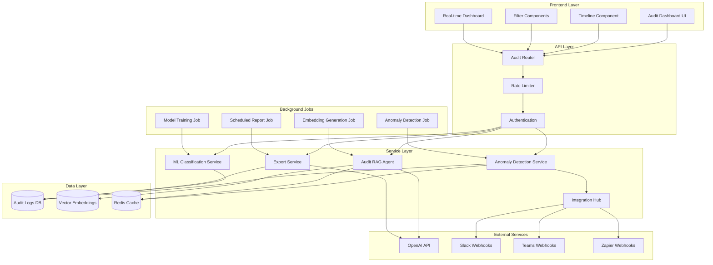

# Design Document: AI-Empowered Audit Trail

## Overview

The AI-Empowered Audit Trail feature extends the existing audit logging infrastructure with advanced AI capabilities including anomaly detection, semantic search, auto-tagging, and intelligent insights. The system leverages the existing `audit_logs` and `audit_logs` tables, integrates with the current AI agents infrastructure (`RAGReporterAgent`, `ResourceOptimizerAgent`, `RiskForecasterAgent`), and extends the help chat RAG system for audit log queries.

### Key Components

1. **Anomaly Detection Service**: Scikit-learn Isolation Forest for detecting unusual patterns
2. **Audit RAG Agent**: Extension of existing RAG system for semantic search over audit logs
3. **ML Classification Service**: Scikit-learn classifiers for auto-tagging and risk assessment
4. **Timeline Visualization**: React/Next.js component using Recharts for interactive timeline
5. **Export Service**: PDF/CSV generation with AI-generated executive summaries
6. **Integration Hub**: Webhook management for Zapier, Slack, Teams notifications
7. **Real-time Dashboard**: WebSocket-powered monitoring interface

### Technology Stack

- **Backend**: FastAPI (existing), Python 3.11+
- **Database**: Supabase PostgreSQL with pgvector extension (existing)
- **AI/ML**: OpenAI GPT-4 (existing), scikit-learn for ML models
- **Frontend**: Next.js 14 (existing), React 18, Recharts for visualization
- **Caching**: Redis for response caching and job queuing
- **Scheduling**: APScheduler for cron jobs
- **Real-time**: WebSockets for live updates

## Architecture

### System Architecture



### Data Flow

#### Audit Event Creation Flow
1. User action triggers audit event creation
2. Event is inserted into `audit_logs` table
3. ML Classification Service tags event with category and risk level
4. Embedding Generation Job creates vector embedding for semantic search
5. Event is available for querying and analysis

#### Anomaly Detection Flow
1. Scheduled job runs every hour
2. Anomaly Detection Service fetches last 24 hours of events
3. Isolation Forest model computes anomaly scores
4. Events with score > 0.7 are flagged as anomalies
5. Alerts are created and notifications sent via Integration Hub
6. Anomalies are displayed in real-time dashboard

#### Semantic Search Flow
1. User submits natural language query
2. Audit RAG Agent generates query embedding
3. pgvector performs cosine similarity search
4. Top 10 relevant events are retrieved
5. GPT-4 synthesizes response with source references
6. Response is cached in Redis for 10 minutes

## Components and Interfaces

### Backend Components

#### 1. Anomaly Detection Service (`backend/services/audit_anomaly_service.py`)

```python
class AuditAnomalyService:
    """
    Detects anomalies in audit logs using Isolation Forest.
    """
    
    def __init__(self, supabase_client, redis_client):
        self.supabase = supabase_client
        self.redis = redis_client
        self.model = IsolationForest(contamination=0.1, random_state=42)
        self.feature_extractor = AuditFeatureExtractor()
        
    async def detect_anomalies(
        self, 
        start_time: datetime, 
        end_time: datetime
    ) -> List[AnomalyDetection]:
        """
        Detect anomalies in audit events within time range.
        Returns list of detected anomalies with scores.
        """
        
    async def train_model(self, training_data: List[Dict]) -> ModelMetrics:
        """
        Train Isolation Forest model on historical audit data.
        Returns training metrics.
        """
        
    async def compute_anomaly_score(self, event: Dict) -> float:
        """
        Compute anomaly score for a single event.
        Returns score between 0 and 1.
        """
        
    async def generate_alert(
        self, 
        anomaly: AnomalyDetection
    ) -> Alert:
        """
        Generate alert for detected anomaly.
        Returns alert object.
        """
```

**Feature Extraction Strategy:**
- Event type frequency (how common is this event type)
- User activity patterns (events per hour, events per day)
- Entity access patterns (which entities are accessed together)
- Time-based features (hour of day, day of week)
- Action details complexity (JSON depth, field count)
- Performance metrics (execution time, resource usage)

#### 2. Audit RAG Agent (`backend/services/audit_rag_agent.py`)

```python
class AuditRAGAgent(AIAgentBase):
    """
    RAG agent specialized for audit log semantic search.
    Extends existing RAGReporterAgent infrastructure.
    """
    
    def __init__(self, supabase_client, openai_api_key, redis_client):
        super().__init__(supabase_client, openai_api_key)
        self.redis = redis_client
        self.embedding_model = "text-embedding-ada-002"
        self.chat_model = "gpt-4"
        
    async def index_audit_event(
        self, 
        event: Dict
    ) -> bool:
        """
        Generate and store embedding for audit event.
        Returns success status.
        """
        
    async def semantic_search(
        self, 
        query: str, 
        filters: Dict = None,
        limit: int = 10
    ) -> List[AuditEvent]:
        """
        Perform semantic search over audit logs.
        Returns ranked list of relevant events.
        """
        
    async def generate_summary(
        self, 
        time_period: str,  # 'daily', 'weekly', 'monthly'
        filters: Dict = None
    ) -> AuditSummary:
        """
        Generate AI summary of audit events for time period.
        Returns summary with statistics and insights.
        """
        
    async def explain_event(
        self, 
        event_id: str
    ) -> EventExplanation:
        """
        Generate natural language explanation of audit event.
        Returns explanation with context and impact analysis.
        """
```

#### 3. ML Classification Service (`backend/services/audit_ml_service.py`)

```python
class AuditMLService:
    """
    ML service for auto-tagging and risk classification.
    """
    
    def __init__(self, supabase_client):
        self.supabase = supabase_client
        self.category_classifier = RandomForestClassifier(n_estimators=100)
        self.risk_classifier = GradientBoostingClassifier()
        self.feature_vectorizer = TfidfVectorizer(max_features=500)
        
    async def classify_event(
        self, 
        event: Dict
    ) -> EventClassification:
        """
        Classify audit event into category and risk level.
        Returns classification with confidence scores.
        """
        
    async def train_classifiers(
        self, 
        labeled_data: List[Dict]
    ) -> TrainingMetrics:
        """
        Train category and risk classifiers on labeled data.
        Returns training metrics (accuracy, precision, recall).
        """
        
    async def extract_features(
        self, 
        event: Dict
    ) -> np.ndarray:
        """
        Extract feature vector from audit event.
        Returns numpy array of features.
        """
```

**Classification Features:**
- Event type (one-hot encoded)
- Action details keywords (TF-IDF)
- Entity type
- User role
- Time features (hour, day of week)
- Performance metrics (if available)
- Historical user behavior patterns

**Categories:**
- Security Change: Permission changes, access control, authentication events
- Financial Impact: Budget changes, cost updates, financial approvals
- Resource Allocation: Resource assignments, capacity changes, availability updates
- Risk Event: Risk creation, mitigation actions, risk status changes
- Compliance Action: Audit access, report generation, compliance-related changes

**Risk Levels:**
- Low: Routine operations, read-only access, minor updates
- Medium: Moderate changes, standard approvals, resource adjustments
- High: Significant budget changes (>10%), permission escalations, critical resource changes
- Critical: Security breaches, system failures, compliance violations

#### 4. Export Service (`backend/services/audit_export_service.py`)

```python
class AuditExportService:
    """
    Service for exporting audit logs with AI-generated summaries.
    """
    
    def __init__(self, supabase_client, openai_api_key):
        self.supabase = supabase_client
        self.openai_client = OpenAI(api_key=openai_api_key)
        
    async def export_pdf(
        self, 
        filters: Dict,
        include_summary: bool = True
    ) -> bytes:
        """
        Generate PDF export of filtered audit events.
        Returns PDF bytes.
        """
        
    async def export_csv(
        self, 
        filters: Dict
    ) -> str:
        """
        Generate CSV export of filtered audit events.
        Returns CSV string.
        """
        
    async def generate_executive_summary(
        self, 
        events: List[Dict]
    ) -> str:
        """
        Generate AI-powered executive summary of audit events.
        Returns formatted summary text.
        """
        
    async def generate_trend_analysis(
        self, 
        events: List[Dict]
    ) -> TrendAnalysis:
        """
        Analyze trends in audit events.
        Returns trend analysis with charts data.
        """
```

#### 5. Integration Hub (`backend/services/audit_integration_hub.py`)

```python
class AuditIntegrationHub:
    """
    Manages external integrations for audit alerts.
    """
    
    def __init__(self, supabase_client):
        self.supabase = supabase_client
        self.webhook_clients = {}
        
    async def send_slack_notification(
        self, 
        anomaly: AnomalyDetection,
        channel_url: str
    ) -> bool:
        """
        Send formatted notification to Slack channel.
        Returns success status.
        """
        
    async def send_teams_notification(
        self, 
        anomaly: AnomalyDetection,
        webhook_url: str
    ) -> bool:
        """
        Send formatted notification to Microsoft Teams.
        Returns success status.
        """
        
    async def trigger_zapier_webhook(
        self, 
        anomaly: AnomalyDetection,
        webhook_url: str
    ) -> bool:
        """
        Trigger Zapier webhook with anomaly data.
        Returns success status.
        """
        
    async def send_email_report(
        self, 
        report: AuditReport,
        recipients: List[str]
    ) -> bool:
        """
        Send scheduled email report.
        Returns success status.
        """
```

### API Endpoints

#### Audit Router (`backend/routers/audit.py`)

```python
@router.get("/audit/events")
async def get_audit_events(
    start_date: Optional[datetime] = None,
    end_date: Optional[datetime] = None,
    event_types: Optional[List[str]] = None,
    user_id: Optional[str] = None,
    entity_type: Optional[str] = None,
    entity_id: Optional[str] = None,
    severity: Optional[str] = None,
    categories: Optional[List[str]] = None,
    risk_levels: Optional[List[str]] = None,
    limit: int = 100,
    offset: int = 0,
    current_user = Depends(get_current_user)
) -> AuditEventsResponse:
    """
    Get filtered audit events with pagination.
    """

@router.get("/audit/timeline")
async def get_audit_timeline(
    start_date: datetime,
    end_date: datetime,
    filters: Optional[Dict] = None,
    current_user = Depends(get_current_user)
) -> TimelineResponse:
    """
    Get audit events formatted for timeline visualization.
    Includes AI-generated insights for each event.
    """

@router.get("/audit/anomalies")
async def get_anomalies(
    start_date: Optional[datetime] = None,
    end_date: Optional[datetime] = None,
    min_score: float = 0.7,
    limit: int = 50,
    current_user = Depends(get_current_user)
) -> AnomaliesResponse:
    """
    Get detected anomalies with scores and details.
    """

@router.post("/audit/search")
async def semantic_search(
    query: str,
    filters: Optional[Dict] = None,
    limit: int = 10,
    current_user = Depends(get_current_user)
) -> SearchResponse:
    """
    Perform semantic search over audit logs using natural language.
    """

@router.get("/audit/summary/{period}")
async def get_audit_summary(
    period: str,  # 'daily', 'weekly', 'monthly'
    filters: Optional[Dict] = None,
    current_user = Depends(get_current_user)
) -> SummaryResponse:
    """
    Get AI-generated summary of audit events for time period.
    """

@router.get("/audit/event/{event_id}/explain")
async def explain_event(
    event_id: str,
    current_user = Depends(get_current_user)
) -> ExplanationResponse:
    """
    Get AI-generated explanation of specific audit event.
    """

@router.post("/audit/export/pdf")
async def export_pdf(
    filters: Dict,
    include_summary: bool = True,
    current_user = Depends(get_current_user)
) -> FileResponse:
    """
    Export filtered audit events as PDF with AI summary.
    """

@router.post("/audit/export/csv")
async def export_csv(
    filters: Dict,
    current_user = Depends(get_current_user)
) -> FileResponse:
    """
    Export filtered audit events as CSV.
    """

@router.get("/audit/dashboard/stats")
async def get_dashboard_stats(
    current_user = Depends(get_current_user)
) -> DashboardStatsResponse:
    """
    Get real-time statistics for audit dashboard.
    """

@router.post("/audit/anomaly/{anomaly_id}/feedback")
async def submit_anomaly_feedback(
    anomaly_id: str,
    is_false_positive: bool,
    notes: Optional[str] = None,
    current_user = Depends(get_current_user)
) -> FeedbackResponse:
    """
    Submit feedback on anomaly detection for model improvement.
    """

@router.post("/audit/integrations/configure")
async def configure_integration(
    integration_type: str,  # 'slack', 'teams', 'zapier', 'email'
    config: Dict,
    current_user = Depends(get_current_user)
) -> ConfigurationResponse:
    """
    Configure external integration for audit alerts.
    """
```

### Frontend Components

#### 1. Audit Dashboard Page (`app/audit/page.tsx`)

```typescript
export default function AuditDashboardPage() {
  // Main audit dashboard with tabs for timeline, anomalies, search
  // Real-time stats display
  // Filter controls
  // Export buttons
}
```

#### 2. Timeline Component (`components/audit/Timeline.tsx`)

```typescript
interface TimelineProps {
  events: AuditEvent[];
  onEventClick: (event: AuditEvent) => void;
  filters: TimelineFilters;
  onFilterChange: (filters: TimelineFilters) => void;
}

export function Timeline({ events, onEventClick, filters, onFilterChange }: TimelineProps) {
  // Recharts-based timeline visualization
  // Event markers with color-coded severity
  // AI-generated insight tags
  // Zoom and pan controls
  // Drill-down navigation
}
```

#### 3. Anomaly Dashboard (`components/audit/AnomalyDashboard.tsx`)

```typescript
interface AnomalyDashboardProps {
  anomalies: Anomaly[];
  onAnomalyClick: (anomaly: Anomaly) => void;
  onFeedback: (anomalyId: string, isFalsePositive: boolean) => void;
}

export function AnomalyDashboard({ anomalies, onAnomalyClick, onFeedback }: AnomalyDashboardProps) {
  // List of detected anomalies
  // Anomaly score visualization
  // Severity indicators
  // Feedback buttons
  // Real-time updates via WebSocket
}
```

#### 4. Audit Filters (`components/audit/AuditFilters.tsx`)

```typescript
interface AuditFiltersProps {
  filters: AuditFilters;
  onChange: (filters: AuditFilters) => void;
}

export function AuditFilters({ filters, onChange }: AuditFiltersProps) {
  // Date range picker
  // Event type multi-select
  // User selector
  // Entity type selector
  // Severity filter
  // Category filter
  // Risk level filter
}
```

#### 5. Semantic Search (`components/audit/SemanticSearch.tsx`)

```typescript
interface SemanticSearchProps {
  onSearch: (query: string) => void;
  results: SearchResult[];
  loading: boolean;
}

export function SemanticSearch({ onSearch, results, loading }: SemanticSearchProps) {
  // Natural language query input
  // Search results with similarity scores
  // Source references
  // AI-generated response
  // Related events
}
```

## Data Models

### Database Schema Extensions

#### Audit Events Table (Existing: `audit_logs`)

```sql
-- Extend existing table with new fields
ALTER TABLE audit_logs ADD COLUMN IF NOT EXISTS anomaly_score DECIMAL(3,2);
ALTER TABLE audit_logs ADD COLUMN IF NOT EXISTS is_anomaly BOOLEAN DEFAULT FALSE;
ALTER TABLE audit_logs ADD COLUMN IF NOT EXISTS category VARCHAR(50);
ALTER TABLE audit_logs ADD COLUMN IF NOT EXISTS risk_level VARCHAR(20);
ALTER TABLE audit_logs ADD COLUMN IF NOT EXISTS tags JSONB;
ALTER TABLE audit_logs ADD COLUMN IF NOT EXISTS ai_insights JSONB;
ALTER TABLE audit_logs ADD COLUMN IF NOT EXISTS tenant_id UUID;
ALTER TABLE audit_logs ADD COLUMN IF NOT EXISTS hash VARCHAR(64);
ALTER TABLE audit_logs ADD COLUMN IF NOT EXISTS previous_hash VARCHAR(64);

-- Add indexes for new fields
CREATE INDEX IF NOT EXISTS idx_audit_anomaly_score ON audit_logs(anomaly_score) WHERE is_anomaly = TRUE;
CREATE INDEX IF NOT EXISTS idx_audit_category ON audit_logs(category);
CREATE INDEX IF NOT EXISTS idx_audit_risk_level ON audit_logs(risk_level);
CREATE INDEX IF NOT EXISTS idx_audit_tenant_id ON audit_logs(tenant_id);
CREATE INDEX IF NOT EXISTS idx_audit_tags ON audit_logs USING GIN(tags);
```

#### Audit Embeddings Table (New)

```sql
CREATE TABLE IF NOT EXISTS audit_embeddings (
    id UUID PRIMARY KEY DEFAULT gen_random_uuid(),
    audit_event_id UUID NOT NULL REFERENCES audit_logs(id) ON DELETE CASCADE,
    embedding vector(1536),  -- OpenAI ada-002 embedding dimension
    content_text TEXT NOT NULL,
    tenant_id UUID NOT NULL,
    created_at TIMESTAMP WITH TIME ZONE DEFAULT NOW(),
    
    UNIQUE(audit_event_id)
);

-- Create vector similarity index
CREATE INDEX IF NOT EXISTS idx_audit_embeddings_vector 
    ON audit_embeddings USING ivfflat (embedding vector_cosine_ops)
    WITH (lists = 100);

-- Create tenant isolation index
CREATE INDEX IF NOT EXISTS idx_audit_embeddings_tenant 
    ON audit_embeddings(tenant_id);
```

#### Anomaly Detections Table (New)

```sql
CREATE TABLE IF NOT EXISTS audit_anomalies (
    id UUID PRIMARY KEY DEFAULT gen_random_uuid(),
    audit_event_id UUID NOT NULL REFERENCES audit_logs(id) ON DELETE CASCADE,
    anomaly_score DECIMAL(3,2) NOT NULL,
    detection_timestamp TIMESTAMP WITH TIME ZONE DEFAULT NOW(),
    features_used JSONB NOT NULL,
    model_version VARCHAR(50) NOT NULL,
    is_false_positive BOOLEAN DEFAULT FALSE,
    feedback_notes TEXT,
    feedback_user_id UUID REFERENCES auth.users(id),
    feedback_timestamp TIMESTAMP WITH TIME ZONE,
    alert_sent BOOLEAN DEFAULT FALSE,
    tenant_id UUID NOT NULL,
    
    CONSTRAINT valid_anomaly_score CHECK (anomaly_score >= 0 AND anomaly_score <= 1)
);

CREATE INDEX IF NOT EXISTS idx_anomalies_score ON audit_anomalies(anomaly_score DESC);
CREATE INDEX IF NOT EXISTS idx_anomalies_timestamp ON audit_anomalies(detection_timestamp DESC);
CREATE INDEX IF NOT EXISTS idx_anomalies_tenant ON audit_anomalies(tenant_id);
CREATE INDEX IF NOT EXISTS idx_anomalies_false_positive ON audit_anomalies(is_false_positive);
```

#### ML Model Metadata Table (New)

```sql
CREATE TABLE IF NOT EXISTS audit_ml_models (
    id UUID PRIMARY KEY DEFAULT gen_random_uuid(),
    model_type VARCHAR(50) NOT NULL,  -- 'anomaly_detector', 'category_classifier', 'risk_classifier'
    model_version VARCHAR(50) NOT NULL,
    training_date TIMESTAMP WITH TIME ZONE DEFAULT NOW(),
    training_data_size INTEGER NOT NULL,
    metrics JSONB NOT NULL,  -- accuracy, precision, recall, f1_score
    model_path TEXT NOT NULL,
    is_active BOOLEAN DEFAULT TRUE,
    tenant_id UUID,  -- NULL for shared models
    
    UNIQUE(model_type, model_version, tenant_id)
);

CREATE INDEX IF NOT EXISTS idx_ml_models_type ON audit_ml_models(model_type);
CREATE INDEX IF NOT EXISTS idx_ml_models_active ON audit_ml_models(is_active);
CREATE INDEX IF NOT EXISTS idx_ml_models_tenant ON audit_ml_models(tenant_id);
```

#### Integration Configurations Table (New)

```sql
CREATE TABLE IF NOT EXISTS audit_integrations (
    id UUID PRIMARY KEY DEFAULT gen_random_uuid(),
    tenant_id UUID NOT NULL,
    integration_type VARCHAR(50) NOT NULL,  -- 'slack', 'teams', 'zapier', 'email'
    config JSONB NOT NULL,  -- webhook URLs, API keys (encrypted)
    is_active BOOLEAN DEFAULT TRUE,
    created_at TIMESTAMP WITH TIME ZONE DEFAULT NOW(),
    updated_at TIMESTAMP WITH TIME ZONE DEFAULT NOW(),
    created_by UUID REFERENCES auth.users(id),
    
    UNIQUE(tenant_id, integration_type)
);

CREATE INDEX IF NOT EXISTS idx_integrations_tenant ON audit_integrations(tenant_id);
CREATE INDEX IF NOT EXISTS idx_integrations_active ON audit_integrations(is_active);
```

#### Scheduled Reports Table (New)

```sql
CREATE TABLE IF NOT EXISTS audit_scheduled_reports (
    id UUID PRIMARY KEY DEFAULT gen_random_uuid(),
    tenant_id UUID NOT NULL,
    report_name VARCHAR(255) NOT NULL,
    schedule_cron VARCHAR(100) NOT NULL,  -- Cron expression
    filters JSONB NOT NULL,
    recipients JSONB NOT NULL,  -- Array of email addresses
    include_summary BOOLEAN DEFAULT TRUE,
    format VARCHAR(10) NOT NULL,  -- 'pdf' or 'csv'
    is_active BOOLEAN DEFAULT TRUE,
    last_run TIMESTAMP WITH TIME ZONE,
    next_run TIMESTAMP WITH TIME ZONE,
    created_at TIMESTAMP WITH TIME ZONE DEFAULT NOW(),
    created_by UUID REFERENCES auth.users(id)
);

CREATE INDEX IF NOT EXISTS idx_scheduled_reports_tenant ON audit_scheduled_reports(tenant_id);
CREATE INDEX IF NOT EXISTS idx_scheduled_reports_next_run ON audit_scheduled_reports(next_run) WHERE is_active = TRUE;
```

### Pydantic Models

#### Audit Event Models

```python
class AuditEvent(BaseModel):
    id: UUID
    event_type: str
    user_id: Optional[UUID]
    entity_type: str
    entity_id: Optional[UUID]
    action_details: Dict[str, Any]
    severity: str
    ip_address: Optional[str]
    user_agent: Optional[str]
    project_id: Optional[UUID]
    performance_metrics: Optional[Dict[str, Any]]
    timestamp: datetime
    anomaly_score: Optional[float]
    is_anomaly: bool
    category: Optional[str]
    risk_level: Optional[str]
    tags: Optional[Dict[str, Any]]
    ai_insights: Optional[Dict[str, Any]]
    tenant_id: UUID
    hash: Optional[str]
    previous_hash: Optional[str]

class AnomalyDetection(BaseModel):
    id: UUID
    audit_event_id: UUID
    audit_event: AuditEvent
    anomaly_score: float
    detection_timestamp: datetime
    features_used: Dict[str, Any]
    model_version: str
    is_false_positive: bool
    feedback_notes: Optional[str]
    alert_sent: bool

class EventClassification(BaseModel):
    category: str
    category_confidence: float
    risk_level: str
    risk_confidence: float
    tags: List[str]

class AuditSummary(BaseModel):
    period: str
    start_date: datetime
    end_date: datetime
    total_events: int
    critical_changes: int
    budget_updates: int
    security_events: int
    anomalies_detected: int
    top_users: List[Dict[str, Any]]
    top_event_types: List[Dict[str, Any]]
    category_breakdown: Dict[str, int]
    ai_insights: str
    trend_analysis: Dict[str, Any]

class SearchResult(BaseModel):
    event: AuditEvent
    similarity_score: float
    relevance_explanation: str

class SearchResponse(BaseModel):
    query: str
    results: List[SearchResult]
    ai_response: str
    sources: List[Dict[str, Any]]
    total_results: int
```

## Correctness Properties

*A property is a characteristic or behavior that should hold true across all valid executions of a system—essentially, a formal statement about what the system should do. Properties serve as the bridge between human-readable specifications and machine-verifiable correctness guarantees.*


### Property Reflection

After analyzing all acceptance criteria, I identified several areas where properties can be consolidated:

**Filtering Properties (2.5, 2.6, 2.7, 4.9, 4.10)**: All filtering operations follow the same pattern - for any filter applied, all returned results should match the filter criteria. These can be combined into a single comprehensive filtering property.

**Integration Notifications (5.6, 5.7, 5.8)**: All three integration types (Zapier, Slack, Teams) follow the same pattern - when an anomaly is detected and integration is configured, a notification should be sent. These can be combined into a single property.

**Summary Time Windows (3.6, 3.7, 3.8)**: All summary requests follow the same pattern - the summary should cover events from the correct time window. These can be combined into a single property with parameterized time periods.

**Permission Checks (6.7, 6.8)**: Both read and export permissions follow the same pattern - access should be denied without proper permissions. These can be combined into a single authorization property.

**ML Tagging Rules (4.5, 4.6, 4.7)**: All specific tagging rules follow the same pattern - events matching certain criteria should receive appropriate tags. These can be combined into a single property about business rule application.

**Dashboard Rankings (10.4, 10.5)**: Both top users and top event types follow the same ranking pattern. These can be combined into a single property about ranking correctness.

After reflection, I've reduced redundancy while maintaining comprehensive coverage of all functional requirements.

### Correctness Properties

Property 1: Anomaly Score Threshold Classification
*For any* audit event with an anomaly score, if the score is greater than 0.7, then the event's is_anomaly flag should be true, and if the score is less than or equal to 0.7, then the is_anomaly flag should be false.
**Validates: Requirements 1.3**

Property 2: Anomaly Alert Generation
*For any* audit event classified as an anomaly (is_anomaly = true), there should exist a corresponding alert record in the audit_anomalies table with the same audit_event_id, and the alert should contain severity level, event details, and anomaly score.
**Validates: Requirements 1.4**

Property 3: Chronological Event Ordering
*For any* list of audit events displayed in the timeline, the events should be ordered by timestamp in ascending or descending order (depending on sort direction), such that for any two consecutive events in the list, the first event's timestamp is less than or equal to the second event's timestamp (for ascending order).
**Validates: Requirements 2.1**

Property 4: Filter Result Correctness
*For any* filter applied to audit events (date range, event type, severity, category, risk level), all returned events should match the filter criteria, and no events matching the criteria should be excluded from the results.
**Validates: Requirements 2.5, 2.6, 2.7, 4.9, 4.10**

Property 5: Embedding Generation for Events
*For any* audit event created in the system, an embedding should be generated and stored in the audit_embeddings table with the same audit_event_id, and the embedding vector should have dimension 1536 (OpenAI ada-002 dimension).
**Validates: Requirements 3.1, 3.10**

Property 6: Search Result Limit and Scoring
*For any* semantic search query, the number of returned results should be at most 10, and each result should have a similarity score between 0 and 1, with results ordered by similarity score in descending order.
**Validates: Requirements 3.2, 3.3**

Property 7: Summary Time Window Correctness
*For any* summary request (daily, weekly, monthly), all events included in the summary should have timestamps within the specified time window (24 hours for daily, 7 days for weekly, 30 days for monthly from the request time), and the summary should include statistics for total events, critical changes, budget updates, and security events.
**Validates: Requirements 3.6, 3.7, 3.8, 3.9**

Property 8: Source Reference Inclusion
*For any* AI-generated response from the RAG search engine, the response should include source references that map to the retrieved audit events used to generate the response.
**Validates: Requirements 3.5**

Property 9: Automatic Event Classification
*For any* newly created audit event, the ML classifier should assign a category from the valid set (Security Change, Financial Impact, Resource Allocation, Risk Event, Compliance Action) and a risk level from the valid set (Low, Medium, High, Critical).
**Validates: Requirements 4.1, 4.2, 4.3**

Property 10: Business Rule Tag Application
*For any* audit event where action_details contains budget changes exceeding 10% of project budget, the event should be tagged with "Financial Impact: High"; for any event involving permission or access control changes, it should be tagged with "Security Change"; for any event involving resource assignments or capacity changes, it should be tagged with "Resource Allocation".
**Validates: Requirements 4.5, 4.6, 4.7**

Property 11: Tag Persistence
*For any* audit event that has been classified by the ML classifier, the assigned tags should be persisted in the tags JSONB field of the audit_logs table and should be retrievable in subsequent queries.
**Validates: Requirements 4.8**

Property 12: Export Content Completeness
*For any* export request (PDF or CSV), the generated export should contain all audit events matching the specified filters, and should include anomaly scores, tags, and risk levels for each event.
**Validates: Requirements 5.1, 5.2, 5.4**

Property 13: Executive Summary Inclusion
*For any* export request with include_summary set to true, the generated export should contain an AI-generated executive summary section at the beginning of the document.
**Validates: Requirements 5.3, 5.5**

Property 14: Integration Notification Delivery
*For any* detected anomaly, if external integrations (Zapier, Slack, or Teams) are configured and active for the tenant, then notification attempts should be made to all configured integration endpoints.
**Validates: Requirements 1.5, 5.6, 5.7, 5.8**

Property 15: Integration Configuration Validation
*For any* integration configuration request, the system should validate that webhook URLs are properly formatted (valid HTTP/HTTPS URLs) and that required credentials are present before saving the configuration.
**Validates: Requirements 5.11**

Property 16: Append-Only Audit Log Immutability
*For any* audit event in the audit_logs table, there should be no update or delete operations exposed through the API, ensuring that once an event is created, it cannot be modified or removed.
**Validates: Requirements 6.1**

Property 17: Hash Chain Integrity
*For any* audit event created, the system should generate a cryptographic hash of the event data and store it in the hash field, and the previous_hash field should match the hash of the chronologically previous event, forming an unbroken chain.
**Validates: Requirements 6.2, 6.3**

Property 18: Hash Chain Verification
*For any* retrieval of audit logs, the system should verify that the hash chain is intact by checking that each event's previous_hash matches the hash of the previous event, and if the chain is broken, a critical alert should be raised.
**Validates: Requirements 6.4, 6.5 (edge case)**

Property 19: Authorization Enforcement
*For any* attempt to access or export audit logs, the system should verify that the requesting user has the appropriate permission (audit:read for access, audit:export for export), and should deny access if the permission is not present.
**Validates: Requirements 6.7, 6.8**

Property 20: Audit Access Logging
*For any* access to audit logs (read or export), the system should create a meta-audit event recording the access, including user ID, timestamp, and query parameters used.
**Validates: Requirements 6.9**

Property 21: Sensitive Field Encryption
*For any* audit event containing sensitive fields (as defined by the system's sensitivity rules), those fields should be encrypted at rest using AES-256 encryption before storage in the database.
**Validates: Requirements 6.6**

Property 22: Batch Insertion Support
*For any* batch insertion request containing up to 1000 audit events, all events should be successfully inserted into the database, and the operation should complete without errors.
**Validates: Requirements 7.2**

Property 23: Classification Result Caching
*For any* audit event that has been classified by the ML classifier, the classification result should be cached in Redis with a TTL of 1 hour, and subsequent requests for the same event's classification within that hour should return the cached result.
**Validates: Requirements 7.10**

Property 24: Anomaly Detection Rate Tracking
*For any* analysis period, the system should track and store anomaly detection rates broken down by user role, department, and entity type, enabling bias analysis.
**Validates: Requirements 8.1**

Property 25: Bias Detection Threshold
*For any* set of anomaly detection rates across user groups, if the difference between the highest and lowest rates exceeds 20%, the system should flag potential bias and create a bias alert record.
**Validates: Requirements 8.2**

Property 26: Balanced Training Dataset
*For any* ML model training operation, the training dataset should have approximately equal representation across all categories (within 10% variance), ensuring balanced learning.
**Validates: Requirements 8.4**

Property 27: AI Prediction Logging
*For any* AI model prediction (anomaly detection, classification, risk assessment), the system should log the prediction along with its confidence score in the appropriate audit table.
**Validates: Requirements 8.5**

Property 28: Low Confidence Flagging
*For any* AI prediction with a confidence score below 0.6, the system should set a review_required flag on the prediction record, indicating it needs human review.
**Validates: Requirements 8.6**

Property 29: Anomaly Explanation Generation
*For any* detected anomaly, the system should generate an explanation that includes which features contributed most to the anomaly score, providing transparency in the detection process.
**Validates: Requirements 8.7**

Property 30: Tenant Isolation in Queries
*For any* query for audit events, the system should automatically filter results to include only events where tenant_id matches the requesting user's tenant_id, preventing cross-tenant data access.
**Validates: Requirements 9.1, 9.2, 9.3**

Property 31: Embedding Namespace Isolation
*For any* embedding generated for an audit event, the embedding should be stored with the same tenant_id as the audit event, ensuring tenant isolation in semantic search.
**Validates: Requirements 9.4**

Property 32: Tenant-Specific Model Selection
*For any* ML classification or anomaly detection operation, if the tenant has sufficient historical data (>1000 labeled events), a tenant-specific model should be used; otherwise, the shared baseline model should be used.
**Validates: Requirements 9.5, 9.6**

Property 33: Resource Usage Tracking
*For any* tenant, the system should track and store resource usage metrics including storage size (bytes) and compute time (milliseconds) for billing purposes.
**Validates: Requirements 9.7**

Property 34: Dashboard Time Window Accuracy
*For any* dashboard view, the event volume chart should display data from exactly the past 24 hours from the current time, and the data should be accurate to the actual event counts in that period.
**Validates: Requirements 10.2**

Property 35: Dashboard Ranking Correctness
*For any* dashboard view showing top users or top event types, the items should be ranked in descending order by their respective counts (activity count for users, frequency for event types), and the rankings should be accurate.
**Validates: Requirements 10.4, 10.5**

Property 36: Category Breakdown Accuracy
*For any* dashboard view, the category breakdown should show accurate counts for each category (Security, Financial, Resource, Risk, Compliance), and the sum of category counts should equal the total number of events in the time period.
**Validates: Requirements 10.6**

Property 37: Real-Time Anomaly Notification
*For any* critical anomaly (risk_level = 'Critical') detected, a real-time notification should be pushed to all connected dashboard clients via WebSocket within 5 seconds of detection.
**Validates: Requirements 10.7**

Property 38: Dashboard Metric Navigation
*For any* dashboard metric clicked by a user, the system should navigate to the timeline view with filters pre-applied to show only the events relevant to that metric (e.g., clicking "Security Events" should filter to category = 'Security Change').
**Validates: Requirements 10.10**

## Error Handling

### Error Categories

1. **AI Service Errors**
   - OpenAI API failures (rate limits, timeouts, invalid responses)
   - Embedding generation failures
   - Model inference errors

2. **Database Errors**
   - Connection failures
   - Query timeouts
   - Constraint violations
   - Vector search errors

3. **ML Model Errors**
   - Model loading failures
   - Feature extraction errors
   - Prediction errors
   - Training failures

4. **Integration Errors**
   - Webhook delivery failures
   - Authentication errors
   - Network timeouts
   - Invalid configurations

5. **Validation Errors**
   - Invalid filter parameters
   - Malformed queries
   - Permission denied
   - Tenant isolation violations

### Error Handling Strategies

#### AI Service Error Handling

```python
async def generate_embedding_with_retry(text: str, max_retries: int = 3) -> List[float]:
    """
    Generate embedding with exponential backoff retry.
    Falls back to cached embedding or null if all retries fail.
    """
    for attempt in range(max_retries):
        try:
            return await openai_client.embeddings.create(
                model="text-embedding-ada-002",
                input=text
            ).data[0].embedding
        except RateLimitError:
            if attempt < max_retries - 1:
                await asyncio.sleep(2 ** attempt)
            else:
                logger.error("Embedding generation failed after retries")
                return None
        except Exception as e:
            logger.error(f"Embedding generation error: {e}")
            return None
```

#### Database Error Handling

```python
async def query_with_fallback(query_func, fallback_value):
    """
    Execute database query with fallback on failure.
    Logs error and returns fallback value.
    """
    try:
        return await query_func()
    except asyncpg.exceptions.QueryCanceledError:
        logger.warning("Query timeout, returning fallback")
        return fallback_value
    except Exception as e:
        logger.error(f"Database query failed: {e}")
        return fallback_value
```

#### ML Model Error Handling

```python
async def classify_with_fallback(event: Dict) -> EventClassification:
    """
    Classify event with fallback to rule-based classification.
    If ML model fails, use deterministic rules.
    """
    try:
        return await ml_classifier.classify_event(event)
    except Exception as e:
        logger.warning(f"ML classification failed, using rule-based fallback: {e}")
        return rule_based_classifier.classify_event(event)
```

#### Integration Error Handling

```python
async def send_notification_with_retry(
    notification: Dict,
    webhook_url: str,
    max_retries: int = 3
) -> bool:
    """
    Send webhook notification with retry.
    Logs failure but doesn't block main flow.
    """
    for attempt in range(max_retries):
        try:
            response = await http_client.post(webhook_url, json=notification)
            if response.status_code == 200:
                return True
        except Exception as e:
            logger.warning(f"Webhook delivery attempt {attempt + 1} failed: {e}")
            if attempt < max_retries - 1:
                await asyncio.sleep(2 ** attempt)
    
    logger.error(f"Webhook delivery failed after {max_retries} attempts")
    return False
```

### Error Response Format

All API endpoints return errors in a consistent format:

```json
{
  "error": {
    "code": "ANOMALY_DETECTION_FAILED",
    "message": "Failed to detect anomalies in audit logs",
    "details": {
      "reason": "Model inference timeout",
      "timestamp": "2024-01-15T10:30:00Z",
      "request_id": "req_abc123"
    },
    "fallback_used": true
  }
}
```

## Testing Strategy

### Dual Testing Approach

The AI-Empowered Audit Trail feature requires both unit tests and property-based tests for comprehensive coverage:

- **Unit tests**: Verify specific examples, edge cases, and error conditions
- **Property tests**: Verify universal properties across all inputs
- Both are complementary and necessary for comprehensive coverage

### Unit Testing Focus

Unit tests should focus on:
- Specific examples that demonstrate correct behavior (e.g., specific anomaly detection scenarios)
- Integration points between components (e.g., API endpoint to service layer)
- Edge cases and error conditions (e.g., hash chain break detection, permission denial)
- External service mocking (OpenAI API, webhook endpoints)

Avoid writing too many unit tests - property-based tests handle covering lots of inputs.

### Property-Based Testing Configuration

**Library Selection**: Use `hypothesis` for Python property-based testing

**Test Configuration**:
- Minimum 100 iterations per property test (due to randomization)
- Each property test must reference its design document property
- Tag format: `# Feature: ai-empowered-audit-trail, Property {number}: {property_text}`

**Example Property Test Structure**:

```python
from hypothesis import given, strategies as st
import pytest

# Feature: ai-empowered-audit-trail, Property 1: Anomaly Score Threshold Classification
@given(
    anomaly_score=st.floats(min_value=0.0, max_value=1.0),
    event_id=st.uuids()
)
@pytest.mark.property_test
async def test_anomaly_score_threshold_classification(anomaly_score, event_id):
    """
    Property: For any audit event with an anomaly score, if the score is 
    greater than 0.7, then is_anomaly should be true.
    """
    # Create test event with given anomaly score
    event = create_test_audit_event(id=event_id, anomaly_score=anomaly_score)
    
    # Verify classification
    if anomaly_score > 0.7:
        assert event.is_anomaly is True
    else:
        assert event.is_anomaly is False

# Feature: ai-empowered-audit-trail, Property 4: Filter Result Correctness
@given(
    events=st.lists(
        st.builds(AuditEvent, 
            event_type=st.sampled_from(['user_login', 'budget_change', 'permission_change']),
            severity=st.sampled_from(['info', 'warning', 'error', 'critical']),
            timestamp=st.datetimes()
        ),
        min_size=10,
        max_size=100
    ),
    filter_event_type=st.sampled_from(['user_login', 'budget_change', 'permission_change'])
)
@pytest.mark.property_test
async def test_filter_result_correctness(events, filter_event_type):
    """
    Property: For any filter applied, all returned events should match 
    the filter criteria.
    """
    # Store events in test database
    await store_test_events(events)
    
    # Apply filter
    filtered_results = await audit_service.get_events(
        filters={'event_type': filter_event_type}
    )
    
    # Verify all results match filter
    for result in filtered_results:
        assert result.event_type == filter_event_type
    
    # Verify no matching events were excluded
    expected_count = sum(1 for e in events if e.event_type == filter_event_type)
    assert len(filtered_results) == expected_count
```

### Test Data Generators

**Hypothesis Strategies for Audit Events**:

```python
from hypothesis import strategies as st
from datetime import datetime, timedelta

# Generate valid audit events
audit_event_strategy = st.builds(
    AuditEvent,
    id=st.uuids(),
    event_type=st.sampled_from([
        'user_login', 'budget_change', 'permission_change',
        'resource_assignment', 'risk_created', 'report_generated'
    ]),
    user_id=st.uuids(),
    entity_type=st.sampled_from(['project', 'resource', 'risk', 'change_request']),
    entity_id=st.uuids(),
    action_details=st.dictionaries(
        keys=st.text(min_size=1, max_size=20),
        values=st.one_of(st.text(), st.integers(), st.floats(), st.booleans())
    ),
    severity=st.sampled_from(['info', 'warning', 'error', 'critical']),
    timestamp=st.datetimes(
        min_value=datetime.now() - timedelta(days=365),
        max_value=datetime.now()
    ),
    anomaly_score=st.floats(min_value=0.0, max_value=1.0),
    category=st.sampled_from([
        'Security Change', 'Financial Impact', 'Resource Allocation',
        'Risk Event', 'Compliance Action'
    ]),
    risk_level=st.sampled_from(['Low', 'Medium', 'High', 'Critical']),
    tenant_id=st.uuids()
)

# Generate anomaly detections
anomaly_strategy = st.builds(
    AnomalyDetection,
    id=st.uuids(),
    audit_event_id=st.uuids(),
    anomaly_score=st.floats(min_value=0.7, max_value=1.0),  # Only anomalies
    detection_timestamp=st.datetimes(),
    model_version=st.text(min_size=1, max_size=20),
    is_false_positive=st.booleans(),
    tenant_id=st.uuids()
)
```

### Integration Testing

Integration tests should cover:
1. End-to-end audit event creation with embedding generation
2. Anomaly detection pipeline from event creation to alert notification
3. Semantic search flow from query to AI-generated response
4. Export generation with AI summary
5. Real-time dashboard updates via WebSocket
6. Multi-tenant isolation across all operations

### Performance Testing

Performance tests should validate:
1. Audit event ingestion latency (< 100ms at p95)
2. Anomaly detection batch processing (10,000 events in < 5 minutes)
3. Semantic search response time (< 2 seconds for 1M events)
4. Timeline rendering performance (100 events in < 1 second)
5. Concurrent user load handling (100 simultaneous users)

### Security Testing

Security tests should verify:
1. Tenant isolation (no cross-tenant data leakage)
2. Permission enforcement (unauthorized access denied)
3. Hash chain integrity (tamper detection)
4. Sensitive field encryption (data at rest)
5. SQL injection prevention (parameterized queries)
6. XSS prevention (sanitized outputs)

### Compliance Testing

Compliance tests should ensure:
1. Audit log immutability (no updates/deletes)
2. 7-year retention policy enforcement
3. Access logging (audit-of-audit)
4. Data encryption standards (AES-256)
5. GDPR data export capabilities
6. FDA 21 CFR Part 11 electronic signature support
