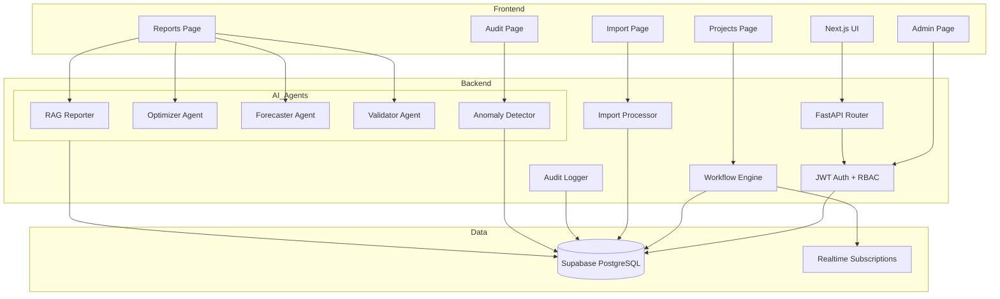

# Design Document: AI-Empowered PPM Features

## Overview

This design document specifies the architecture and implementation details for comprehensive AI-powered features in a FastAPI + Next.js PPM SaaS application. The system will enhance existing partial AI implementations, add new AI agents, implement a workflow engine, extend RBAC capabilities, enable bulk imports, and create an advanced audit trail system with AI-powered anomaly detection.

The implementation integrates with existing patterns:
- **Backend**: FastAPI with `Depends(get_current_user)` for JWT auth, Supabase for data persistence
- **Frontend**: Next.js 16 with Tailwind CSS and Recharts for visualization
- **AI Stack**: OpenAI API for LLM capabilities, scikit-learn for ML, statsmodels for time series, PuLP for optimization
- **Database**: Supabase PostgreSQL with organization_id filtering for multi-tenancy

## Architecture

### System Components




### Component Interactions

1. **AI Agent Flow**: Frontend → API Router → AI Agent → Supabase → AI Agent → Response → Frontend
2. **Workflow Flow**: Frontend → Workflow API → Workflow Engine → Supabase → Realtime → Frontend
3. **Import Flow**: Frontend → Upload → Import Processor → Validation → Supabase Batch Insert → Response
4. **Audit Flow**: All operations → Audit Logger → Supabase audit_logs → Anomaly Detector (periodic)

### Authentication and Authorization

All endpoints use existing JWT authentication pattern:
```python
from backend.auth.dependencies import get_current_user, require_admin
from backend.auth.rbac import UserRole, Permission

# Standard endpoint
@router.get("/endpoint")
async def endpoint(current_user: dict = Depends(get_current_user)):
    organization_id = current_user["organization_id"]
    # Filter all queries by organization_id

# Admin endpoint
@router.post("/admin/endpoint")
async def admin_endpoint(current_user: dict = Depends(require_admin)):
    # Only accessible to admin users
```

## Components and Interfaces

### 1. Enhanced RAG Reporter Agent

**Location**: `backend/ai_agents.py` (modify existing `RAGReporterAgent`)

**Purpose**: Fix existing AI chat with proper error handling, retry logic, and confidence threshold management.

**Key Methods**:
```python
class RAGReporterAgent:
    def __init__(self, supabase_client, openai_client):
        self.supabase = supabase_client
        self.openai = openai_client
        self.hallucination_validator = HallucinationValidator()
        self.max_retries = 3
        self.confidence_threshold = 0.5
    
    async def generate_report(
        self, 
        query: str, 
        organization_id: str,
        user_id: str
    ) -> Dict[str, Any]:
        """Generate report with retry logic and error handling"""
        
    async def _attempt_generation(
        self, 
        query: str, 
        context: List[Dict]
    ) -> Tuple[str, float]:
        """Single generation attempt with confidence scoring"""
        
    async def _retrieve_context(
        self, 
        query: str, 
        organization_id: str
    ) -> List[Dict]:
        """Retrieve relevant context from Supabase"""
        
    async def _log_interaction(
        self,
        user_id: str,
        query: str,
        response: str,
        confidence: float,
        success: bool,
        error: Optional[str] = None
    ):
        """Log all interactions to audit_logs"""
```

**Error Handling Strategy**:
1. Wrap all operations in try-except blocks
2. Catch specific exceptions: `OpenAIError`, `SupabaseError`, `ValidationError`
3. Implement exponential backoff: 1s, 2s, 4s between retries
4. Log all errors with full context to audit_logs
5. Return user-friendly error messages

**Confidence Threshold Logic**:
- If confidence < 0.5: trigger retry
- After 3 retries with low confidence: return fallback response
- Fallback response: "I don't have enough confidence in this answer. Please try rephrasing your question or contact support."

### 2. Resource Optimizer Agent

**Location**: `backend/ai_agents.py` (complete existing `ResourceOptimizerAgent`)

**Purpose**: Optimize resource allocations using linear programming to minimize costs while satisfying project constraints.

**Key Methods**:
```python
class ResourceOptimizerAgent:
    def __init__(self, supabase_client):
        self.supabase = supabase_client
    
    async def optimize_resources(
        self,
        organization_id: str,
        user_id: str,
        constraints: Optional[Dict] = None
    ) -> Dict[str, Any]:
        """Optimize resource allocations using PuLP"""
        
    def _build_optimization_model(
        self,
        resources: List[Dict],
        projects: List[Dict],
        constraints: Dict
    ) -> pulp.LpProblem:
        """Build linear programming model"""
        
    def _extract_recommendations(
        self,
        model: pulp.LpProblem,
        resources: List[Dict],
        projects: List[Dict]
    ) -> List[Dict]:
        """Extract recommendations from solved model"""
        
    def _calculate_confidence(
        self,
        model: pulp.LpProblem
    ) -> float:
        """Calculate confidence based on solution quality"""
```

**Optimization Model**:
- **Objective**: Minimize total cost = Σ(resource_cost × allocation_hours)
- **Constraints**:
  - Resource availability: Σ(allocations per resource) ≤ available_hours
  - Project requirements: Σ(allocations per project) ≥ required_hours
  - Skill matching: resource_skills ⊇ project_required_skills
- **Variables**: allocation[resource_id, project_id] = hours allocated

**Confidence Calculation**:
- 1.0: Optimal solution found with all constraints satisfied
- 0.8: Optimal solution with some constraints relaxed
- 0.6: Feasible solution found but not optimal
- 0.4: Partial solution with constraint violations
- 0.0: No feasible solution

### 3. Risk Forecaster Agent

**Location**: `backend/ai_agents.py` (complete existing `RiskForecasterAgent`)

**Purpose**: Forecast project risks using ARIMA time series analysis on historical risk data.

**Key Methods**:
```python
class RiskForecasterAgent:
    def __init__(self, supabase_client):
        self.supabase = supabase_client
        self.min_data_points = 10
    
    async def forecast_risks(
        self,
        organization_id: str,
        project_id: Optional[str],
        forecast_periods: int = 12,
        user_id: str
    ) -> Dict[str, Any]:
        """Forecast risks using ARIMA"""
        
    def _prepare_time_series(
        self,
        risk_data: List[Dict]
    ) -> pd.DataFrame:
        """Prepare time series data for ARIMA"""
        
    def _fit_arima_model(
        self,
        time_series: pd.Series
    ) -> Tuple[ARIMAResults, float]:
        """Fit ARIMA model and return with confidence"""
        
    def _generate_forecast(
        self,
        model: ARIMAResults,
        periods: int
    ) -> List[Dict]:
        """Generate forecast with confidence intervals"""
```

**ARIMA Configuration**:
- **Model Selection**: Auto ARIMA with AIC criterion
- **Parameters**: Test p,d,q in range (0-2, 0-1, 0-2)
- **Seasonality**: Detect and model if present
- **Validation**: Use last 20% of data for validation

**Forecast Output**:
```python
{
    "forecasts": [
        {
            "period": "2024-02",
            "risk_probability": 0.35,
            "risk_impact": 7.2,
            "confidence_lower": 0.25,
            "confidence_upper": 0.45
        }
    ],
    "model_confidence": 0.82,
    "model_metrics": {
        "aic": 145.2,
        "rmse": 0.08
    }
}
```

### 4. Data Validator Agent

**Location**: `backend/ai_agents.py` (complete existing stub)

**Purpose**: Validate data integrity, detect budget overruns, timeline issues, and inconsistencies.

**Key Methods**:
```python
class DataValidatorAgent:
    def __init__(self, supabase_client):
        self.supabase = supabase_client
    
    async def validate_data(
        self,
        organization_id: str,
        validation_scope: str,  # "all", "financials", "timelines", "integrity"
        user_id: str
    ) -> Dict[str, Any]:
        """Validate data and return issues"""
        
    async def _validate_financials(
        self,
        organization_id: str
    ) -> List[Dict]:
        """Check for budget overruns and financial inconsistencies"""
        
    async def _validate_timelines(
        self,
        organization_id: str
    ) -> List[Dict]:
        """Check for schedule conflicts and deadline violations"""
        
    async def _validate_integrity(
        self,
        organization_id: str
    ) -> List[Dict]:
        """Check foreign keys and required fields"""
```

**Validation Rules**:

1. **Financial Validation**:
   - Budget overrun: actual_cost > budget
   - Negative values: cost < 0 or budget < 0
   - Missing financials: projects without budget records

2. **Timeline Validation**:
   - End before start: end_date < start_date
   - Overdue projects: end_date < current_date AND status != "completed"
   - Resource conflicts: same resource allocated to overlapping tasks

3. **Integrity Validation**:
   - Orphaned records: foreign keys pointing to non-existent records
   - Missing required fields: NULL values in NOT NULL columns
   - Duplicate entries: duplicate unique identifiers

**Issue Severity Levels**:
- **CRITICAL**: Data corruption, integrity violations
- **HIGH**: Budget overruns > 20%, major timeline violations
- **MEDIUM**: Budget overruns 10-20%, minor timeline issues
- **LOW**: Missing optional fields, minor inconsistencies


### 5. Workflow Engine

**Location**: `backend/workflow_engine.py` (new file)

**Purpose**: Execute and manage approval workflows using existing workflow tables.

**Database Schema** (existing tables):
```sql
-- workflows table (workflow definitions)
CREATE TABLE workflows (
    id UUID PRIMARY KEY,
    name VARCHAR NOT NULL,
    description TEXT,
    steps JSONB NOT NULL,  -- Array of step definitions
    organization_id UUID NOT NULL,
    created_at TIMESTAMP DEFAULT NOW()
);

-- workflow_instances table (active workflows)
CREATE TABLE workflow_instances (
    id UUID PRIMARY KEY,
    workflow_id UUID REFERENCES workflows(id),
    entity_type VARCHAR NOT NULL,  -- "project", "change_request", etc.
    entity_id UUID NOT NULL,
    current_step INTEGER DEFAULT 0,
    status VARCHAR NOT NULL,  -- "pending", "approved", "rejected", "completed"
    data JSONB,
    organization_id UUID NOT NULL,
    created_at TIMESTAMP DEFAULT NOW(),
    updated_at TIMESTAMP DEFAULT NOW()
);

-- workflow_approvals table (approval decisions)
CREATE TABLE workflow_approvals (
    id UUID PRIMARY KEY,
    workflow_instance_id UUID REFERENCES workflow_instances(id),
    step_number INTEGER NOT NULL,
    approver_id UUID NOT NULL,
    decision VARCHAR,  -- "approved", "rejected", NULL (pending)
    comments TEXT,
    decided_at TIMESTAMP,
    organization_id UUID NOT NULL,
    created_at TIMESTAMP DEFAULT NOW()
);
```

**Key Classes**:
```python
class WorkflowEngine:
    def __init__(self, supabase_client):
        self.supabase = supabase_client
    
    async def create_instance(
        self,
        workflow_id: str,
        entity_type: str,
        entity_id: str,
        organization_id: str,
        initiator_id: str
    ) -> str:
        """Create new workflow instance"""
        
    async def advance_workflow(
        self,
        instance_id: str,
        organization_id: str,
        user_id: str
    ) -> Dict[str, Any]:
        """Advance workflow to next step"""
        
    async def submit_approval(
        self,
        instance_id: str,
        decision: str,  # "approved" or "rejected"
        comments: Optional[str],
        approver_id: str,
        organization_id: str
    ) -> Dict[str, Any]:
        """Submit approval decision"""
        
    async def get_instance_status(
        self,
        instance_id: str,
        organization_id: str
    ) -> Dict[str, Any]:
        """Get workflow instance status"""
        
    async def _notify_approvers(
        self,
        instance_id: str,
        step_number: int,
        approver_ids: List[str]
    ):
        """Send notifications via Supabase Realtime"""
```

**Workflow Step Definition**:
```python
{
    "step_number": 1,
    "name": "Manager Approval",
    "approver_role": "manager",  # or specific user_ids
    "required_approvals": 1,  # number of approvals needed
    "auto_advance": True  # advance automatically when approved
}
```

**Workflow Execution Logic**:
1. Create instance with status "pending", current_step = 0
2. Create approval records for first step approvers
3. When approval submitted:
   - Update workflow_approvals with decision
   - If approved and required_approvals met: advance to next step
   - If rejected: set instance status to "rejected"
   - If last step approved: set instance status to "completed"
4. Log all state changes to audit_logs
5. Send Realtime notifications on state changes

### 6. Bulk Import Processor

**Location**: `backend/import_processor.py` (new file)

**Purpose**: Process CSV/JSON file uploads with validation and batch insertion.

**Key Classes**:
```python
class ImportProcessor:
    def __init__(self, supabase_client):
        self.supabase = supabase_client
        self.batch_size = 100
    
    async def process_import(
        self,
        file_content: bytes,
        file_type: str,  # "csv" or "json"
        entity_type: str,  # "projects", "resources", "financials"
        organization_id: str,
        user_id: str
    ) -> Dict[str, Any]:
        """Process import file"""
        
    def _parse_csv(
        self,
        content: bytes
    ) -> pd.DataFrame:
        """Parse CSV file using pandas"""
        
    def _parse_json(
        self,
        content: bytes
    ) -> List[Dict]:
        """Parse JSON file"""
        
    async def _validate_records(
        self,
        records: List[Dict],
        entity_type: str
    ) -> Tuple[List[Dict], List[Dict]]:
        """Validate records, return (valid, invalid)"""
        
    async def _batch_insert(
        self,
        records: List[Dict],
        table_name: str,
        organization_id: str
    ) -> int:
        """Batch insert records using Supabase transaction"""
```

**Validation Models** (Pydantic):
```python
class ProjectImportModel(BaseModel):
    name: str
    description: Optional[str]
    start_date: date
    end_date: date
    budget: Decimal
    status: str
    
    @validator('end_date')
    def end_after_start(cls, v, values):
        if 'start_date' in values and v < values['start_date']:
            raise ValueError('end_date must be after start_date')
        return v

class ResourceImportModel(BaseModel):
    name: str
    email: EmailStr
    role: str
    hourly_rate: Decimal
    skills: List[str]

class FinancialImportModel(BaseModel):
    project_id: UUID
    category: str
    amount: Decimal
    date: date
```

**Import Process**:
1. Parse file (CSV with pandas, JSON with json.loads)
2. Validate each record against Pydantic model
3. Collect validation errors with line numbers
4. If validation passes: batch insert in chunks of 100
5. Use Supabase transaction for atomicity
6. Log import to audit_logs with counts
7. Return summary: {success_count, error_count, errors: [{line, field, message}]}

### 7. Anomaly Detection Agent

**Location**: `backend/ai_agents.py`

**Purpose**: Detect suspicious patterns in audit logs using Isolation Forest.

**Key Methods**:
```python
class AnomalyDetectorAgent:
    def __init__(self, supabase_client):
        self.supabase = supabase_client
        self.contamination = 0.1  # Expected anomaly rate
    
    async def detect_anomalies(
        self,
        organization_id: str,
        time_range_days: int = 30,
        user_id: str
    ) -> Dict[str, Any]:
        """Detect anomalies in audit logs"""
        
    def _prepare_features(
        self,
        audit_logs: List[Dict]
    ) -> pd.DataFrame:
        """Extract features for anomaly detection"""
        
    def _train_isolation_forest(
        self,
        features: pd.DataFrame
    ) -> IsolationForest:
        """Train Isolation Forest model"""
        
    def _score_anomalies(
        self,
        model: IsolationForest,
        features: pd.DataFrame,
        audit_logs: List[Dict]
    ) -> List[Dict]:
        """Score and rank anomalies"""
```

**Feature Engineering**:
```python
features = {
    "hour_of_day": log.created_at.hour,
    "day_of_week": log.created_at.weekday(),
    "action_frequency": count of action type in last hour,
    "user_action_diversity": unique actions by user in last hour,
    "time_since_last_action": seconds since user's last action,
    "failed_attempts": count of failed actions in last hour,
    "data_volume": size of data accessed/modified
}
```

**Isolation Forest Configuration**:
- **n_estimators**: 100 trees
- **contamination**: 0.1 (expect 10% anomalies)
- **max_samples**: 256
- **random_state**: 42 for reproducibility

**Anomaly Scoring**:
- Isolation Forest returns anomaly score: -1 (anomaly) or 1 (normal)
- Convert to confidence: `confidence = (1 - score) / 2`  # 0.0 to 1.0
- Rank by confidence descending
- Return top anomalies with context

### 8. Audit RAG Search

**Location**: `backend/ai_agents.py`

**Purpose**: Enable natural language search over audit logs using RAG.

**Key Methods**:
```python
class AuditSearchAgent:
    def __init__(self, supabase_client, openai_client):
        self.supabase = supabase_client
        self.openai = openai_client
    
    async def search_audit_logs(
        self,
        query: str,
        organization_id: str,
        user_id: str,
        limit: int = 50
    ) -> Dict[str, Any]:
        """Search audit logs using RAG"""
        
    async def _generate_embedding(
        self,
        text: str
    ) -> List[float]:
        """Generate embedding for query"""
        
    async def _semantic_search(
        self,
        embedding: List[float],
        organization_id: str,
        limit: int
    ) -> List[Dict]:
        """Perform semantic search on audit logs"""
        
    def _rank_results(
        self,
        query: str,
        results: List[Dict]
    ) -> List[Dict]:
        """Rank results by relevance"""
```

**Search Process**:
1. Generate embedding for natural language query using OpenAI
2. Perform vector similarity search on audit_logs (requires embedding column)
3. Rank results by cosine similarity
4. Highlight relevant sections in log details
5. Return top N results with relevance scores

**Note**: Requires adding embedding column to audit_logs:
```sql
ALTER TABLE audit_logs ADD COLUMN embedding vector(1536);
CREATE INDEX ON audit_logs USING ivfflat (embedding vector_cosine_ops);
```


## Data Models

### API Request/Response Models

**AI Agent Requests**:
```python
# RAG Reporter
class RAGReportRequest(BaseModel):
    query: str = Field(..., min_length=1, max_length=1000)

class RAGReportResponse(BaseModel):
    response: str
    confidence: float
    sources: List[Dict[str, Any]]
    timestamp: datetime

# Resource Optimizer
class OptimizeResourcesRequest(BaseModel):
    constraints: Optional[Dict[str, Any]] = None

class ResourceRecommendation(BaseModel):
    resource_id: UUID
    resource_name: str
    project_id: UUID
    project_name: str
    allocated_hours: float
    cost_savings: float
    confidence: float

class OptimizeResourcesResponse(BaseModel):
    recommendations: List[ResourceRecommendation]
    total_cost_savings: float
    model_confidence: float
    constraints_satisfied: bool

# Risk Forecaster
class ForecastRisksRequest(BaseModel):
    project_id: Optional[UUID] = None
    forecast_periods: int = Field(default=12, ge=1, le=24)

class RiskForecast(BaseModel):
    period: str
    risk_probability: float
    risk_impact: float
    confidence_lower: float
    confidence_upper: float

class ForecastRisksResponse(BaseModel):
    forecasts: List[RiskForecast]
    model_confidence: float
    model_metrics: Dict[str, float]

# Data Validator
class ValidateDataRequest(BaseModel):
    validation_scope: str = Field(default="all", pattern="^(all|financials|timelines|integrity)$")

class ValidationIssue(BaseModel):
    severity: str  # "CRITICAL", "HIGH", "MEDIUM", "LOW"
    category: str  # "financial", "timeline", "integrity"
    entity_type: str
    entity_id: UUID
    description: str
    recommendation: Optional[str]

class ValidateDataResponse(BaseModel):
    issues: List[ValidationIssue]
    total_issues: int
    critical_count: int
    high_count: int
    medium_count: int
    low_count: int
```

**Workflow Models**:
```python
class CreateWorkflowInstanceRequest(BaseModel):
    workflow_id: UUID
    entity_type: str
    entity_id: UUID

class SubmitApprovalRequest(BaseModel):
    decision: str = Field(..., pattern="^(approved|rejected)$")
    comments: Optional[str] = Field(None, max_length=1000)

class WorkflowStep(BaseModel):
    step_number: int
    name: str
    status: str  # "pending", "approved", "rejected"
    approver_name: Optional[str]
    decided_at: Optional[datetime]
    comments: Optional[str]

class WorkflowInstanceResponse(BaseModel):
    id: UUID
    workflow_name: str
    entity_type: str
    entity_id: UUID
    current_step: int
    status: str
    steps: List[WorkflowStep]
    created_at: datetime
    updated_at: datetime
```

**Import Models**:
```python
class ImportRequest(BaseModel):
    entity_type: str = Field(..., pattern="^(projects|resources|financials)$")

class ImportError(BaseModel):
    line_number: int
    field: str
    message: str
    value: Any

class ImportResponse(BaseModel):
    success_count: int
    error_count: int
    errors: List[ImportError]
    processing_time_seconds: float
```

**Audit Models**:
```python
class DetectAnomaliesRequest(BaseModel):
    time_range_days: int = Field(default=30, ge=1, le=90)

class AnomalyResult(BaseModel):
    log_id: UUID
    timestamp: datetime
    user_id: UUID
    user_name: str
    action: str
    confidence: float  # 0.0 = normal, 1.0 = highly anomalous
    reason: str
    details: Dict[str, Any]

class DetectAnomaliesResponse(BaseModel):
    anomalies: List[AnomalyResult]
    total_logs_analyzed: int
    anomaly_count: int

class AuditSearchRequest(BaseModel):
    query: str = Field(..., min_length=1, max_length=500)
    limit: int = Field(default=50, ge=1, le=100)

class AuditSearchResult(BaseModel):
    log_id: UUID
    timestamp: datetime
    user_name: str
    action: str
    details: str
    relevance_score: float
    highlighted_text: str

class AuditSearchResponse(BaseModel):
    results: List[AuditSearchResult]
    total_results: int

class AddTagRequest(BaseModel):
    tag: str = Field(..., min_length=1, max_length=50)

class ExportAuditLogsRequest(BaseModel):
    format: str = Field(..., pattern="^(csv|json)$")
    start_date: Optional[date] = None
    end_date: Optional[date] = None
    user_id: Optional[UUID] = None
    action_type: Optional[str] = None
```

**RBAC Models**:
```python
class RoleInfo(BaseModel):
    role: str
    permissions: List[str]
    description: str

class AssignRoleRequest(BaseModel):
    role: str = Field(..., pattern="^(admin|manager|member|viewer)$")

class UserRoleInfo(BaseModel):
    user_id: UUID
    user_name: str
    email: str
    roles: List[str]
```

### Database Models

**Audit Log Entry**:
```python
{
    "id": UUID,
    "organization_id": UUID,
    "user_id": UUID,
    "action": str,  # "ai_query", "workflow_approval", "import", "anomaly_detection"
    "entity_type": Optional[str],  # "project", "resource", etc.
    "entity_id": Optional[UUID],
    "details": JSONB,  # Action-specific details
    "success": bool,
    "error_message": Optional[str],
    "ip_address": Optional[str],
    "user_agent": Optional[str],
    "embedding": Optional[vector(1536)],  # For RAG search
    "tags": List[str],
    "created_at": timestamp
}
```

**Workflow Instance Data**:
```python
{
    "id": UUID,
    "workflow_id": UUID,
    "entity_type": str,
    "entity_id": UUID,
    "current_step": int,
    "status": str,
    "data": {
        "initiator_id": UUID,
        "initiator_name": str,
        "entity_details": Dict,
        "history": List[Dict]  # State change history
    },
    "organization_id": UUID,
    "created_at": timestamp,
    "updated_at": timestamp
}
```

## Correctness Properties

*A property is a characteristic or behavior that should hold true across all valid executions of a system—essentially, a formal statement about what the system should do. Properties serve as the bridge between human-readable specifications and machine-verifiable correctness guarantees.*


### Property Reflection

After analyzing all acceptance criteria, I've identified several areas of redundancy:

1. **Audit Logging Properties**: Requirements 1.1, 1.5, 2.4, 3.6, 4.6, 6.6, 9.5, 11.5, 13.5, 14.5, 15.6 all test that operations are logged to audit_logs. These can be consolidated into a single comprehensive property about audit logging for all operations.

2. **Organization Context Filtering**: Requirements 2.1, 3.1, 7.2, 11.7, 13.1, 14.2, 15.1, 15.5 all test that data is filtered by organization_id. These can be combined into one property about organization isolation.

3. **Confidence Score Presence**: Requirements 2.3, 3.4, 13.3 all test that AI agent outputs include confidence scores. These can be combined into one property.

4. **Authentication Validation**: Requirements 7.4, 9.4, 15.5 all test JWT authentication. These can be combined into one property.

5. **Frontend Display Properties**: Many frontend requirements (5.4, 5.6, 8.1, 10.2, 10.6, 16.7) test that data is displayed correctly. These can be consolidated into fewer, more comprehensive properties.

6. **Error Handling**: Requirements 1.7, 2.5, 3.5 test error handling patterns. These can be combined into a general error handling property.

After reflection, I'll write consolidated properties that eliminate redundancy while maintaining comprehensive coverage.

### Correctness Properties

**Property 1: Audit Logging Completeness**
*For any* system operation (AI query, workflow action, import, role change, anomaly detection, audit search, tagging), the system SHALL create an audit log entry containing timestamp, user_id, action type, success status, and operation-specific details filtered by organization_id.
**Validates: Requirements 1.1, 1.5, 2.4, 3.6, 4.6, 6.6, 9.5, 11.5, 13.5, 14.5, 15.6**

**Property 2: Retry with Exponential Backoff**
*For any* RAG_Agent request that fails, the system SHALL retry exactly 3 times with exponential backoff delays of 1s, 2s, and 4s between attempts.
**Validates: Requirements 1.2**

**Property 3: Confidence Threshold Handling**
*For any* RAG_Agent response with confidence score below 0.5, the system SHALL either trigger a retry or return a fallback response indicating low confidence.
**Validates: Requirements 1.3**

**Property 4: Exception Logging and User-Friendly Errors**
*For any* unexpected exception during AI agent processing, the system SHALL log the full stack trace to audit_logs AND return a user-friendly error message (not the raw exception) to the user.
**Validates: Requirements 1.7**

**Property 5: Organization Context Isolation**
*For any* data retrieval operation (AI agents, workflows, imports, audit logs), the system SHALL filter all queries by the authenticated user's organization_id, ensuring users can only access their organization's data.
**Validates: Requirements 2.1, 3.1, 7.2, 11.7, 13.1, 14.2, 15.1**

**Property 6: Optimization Cost Minimization**
*For any* valid resource optimization request with satisfiable constraints, the Optimizer_Agent SHALL return a solution that minimizes total cost (Σ resource_cost × allocation_hours) while satisfying all project requirements and resource availability constraints.
**Validates: Requirements 2.2**

**Property 7: AI Agent Confidence Scores**
*For any* AI agent response (Optimizer, Forecaster, Validator, Anomaly Detector), the system SHALL include a confidence score between 0.0 and 1.0 for each recommendation or prediction.
**Validates: Requirements 2.3, 3.4, 13.3**

**Property 8: Missing Data Error Messages**
*For any* AI agent request with insufficient input data, the system SHALL return an error message specifically indicating which required data fields or minimum data requirements are missing.
**Validates: Requirements 2.5, 3.5**

**Property 9: ARIMA Forecast Output Format**
*For any* successful risk forecast, the Forecaster_Agent SHALL return predictions containing risk_probability, risk_impact, timeline period, confidence_lower, confidence_upper, and model_confidence for each forecast period.
**Validates: Requirements 3.3, 3.4**

**Property 10: Budget Overrun Detection**
*For any* project where actual_cost > budget, the Validator_Agent SHALL detect and report the overrun with severity level based on percentage (>20% = HIGH, 10-20% = MEDIUM, <10% = LOW).
**Validates: Requirements 4.1**

**Property 11: Timeline Violation Detection**
*For any* project where end_date < start_date OR (end_date < current_date AND status != "completed"), the Validator_Agent SHALL detect and report the timeline violation.
**Validates: Requirements 4.2**

**Property 12: Data Integrity Validation**
*For any* validation request, the Validator_Agent SHALL check for orphaned foreign key references, NULL values in required fields, and duplicate unique identifiers, reporting all violations found.
**Validates: Requirements 4.3**

**Property 13: Validation Issue Severity Assignment**
*For any* detected validation issue, the system SHALL assign a severity level (CRITICAL, HIGH, MEDIUM, LOW) based on the issue type and impact, and include this in the validation report.
**Validates: Requirements 4.4**

**Property 14: Frontend Error Handling**
*For any* failed AI agent request, the Frontend SHALL display both a toast notification with the error message AND a retry button to resubmit the request.
**Validates: Requirements 5.1, 5.2**

**Property 15: Frontend Loading States**
*For any* AI agent request in progress, the Frontend SHALL display a loading indicator until the request completes or fails.
**Validates: Requirements 5.5**

**Property 16: Workflow Instance Creation**
*For any* new workflow instance, the Workflow_Engine SHALL create a record in workflow_instances with status="pending", current_step=0, and the authenticated user's organization_id.
**Validates: Requirements 6.1**

**Property 17: Workflow Approval Record Creation**
*For any* workflow step requiring approval, the Workflow_Engine SHALL create entries in workflow_approvals for all assigned approvers with decision=NULL and the current step_number.
**Validates: Requirements 6.2**

**Property 18: Workflow State Advancement**
*For any* workflow approval where decision="approved" AND required_approvals are met, the Workflow_Engine SHALL increment current_step and create approval records for the next step's approvers.
**Validates: Requirements 6.3**

**Property 19: Workflow Completion**
*For any* workflow where the final step receives required approvals, the Workflow_Engine SHALL set status="completed" and NOT create additional approval records.
**Validates: Requirements 6.4**

**Property 20: Workflow Rejection Halting**
*For any* workflow approval where decision="rejected", the Workflow_Engine SHALL set status="rejected", halt progression (no step advancement), and NOT create additional approval records.
**Validates: Requirements 6.5**

**Property 21: Workflow Realtime Notifications**
*For any* workflow state change (step advancement, approval, rejection, completion), the Workflow_Engine SHALL send a notification via Supabase Realtime to all relevant users (approvers, initiator).
**Validates: Requirements 6.7**

**Property 22: JWT Authentication Enforcement**
*For any* API endpoint request without a valid JWT token OR with a token from a different organization, the system SHALL return a 401 Unauthorized or 403 Forbidden error.
**Validates: Requirements 7.4, 9.4, 15.5**

**Property 23: Input Validation Error Details**
*For any* API request with invalid input data, the system SHALL return a 422 validation error response containing specific field names and error descriptions for each invalid field.
**Validates: Requirements 7.5, 9.6**

**Property 24: Admin Authorization**
*For any* request to admin endpoints (/admin/*) by a user without admin role, the system SHALL return a 403 Forbidden error.
**Validates: Requirements 9.4**

**Property 25: Role Assignment and Removal**
*For any* valid role assignment or removal request by an admin, the system SHALL update the user's roles AND log the change to audit_logs with both admin_user_id and affected_user_id.
**Validates: Requirements 9.2, 9.3, 9.5**

**Property 26: CSV Import Parsing**
*For any* valid CSV file uploaded to /projects/import, the system SHALL parse all rows using pandas and validate each record against the appropriate Pydantic model.
**Validates: Requirements 11.1, 11.3**

**Property 27: JSON Import Parsing**
*For any* valid JSON file uploaded to /projects/import, the system SHALL parse the structure and validate each record against the appropriate Pydantic model.
**Validates: Requirements 11.2, 11.3**

**Property 28: Import Transaction Atomicity**
*For any* import operation, if validation fails for any record OR database insertion fails, the system SHALL rollback the entire transaction, ensuring no partial data is committed.
**Validates: Requirements 11.4**

**Property 29: Import Validation Error Reporting**
*For any* import with validation errors, the system SHALL return a report containing line_number, field_name, and error_message for each invalid record.
**Validates: Requirements 11.6**

**Property 30: Isolation Forest Anomaly Detection**
*For any* anomaly detection request, the Anomaly_Detector SHALL use scikit-learn Isolation Forest with features including hour_of_day, day_of_week, action_frequency, user_action_diversity, and time_since_last_action to identify anomalies.
**Validates: Requirements 13.2, 13.4**

**Property 31: RAG Audit Search Relevance Ranking**
*For any* audit search query, the Audit_System SHALL return results ranked by relevance score (cosine similarity of embeddings) in descending order.
**Validates: Requirements 14.3**

**Property 32: Audit Search Result Highlighting**
*For any* audit search result, the system SHALL include highlighted_text showing the relevant sections that matched the query.
**Validates: Requirements 14.4**

**Property 33: Audit Log Filtering**
*For any* GET request to /audit/logs with filter parameters (date_range, user_id, action_type), the system SHALL return only logs matching ALL specified filters AND filtered by organization_id.
**Validates: Requirements 15.1**

**Property 34: Audit Log Tagging**
*For any* POST request to /audit/logs/{id}/tag, the system SHALL add the tag to the log entry AND create an audit log recording the tagging action with the user who added the tag.
**Validates: Requirements 15.2, 15.6**

**Property 35: Audit Export Completeness**
*For any* audit export request, the generated CSV or JSON file SHALL include all fields: timestamp, user_id, action, entity_type, entity_id, details, success, error_message, and tags for each log entry.
**Validates: Requirements 15.4**

**Property 36: Frontend Real-time Workflow Updates**
*For any* workflow state change, the Frontend SHALL update the displayed workflow status within 2 seconds using Supabase Realtime subscriptions without requiring a page refresh.
**Validates: Requirements 8.3**

**Property 37: Frontend Data Formatting Consistency**
*For any* displayed numerical value or date across all pages, the Frontend SHALL use consistent formatting (e.g., dates as YYYY-MM-DD, currency with 2 decimals, percentages with 1 decimal).
**Validates: Requirements 5.6**

**Property 38: Non-Admin Access Denial**
*For any* non-admin user attempting to access /admin routes, the Frontend SHALL either redirect to the home page OR display an access denied message.
**Validates: Requirements 10.5**


## Error Handling

### Error Handling Strategy

All components follow a consistent error handling pattern:

1. **Specific Exception Catching**: Catch specific exceptions (OpenAIError, SupabaseError, ValidationError) before generic Exception
2. **Audit Logging**: Log all errors to audit_logs with full context
3. **User-Friendly Messages**: Return sanitized error messages to users (never expose stack traces)
4. **HTTP Status Codes**: Use appropriate status codes (400, 401, 403, 404, 422, 500)
5. **Structured Error Responses**: Return consistent error format

### Error Response Format

```python
class ErrorResponse(BaseModel):
    error: str  # Error type/category
    message: str  # User-friendly message
    details: Optional[Dict[str, Any]]  # Additional context
    request_id: Optional[str]  # For tracking
```

### Component-Specific Error Handling

**AI Agents**:
```python
try:
    result = await agent.process(request)
    return result
except OpenAIError as e:
    await log_error(user_id, "openai_error", str(e))
    if retry_count < max_retries:
        await asyncio.sleep(2 ** retry_count)
        return await retry_with_backoff(request, retry_count + 1)
    raise HTTPException(
        status_code=503,
        detail="AI service temporarily unavailable. Please try again."
    )
except ValidationError as e:
    await log_error(user_id, "validation_error", str(e))
    raise HTTPException(
        status_code=422,
        detail={"error": "validation_failed", "fields": e.errors()}
    )
except Exception as e:
    await log_error(user_id, "unexpected_error", str(e), traceback.format_exc())
    raise HTTPException(
        status_code=500,
        detail="An unexpected error occurred. Please contact support."
    )
```

**Workflow Engine**:
```python
try:
    instance = await workflow_engine.advance_workflow(instance_id, org_id, user_id)
    return instance
except WorkflowNotFoundError:
    raise HTTPException(status_code=404, detail="Workflow instance not found")
except WorkflowAlreadyCompletedError:
    raise HTTPException(status_code=400, detail="Workflow already completed")
except InsufficientPermissionsError:
    raise HTTPException(status_code=403, detail="You don't have permission to approve this workflow")
except Exception as e:
    await log_error(user_id, "workflow_error", str(e))
    raise HTTPException(status_code=500, detail="Failed to process workflow")
```

**Import Processor**:
```python
try:
    result = await import_processor.process_import(file, file_type, entity_type, org_id, user_id)
    return result
except pandas.errors.ParserError as e:
    raise HTTPException(
        status_code=400,
        detail=f"Failed to parse {file_type.upper()} file: {str(e)}"
    )
except ValidationError as e:
    # Return detailed validation errors
    return ImportResponse(
        success_count=0,
        error_count=len(e.errors()),
        errors=[
            ImportError(
                line_number=err.get("line", 0),
                field=err["loc"][0],
                message=err["msg"],
                value=err.get("input")
            )
            for err in e.errors()
        ]
    )
except SupabaseError as e:
    await log_error(user_id, "database_error", str(e))
    raise HTTPException(
        status_code=500,
        detail="Database error during import. Transaction rolled back."
    )
```

### Frontend Error Handling

**API Error Handling**:
```typescript
async function callAIAgent(endpoint: string, data: any) {
  try {
    const response = await fetch(endpoint, {
      method: 'POST',
      headers: {
        'Authorization': `Bearer ${token}`,
        'Content-Type': 'application/json'
      },
      body: JSON.stringify(data)
    });
    
    if (!response.ok) {
      const error = await response.json();
      throw new APIError(error.message, response.status, error.details);
    }
    
    return await response.json();
  } catch (error) {
    if (error instanceof APIError) {
      // Show user-friendly error
      toast.error(error.message);
      // Log to console for debugging
      console.error('API Error:', error);
    } else {
      // Network or unexpected error
      toast.error('Network error. Please check your connection.');
      console.error('Unexpected error:', error);
    }
    throw error;
  }
}
```

**Retry Logic**:
```typescript
function AIAgentPanel() {
  const [error, setError] = useState<string | null>(null);
  const [retryCount, setRetryCount] = useState(0);
  
  const handleSubmit = async () => {
    try {
      setError(null);
      const result = await callAIAgent('/api/agents/optimize', data);
      setResult(result);
      setRetryCount(0);
    } catch (err) {
      setError(err.message);
      // Show retry button
    }
  };
  
  const handleRetry = () => {
    setRetryCount(retryCount + 1);
    handleSubmit();
  };
  
  return (
    <div>
      {error && (
        <div className="error-banner">
          <p>{error}</p>
          <button onClick={handleRetry}>Retry</button>
        </div>
      )}
      {/* ... rest of component */}
    </div>
  );
}
```

## Testing Strategy

### Dual Testing Approach

The implementation requires both unit tests and property-based tests for comprehensive coverage:

**Unit Tests**: Focus on specific examples, edge cases, and integration points
**Property Tests**: Verify universal properties across all inputs using randomization

### Property-Based Testing Configuration

**Library Selection**:
- **Python Backend**: Use `hypothesis` library for property-based testing
- **TypeScript Frontend**: Use `fast-check` library for property-based testing

**Test Configuration**:
```python
# pytest configuration in conftest.py
from hypothesis import settings, Verbosity

settings.register_profile("ci", max_examples=100, verbosity=Verbosity.verbose)
settings.register_profile("dev", max_examples=50)
settings.load_profile("dev")
```

**Property Test Template**:
```python
from hypothesis import given, strategies as st
import pytest

@given(
    query=st.text(min_size=1, max_size=1000),
    organization_id=st.uuids(),
    user_id=st.uuids()
)
@settings(max_examples=100)
def test_rag_agent_audit_logging(query, organization_id, user_id):
    """
    Feature: ai-empowered-ppm-features
    Property 1: Audit Logging Completeness
    
    For any RAG agent query, the system SHALL create an audit log entry
    containing timestamp, user_id, action type, success status, and details.
    """
    # Arrange
    agent = RAGReporterAgent(supabase_client, openai_client)
    
    # Act
    result = await agent.generate_report(query, str(organization_id), str(user_id))
    
    # Assert
    audit_logs = supabase_client.table("audit_logs").select("*").eq("user_id", str(user_id)).execute()
    assert len(audit_logs.data) > 0
    
    latest_log = audit_logs.data[-1]
    assert latest_log["user_id"] == str(user_id)
    assert latest_log["organization_id"] == str(organization_id)
    assert latest_log["action"] == "ai_query"
    assert "success" in latest_log
    assert "details" in latest_log
    assert latest_log["created_at"] is not None
```

### Test Coverage Requirements

**Backend Tests** (pytest):

1. **AI Agents** (`tests/test_ai_agents.py`):
   - Property tests for audit logging (Property 1)
   - Property tests for retry logic (Property 2)
   - Property tests for confidence thresholds (Property 3, 7)
   - Property tests for organization isolation (Property 5)
   - Unit tests for specific error scenarios
   - Unit tests for edge cases (empty data, malformed input)

2. **Workflow Engine** (`tests/test_workflow_engine.py`):
   - Property tests for workflow state transitions (Properties 16-21)
   - Property tests for organization isolation (Property 5)
   - Unit tests for approval logic
   - Unit tests for rejection handling
   - Integration tests for Realtime notifications

3. **Import Processor** (`tests/test_import_processor.py`):
   - Property tests for CSV/JSON parsing (Properties 26-27)
   - Property tests for transaction atomicity (Property 28)
   - Property tests for validation error reporting (Property 29)
   - Unit tests for specific file formats
   - Unit tests for large file handling

4. **Audit System** (`tests/test_audit_system.py`):
   - Property tests for anomaly detection (Property 30)
   - Property tests for RAG search (Properties 31-32)
   - Property tests for filtering (Property 33)
   - Property tests for tagging (Property 34)
   - Unit tests for export formats

5. **RBAC** (`tests/test_rbac.py`):
   - Property tests for authentication (Property 22)
   - Property tests for admin authorization (Property 24)
   - Property tests for role assignment (Property 25)
   - Unit tests for permission checks

**Frontend Tests** (Jest + React Testing Library):

1. **AI Agent Components** (`tests/components/AIAgents.test.tsx`):
   - Property tests for error handling (Property 14)
   - Property tests for loading states (Property 15)
   - Unit tests for result visualization
   - Unit tests for retry button functionality

2. **Workflow Components** (`tests/components/Workflows.test.tsx`):
   - Property tests for real-time updates (Property 36)
   - Unit tests for approval modal
   - Unit tests for workflow status display
   - Integration tests with Supabase Realtime

3. **Import Components** (`tests/components/Import.test.tsx`):
   - Unit tests for file upload
   - Unit tests for progress display
   - Unit tests for error display
   - Unit tests for validation error formatting

4. **Audit Components** (`tests/components/Audit.test.tsx`):
   - Unit tests for timeline chart
   - Unit tests for search interface
   - Unit tests for anomaly highlighting
   - Unit tests for tag management

5. **Admin Components** (`tests/components/Admin.test.tsx`):
   - Property tests for access control (Property 38)
   - Unit tests for role assignment UI
   - Unit tests for user list display

### Integration Testing

**End-to-End Workflows**:
1. Complete AI agent workflow: Query → Processing → Response → Audit Log
2. Complete workflow approval: Create → Approve → Advance → Complete → Notification
3. Complete import workflow: Upload → Validate → Insert → Audit Log
4. Complete audit workflow: Action → Log → Search → Tag → Export

**Database Integration**:
- Test with real Supabase instance (test database)
- Test organization isolation
- Test transaction rollbacks
- Test Realtime subscriptions

### Test Data Generation

**Hypothesis Strategies**:
```python
from hypothesis import strategies as st

# Custom strategies for domain models
@st.composite
def project_strategy(draw):
    return {
        "name": draw(st.text(min_size=1, max_size=100)),
        "start_date": draw(st.dates()),
        "end_date": draw(st.dates()),
        "budget": draw(st.decimals(min_value=0, max_value=1000000, places=2)),
        "status": draw(st.sampled_from(["planning", "active", "completed", "cancelled"]))
    }

@st.composite
def workflow_strategy(draw):
    num_steps = draw(st.integers(min_value=1, max_value=5))
    return {
        "name": draw(st.text(min_size=1, max_size=100)),
        "steps": [
            {
                "step_number": i,
                "name": draw(st.text(min_size=1, max_size=50)),
                "approver_role": draw(st.sampled_from(["admin", "manager", "member"])),
                "required_approvals": draw(st.integers(min_value=1, max_value=3))
            }
            for i in range(num_steps)
        ]
    }
```

### Performance Testing

**Load Testing** (using locust):
- Test AI agent endpoints with concurrent requests
- Test workflow engine with multiple simultaneous approvals
- Test import processor with large files
- Test audit search with large datasets

**Performance Targets**:
- AI agent response time: < 5 seconds (95th percentile)
- Workflow state transition: < 500ms
- Import processing: > 1000 records/second
- Audit search: < 2 seconds for 100k logs

### Continuous Integration

**CI Pipeline** (GitHub Actions):
```yaml
name: Test Suite

on: [push, pull_request]

jobs:
  backend-tests:
    runs-on: ubuntu-latest
    steps:
      - uses: actions/checkout@v2
      - name: Set up Python
        uses: actions/setup-python@v2
        with:
          python-version: '3.11'
      - name: Install dependencies
        run: |
          pip install -r requirements.txt
          pip install pytest hypothesis pytest-asyncio
      - name: Run property tests
        run: pytest tests/ --hypothesis-profile=ci -v
      - name: Run unit tests
        run: pytest tests/ -v --cov=backend --cov-report=xml
      - name: Upload coverage
        uses: codecov/codecov-action@v2

  frontend-tests:
    runs-on: ubuntu-latest
    steps:
      - uses: actions/checkout@v2
      - name: Set up Node.js
        uses: actions/setup-node@v2
        with:
          node-version: '18'
      - name: Install dependencies
        run: npm ci
      - name: Run tests
        run: npm test -- --coverage
      - name: Upload coverage
        uses: codecov/codecov-action@v2
```

### Test Documentation

Each property test MUST include a docstring with:
1. Feature name: `ai-empowered-ppm-features`
2. Property number and title
3. Property statement (from design document)
4. Requirements validated

Example:
```python
def test_property_5_organization_isolation():
    """
    Feature: ai-empowered-ppm-features
    Property 5: Organization Context Isolation
    
    For any data retrieval operation (AI agents, workflows, imports, audit logs),
    the system SHALL filter all queries by the authenticated user's organization_id,
    ensuring users can only access their organization's data.
    
    Validates: Requirements 2.1, 3.1, 7.2, 11.7, 13.1, 14.2, 15.1
    """
```
