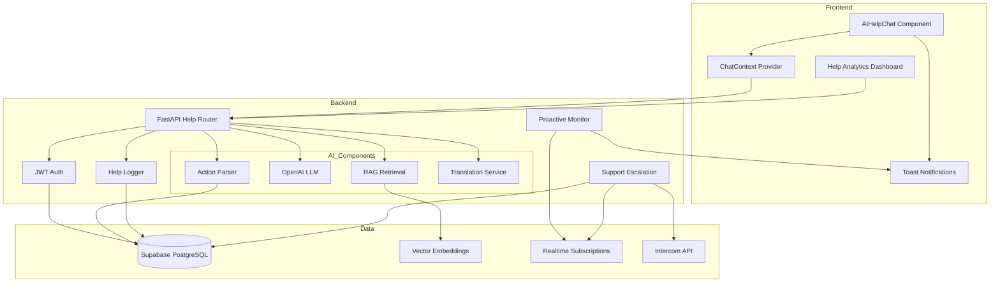

# Design Document: AI Help Chat Enhancement

## Overview

This design document specifies the architecture and implementation details for enhancing the existing AI Help Chat feature in a Next.js 16 + FastAPI PPM SaaS application. The enhancement follows a three-phase roadmap: (1) Optimization & Integration with context-aware responses and RAG, (2) Proactive & Actionable Features with natural language actions, and (3) Scaling & Enterprise-Ready features with multi-language support and human escalation.

The implementation integrates with existing patterns:
- **Frontend**: Next.js 16 with React Context for state management, Tailwind CSS for styling, Recharts for analytics visualization
- **Backend**: FastAPI with `Depends(get_current_user)` for JWT auth, Supabase for data persistence
- **AI Stack**: OpenAI API for LLM capabilities and embeddings, DeepL API for translation
- **Database**: Supabase PostgreSQL with organization_id filtering for multi-tenancy, pgvector for RAG
- **Real-time**: Supabase Realtime for proactive notifications and support escalation

**Current State**: Basic AIHelpChat.tsx component using useState and fetch to /api/help/query endpoint.

**Target State**: Context-aware, RAG-enhanced chat with proactive tips, natural language actions, multi-language support, and human escalation.

## Architecture

### System Components



### Component Interactions

**Phase 1 - Context-Aware Query Flow**:
1. User submits query → ChatContext captures page + role → API receives enriched query
2. API → RAG retrieves top-3 docs → LLM generates response with sources → Logger logs interaction
3. Response → Frontend displays with feedback buttons → User provides feedback → Logger stores rating

**Phase 2 - Proactive Tips Flow**:
1. Supabase Realtime detects data change (variance > 10%) → Monitor evaluates trigger rules
2. Monitor → Toast notification with pre-filled query → User clicks "Learn More" → Chat opens with context

**Phase 2 - Natural Language Actions Flow**:
1. User query → Action Parser (OpenAI Function Calling) → Identifies action + parameters
2. Action execution (fetch data / navigate / open modal) → Result + confirmation → Frontend updates

**Phase 3 - Multi-Language Flow**:
1. User query (non-English) → Translation Service (DeepL) → English query → LLM processing
2. English response → Translation Service → User's language → Frontend displays

**Phase 3 - Escalation Flow**:
1. User clicks "Escalate to Support" → Backend creates support_ticket → Intercom API integration
2. Ticket created → Realtime notification to support team → User receives confirmation

### Authentication and Authorization

All endpoints use existing JWT authentication pattern:
```python
from backend.auth.dependencies import get_current_user, require_admin

# Standard help endpoint
@router.post("/help/query")
async def help_query(
    request: HelpQueryRequest,
    current_user: dict = Depends(get_current_user)
):
    organization_id = current_user["organization_id"]
    user_role = current_user.get("role", "member")
    # Process query with context

# Admin analytics endpoint
@router.get("/admin/help-analytics")
async def help_analytics(current_user: dict = Depends(require_admin)):
    organization_id = current_user["organization_id"]
    # Return analytics filtered by organization
```


## Components and Interfaces

### 1. ChatContext Provider (Phase 1)

**Location**: `frontend/contexts/ChatContext.tsx` (new file)

**Purpose**: Provide page context and user role to the AI Help Chat component throughout the application.

**Implementation**:
```typescript
interface ChatContextValue {
  pageContext: string;  // e.g., 'financials/costbook', 'projects/dashboard'
  userRole: string;     // e.g., 'admin', 'manager', 'member'
  updateContext: (page: string) => void;
}

export const ChatContextProvider: React.FC<{children: React.ReactNode}> = ({children}) => {
  const router = useRouter();
  const { user } = useAuth();  // Existing auth context
  const [pageContext, setPageContext] = useState<string>('');
  const [userRole, setUserRole] = useState<string>('member');
  
  useEffect(() => {
    // Extract page context from URL path
    const path = router.pathname;
    const context = path.replace(/^\//, '').replace(/\//g, '/');
    setPageContext(context || 'home');
  }, [router.pathname]);
  
  useEffect(() => {
    // Fetch user role from Supabase user metadata
    if (user?.id) {
      fetchUserRole(user.id).then(role => setUserRole(role));
    }
  }, [user]);
  
  const updateContext = (page: string) => {
    setPageContext(page);
  };
  
  return (
    <ChatContext.Provider value={{ pageContext, userRole, updateContext }}>
      {children}
    </ChatContext.Provider>
  );
};
```

**Key Methods**:
- `updateContext(page: string)`: Manually update page context (for dynamic pages)
- `fetchUserRole(userId: string)`: Query Supabase for user role from user metadata

### 2. Enhanced AIHelpChat Component (Phase 1)

**Location**: `frontend/components/AIHelpChat.tsx` (modify existing)

**Purpose**: Enhanced chat interface with context awareness, feedback buttons, and streaming responses.

**Key Changes**:
```typescript
export const AIHelpChat: React.FC = () => {
  const { pageContext, userRole } = useChatContext();
  const [messages, setMessages] = useState<Message[]>([]);
  const [isLoading, setIsLoading] = useState(false);
  const [streamingResponse, setStreamingResponse] = useState('');
  
  const handleSubmit = async (query: string) => {
    setIsLoading(true);
    
    try {
      // Send query with context
      const response = await fetch('/api/help/query', {
        method: 'POST',
        headers: {
          'Authorization': `Bearer ${token}`,
          'Content-Type': 'application/json'
        },
        body: JSON.stringify({
          query,
          page_context: pageContext,
          user_role: userRole
        })
      });
      
      // Handle streaming response
      const reader = response.body?.getReader();
      const decoder = new TextDecoder();
      
      while (true) {
        const { done, value } = await reader.read();
        if (done) break;
        
        const chunk = decoder.decode(value);
        setStreamingResponse(prev => prev + chunk);
      }
      
      // Add complete message
      const result = JSON.parse(streamingResponse);
      setMessages(prev => [...prev, {
        role: 'assistant',
        content: result.response,
        sources: result.sources,
        confidence: result.confidence,
        queryId: result.query_id
      }]);
      
    } catch (error) {
      toast.error('Failed to get response. Please try again.');
    } finally {
      setIsLoading(false);
      setStreamingResponse('');
    }
  };
  
  const handleFeedback = async (queryId: string, rating: number) => {
    await fetch('/api/help/feedback', {
      method: 'POST',
      headers: {
        'Authorization': `Bearer ${token}`,
        'Content-Type': 'application/json'
      },
      body: JSON.stringify({ query_id: queryId, rating })
    });
    
    toast.success('Thank you for your feedback!');
  };
  
  return (
    <div className="chat-container">
      {/* Chat messages */}
      {messages.map((msg, idx) => (
        <div key={idx} className="message">
          <div className="content">{msg.content}</div>
          {msg.sources && (
            <div className="sources">
              Sources: {msg.sources.map(s => s.title).join(', ')}
            </div>
          )}
          {msg.role === 'assistant' && (
            <div className="feedback-buttons">
              <button onClick={() => handleFeedback(msg.queryId, 1)}>
                👍 Helpful
              </button>
              <button onClick={() => handleFeedback(msg.queryId, 0)}>
                👎 Not Helpful
              </button>
            </div>
          )}
        </div>
      ))}
      
      {/* Streaming indicator */}
      {isLoading && streamingResponse && (
        <div className="streaming">{streamingResponse}</div>
      )}
      
      {/* Input form */}
      <form onSubmit={(e) => { e.preventDefault(); handleSubmit(query); }}>
        <input 
          value={query} 
          onChange={(e) => setQuery(e.target.value)}
          placeholder={`Ask about ${pageContext}...`}
        />
        <button type="submit">Send</button>
      </form>
    </div>
  );
};
```


### 3. RAG Documentation System (Phase 1)

**Location**: `backend/rag/help_docs.py` (new file)

**Purpose**: Index application documentation and retrieve relevant snippets for help queries.

**Database Schema**:
```sql
-- Embeddings table (reuse existing from ai-empowered-ppm-features)
-- Already has: id, content, content_type, content_id, embedding vector(1536), metadata, organization_id

-- Help-specific indexes
CREATE INDEX idx_embeddings_help_docs 
ON embeddings(organization_id, content_type) 
WHERE content_type = 'help_doc';
```

**Key Classes**:
```python
class HelpDocumentationRAG:
    def __init__(self, supabase_client, openai_client):
        self.supabase = supabase_client
        self.openai = openai_client
        self.similarity_threshold = 0.7
    
    async def index_documentation(
        self,
        doc_content: str,
        doc_title: str,
        doc_category: str,
        organization_id: str
    ) -> str:
        """Index a documentation page for RAG retrieval"""
        # Generate embedding
        embedding = await self._generate_embedding(doc_content)
        
        # Store in embeddings table
        result = self.supabase.table("embeddings").insert({
            "content": doc_content,
            "content_type": "help_doc",
            "content_id": f"doc_{doc_title}",
            "embedding": embedding,
            "metadata": {
                "title": doc_title,
                "category": doc_category
            },
            "organization_id": organization_id
        }).execute()
        
        return result.data[0]["id"]
    
    async def retrieve_relevant_docs(
        self,
        query: str,
        organization_id: str,
        top_k: int = 3
    ) -> List[Dict[str, Any]]:
        """Retrieve top-k most relevant documentation snippets"""
        # Generate query embedding
        query_embedding = await self._generate_embedding(query)
        
        # Perform vector similarity search
        results = self.supabase.rpc(
            "vector_similarity_search",
            {
                "query_embedding": query_embedding,
                "match_count": top_k,
                "filter_content_type": "help_doc",
                "filter_organization_id": organization_id
            }
        ).execute()
        
        # Filter by similarity threshold
        relevant_docs = [
            {
                "content": doc["content"],
                "title": doc["metadata"]["title"],
                "category": doc["metadata"]["category"],
                "similarity": doc["similarity"]
            }
            for doc in results.data
            if doc["similarity"] >= self.similarity_threshold
        ]
        
        return relevant_docs
    
    async def _generate_embedding(self, text: str) -> List[float]:
        """Generate embedding using OpenAI"""
        response = await self.openai.embeddings.create(
            model="text-embedding-ada-002",
            input=text
        )
        return response.data[0].embedding
```

**Indexing Strategy**:
- Index all application documentation pages on deployment
- Index custom organization-specific docs separately
- Re-index when documentation is updated
- Use background job for bulk indexing


### 4. Enhanced Help Query Endpoint (Phase 1)

**Location**: `backend/routers/help.py` (modify existing)

**Purpose**: Process help queries with context awareness and RAG enhancement.

**Key Implementation**:
```python
class HelpQueryProcessor:
    def __init__(self, supabase_client, openai_client):
        self.supabase = supabase_client
        self.openai = openai_client
        self.rag = HelpDocumentationRAG(supabase_client, openai_client)
        self.logger = HelpLogger(supabase_client)
    
    async def process_query(
        self,
        query: str,
        page_context: str,
        user_role: str,
        user_id: str,
        organization_id: str
    ) -> Dict[str, Any]:
        """Process help query with context and RAG"""
        start_time = time.time()
        query_id = str(uuid.uuid4())
        
        try:
            # Log query
            await self.logger.log_query(
                query_id=query_id,
                query=query,
                user_id=user_id,
                organization_id=organization_id,
                page_context=page_context,
                user_role=user_role
            )
            
            # Retrieve relevant documentation
            relevant_docs = await self.rag.retrieve_relevant_docs(
                query=query,
                organization_id=organization_id,
                top_k=3
            )
            
            # Build context-aware prompt
            prompt = self._build_prompt(
                query=query,
                page_context=page_context,
                user_role=user_role,
                relevant_docs=relevant_docs
            )
            
            # Generate response with streaming
            response_text = ""
            confidence = 0.0
            
            async for chunk in self._stream_response(prompt):
                response_text += chunk
                yield chunk
            
            # Calculate confidence based on documentation relevance
            confidence = self._calculate_confidence(relevant_docs)
            
            # Log response
            response_time = int((time.time() - start_time) * 1000)
            await self.logger.log_response(
                query_id=query_id,
                response=response_text,
                confidence=confidence,
                sources=[{"title": doc["title"], "similarity": doc["similarity"]} 
                        for doc in relevant_docs],
                response_time_ms=response_time,
                success=True
            )
            
            # Return final result
            yield json.dumps({
                "query_id": query_id,
                "response": response_text,
                "confidence": confidence,
                "sources": relevant_docs,
                "response_time_ms": response_time
            })
            
        except Exception as e:
            await self.logger.log_error(
                query_id=query_id,
                error_type=type(e).__name__,
                error_message=str(e)
            )
            raise
    
    def _build_prompt(
        self,
        query: str,
        page_context: str,
        user_role: str,
        relevant_docs: List[Dict]
    ) -> str:
        """Build context-aware prompt"""
        prompt = f"""You are a helpful assistant for a PPM application.

User Context:
- Role: {user_role}
- Current Page: {page_context}

"""
        
        if relevant_docs:
            prompt += "Relevant Documentation:\n"
            for doc in relevant_docs:
                prompt += f"- {doc['title']}: {doc['content'][:200]}...\n"
            prompt += "\n"
        
        prompt += f"User Question: {query}\n\n"
        prompt += "Provide a helpful, concise answer based on the context and documentation."
        
        return prompt
    
    async def _stream_response(self, prompt: str):
        """Stream response from OpenAI"""
        stream = await self.openai.chat.completions.create(
            model="gpt-4",
            messages=[{"role": "user", "content": prompt}],
            stream=True
        )
        
        async for chunk in stream:
            if chunk.choices[0].delta.content:
                yield chunk.choices[0].delta.content
    
    def _calculate_confidence(self, relevant_docs: List[Dict]) -> float:
        """Calculate confidence based on documentation relevance"""
        if not relevant_docs:
            return 0.5  # Medium confidence without docs
        
        avg_similarity = sum(doc["similarity"] for doc in relevant_docs) / len(relevant_docs)
        return min(avg_similarity + 0.2, 1.0)  # Boost confidence with good docs
```

**API Endpoint**:
```python
@router.post("/help/query")
async def help_query(
    request: HelpQueryRequest,
    current_user: dict = Depends(get_current_user)
):
    processor = HelpQueryProcessor(supabase_client, openai_client)
    
    return StreamingResponse(
        processor.process_query(
            query=request.query,
            page_context=request.page_context,
            user_role=request.user_role,
            user_id=current_user["user_id"],
            organization_id=current_user["organization_id"]
        ),
        media_type="text/event-stream"
    )
```


### 5. Help Logger (Phase 1)

**Location**: `backend/services/help_logger.py` (new file)

**Purpose**: Log all help interactions, responses, and feedback for analytics and auditing.

**Database Schema**:
```sql
-- Help logs table
CREATE TABLE help_logs (
    id UUID PRIMARY KEY DEFAULT uuid_generate_v4(),
    query_id UUID UNIQUE NOT NULL,
    user_id UUID NOT NULL,
    organization_id UUID NOT NULL,
    query TEXT NOT NULL,
    response TEXT,
    page_context VARCHAR(255),
    user_role VARCHAR(50),
    confidence_score DECIMAL(3,2),
    sources_used JSONB,
    response_time_ms INTEGER,
    success BOOLEAN DEFAULT true,
    error_type VARCHAR(100),
    error_message TEXT,
    action_type VARCHAR(50) DEFAULT 'query',  -- 'query', 'proactive_tip', 'natural_language_action'
    action_details JSONB,
    created_at TIMESTAMP DEFAULT NOW(),
    updated_at TIMESTAMP DEFAULT NOW()
);

CREATE INDEX idx_help_logs_org_user ON help_logs(organization_id, user_id);
CREATE INDEX idx_help_logs_created ON help_logs(created_at DESC);
CREATE INDEX idx_help_logs_action_type ON help_logs(action_type);

-- Help feedback table
CREATE TABLE help_feedback (
    id UUID PRIMARY KEY DEFAULT uuid_generate_v4(),
    query_id UUID REFERENCES help_logs(query_id),
    user_id UUID NOT NULL,
    organization_id UUID NOT NULL,
    rating INTEGER NOT NULL CHECK (rating IN (0, 1)),  -- 0 = not helpful, 1 = helpful
    comments TEXT,
    created_at TIMESTAMP DEFAULT NOW()
);

CREATE INDEX idx_help_feedback_query ON help_feedback(query_id);
CREATE INDEX idx_help_feedback_org ON help_feedback(organization_id);
```

**Key Methods**:
```python
class HelpLogger:
    def __init__(self, supabase_client):
        self.supabase = supabase_client
    
    async def log_query(
        self,
        query_id: str,
        query: str,
        user_id: str,
        organization_id: str,
        page_context: str,
        user_role: str
    ):
        """Log initial query"""
        self.supabase.table("help_logs").insert({
            "query_id": query_id,
            "user_id": user_id,
            "organization_id": organization_id,
            "query": query,
            "page_context": page_context,
            "user_role": user_role
        }).execute()
    
    async def log_response(
        self,
        query_id: str,
        response: str,
        confidence: float,
        sources: List[Dict],
        response_time_ms: int,
        success: bool = True
    ):
        """Log response details"""
        self.supabase.table("help_logs").update({
            "response": response,
            "confidence_score": confidence,
            "sources_used": sources,
            "response_time_ms": response_time_ms,
            "success": success,
            "updated_at": "NOW()"
        }).eq("query_id", query_id).execute()
    
    async def log_error(
        self,
        query_id: str,
        error_type: str,
        error_message: str
    ):
        """Log error details"""
        self.supabase.table("help_logs").update({
            "success": False,
            "error_type": error_type,
            "error_message": error_message,
            "updated_at": "NOW()"
        }).eq("query_id", query_id).execute()
    
    async def log_feedback(
        self,
        query_id: str,
        user_id: str,
        organization_id: str,
        rating: int,
        comments: Optional[str] = None
    ):
        """Log user feedback"""
        self.supabase.table("help_feedback").insert({
            "query_id": query_id,
            "user_id": user_id,
            "organization_id": organization_id,
            "rating": rating,
            "comments": comments
        }).execute()
```


### 6. Help Analytics Dashboard (Phase 1)

**Location**: `frontend/pages/admin/help-analytics.tsx` (new file)

**Purpose**: Display help chat usage metrics and effectiveness for administrators.

**Key Components**:
```typescript
export default function HelpAnalytics() {
  const [metrics, setMetrics] = useState<HelpMetrics | null>(null);
  const [loading, setLoading] = useState(true);
  
  useEffect(() => {
    fetchAnalytics();
  }, []);
  
  const fetchAnalytics = async () => {
    const response = await fetch('/api/admin/help-analytics', {
      headers: { 'Authorization': `Bearer ${token}` }
    });
    const data = await response.json();
    setMetrics(data);
    setLoading(false);
  };
  
  if (loading) return <LoadingSpinner />;
  
  return (
    <div className="analytics-dashboard">
      <h1>Help Chat Analytics</h1>
      
      {/* Query Volume Chart */}
      <div className="chart-container">
        <h2>Query Volume (Last 30 Days)</h2>
        <ResponsiveContainer width="100%" height={300}>
          <LineChart data={metrics.queryVolume}>
            <CartesianGrid strokeDasharray="3 3" />
            <XAxis dataKey="date" />
            <YAxis />
            <Tooltip />
            <Line type="monotone" dataKey="count" stroke="#8884d8" />
          </LineChart>
        </ResponsiveContainer>
      </div>
      
      {/* Top Query Topics */}
      <div className="topics-container">
        <h2>Top Query Topics</h2>
        <ResponsiveContainer width="100%" height={300}>
          <BarChart data={metrics.topTopics}>
            <CartesianGrid strokeDasharray="3 3" />
            <XAxis dataKey="topic" />
            <YAxis />
            <Tooltip />
            <Bar dataKey="count" fill="#82ca9d" />
          </BarChart>
        </ResponsiveContainer>
      </div>
      
      {/* Helpfulness Rating */}
      <div className="rating-card">
        <h2>Average Helpfulness</h2>
        <div className="rating-value">
          {(metrics.helpfulnessRate * 100).toFixed(1)}%
        </div>
        <div className="rating-breakdown">
          <span>👍 {metrics.helpfulCount} Helpful</span>
          <span>👎 {metrics.notHelpfulCount} Not Helpful</span>
        </div>
      </div>
      
      {/* Negative Feedback List */}
      <div className="feedback-list">
        <h2>Queries with Negative Feedback</h2>
        <table>
          <thead>
            <tr>
              <th>Date</th>
              <th>Query</th>
              <th>Response</th>
              <th>Comments</th>
            </tr>
          </thead>
          <tbody>
            {metrics.negativeFeedback.map(item => (
              <tr key={item.query_id}>
                <td>{formatDate(item.created_at)}</td>
                <td>{item.query}</td>
                <td>{item.response.substring(0, 100)}...</td>
                <td>{item.comments || '-'}</td>
              </tr>
            ))}
          </tbody>
        </table>
      </div>
    </div>
  );
}
```

**Backend Analytics Endpoint**:
```python
@router.get("/admin/help-analytics")
async def help_analytics(current_user: dict = Depends(require_admin)):
    organization_id = current_user["organization_id"]
    
    # Query volume (last 30 days)
    query_volume = supabase.rpc("get_help_query_volume", {
        "org_id": organization_id,
        "days": 30
    }).execute()
    
    # Top topics (keyword extraction)
    top_topics = supabase.rpc("get_help_top_topics", {
        "org_id": organization_id,
        "limit": 10
    }).execute()
    
    # Helpfulness rating
    feedback_stats = supabase.table("help_feedback")\
        .select("rating")\
        .eq("organization_id", organization_id)\
        .execute()
    
    helpful_count = sum(1 for f in feedback_stats.data if f["rating"] == 1)
    not_helpful_count = len(feedback_stats.data) - helpful_count
    helpfulness_rate = helpful_count / len(feedback_stats.data) if feedback_stats.data else 0
    
    # Negative feedback queries
    negative_feedback = supabase.table("help_logs")\
        .select("*, help_feedback!inner(*)")\
        .eq("organization_id", organization_id)\
        .eq("help_feedback.rating", 0)\
        .order("created_at", desc=True)\
        .limit(20)\
        .execute()
    
    return {
        "queryVolume": query_volume.data,
        "topTopics": top_topics.data,
        "helpfulnessRate": helpfulness_rate,
        "helpfulCount": helpful_count,
        "notHelpfulCount": not_helpful_count,
        "negativeFeedback": negative_feedback.data
    }
```


### 7. Proactive Tip Engine (Phase 2)

**Location**: `backend/services/proactive_tips.py` (new file)

**Purpose**: Monitor data changes and trigger proactive help suggestions.

**Key Implementation**:
```python
class ProactiveTipEngine:
    def __init__(self, supabase_client):
        self.supabase = supabase_client
        self.tip_rules = self._load_tip_rules()
        self.tip_cooldown = {}  # Track dismissed tips
    
    def _load_tip_rules(self) -> List[Dict]:
        """Define rules for proactive tips"""
        return [
            {
                "name": "high_variance",
                "table": "projects",
                "condition": lambda old, new: (
                    abs(new.get("variance_percentage", 0)) > 10
                ),
                "priority": "high",
                "message": "Project variance exceeds 10%. Would you like help understanding this?",
                "suggested_query": "Why is my project showing high variance and what should I do?"
            },
            {
                "name": "overdue_project",
                "table": "projects",
                "condition": lambda old, new: (
                    new.get("status") != "completed" and
                    new.get("end_date") < datetime.now().date()
                ),
                "priority": "medium",
                "message": "This project is overdue. Need help with project recovery?",
                "suggested_query": "How do I handle an overdue project?"
            },
            {
                "name": "budget_exceeded",
                "table": "financials",
                "condition": lambda old, new: (
                    new.get("actual_cost", 0) > new.get("budget", 0)
                ),
                "priority": "high",
                "message": "Budget exceeded. Want to learn about cost management?",
                "suggested_query": "What should I do when project budget is exceeded?"
            }
        ]
    
    async def start_monitoring(self, organization_id: str):
        """Start monitoring data changes via Supabase Realtime"""
        for rule in self.tip_rules:
            channel = self.supabase.channel(f"proactive_tips_{rule['table']}")
            
            channel.on_postgres_changes(
                event="UPDATE",
                schema="public",
                table=rule["table"],
                filter=f"organization_id=eq.{organization_id}",
                callback=lambda payload: self._handle_change(payload, rule, organization_id)
            ).subscribe()
    
    async def _handle_change(
        self,
        payload: Dict,
        rule: Dict,
        organization_id: str
    ):
        """Handle data change and evaluate tip rules"""
        old_record = payload.get("old", {})
        new_record = payload.get("new", {})
        
        # Check if rule condition is met
        if rule["condition"](old_record, new_record):
            entity_id = new_record["id"]
            
            # Check cooldown (don't show same tip within 24 hours)
            cooldown_key = f"{rule['name']}_{entity_id}"
            if self._is_in_cooldown(cooldown_key):
                return
            
            # Trigger proactive tip
            await self._trigger_tip(
                rule=rule,
                entity_id=entity_id,
                organization_id=organization_id,
                user_id=new_record.get("updated_by")  # User who made the change
            )
            
            # Set cooldown
            self._set_cooldown(cooldown_key, hours=24)
    
    async def _trigger_tip(
        self,
        rule: Dict,
        entity_id: str,
        organization_id: str,
        user_id: str
    ):
        """Trigger proactive tip notification"""
        # Log to help_logs
        query_id = str(uuid.uuid4())
        await HelpLogger(self.supabase).log_query(
            query_id=query_id,
            query=rule["suggested_query"],
            user_id=user_id,
            organization_id=organization_id,
            page_context="proactive_tip",
            user_role="auto"
        )
        
        # Update with action details
        self.supabase.table("help_logs").update({
            "action_type": "proactive_tip",
            "action_details": {
                "rule_name": rule["name"],
                "entity_id": entity_id,
                "priority": rule["priority"],
                "message": rule["message"]
            }
        }).eq("query_id", query_id).execute()
        
        # Send Realtime notification to user
        self.supabase.channel(f"user_{user_id}").send({
            "type": "proactive_tip",
            "payload": {
                "message": rule["message"],
                "suggested_query": rule["suggested_query"],
                "priority": rule["priority"],
                "query_id": query_id
            }
        })
    
    def _is_in_cooldown(self, key: str) -> bool:
        """Check if tip is in cooldown period"""
        if key not in self.tip_cooldown:
            return False
        return datetime.now() < self.tip_cooldown[key]
    
    def _set_cooldown(self, key: str, hours: int):
        """Set cooldown period for tip"""
        self.tip_cooldown[key] = datetime.now() + timedelta(hours=hours)
```

**Frontend Toast Integration**:
```typescript
// In _app.tsx or layout component
useEffect(() => {
  const channel = supabase.channel(`user_${user.id}`);
  
  channel.on('broadcast', { event: 'proactive_tip' }, (payload) => {
    const { message, suggested_query, priority } = payload.payload;
    
    toast.info(
      <div>
        <p>{message}</p>
        <button onClick={() => openChatWithQuery(suggested_query)}>
          Learn More
        </button>
      </div>,
      {
        duration: 10000,
        position: 'top-right',
        className: `toast-${priority}`
      }
    );
  }).subscribe();
  
  return () => {
    channel.unsubscribe();
  };
}, [user]);
```


### 8. Natural Language Action Parser (Phase 2)

**Location**: `backend/services/action_parser.py` (new file)

**Purpose**: Parse natural language queries into executable actions using OpenAI Function Calling.

**Key Implementation**:
```python
class ActionParser:
    def __init__(self, openai_client, supabase_client):
        self.openai = openai_client
        self.supabase = supabase_client
        self.functions = self._define_functions()
    
    def _define_functions(self) -> List[Dict]:
        """Define available actions as OpenAI functions"""
        return [
            {
                "name": "fetch_project_data",
                "description": "Fetch project data like EAC, variance, or status",
                "parameters": {
                    "type": "object",
                    "properties": {
                        "project_id": {
                            "type": "string",
                            "description": "Project ID or 'current' for current project"
                        },
                        "data_type": {
                            "type": "string",
                            "enum": ["eac", "variance", "status", "budget", "timeline"],
                            "description": "Type of data to fetch"
                        }
                    },
                    "required": ["data_type"]
                }
            },
            {
                "name": "navigate_to_page",
                "description": "Navigate to a specific page in the application",
                "parameters": {
                    "type": "object",
                    "properties": {
                        "page": {
                            "type": "string",
                            "enum": ["projects", "financials", "costbook", "dashboard", "reports"],
                            "description": "Page to navigate to"
                        },
                        "entity_id": {
                            "type": "string",
                            "description": "Optional entity ID for detail pages"
                        }
                    },
                    "required": ["page"]
                }
            },
            {
                "name": "open_modal",
                "description": "Open a modal dialog for creating or editing entities",
                "parameters": {
                    "type": "object",
                    "properties": {
                        "modal_type": {
                            "type": "string",
                            "enum": ["create_project", "create_task", "edit_budget", "add_resource"],
                            "description": "Type of modal to open"
                        },
                        "prefill_data": {
                            "type": "object",
                            "description": "Data to prefill in the modal"
                        }
                    },
                    "required": ["modal_type"]
                }
            }
        ]
    
    async def parse_and_execute(
        self,
        query: str,
        user_id: str,
        organization_id: str,
        page_context: str
    ) -> Dict[str, Any]:
        """Parse query and execute action if identified"""
        # Call OpenAI with function definitions
        response = await self.openai.chat.completions.create(
            model="gpt-4",
            messages=[
                {
                    "role": "system",
                    "content": f"You are a helpful assistant that can execute actions. Current context: {page_context}"
                },
                {"role": "user", "content": query}
            ],
            functions=self.functions,
            function_call="auto"
        )
        
        message = response.choices[0].message
        
        # Check if function was called
        if message.function_call:
            function_name = message.function_call.name
            function_args = json.loads(message.function_call.arguments)
            
            # Execute the action
            result = await self._execute_action(
                function_name=function_name,
                args=function_args,
                user_id=user_id,
                organization_id=organization_id,
                page_context=page_context
            )
            
            # Generate natural language confirmation
            confirmation = await self._generate_confirmation(
                function_name=function_name,
                args=function_args,
                result=result
            )
            
            return {
                "action_executed": True,
                "action_type": function_name,
                "action_params": function_args,
                "action_result": result,
                "confirmation": confirmation
            }
        else:
            # No action identified, return regular response
            return {
                "action_executed": False,
                "response": message.content
            }
    
    async def _execute_action(
        self,
        function_name: str,
        args: Dict,
        user_id: str,
        organization_id: str,
        page_context: str
    ) -> Dict[str, Any]:
        """Execute the identified action"""
        if function_name == "fetch_project_data":
            return await self._fetch_project_data(args, organization_id, page_context)
        elif function_name == "navigate_to_page":
            return {"command": "navigate", "page": args["page"], "entity_id": args.get("entity_id")}
        elif function_name == "open_modal":
            return {"command": "open_modal", "modal_type": args["modal_type"], "prefill": args.get("prefill_data", {})}
        else:
            raise ValueError(f"Unknown function: {function_name}")
    
    async def _fetch_project_data(
        self,
        args: Dict,
        organization_id: str,
        page_context: str
    ) -> Dict[str, Any]:
        """Fetch project data from database"""
        project_id = args.get("project_id")
        
        # If 'current', extract from page context
        if project_id == "current" or not project_id:
            project_id = self._extract_project_id_from_context(page_context)
        
        data_type = args["data_type"]
        
        # Query appropriate table
        if data_type in ["eac", "variance", "budget"]:
            result = self.supabase.table("financials")\
                .select("*")\
                .eq("project_id", project_id)\
                .eq("organization_id", organization_id)\
                .single()\
                .execute()
        elif data_type == "status":
            result = self.supabase.table("projects")\
                .select("status, name")\
                .eq("id", project_id)\
                .eq("organization_id", organization_id)\
                .single()\
                .execute()
        elif data_type == "timeline":
            result = self.supabase.table("projects")\
                .select("start_date, end_date, status")\
                .eq("id", project_id)\
                .eq("organization_id", organization_id)\
                .single()\
                .execute()
        
        return result.data
    
    async def _generate_confirmation(
        self,
        function_name: str,
        args: Dict,
        result: Dict
    ) -> str:
        """Generate natural language confirmation"""
        prompt = f"""Generate a brief, friendly confirmation message for this action:
Function: {function_name}
Parameters: {json.dumps(args)}
Result: {json.dumps(result)}

Keep it under 50 words."""
        
        response = await self.openai.chat.completions.create(
            model="gpt-3.5-turbo",
            messages=[{"role": "user", "content": prompt}]
        )
        
        return response.choices[0].message.content
```


### 9. Translation Service (Phase 3)

**Location**: `backend/services/translation.py` (new file)

**Purpose**: Translate queries and responses between languages using DeepL API.

**Key Implementation**:
```python
class TranslationService:
    def __init__(self, deepl_api_key: str):
        self.api_key = deepl_api_key
        self.base_url = "https://api-free.deepl.com/v2"
        self.supported_languages = [
            "EN", "DE", "FR", "ES", "IT", "PT", "NL", "PL", "RU", "JA", "ZH"
        ]
    
    async def translate_query(
        self,
        text: str,
        source_lang: str,
        target_lang: str = "EN"
    ) -> Dict[str, Any]:
        """Translate user query to English for processing"""
        if source_lang.upper() == "EN":
            return {"translated_text": text, "detected_language": "EN"}
        
        try:
            async with httpx.AsyncClient() as client:
                response = await client.post(
                    f"{self.base_url}/translate",
                    data={
                        "auth_key": self.api_key,
                        "text": text,
                        "source_lang": source_lang.upper(),
                        "target_lang": target_lang
                    }
                )
                response.raise_for_status()
                result = response.json()
                
                return {
                    "translated_text": result["translations"][0]["text"],
                    "detected_language": result["translations"][0]["detected_source_language"]
                }
        except Exception as e:
            # Fallback to original text if translation fails
            return {
                "translated_text": text,
                "detected_language": source_lang,
                "error": str(e)
            }
    
    async def translate_response(
        self,
        text: str,
        target_lang: str
    ) -> str:
        """Translate AI response to user's language"""
        if target_lang.upper() == "EN":
            return text
        
        try:
            async with httpx.AsyncClient() as client:
                response = await client.post(
                    f"{self.base_url}/translate",
                    data={
                        "auth_key": self.api_key,
                        "text": text,
                        "source_lang": "EN",
                        "target_lang": target_lang.upper()
                    }
                )
                response.raise_for_status()
                result = response.json()
                
                return result["translations"][0]["text"]
        except Exception as e:
            # Fallback to English if translation fails
            return text
    
    async def get_user_language(
        self,
        user_id: str,
        supabase_client
    ) -> str:
        """Get user's preferred language from Supabase"""
        result = supabase_client.table("users")\
            .select("language_preference")\
            .eq("id", user_id)\
            .single()\
            .execute()
        
        return result.data.get("language_preference", "EN")
```

**Integration with Help Query Processor**:
```python
# In HelpQueryProcessor.process_query()
async def process_query(self, query: str, user_id: str, ...):
    # Get user's language
    user_lang = await translation_service.get_user_language(user_id, self.supabase)
    
    # Translate query to English if needed
    if user_lang != "EN":
        translation_result = await translation_service.translate_query(
            text=query,
            source_lang=user_lang,
            target_lang="EN"
        )
        query_english = translation_result["translated_text"]
        
        # Log both original and translated
        await self.logger.log_query(
            query_id=query_id,
            query=query,  # Original
            query_translated=query_english,  # Translated
            ...
        )
    else:
        query_english = query
    
    # Process query in English
    response_english = await self._generate_response(query_english, ...)
    
    # Translate response back to user's language
    if user_lang != "EN":
        response = await translation_service.translate_response(
            text=response_english,
            target_lang=user_lang
        )
    else:
        response = response_english
    
    return response
```


### 10. Support Escalation System (Phase 3)

**Location**: `backend/services/support_escalation.py` (new file)

**Purpose**: Create support tickets from chat conversations and integrate with Intercom.

**Database Schema**:
```sql
-- Support tickets table
CREATE TABLE support_tickets (
    id UUID PRIMARY KEY DEFAULT uuid_generate_v4(),
    user_id UUID NOT NULL,
    organization_id UUID NOT NULL,
    subject VARCHAR(255) NOT NULL,
    description TEXT NOT NULL,
    conversation_history JSONB NOT NULL,
    status VARCHAR(50) DEFAULT 'open',  -- 'open', 'in_progress', 'resolved', 'closed'
    priority VARCHAR(50) DEFAULT 'normal',  -- 'low', 'normal', 'high', 'urgent'
    external_ticket_id VARCHAR(255),  -- Intercom ticket ID
    assigned_to UUID,
    created_at TIMESTAMP DEFAULT NOW(),
    updated_at TIMESTAMP DEFAULT NOW(),
    resolved_at TIMESTAMP
);

CREATE INDEX idx_support_tickets_org ON support_tickets(organization_id);
CREATE INDEX idx_support_tickets_user ON support_tickets(user_id);
CREATE INDEX idx_support_tickets_status ON support_tickets(status);
```

**Key Implementation**:
```python
class SupportEscalationService:
    def __init__(self, supabase_client, intercom_api_key: str):
        self.supabase = supabase_client
        self.intercom_api_key = intercom_api_key
        self.intercom_base_url = "https://api.intercom.io"
    
    async def create_ticket(
        self,
        user_id: str,
        organization_id: str,
        conversation_history: List[Dict],
        priority: str = "normal"
    ) -> Dict[str, Any]:
        """Create support ticket from chat conversation"""
        # Generate subject from first query
        subject = self._generate_subject(conversation_history)
        
        # Format conversation history
        description = self._format_conversation(conversation_history)
        
        # Create internal ticket
        ticket_id = str(uuid.uuid4())
        ticket_data = {
            "id": ticket_id,
            "user_id": user_id,
            "organization_id": organization_id,
            "subject": subject,
            "description": description,
            "conversation_history": conversation_history,
            "status": "open",
            "priority": priority
        }
        
        self.supabase.table("support_tickets").insert(ticket_data).execute()
        
        # Integrate with Intercom
        external_ticket_id = None
        integration_error = None
        
        try:
            external_ticket_id = await self._create_intercom_ticket(
                user_id=user_id,
                subject=subject,
                description=description
            )
            
            # Update with external ID
            self.supabase.table("support_tickets")\
                .update({"external_ticket_id": external_ticket_id})\
                .eq("id", ticket_id)\
                .execute()
        except Exception as e:
            integration_error = str(e)
            # Log error but don't fail ticket creation
            await self._log_integration_error(ticket_id, str(e))
        
        # Send Realtime notification to support team
        await self._notify_support_team(ticket_data)
        
        return {
            "ticket_id": ticket_id,
            "external_ticket_id": external_ticket_id,
            "subject": subject,
            "status": "open",
            "integration_error": integration_error
        }
    
    def _generate_subject(self, conversation: List[Dict]) -> str:
        """Generate ticket subject from first query"""
        if not conversation:
            return "Help Request"
        
        first_query = conversation[0].get("content", "")
        # Truncate to 100 chars
        subject = first_query[:100]
        if len(first_query) > 100:
            subject += "..."
        
        return subject or "Help Request"
    
    def _format_conversation(self, conversation: List[Dict]) -> str:
        """Format conversation history for ticket description"""
        formatted = "=== Chat Conversation ===\n\n"
        
        for msg in conversation:
            role = msg.get("role", "user")
            content = msg.get("content", "")
            timestamp = msg.get("timestamp", "")
            
            formatted += f"[{timestamp}] {role.upper()}: {content}\n\n"
        
        return formatted
    
    async def _create_intercom_ticket(
        self,
        user_id: str,
        subject: str,
        description: str
    ) -> str:
        """Create ticket in Intercom"""
        # Get user email from Supabase
        user_result = self.supabase.table("users")\
            .select("email, name")\
            .eq("id", user_id)\
            .single()\
            .execute()
        
        user_email = user_result.data["email"]
        user_name = user_result.data.get("name", "Unknown")
        
        # Create Intercom conversation
        async with httpx.AsyncClient() as client:
            response = await client.post(
                f"{self.intercom_base_url}/conversations",
                headers={
                    "Authorization": f"Bearer {self.intercom_api_key}",
                    "Content-Type": "application/json"
                },
                json={
                    "from": {
                        "type": "user",
                        "email": user_email,
                        "name": user_name
                    },
                    "body": f"Subject: {subject}\n\n{description}"
                }
            )
            response.raise_for_status()
            result = response.json()
            
            return result["id"]
    
    async def _notify_support_team(self, ticket_data: Dict):
        """Send Realtime notification to support team"""
        self.supabase.channel("support_team").send({
            "type": "new_ticket",
            "payload": {
                "ticket_id": ticket_data["id"],
                "subject": ticket_data["subject"],
                "priority": ticket_data["priority"],
                "user_id": ticket_data["user_id"]
            }
        })
    
    async def _log_integration_error(self, ticket_id: str, error: str):
        """Log Intercom integration error"""
        self.supabase.table("audit_logs").insert({
            "action": "support_escalation_error",
            "entity_type": "support_ticket",
            "entity_id": ticket_id,
            "details": {"error": error},
            "success": False
        }).execute()
```

**API Endpoint**:
```python
@router.post("/help/escalate")
async def escalate_to_support(
    request: EscalateRequest,
    current_user: dict = Depends(get_current_user)
):
    escalation_service = SupportEscalationService(supabase_client, intercom_api_key)
    
    result = await escalation_service.create_ticket(
        user_id=current_user["user_id"],
        organization_id=current_user["organization_id"],
        conversation_history=request.conversation_history,
        priority=request.priority
    )
    
    return result
```


## Data Models

### API Request/Response Models

**Phase 1 - Help Query**:
```python
class HelpQueryRequest(BaseModel):
    query: str = Field(..., min_length=1, max_length=1000)
    page_context: str = Field(..., max_length=255)
    user_role: str

class HelpQueryResponse(BaseModel):
    query_id: UUID
    response: str
    confidence: float = Field(..., ge=0.0, le=1.0)
    sources: List[Dict[str, Any]]
    response_time_ms: int

class HelpFeedbackRequest(BaseModel):
    query_id: UUID
    rating: int = Field(..., ge=0, le=1)  # 0 = not helpful, 1 = helpful
    comments: Optional[str] = Field(None, max_length=500)

class HelpAnalyticsResponse(BaseModel):
    query_volume: List[Dict[str, Any]]  # [{date, count}]
    top_topics: List[Dict[str, Any]]  # [{topic, count}]
    helpfulness_rate: float
    helpful_count: int
    not_helpful_count: int
    negative_feedback: List[Dict[str, Any]]
```

**Phase 2 - Actions**:
```python
class ActionQueryRequest(BaseModel):
    query: str = Field(..., min_length=1, max_length=1000)
    page_context: str
    user_role: str

class ActionQueryResponse(BaseModel):
    action_executed: bool
    action_type: Optional[str]
    action_params: Optional[Dict[str, Any]]
    action_result: Optional[Dict[str, Any]]
    confirmation: Optional[str]
    response: Optional[str]  # If no action executed
```

**Phase 3 - Escalation**:
```python
class EscalateRequest(BaseModel):
    conversation_history: List[Dict[str, Any]]
    priority: str = Field(default="normal", pattern="^(low|normal|high|urgent)$")

class EscalateResponse(BaseModel):
    ticket_id: UUID
    external_ticket_id: Optional[str]
    subject: str
    status: str
    integration_error: Optional[str]
```

### Database Models

**Help Logs**:
```python
{
    "id": UUID,
    "query_id": UUID,
    "user_id": UUID,
    "organization_id": UUID,
    "query": str,
    "query_translated": Optional[str],  # Phase 3
    "response": str,
    "response_translated": Optional[str],  # Phase 3
    "page_context": str,
    "user_role": str,
    "confidence_score": Decimal(3,2),
    "sources_used": JSONB,  # [{title, similarity, category}]
    "response_time_ms": int,
    "success": bool,
    "error_type": Optional[str],
    "error_message": Optional[str],
    "action_type": str,  # 'query', 'proactive_tip', 'natural_language_action'
    "action_details": Optional[JSONB],
    "created_at": timestamp,
    "updated_at": timestamp
}
```

**Help Feedback**:
```python
{
    "id": UUID,
    "query_id": UUID,
    "user_id": UUID,
    "organization_id": UUID,
    "rating": int,  # 0 or 1
    "comments": Optional[str],
    "created_at": timestamp
}
```

**Support Tickets**:
```python
{
    "id": UUID,
    "user_id": UUID,
    "organization_id": UUID,
    "subject": str,
    "description": str,
    "conversation_history": JSONB,
    "status": str,  # 'open', 'in_progress', 'resolved', 'closed'
    "priority": str,  # 'low', 'normal', 'high', 'urgent'
    "external_ticket_id": Optional[str],
    "assigned_to": Optional[UUID],
    "created_at": timestamp,
    "updated_at": timestamp,
    "resolved_at": Optional[timestamp]
}
```


## Correctness Properties

*A property is a characteristic or behavior that should hold true across all valid executions of a system—essentially, a formal statement about what the system should do. Properties serve as the bridge between human-readable specifications and machine-verifiable correctness guarantees.*

### Property Reflection

After analyzing all acceptance criteria, I've identified several areas of redundancy:

1. **Organization Context Filtering**: Requirements 1.2, 2.3, 3.4, 5.5, 6.3, 7.2, 8.1, 13.5 all test that data is filtered by organization_id. These can be consolidated into a single comprehensive property about organization isolation.

2. **Logging Completeness**: Requirements 1.4, 5.1, 5.2, 5.3, 5.4, 6.4, 7.7, 9.4, 11.6 all test that operations are logged with specific fields. These can be combined into fewer properties about logging different operation types.

3. **UI Rendering**: Requirements 3.1, 10.1 test that specific buttons are displayed. These are examples rather than properties and can be combined.

4. **Translation Round Trip**: Requirements 9.2, 9.3, 9.4 test translation behavior. These can be combined into a single property about translation round trips.

5. **Ticket Creation**: Requirements 10.2, 10.3, 10.5, 10.6 test ticket creation with various scenarios. These can be combined into comprehensive properties.

6. **Performance Requirements**: Requirements 12.1, 12.3, 12.4 test performance metrics. These can be combined into fewer properties.

After reflection, I'll write consolidated properties that eliminate redundancy while maintaining comprehensive coverage.

### Correctness Properties

**Property 1: Organization Context Isolation**
*For any* data retrieval or storage operation (help queries, RAG retrieval, feedback, analytics, proactive tips, action execution, costbook queries), the system SHALL filter all data by the authenticated user's organization_id, ensuring users can only access their organization's data.
**Validates: Requirements 1.2, 2.3, 3.4, 5.5, 6.3, 7.2, 8.1, 13.5**

**Property 2: Context Capture and Formatting**
*For any* help query submission, the system SHALL capture the current page context from the URL path AND format the prompt as "User is [role] viewing [page_context]. Query: [user_query]" with all three components present.
**Validates: Requirements 1.1, 1.3**

**Property 3: Context Update Without Remount**
*For any* page navigation event, the ChatContext SHALL update the page_context state without requiring component remount, maintaining chat history and state.
**Validates: Requirements 1.5**

**Property 4: RAG Top-K Retrieval**
*For any* help query, the RAG_System SHALL retrieve at most 3 documentation snippets ordered by similarity score descending, or fewer if less than 3 relevant documents exist.
**Validates: Requirements 2.2**

**Property 5: RAG Documentation Indexing**
*For any* documentation added or updated, the RAG_System SHALL generate an embedding vector and store it in the embeddings table with content_type='help_doc' and the user's organization_id.
**Validates: Requirements 2.1**

**Property 6: RAG Source Attribution**
*For any* help response that uses retrieved documentation, the system SHALL include source references containing at least the document title and similarity score for each source used.
**Validates: Requirements 2.4, 2.5**

**Property 7: Help Query Logging Completeness**
*For any* help query submission, the Help_Logger SHALL create a log entry containing query_id, query text, user_id, organization_id, page_context, user_role, and timestamp before processing begins.
**Validates: Requirements 1.4, 5.1**

**Property 8: Help Response Logging Completeness**
*For any* completed help query (success or failure), the Help_Logger SHALL update the log entry with response text (if success), confidence_score, sources_used, response_time_ms, success flag, and error details (if failure).
**Validates: Requirements 5.2, 5.3, 5.4**

**Property 9: Feedback Logging Completeness**
*For any* feedback submission, the system SHALL create a help_feedback entry containing query_id, user_id, organization_id, rating (0 or 1), optional comments, and timestamp.
**Validates: Requirements 3.2, 3.4, 3.6**

**Property 10: Feedback UI State Management**
*For any* feedback submission, the frontend SHALL display a confirmation message AND disable both feedback buttons for that specific response to prevent duplicate submissions.
**Validates: Requirements 3.3**

**Property 11: Analytics Helpfulness Calculation**
*For any* analytics request, the system SHALL calculate helpfulness_rate as (count of rating=1) / (total count of all ratings) from the help_feedback table filtered by organization_id.
**Validates: Requirements 4.4**

**Property 12: Analytics Negative Feedback Filtering**
*For any* analytics request, the system SHALL return only help_logs entries that have associated help_feedback entries with rating=0, ordered by created_at descending.
**Validates: Requirements 4.5**

**Property 13: Analytics Data Aggregation**
*For any* analytics request, the system SHALL join data from both help_logs and help_feedback tables filtered by organization_id to compute all metrics.
**Validates: Requirements 4.6**

**Property 14: Admin Authorization**
*For any* request to /admin/help-analytics or /admin/help-analytics/training-data by a user without admin role, the system SHALL return a 403 Forbidden error.
**Validates: Requirements 4.7**

**Property 15: Proactive Tip Variance Threshold**
*For any* project update where the new variance_percentage exceeds 10% (absolute value), the Proactive_Tip_Engine SHALL trigger a toast notification with a suggested help query, unless the tip is in cooldown.
**Validates: Requirements 6.1**

**Property 16: Proactive Tip Notification Content**
*For any* triggered proactive tip, the notification SHALL include both a descriptive message AND a "Learn More" button that opens the chat with a pre-filled suggested_query.
**Validates: Requirements 6.2**

**Property 17: Proactive Tip Logging**
*For any* triggered proactive tip, the system SHALL create a help_logs entry with action_type='proactive_tip' and action_details containing rule_name, entity_id, priority, and message.
**Validates: Requirements 6.4**

**Property 18: Proactive Tip Cooldown**
*For any* dismissed proactive tip, the system SHALL not trigger the same tip type for the same entity_id for 24 hours.
**Validates: Requirements 6.6**

**Property 19: Proactive Tip Priority Batching**
*For any* set of multiple proactive tips triggered within 5 minutes, the system SHALL display only the tip with the highest priority value.
**Validates: Requirements 6.5**

**Property 20: Action Parser Detection**
*For any* query containing actionable intent, the Action_Parser SHALL use OpenAI Function Calling to identify the action type (fetch_data, navigate, open_modal) and extract parameters.
**Validates: Requirements 7.1**

**Property 21: Action Execution Response Format**
*For any* successfully executed action, the system SHALL return a response containing both action_result (the data or command) AND a natural language confirmation message.
**Validates: Requirements 7.5**

**Property 22: Action Execution Error Handling**
*For any* action that cannot be executed due to insufficient permissions or invalid parameters, the system SHALL return an error message explaining the specific reason for failure.
**Validates: Requirements 7.6**

**Property 23: Action Execution Logging**
*For any* executed natural language action, the system SHALL create a help_logs entry with action_type='natural_language_action' and action_details containing the function name, parameters, and result.
**Validates: Requirements 7.7**

**Property 24: Navigate Action Command Generation**
*For any* Action_Parser identification of a "navigate" action, the system SHALL return a command object with command="navigate", page field, and optional entity_id field.
**Validates: Requirements 7.3**

**Property 25: Modal Action Command Generation**
*For any* Action_Parser identification of an "open modal" action, the system SHALL return a command object with command="open_modal", modal_type field, and optional prefill data.
**Validates: Requirements 7.4**

**Property 26: Costbook Data Retrieval**
*For any* query about project financials, the system SHALL query the costbook table for budget, actual_cost, and variance filtered by organization_id and return formatted currency values.
**Validates: Requirements 8.1, 8.2**

**Property 27: Variance Threshold Indication**
*For any* costbook variance calculation, the system SHALL indicate "warning" if variance_percentage > 10% OR "critical" if variance_percentage > 20%.
**Validates: Requirements 8.3**

**Property 28: Costbook Source Citation**
*For any* response including costbook data, the system SHALL include a citation with the data source name and the timestamp of the data.
**Validates: Requirements 8.4**

**Property 29: Language Detection and Default**
*For any* chat initialization, the system SHALL retrieve the user's language_preference from Supabase user metadata, defaulting to "EN" if not set.
**Validates: Requirements 9.1, 9.7**

**Property 30: Translation Round Trip**
*For any* query in a non-English language, the system SHALL translate the query to English before processing, generate a response in English, then translate the response back to the user's language, logging both original and translated versions.
**Validates: Requirements 9.2, 9.3, 9.4**

**Property 31: Translation Fallback**
*For any* translation failure (DeepL API error or timeout), the system SHALL fall back to English for both query processing and response display, AND notify the user of the fallback.
**Validates: Requirements 9.5**

**Property 32: UI Localization**
*For any* chat interface rendering, the system SHALL display UI labels (button text, placeholders, headings) in the user's preferred language.
**Validates: Requirements 9.6**

**Property 33: Support Ticket Creation Completeness**
*For any* support escalation request, the system SHALL create a support_tickets entry containing user_id, organization_id, subject (derived from conversation), description (formatted conversation history), conversation_history JSON, status='open', priority='normal', and timestamp.
**Validates: Requirements 10.2, 10.3**

**Property 34: Intercom Integration Success**
*For any* support ticket creation where Intercom API call succeeds, the system SHALL store the returned external_ticket_id in the support_tickets table.
**Validates: Requirements 10.4, 10.5**

**Property 35: Intercom Integration Failure Handling**
*For any* support ticket creation where Intercom API call fails, the system SHALL still create the internal support_tickets entry AND log the integration error to audit_logs.
**Validates: Requirements 10.6**

**Property 36: Support Ticket Confirmation**
*For any* created support ticket, the system SHALL return a response to the user containing the ticket_id and display a confirmation message in the UI.
**Validates: Requirements 10.7**

**Property 37: Support Team Notification**
*For any* created support ticket, the system SHALL send a Realtime notification to the support_team channel containing ticket_id, subject, priority, and user_id.
**Validates: Requirements 10.8**

**Property 38: Training Candidate Auto-Flagging**
*For any* help interaction where helpfulness rating >= 0.8 AND success=true AND error_message is NULL, the system SHALL set training_candidate=true in the help_logs entry.
**Validates: Requirements 11.1**

**Property 39: Training Data Export Format**
*For any* training data export request, the system SHALL generate a JSONL file where each line contains a JSON object with "prompt" and "completion" fields in OpenAI fine-tuning format.
**Validates: Requirements 11.4**

**Property 40: Training Data Privacy**
*For any* training data export, the system SHALL only include interactions where approved_for_training=true AND anonymize all user-specific information (user_id, organization_id, email addresses, names).
**Validates: Requirements 11.5**

**Property 41: Training Data Export Logging**
*For any* training data export, the system SHALL log the export action to audit_logs with action='training_data_export' and details containing the count of exported interactions.
**Validates: Requirements 11.6**

**Property 42: Response Time Performance**
*For any* set of 100 help queries, at least 95 queries SHALL receive a complete response within 3 seconds from submission to final response.
**Validates: Requirements 12.1**

**Property 43: Streaming Response Behavior**
*For any* help query processing, the system SHALL stream response chunks as they are generated from OpenAI, yielding each chunk immediately rather than buffering the complete response.
**Validates: Requirements 12.2**

**Property 44: Vector Search Performance**
*For any* RAG vector similarity search operation, the query execution time SHALL be less than 500ms when using indexed vector search.
**Validates: Requirements 12.3**

**Property 45: Concurrent Request Handling**
*For any* load test with 50 concurrent help query requests, the system SHALL process all requests without errors and maintain average response time within 150% of single-request baseline.
**Validates: Requirements 12.4**

**Property 46: OpenAI Timeout Handling**
*For any* OpenAI API call that exceeds 10 seconds, the system SHALL timeout the request and return a fallback response indicating the service is temporarily unavailable.
**Validates: Requirements 12.5**

**Property 47: Performance Warning Logging**
*For any* help query where response_time_ms > 5000, the system SHALL log a warning entry to help_logs with a performance_warning flag.
**Validates: Requirements 12.6**

**Property 48: Input Sanitization**
*For any* help query submission, the system SHALL validate and sanitize the input to remove or escape SQL injection patterns, XSS attempts, and command injection attempts before processing.
**Validates: Requirements 13.1**

**Property 49: PII Filtering in Responses**
*For any* AI-generated response, the system SHALL filter out email addresses (regex pattern), phone numbers (regex pattern), and API keys (pattern matching) before displaying to the user.
**Validates: Requirements 13.2**

**Property 50: Sensitive Data Encryption**
*For any* help_logs entry stored in the database, the query and response fields SHALL be encrypted at rest using database-level encryption.
**Validates: Requirements 13.3**

**Property 51: User Data Deletion**
*For any* user data deletion request, the system SHALL delete all help_logs and help_feedback entries where user_id matches AND organization_id matches the requesting user's organization.
**Validates: Requirements 13.4**

**Property 52: Security Alert on Malicious Queries**
*For any* query containing SQL injection patterns (e.g., "'; DROP TABLE") or XSS patterns (e.g., "<script>"), the system SHALL block the query, return an error, AND log a security alert to audit_logs.
**Validates: Requirements 13.6**


## Error Handling

### Error Handling Strategy

All components follow a consistent error handling pattern:

1. **Specific Exception Catching**: Catch specific exceptions (OpenAIError, DeepLError, SupabaseError, ValidationError) before generic Exception
2. **Help Logging**: Log all errors to help_logs with error_type and error_message
3. **User-Friendly Messages**: Return sanitized error messages to users (never expose stack traces or internal details)
4. **HTTP Status Codes**: Use appropriate status codes (400, 401, 403, 404, 422, 500, 503)
5. **Fallback Responses**: Provide fallback responses when external services fail

### Error Response Format

```python
class HelpErrorResponse(BaseModel):
    error: str  # Error type/category
    message: str  # User-friendly message
    query_id: Optional[UUID]  # For tracking
    fallback_available: bool  # Whether fallback response is provided
```

### Component-Specific Error Handling

**Help Query Processor**:
```python
try:
    # Process query with RAG and LLM
    response = await processor.process_query(query, ...)
    return response
except OpenAIError as e:
    await logger.log_error(query_id, "openai_error", str(e))
    raise HTTPException(
        status_code=503,
        detail="AI service temporarily unavailable. Please try again in a moment."
    )
except SupabaseError as e:
    await logger.log_error(query_id, "database_error", str(e))
    raise HTTPException(
        status_code=500,
        detail="Unable to retrieve help information. Please try again."
    )
except ValidationError as e:
    await logger.log_error(query_id, "validation_error", str(e))
    raise HTTPException(
        status_code=422,
        detail={"error": "validation_failed", "fields": e.errors()}
    )
except Exception as e:
    await logger.log_error(query_id, "unexpected_error", str(e))
    raise HTTPException(
        status_code=500,
        detail="An unexpected error occurred. Please contact support."
    )
```

**Translation Service**:
```python
try:
    translated = await translation_service.translate_query(query, source_lang)
    return translated
except DeepLError as e:
    # Fallback to original language
    await logger.log_error(query_id, "translation_error", str(e))
    return {
        "translated_text": query,
        "detected_language": source_lang,
        "fallback": True,
        "error": "Translation service unavailable"
    }
except Exception as e:
    # Fallback to original language
    await logger.log_error(query_id, "translation_error", str(e))
    return {
        "translated_text": query,
        "detected_language": source_lang,
        "fallback": True
    }
```

**Action Parser**:
```python
try:
    result = await action_parser.parse_and_execute(query, ...)
    return result
except PermissionError as e:
    return {
        "action_executed": False,
        "error": "insufficient_permissions",
        "message": "You don't have permission to perform this action."
    }
except ValueError as e:
    return {
        "action_executed": False,
        "error": "invalid_parameters",
        "message": f"Invalid parameters: {str(e)}"
    }
except OpenAIError as e:
    await logger.log_error(query_id, "action_parser_error", str(e))
    return {
        "action_executed": False,
        "error": "parser_unavailable",
        "message": "Action parsing temporarily unavailable. Try rephrasing your request."
    }
```

**Support Escalation**:
```python
try:
    ticket = await escalation_service.create_ticket(...)
    return ticket
except IntercomError as e:
    # Create internal ticket anyway
    await logger.log_error(ticket_id, "intercom_integration_error", str(e))
    ticket = await create_internal_ticket_only(...)
    return {
        **ticket,
        "integration_error": "External support system unavailable. Your ticket has been created internally."
    }
except SupabaseError as e:
    await logger.log_error(ticket_id, "ticket_creation_error", str(e))
    raise HTTPException(
        status_code=500,
        detail="Unable to create support ticket. Please try again or contact support directly."
    )
```

### Frontend Error Handling

**API Error Handling**:
```typescript
async function submitHelpQuery(query: string, context: ChatContext) {
  try {
    const response = await fetch('/api/help/query', {
      method: 'POST',
      headers: {
        'Authorization': `Bearer ${token}`,
        'Content-Type': 'application/json'
      },
      body: JSON.stringify({
        query,
        page_context: context.pageContext,
        user_role: context.userRole
      })
    });
    
    if (!response.ok) {
      const error = await response.json();
      throw new APIError(error.message, response.status, error);
    }
    
    // Handle streaming response
    return await handleStreamingResponse(response);
    
  } catch (error) {
    if (error instanceof APIError) {
      // Show user-friendly error
      toast.error(error.message);
      console.error('Help API Error:', error);
    } else {
      // Network or unexpected error
      toast.error('Unable to connect to help service. Please check your connection.');
      console.error('Unexpected error:', error);
    }
    throw error;
  }
}
```

**Retry Logic**:
```typescript
function AIHelpChat() {
  const [error, setError] = useState<string | null>(null);
  const [retryCount, setRetryCount] = useState(0);
  const maxRetries = 3;
  
  const handleSubmit = async (query: string) => {
    try {
      setError(null);
      const result = await submitHelpQuery(query, context);
      setMessages(prev => [...prev, result]);
      setRetryCount(0);
    } catch (err) {
      setError(err.message);
      // Show retry button if under max retries
    }
  };
  
  const handleRetry = () => {
    if (retryCount < maxRetries) {
      setRetryCount(retryCount + 1);
      handleSubmit(lastQuery);
    } else {
      toast.error('Maximum retries reached. Please try again later.');
    }
  };
  
  return (
    <div>
      {error && retryCount < maxRetries && (
        <div className="error-banner">
          <p>{error}</p>
          <button onClick={handleRetry}>Retry ({retryCount}/{maxRetries})</button>
        </div>
      )}
      {/* ... rest of component */}
    </div>
  );
}
```


## Testing Strategy

### Dual Testing Approach

The implementation requires both unit tests and property-based tests for comprehensive coverage:

**Unit Tests**: Focus on specific examples, edge cases, UI components, and integration points
**Property Tests**: Verify universal properties across all inputs using randomization

### Property-Based Testing Configuration

**Library Selection**:
- **Python Backend**: Use `hypothesis` library for property-based testing
- **TypeScript Frontend**: Use `fast-check` library for property-based testing

**Test Configuration**:
```python
# pytest configuration in conftest.py
from hypothesis import settings, Verbosity

settings.register_profile("ci", max_examples=100, verbosity=Verbosity.verbose)
settings.register_profile("dev", max_examples=50)
settings.load_profile("dev")
```

**Property Test Template**:
```python
from hypothesis import given, strategies as st
import pytest

@given(
    query=st.text(min_size=1, max_size=1000),
    page_context=st.text(min_size=1, max_size=255),
    user_role=st.sampled_from(["admin", "manager", "member", "viewer"]),
    organization_id=st.uuids(),
    user_id=st.uuids()
)
@settings(max_examples=100)
def test_help_query_logging_completeness(query, page_context, user_role, organization_id, user_id):
    """
    Feature: ai-help-chat-enhancement
    Property 7: Help Query Logging Completeness
    
    For any help query submission, the Help_Logger SHALL create a log entry
    containing query_id, query text, user_id, organization_id, page_context,
    user_role, and timestamp before processing begins.
    """
    # Arrange
    logger = HelpLogger(supabase_client)
    query_id = str(uuid.uuid4())
    
    # Act
    await logger.log_query(
        query_id=query_id,
        query=query,
        user_id=str(user_id),
        organization_id=str(organization_id),
        page_context=page_context,
        user_role=user_role
    )
    
    # Assert
    log_entry = supabase_client.table("help_logs")\
        .select("*")\
        .eq("query_id", query_id)\
        .single()\
        .execute()
    
    assert log_entry.data is not None
    assert log_entry.data["query_id"] == query_id
    assert log_entry.data["query"] == query
    assert log_entry.data["user_id"] == str(user_id)
    assert log_entry.data["organization_id"] == str(organization_id)
    assert log_entry.data["page_context"] == page_context
    assert log_entry.data["user_role"] == user_role
    assert log_entry.data["created_at"] is not None
```

### Test Coverage Requirements

**Backend Tests** (`tests/test_help_*.py`):

1. **Help Query Processor** (`tests/test_help_query.py`):
   - Property tests for organization isolation (Property 1)
   - Property tests for context formatting (Property 2)
   - Property tests for logging completeness (Properties 7, 8)
   - Property tests for RAG retrieval (Properties 4, 6)
   - Unit tests for streaming responses
   - Unit tests for error scenarios (OpenAI timeout, Supabase errors)

2. **RAG System** (`tests/test_rag_help_docs.py`):
   - Property tests for documentation indexing (Property 5)
   - Property tests for top-k retrieval (Property 4)
   - Property tests for organization filtering (Property 1)
   - Unit tests for similarity threshold edge cases
   - Unit tests for empty documentation scenarios

3. **Proactive Tip Engine** (`tests/test_proactive_tips.py`):
   - Property tests for variance threshold triggering (Property 15)
   - Property tests for cooldown logic (Property 18)
   - Property tests for priority batching (Property 19)
   - Property tests for notification content (Property 16)
   - Property tests for logging (Property 17)
   - Unit tests for Realtime subscription setup

4. **Action Parser** (`tests/test_action_parser.py`):
   - Property tests for action detection (Property 20)
   - Property tests for response format (Property 21)
   - Property tests for error handling (Property 22)
   - Property tests for command generation (Properties 24, 25)
   - Property tests for logging (Property 23)
   - Unit tests for specific action types (fetch, navigate, modal)

5. **Translation Service** (`tests/test_translation.py`):
   - Property tests for translation round trip (Property 30)
   - Property tests for language detection (Property 29)
   - Property tests for fallback behavior (Property 31)
   - Unit tests for DeepL API integration
   - Unit tests for error scenarios

6. **Support Escalation** (`tests/test_support_escalation.py`):
   - Property tests for ticket creation (Property 33)
   - Property tests for Intercom integration (Properties 34, 35)
   - Property tests for notifications (Property 37)
   - Unit tests for conversation formatting
   - Unit tests for subject generation

7. **Analytics** (`tests/test_help_analytics.py`):
   - Property tests for helpfulness calculation (Property 11)
   - Property tests for negative feedback filtering (Property 12)
   - Property tests for data aggregation (Property 13)
   - Property tests for admin authorization (Property 14)
   - Unit tests for query volume aggregation
   - Unit tests for topic extraction

8. **Security** (`tests/test_help_security.py`):
   - Property tests for input sanitization (Property 48)
   - Property tests for PII filtering (Property 49)
   - Property tests for security alerts (Property 52)
   - Property tests for data deletion (Property 51)
   - Unit tests for specific injection patterns

9. **Performance** (`tests/test_help_performance.py`):
   - Property tests for response time (Property 42)
   - Property tests for vector search performance (Property 44)
   - Property tests for concurrent requests (Property 45)
   - Property tests for timeout handling (Property 46)
   - Load tests with locust or pytest-benchmark

**Frontend Tests** (`tests/components/Help*.test.tsx`):

1. **ChatContext** (`tests/contexts/ChatContext.test.tsx`):
   - Property tests for context updates (Property 3)
   - Unit tests for URL path extraction
   - Unit tests for role fetching
   - Integration tests with router

2. **AIHelpChat Component** (`tests/components/AIHelpChat.test.tsx`):
   - Property tests for feedback UI state (Property 10)
   - Unit tests for message rendering
   - Unit tests for streaming response display
   - Unit tests for error handling and retry
   - Unit tests for feedback button interaction

3. **Help Analytics Dashboard** (`tests/pages/HelpAnalytics.test.tsx`):
   - Unit tests for chart rendering
   - Unit tests for metric display
   - Unit tests for admin access control
   - Integration tests with API

4. **Proactive Tips** (`tests/components/ProactiveTips.test.tsx`):
   - Unit tests for toast notification rendering
   - Unit tests for "Learn More" button
   - Integration tests with Realtime subscriptions

5. **Translation UI** (`tests/components/TranslationUI.test.tsx`):
   - Property tests for UI localization (Property 32)
   - Unit tests for language selector
   - Unit tests for fallback notifications

### Integration Testing

**End-to-End Workflows**:
1. Complete help query workflow: Submit → RAG retrieval → LLM response → Logging → Feedback
2. Complete proactive tip workflow: Data change → Trigger evaluation → Notification → Chat open
3. Complete action workflow: Query → Parse → Execute → Confirmation → Logging
4. Complete translation workflow: Non-English query → Translate → Process → Translate back → Display
5. Complete escalation workflow: Click button → Create ticket → Intercom integration → Notification

**Database Integration**:
- Test with real Supabase instance (test database)
- Test organization isolation across all tables
- Test Realtime subscriptions
- Test vector similarity search performance

### Test Data Generation

**Hypothesis Strategies**:
```python
from hypothesis import strategies as st

# Custom strategies for domain models
@st.composite
def help_query_strategy(draw):
    return {
        "query": draw(st.text(min_size=1, max_size=1000)),
        "page_context": draw(st.sampled_from([
            "financials/costbook",
            "projects/dashboard",
            "reports/variance",
            "admin/users"
        ])),
        "user_role": draw(st.sampled_from(["admin", "manager", "member", "viewer"]))
    }

@st.composite
def proactive_tip_rule_strategy(draw):
    return {
        "name": draw(st.sampled_from(["high_variance", "overdue_project", "budget_exceeded"])),
        "priority": draw(st.sampled_from(["low", "medium", "high", "urgent"])),
        "variance_percentage": draw(st.floats(min_value=-50.0, max_value=50.0))
    }

@st.composite
def conversation_history_strategy(draw):
    num_messages = draw(st.integers(min_value=1, max_value=10))
    return [
        {
            "role": draw(st.sampled_from(["user", "assistant"])),
            "content": draw(st.text(min_size=1, max_size=500)),
            "timestamp": draw(st.datetimes())
        }
        for _ in range(num_messages)
    ]
```

### Performance Testing

**Load Testing** (using locust):
- Test help query endpoint with 50 concurrent users
- Test RAG vector search with high query volume
- Test proactive tip engine with rapid data changes
- Test translation service with multiple languages

**Performance Targets**:
- Help query response time: < 3 seconds (95th percentile)
- RAG vector search: < 500ms
- Proactive tip trigger latency: < 1 second
- Translation API call: < 2 seconds
- Support ticket creation: < 1 second

### Continuous Integration

**CI Pipeline** (GitHub Actions):
```yaml
name: AI Help Chat Test Suite

on: [push, pull_request]

jobs:
  backend-tests:
    runs-on: ubuntu-latest
    steps:
      - uses: actions/checkout@v2
      - name: Set up Python
        uses: actions/setup-python@v2
        with:
          python-version: '3.11'
      - name: Install dependencies
        run: |
          pip install -r requirements.txt
          pip install pytest hypothesis pytest-asyncio
      - name: Run property tests
        run: pytest tests/test_help_*.py --hypothesis-profile=ci -v
      - name: Run unit tests
        run: pytest tests/ -v --cov=backend --cov-report=xml
      - name: Upload coverage
        uses: codecov/codecov-action@v2

  frontend-tests:
    runs-on: ubuntu-latest
    steps:
      - uses: actions/checkout@v2
      - name: Set up Node.js
        uses: actions/setup-node@v2
        with:
          node-version: '18'
      - name: Install dependencies
        run: npm ci
      - name: Run tests
        run: npm test -- --coverage
      - name: Upload coverage
        uses: codecov/codecov-action@v2
```

### Test Documentation

Each property test MUST include a docstring with:
1. Feature name: `ai-help-chat-enhancement`
2. Property number and title
3. Property statement (from design document)
4. Requirements validated

Example:
```python
def test_property_1_organization_isolation():
    """
    Feature: ai-help-chat-enhancement
    Property 1: Organization Context Isolation
    
    For any data retrieval or storage operation (help queries, RAG retrieval,
    feedback, analytics, proactive tips, action execution, costbook queries),
    the system SHALL filter all data by the authenticated user's organization_id,
    ensuring users can only access their organization's data.
    
    Validates: Requirements 1.2, 2.3, 3.4, 5.5, 6.3, 7.2, 8.1, 13.5
    """
```

