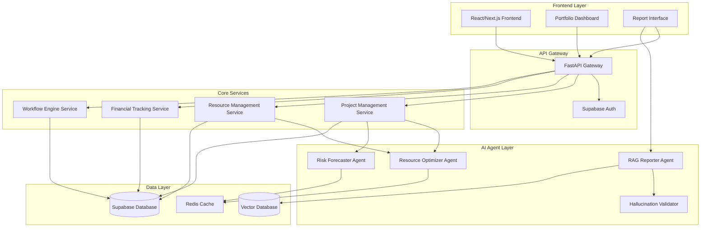

# Design Document: AI-Powered PPM Platform

## Overview

The AI-powered Project Portfolio Management (PPM) platform is a comprehensive SaaS solution that combines traditional portfolio management capabilities with advanced AI agents for optimization, forecasting, and intelligent reporting. The system serves as an intelligent alternative to Cora, providing enhanced decision-making capabilities through machine learning, natural language processing, and retrieval-augmented generation.

The platform follows a microservices architecture with AI agents operating as specialized services, ensuring scalability and maintainability while providing real-time insights and recommendations to portfolio managers, resource managers, and executives.

## Architecture

### High-Level Architecture



### Technology Stack

**Frontend:**
- Next.js 14 with TypeScript for the web application
- Tailwind CSS for styling and responsive design
- Chart.js/D3.js for data visualizations
- React Query for state management and caching

**Backend:**
- FastAPI (Python) for the main API gateway and services
- Supabase for authentication, database, and real-time subscriptions
- PostgreSQL (via Supabase) for primary data storage
- Redis for caching and session management

**AI/ML Stack:**
- OpenAI GPT-4 for natural language processing and generation
- LangChain for RAG implementation and agent orchestration
- Pinecone or Weaviate for vector database (embeddings storage)
- scikit-learn for traditional ML models and risk forecasting

**Infrastructure:**
- Vercel for frontend deployment
- Railway or AWS for backend services
- Supabase for managed database and auth
- Docker for containerization

## Components and Interfaces

### Core Data Models

#### Project Entity
```typescript
interface Project {
  id: string;
  name: string;
  description: string;
  status: 'planning' | 'active' | 'on-hold' | 'completed' | 'cancelled';
  health: 'green' | 'yellow' | 'red';
  startDate: Date;
  endDate: Date;
  budget: number;
  actualCost: number;
  managerId: string;
  teamMembers: string[];
  milestones: Milestone[];
  risks: Risk[];
  issues: Issue[];
  createdAt: Date;
  updatedAt: Date;
}
```

#### Resource Entity
```typescript
interface Resource {
  id: string;
  name: string;
  email: string;
  role: string;
  skills: string[];
  availability: number; // percentage
  hourlyRate: number;
  currentProjects: string[];
  capacity: number; // hours per week
  location: string;
  createdAt: Date;
  updatedAt: Date;
}
```

#### Risk Entity
```typescript
interface Risk {
  id: string;
  projectId: string;
  title: string;
  description: string;
  category: 'technical' | 'financial' | 'resource' | 'schedule' | 'external';
  probability: number; // 0-1
  impact: number; // 0-1
  riskScore: number; // probability * impact
  status: 'identified' | 'analyzing' | 'mitigating' | 'closed';
  mitigation: string;
  owner: string;
  dueDate: Date;
  createdAt: Date;
  updatedAt: Date;
}
```

### AI Agent Interfaces

#### Resource Optimizer Agent
```typescript
interface ResourceOptimizerAgent {
  analyzeResourceAllocation(projectIds: string[]): Promise<OptimizationRecommendation[]>;
  detectConflicts(allocations: ResourceAllocation[]): Promise<Conflict[]>;
  generateOptimizationPlan(constraints: OptimizationConstraints): Promise<OptimizationPlan>;
  calculateConfidenceScore(recommendation: OptimizationRecommendation): number;
}

interface OptimizationRecommendation {
  type: 'reallocation' | 'hiring' | 'skill_development' | 'timeline_adjustment';
  description: string;
  impactScore: number;
  confidenceScore: number;
  reasoning: string;
  affectedResources: string[];
  affectedProjects: string[];
  estimatedBenefit: string;
}
```

#### Risk Forecaster Agent
```typescript
interface RiskForecasterAgent {
  forecastRisks(projectId: string): Promise<RiskForecast[]>;
  analyzeHistoricalPatterns(projectData: HistoricalProject[]): Promise<RiskPattern[]>;
  updateRiskPredictions(projectId: string): Promise<void>;
  calculateRiskTrends(timeframe: TimeRange): Promise<RiskTrend[]>;
}

interface RiskForecast {
  riskType: string;
  probability: number;
  potentialImpact: number;
  timeframe: string;
  indicators: string[];
  suggestedMitigation: string;
  confidenceLevel: number;
}
```

#### RAG Reporter Agent
```typescript
interface RAGReporter {
  generateReport(query: string, context: ReportContext): Promise<GeneratedReport>;
  retrieveRelevantData(query: string): Promise<RelevantData[]>;
  validateReport(report: GeneratedReport): Promise<ValidationResult>;
  supportedQueryTypes(): string[];
}

interface GeneratedReport {
  title: string;
  content: string;
  visualizations: Visualization[];
  sources: DataSource[];
  confidence: number;
  generatedAt: Date;
}
```

### Service Layer Interfaces

#### Project Management Service
```typescript
interface ProjectManagementService {
  createProject(project: CreateProjectRequest): Promise<Project>;
  updateProject(id: string, updates: UpdateProjectRequest): Promise<Project>;
  getProject(id: string): Promise<Project>;
  listProjects(filters: ProjectFilters): Promise<Project[]>;
  deleteProject(id: string): Promise<void>;
  getProjectHealth(id: string): Promise<HealthMetrics>;
  calculatePortfolioMetrics(): Promise<PortfolioMetrics>;
}
```

#### Financial Tracking Service
```typescript
interface FinancialTrackingService {
  updateProjectCosts(projectId: string, costs: CostUpdate[]): Promise<void>;
  calculateBudgetVariance(projectId: string): Promise<BudgetVariance>;
  generateFinancialReport(filters: FinancialFilters): Promise<FinancialReport>;
  trackExchangeRates(): Promise<void>;
  alertBudgetThresholds(): Promise<BudgetAlert[]>;
}
```

## Data Models

### Database Schema Design

The system uses PostgreSQL via Supabase with the following key tables:

#### Projects Table
```sql
CREATE TABLE projects (
  id UUID PRIMARY KEY DEFAULT gen_random_uuid(),
  name VARCHAR(255) NOT NULL,
  description TEXT,
  status project_status NOT NULL DEFAULT 'planning',
  health health_indicator NOT NULL DEFAULT 'green',
  start_date DATE,
  end_date DATE,
  budget DECIMAL(12,2),
  actual_cost DECIMAL(12,2) DEFAULT 0,
  manager_id UUID REFERENCES auth.users(id),
  created_at TIMESTAMP WITH TIME ZONE DEFAULT NOW(),
  updated_at TIMESTAMP WITH TIME ZONE DEFAULT NOW()
);
```

#### Resources Table
```sql
CREATE TABLE resources (
  id UUID PRIMARY KEY DEFAULT gen_random_uuid(),
  name VARCHAR(255) NOT NULL,
  email VARCHAR(255) UNIQUE NOT NULL,
  role VARCHAR(100),
  skills JSONB DEFAULT '[]',
  availability INTEGER DEFAULT 100,
  hourly_rate DECIMAL(8,2),
  capacity INTEGER DEFAULT 40,
  location VARCHAR(255),
  created_at TIMESTAMP WITH TIME ZONE DEFAULT NOW(),
  updated_at TIMESTAMP WITH TIME ZONE DEFAULT NOW()
);
```

#### Risk Register Table
```sql
CREATE TABLE risks (
  id UUID PRIMARY KEY DEFAULT gen_random_uuid(),
  project_id UUID REFERENCES projects(id) ON DELETE CASCADE,
  title VARCHAR(255) NOT NULL,
  description TEXT,
  category risk_category NOT NULL,
  probability DECIMAL(3,2) CHECK (probability >= 0 AND probability <= 1),
  impact DECIMAL(3,2) CHECK (impact >= 0 AND impact <= 1),
  risk_score DECIMAL(3,2) GENERATED ALWAYS AS (probability * impact) STORED,
  status risk_status DEFAULT 'identified',
  mitigation TEXT,
  owner_id UUID REFERENCES auth.users(id),
  due_date DATE,
  created_at TIMESTAMP WITH TIME ZONE DEFAULT NOW(),
  updated_at TIMESTAMP WITH TIME ZONE DEFAULT NOW()
);
```

### Vector Database Schema

For RAG functionality, embeddings are stored in a vector database:

```typescript
interface DocumentEmbedding {
  id: string;
  content: string;
  embedding: number[];
  metadata: {
    type: 'project' | 'report' | 'risk' | 'resource';
    projectId?: string;
    createdAt: Date;
    tags: string[];
  };
}
```

## Correctness Properties

*A property is a characteristic or behavior that should hold true across all valid executions of a system—essentially, a formal statement about what the system should do. Properties serve as the bridge between human-readable specifications and machine-verifiable correctness guarantees.*

### Prework Analysis

Before defining correctness properties, I'll analyze each acceptance criterion for testability:

<function_calls>
<invoke name="prework">
<parameter name="featureName">ai-ppm-platform

### Property Reflection

After analyzing the acceptance criteria, I've identified several areas where properties can be consolidated:

**Consolidation Opportunities:**
- Properties related to data integrity (risk register, issue register, audit trails) can be combined into comprehensive data consistency properties
- Authentication and authorization properties can be unified into access control properties  
- Financial tracking properties can be consolidated into financial calculation accuracy properties
- API properties can be combined into comprehensive API behavior properties

### Core Properties

Based on the prework analysis, here are the key correctness properties:

**Property 1: Portfolio Metrics Calculation Performance**
*For any* portfolio with projects, calculating portfolio metrics should complete within 5 seconds regardless of portfolio size up to 1000 projects
**Validates: Requirements 1.2**

**Property 2: Dashboard Filter Consistency**
*For any* set of filter criteria applied to the portfolio dashboard, all displayed projects should match the filter conditions exactly
**Validates: Requirements 1.3**

**Property 3: Health Indicator Consistency**
*For any* project displayed on the dashboard, the health indicator color should accurately reflect the project's calculated health status
**Validates: Requirements 1.4**

**Property 4: Resource Optimization Performance**
*For any* resource allocation update, the Resource Optimizer Agent should generate recommendations within 30 seconds
**Validates: Requirements 2.1**

**Property 5: Resource Conflict Detection**
*For any* resource allocation scenario with conflicts, the Resource Optimizer Agent should propose alternative allocation strategies
**Validates: Requirements 2.2**

**Property 6: Optimization Constraint Compliance**
*For any* optimization recommendation, it should respect skill matching, availability, and workload balancing constraints
**Validates: Requirements 2.3**

**Property 7: Recommendation Metadata Completeness**
*For any* optimization recommendation generated, it should include confidence scores and reasoning explanations
**Validates: Requirements 2.4**

**Property 8: Resource Update Propagation**
*For any* accepted optimization recommendation, resource allocations should be updated and stakeholder notifications should be sent
**Validates: Requirements 2.5**

**Property 9: Risk Analysis Completeness**
*For any* project with available data, the Risk Forecaster Agent should identify potential risks with probability and impact scores
**Validates: Requirements 3.1, 3.3**

**Property 10: Risk Register Population**
*For any* forecasted risk, the Risk Register should be automatically populated with risk details and mitigation strategies
**Validates: Requirements 3.2**

**Property 11: RAG Report Generation**
*For any* valid natural language query, the RAG Reporter should generate relevant reports using available project data
**Validates: Requirements 4.1, 4.2**

**Property 12: Report Query Type Support**
*For any* query about project status, resource utilization, financial metrics, or risk assessments, the RAG Reporter should provide appropriate responses
**Validates: Requirements 4.3**

**Property 13: Hallucination Validation**
*For any* generated report, the Hallucination Validator should verify factual accuracy and flag inconsistencies when detected
**Validates: Requirements 4.4, 4.5**

**Property 14: Financial Calculation Accuracy**
*For any* project cost update, budget utilization and variance metrics should be recalculated correctly in real-time
**Validates: Requirements 5.1, 5.2**

**Property 15: Budget Alert Generation**
*For any* project exceeding budget thresholds, automated alerts should be generated to designated stakeholders
**Validates: Requirements 5.3**

**Property 16: Multi-Currency Support**
*For any* financial operation, the system should handle multiple currencies correctly with current exchange rates
**Validates: Requirements 5.4**

**Property 17: Financial Report Completeness**
*For any* financial report request, the generated report should include comprehensive cost analysis with trend projections
**Validates: Requirements 5.5**

**Property 18: Register Data Integrity**
*For any* risk or issue entry, all required metadata fields should be properly maintained and validated
**Validates: Requirements 6.1, 6.2, 6.3**

**Property 19: Audit Trail Maintenance**
*For any* risk or issue update, audit trails should be maintained and relevant stakeholders should be notified
**Validates: Requirements 6.4**

**Property 20: Risk-Issue Linkage**
*For any* risk that materializes into an issue, the system should automatically create proper linkages between related entries
**Validates: Requirements 6.5**

**Property 21: Workflow Configuration Support**
*For any* workflow template, the system should support multi-step approval processes with conditional routing
**Validates: Requirements 7.1**

**Property 22: Approval Routing Accuracy**
*For any* approval request, it should be routed to appropriate approvers based on configured rules
**Validates: Requirements 7.2**

**Property 23: Workflow Pattern Support**
*For any* workflow configuration, the system should support parallel and sequential approval patterns with timeout handling
**Validates: Requirements 7.3**

**Property 24: Workflow Completion Handling**
*For any* completed workflow, project status should be updated and all relevant stakeholders should be notified
**Validates: Requirements 7.5**

**Property 25: Access Control Enforcement**
*For any* user with a specific role, access permissions should be enforced consistently across all system components
**Validates: Requirements 8.2**

**Property 26: Session Management**
*For any* expired user session, the system should require re-authentication before allowing continued access
**Validates: Requirements 8.3**

**Property 27: Audit Logging Completeness**
*For any* user action, appropriate audit logs should be maintained for security compliance
**Validates: Requirements 8.4**

**Property 28: Permission Propagation**
*For any* user role modification, access permissions should be immediately updated across all system components
**Validates: Requirements 8.5**

**Property 29: API Completeness and Security**
*For any* core data entity, RESTful APIs should be available with proper authentication
**Validates: Requirements 9.1**

**Property 30: API Performance**
*For any* standard API query, the system should respond within 2 seconds
**Validates: Requirements 9.2**

**Property 31: Bulk Operation Support**
*For any* bulk import/export operation, the system should handle large datasets correctly without data loss
**Validates: Requirements 9.3**

**Property 32: Rate Limiting Behavior**
*For any* API request exceeding rate limits, appropriate HTTP status codes and retry guidance should be returned
**Validates: Requirements 9.4**

**Property 33: API Versioning Support**
*For any* API version, backward compatibility should be maintained during system updates
**Validates: Requirements 9.5**

**Property 34: AI Operation Logging**
*For any* AI agent recommendation, model inputs, outputs, and confidence scores should be logged
**Validates: Requirements 10.1**

**Property 35: AI Content Validation**
*For any* AI-generated content, the Hallucination Validator should cross-reference with source data and flag inconsistencies
**Validates: Requirements 10.2**

**Property 36: AI Performance Monitoring**
*For any* AI model performance degradation, administrators should be alerted with performance metrics
**Validates: Requirements 10.3**

**Property 37: AI A/B Testing Support**
*For any* AI model comparison scenario, the system should support A/B testing with proper result tracking
**Validates: Requirements 10.4**

**Property 38: AI Feedback Capture**
*For any* AI recommendation interaction, user acceptance or rejection feedback should be captured for model training
**Validates: Requirements 10.5**

## Error Handling

### Error Classification

The system implements a comprehensive error handling strategy with the following error categories:

**Validation Errors (400-level)**
- Input validation failures
- Authentication/authorization errors
- Business rule violations
- Data format errors

**System Errors (500-level)**
- Database connection failures
- AI service unavailability
- External API failures
- Performance threshold violations

**AI-Specific Errors**
- Model inference failures
- Hallucination detection
- Confidence threshold violations
- Training data inconsistencies

### Error Handling Patterns

```typescript
interface ErrorResponse {
  error: {
    code: string;
    message: string;
    details?: any;
    timestamp: Date;
    requestId: string;
  };
}

// Example error handling for AI agents
class AIAgentError extends Error {
  constructor(
    public agentType: string,
    public operation: string,
    public confidence: number,
    message: string
  ) {
    super(message);
  }
}
```

### Graceful Degradation

When AI services are unavailable:
- Resource optimization falls back to rule-based allocation
- Risk forecasting uses historical averages
- RAG reporting provides template-based reports
- System continues core PPM functionality

## Testing Strategy

### Dual Testing Approach

The system employs both unit testing and property-based testing for comprehensive coverage:

**Unit Tests:**
- Specific examples demonstrating correct behavior
- Edge cases and error conditions
- Integration points between components
- Authentication and authorization flows

**Property-Based Tests:**
- Universal properties across all inputs
- Performance characteristics under load
- Data consistency across operations
- AI model behavior validation

### Property-Based Testing Configuration

**Framework:** Hypothesis (Python) for backend services, fast-check (TypeScript) for frontend
**Configuration:** Minimum 100 iterations per property test
**Tagging:** Each test references its design document property

Example property test structure:
```python
@given(projects=project_strategy(), filters=filter_strategy())
def test_dashboard_filter_consistency(projects, filters):
    """
    Feature: ai-ppm-platform, Property 2: Dashboard Filter Consistency
    For any set of filter criteria, all displayed projects should match exactly
    """
    filtered_projects = apply_dashboard_filters(projects, filters)
    assert all(project_matches_filters(p, filters) for p in filtered_projects)
```

### Testing Pyramid

**Unit Tests (70%):**
- Individual function and class testing
- Mocked external dependencies
- Fast execution (< 1 second per test)

**Integration Tests (20%):**
- Service-to-service communication
- Database operations
- AI agent interactions

**Property-Based Tests (10%):**
- Cross-cutting concerns
- Performance validation
- Data consistency properties
- AI behavior verification

### AI Testing Strategy

**Model Validation:**
- Confidence score thresholds
- Output format validation
- Hallucination detection accuracy
- Performance benchmarking

**Data Quality:**
- Training data consistency
- Embedding quality validation
- Vector database integrity
- Knowledge base accuracy

The testing strategy ensures that both traditional software functionality and AI-driven features maintain high reliability and accuracy standards while providing comprehensive coverage of the system's correctness properties.