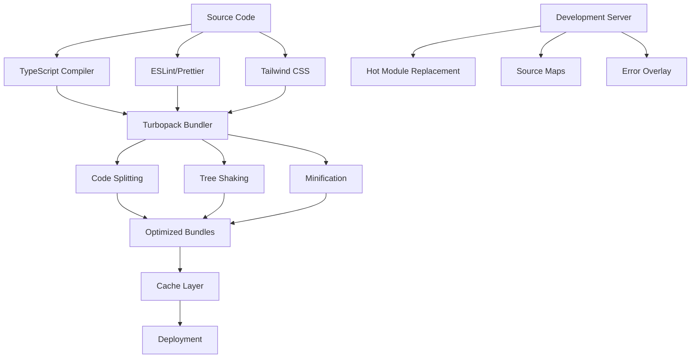
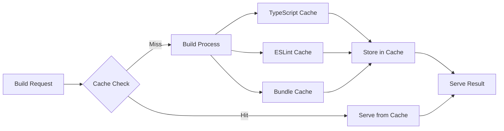

# Design Document: Build- und Kompiliervorgang-Optimierung

## Overview

Dieses Design implementiert eine umfassende Optimierung der Build- und Kompiliervorgänge für das ORKA-PPM System. Die Lösung fokussiert auf Geschwindigkeit, Effizienz und Entwicklerproduktivität durch moderne Build-Tools, intelligentes Caching und Parallelisierung.

## Architecture

### Build-System Architektur



### Cache-System Architektur



## Components and Interfaces

### 1. Enhanced Next.js Configuration

**Zweck**: Optimierte Next.js Konfiguration mit Turbopack und Performance-Optimierungen

**Schnittstelle**:
```typescript
interface OptimizedNextConfig {
  experimental: {
    turbo: TurbopackConfig;
    optimizePackageImports: string[];
    serverComponentsExternalPackages: string[];
    optimizeCss: boolean;
    gzipSize: boolean;
  };
  compiler: {
    removeConsole: boolean;
    reactRemoveProperties: boolean;
    styledComponents: boolean;
  };
  webpack: (config: WebpackConfig) => WebpackConfig;
}
```

### 2. TypeScript Build Optimizer

**Zweck**: Optimierte TypeScript-Kompilierung mit incremental builds und Project References

**Schnittstelle**:
```typescript
interface TypeScriptOptimizer {
  enableIncremental(): void;
  setupProjectReferences(): void;
  optimizeCompilerOptions(): CompilerOptions;
  enableParallelTypeChecking(): void;
}
```

### 3. Cache Management System

**Zweck**: Intelligentes Caching für alle Build-Artefakte

**Schnittstelle**:
```typescript
interface CacheManager {
  getCache(key: string): Promise<CacheEntry | null>;
  setCache(key: string, value: any, ttl?: number): Promise<void>;
  invalidateCache(pattern: string): Promise<void>;
  getCacheStats(): CacheStats;
}
```

### 4. Bundle Analyzer Integration

**Zweck**: Automatische Bundle-Analyse und Optimierungsvorschläge

**Schnittstelle**:
```typescript
interface BundleAnalyzer {
  analyzeBundles(): Promise<BundleReport>;
  generateOptimizationSuggestions(): OptimizationSuggestion[];
  trackBundleSizeChanges(): void;
}
```

### 5. Development Server Enhancer

**Zweck**: Optimierter Development Server mit verbessertem HMR

**Schnittstelle**:
```typescript
interface DevServerEnhancer {
  enableFastRefresh(): void;
  optimizeHotReload(): void;
  setupErrorOverlay(): void;
  enableSourceMaps(): void;
}
```

## Data Models

### Build Configuration Model

```typescript
interface BuildConfig {
  mode: 'development' | 'production' | 'test';
  target: 'web' | 'node' | 'electron';
  optimization: {
    minimize: boolean;
    splitChunks: boolean;
    treeShaking: boolean;
    deadCodeElimination: boolean;
  };
  cache: {
    type: 'memory' | 'filesystem';
    buildDependencies: string[];
    maxAge: number;
  };
  performance: {
    maxAssetSize: number;
    maxEntrypointSize: number;
    hints: 'warning' | 'error' | false;
  };
}
```

### Cache Entry Model

```typescript
interface CacheEntry {
  key: string;
  value: any;
  timestamp: number;
  ttl: number;
  dependencies: string[];
  hash: string;
}
```

### Build Metrics Model

```typescript
interface BuildMetrics {
  buildTime: number;
  bundleSize: number;
  chunkCount: number;
  cacheHitRate: number;
  memoryUsage: number;
  cpuUsage: number;
  errors: BuildError[];
  warnings: BuildWarning[];
}
```

## Correctness Properties

*A property is a characteristic or behavior that should hold true across all valid executions of a system-essentially, a formal statement about what the system should do. Properties serve as the bridge between human-readable specifications and machine-verifiable correctness guarantees.*

### Property 1: Build Time Consistency
*For any* unchanged source code, rebuilding should produce identical results in consistent time
**Validates: Requirements 1.1, 1.2**

### Property 2: Cache Invalidation Correctness
*For any* source file change, all dependent cached artifacts should be invalidated appropriately
**Validates: Requirements 5.1, 5.2**

### Property 3: Bundle Size Optimization
*For any* production build, the total bundle size should not exceed the configured thresholds
**Validates: Requirements 3.1, 3.2**

### Property 4: TypeScript Compilation Accuracy
*For any* valid TypeScript code, compilation should preserve type safety and produce correct JavaScript
**Validates: Requirements 4.1, 4.3**

### Property 5: Hot Reload Preservation
*For any* component state during development, hot reload should preserve state when possible
**Validates: Requirements 2.2, 9.5**

### Property 6: Memory Usage Bounds
*For any* build process, memory usage should remain within configured limits
**Validates: Requirements 7.1, 7.4**

### Property 7: Parallel Processing Safety
*For any* parallel build tasks, the final result should be identical to sequential execution
**Validates: Requirements 6.1, 6.2**

### Property 8: Error Reporting Accuracy
*For any* build error, the reported location and context should be accurate and helpful
**Validates: Requirements 10.1, 10.2**

### Property 9: Cache Consistency
*For any* cached build artifact, it should be functionally equivalent to a fresh build
**Validates: Requirements 5.3, 5.4**

### Property 10: Environment Isolation
*For any* environment-specific build, the output should only contain appropriate optimizations
**Validates: Requirements 12.1, 12.2**

## Error Handling

### Build Error Recovery

1. **Syntax Errors**: Graceful handling mit präzisen Fehlermeldungen
2. **Type Errors**: Incremental re-checking nur betroffener Dateien
3. **Bundle Errors**: Fallback zu vorheriger funktionierender Version
4. **Memory Errors**: Automatische Garbage Collection und Heap-Optimierung
5. **Cache Corruption**: Automatische Cache-Invalidierung und Rebuild

### Performance Degradation Handling

1. **Slow Builds**: Automatische Parallelisierung und Cache-Optimierung
2. **Memory Leaks**: Monitoring und automatische Prozess-Neustarts
3. **Hot Reload Failures**: Fallback zu Full Reload mit State Recovery
4. **Bundle Size Bloat**: Automatische Warnungen und Optimierungsvorschläge

## Testing Strategy

### Unit Testing
- **Build Configuration Tests**: Validierung aller Konfigurationsoptionen
- **Cache Logic Tests**: Korrekte Cache-Invalidierung und -Retrieval
- **Bundle Optimization Tests**: Verifikation der Bundle-Größen und -Struktur
- **TypeScript Compilation Tests**: Korrekte Type-Checking und Code-Generation

### Integration Testing
- **End-to-End Build Tests**: Vollständige Build-Pipeline von Source zu Deployment
- **Development Server Tests**: HMR, Error Overlay und Source Maps
- **Multi-Environment Tests**: Konsistenz zwischen Development, Test und Production
- **Performance Regression Tests**: Automatische Erkennung von Performance-Verschlechterungen

### Property-Based Testing
- **Build Determinism**: Identische Inputs produzieren identische Outputs
- **Cache Correctness**: Cache-Hits sind funktional äquivalent zu Cache-Misses
- **Bundle Optimization**: Tree-shaking entfernt nur tatsächlich ungenutzten Code
- **Memory Management**: Builds bleiben innerhalb definierter Memory-Grenzen

**Dual Testing Approach**:
- Unit tests validieren spezifische Build-Konfigurationen und Edge Cases
- Property tests verifizieren universelle Build-Eigenschaften über alle Inputs
- Beide sind komplementär für umfassende Build-System-Validierung

**Property Test Configuration**:
- Minimum 100 Iterationen pro Property Test
- Jeder Property Test referenziert sein Design-Dokument Property
- Tag Format: **Feature: build-optimization, Property {number}: {property_text}**