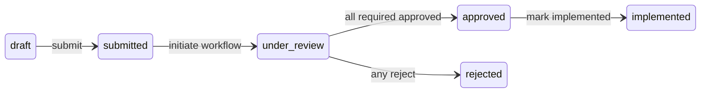

# Change Order Workflow – Design

## 1. Architecture Overview

```mermaid
flowchart TB
  subgraph frontend [Next.js App]
    ChangesPage[Changes Page]
    PendingPage[My Pending Approvals Page or Widget]
    Tracker[ApprovalWorkflowTracker]
    ChangesPage --> Tracker
    PendingPage --> Tracker
  end

  subgraph api [Next.js API Proxy]
    ChangeOrdersApi[/api/change-orders]
    ChangeApprovalsApi[/api/change-approvals]
  end

  subgraph backend [FastAPI Backend]
    CORouter[/change-orders]
    ApprovalsRouter[/change-approvals]
    WorkflowService[ChangeOrderApprovalWorkflowService]
    ManagerService[ChangeOrderManagerService]
    CORouter --> ManagerService
    ApprovalsRouter --> WorkflowService
  end

  subgraph db [Supabase]
    ChangeOrders[(change_orders)]
    Approvals[(change_order_approvals)]
  end

  frontend --> api
  api --> backend
  WorkflowService --> Approvals
  ManagerService --> ChangeOrders
  WorkflowService --> ChangeOrders
```

**Flow:**

- **Frontend:** `/changes`, `/changes/orders/[projectId]`, and (new) `/changes/pending` or dashboard widget; change order detail shows `ApprovalWorkflowTracker`. User approves/rejects or delegates from tracker or from "My Pending" list.
- **Next.js API:** Proxies to FastAPI for `/change-orders/*` and `/change-approvals/*`; current user comes from session for pending list.
- **Backend:** `ChangeOrderManagerService` (CRUD, submit); `ChangeOrderApprovalWorkflowService` (initiate_workflow, get_pending_approvals, approve, reject, get_workflow_status, delegate). Both read/write `change_orders` and `change_order_approvals`.

---

## 2. Status State Machine

Allowed transitions only:

| From     | To           | Trigger / Condition                          |
|----------|--------------|----------------------------------------------|
| draft    | submitted    | User submits (e.g. POST submit)              |
| submitted| under_review | Workflow initiated (approval rows created)   |
| under_review | approved   | All required approvals have status approved  |
| under_review | rejected   | Any approval rejected                        |
| approved | implemented  | User marks implemented                       |

Terminal states: **rejected**, **implemented**. No transition from rejected or implemented back to draft in this spec (policy can be extended later).



---

## 3. API (Workflow-Relevant)

### Existing (FastAPI)

| Method | Path | Description |
|--------|------|-------------|
| POST | /change-approvals/workflow/{change_order_id} | Initiate approval workflow (create approval rows). |
| GET | /change-approvals/pending/{user_id} | List pending approvals for user. |
| POST | /change-approvals/approve/{approval_id} | Approve (body: comments, conditions). |
| POST | /change-approvals/reject/{approval_id} | Reject (body: comments). |
| GET | /change-approvals/workflow-status/{change_order_id} | Current workflow status and levels. |

### New or Extended

| Method | Path | Description |
|--------|------|-------------|
| POST | /change-approvals/delegate/{approval_id} | Delegate approval to another user (body: delegate_to_user_id). Only current approver or admin. |
| PUT | /change-orders/{id}/status | Optional: explicit status transition with validation (alternative: keep transitions only inside submit/approve/reject). |

Next.js API proxy must forward all of the above; for GET pending, use current user id from session.

---

## 4. Approver Routing Logic

**Current:** Hardcoded in `ChangeOrderApprovalWorkflowService`: two levels if cost ≤ 50k (project_manager, portfolio_manager), three levels if cost > 50k (add executive); approver_user_id is set to created_by (placeholder).

**Target:**

- **Configurable thresholds and roles:** e.g. table `workflow_approval_config` or project-level config: (project_id optional, level, cost_threshold_max, role_name). Example: level 1, max 50000, role project_manager; level 2, max 200000, role portfolio_manager; level 3, max null, role executive.
- **Resolve approver_user_id:** For each level, resolve a user from project/org who has the required role (e.g. project_manager for the project’s portfolio). Use existing RBAC or project_roles table. If no user found, leave approver_user_id null or set to a default; UI can show "Unassigned" and allow manual assignment or delegation.
- Service reads config, builds approval rows with correct approver_user_id where possible.

---

## 5. My Pending Approvals UI

- **Route:** Dedicated page e.g. `/changes/pending` or a tab/section on `/changes` that shows only "My Pending".
- **Data:** GET /change-approvals/pending/{current_user_id} (via Next.js proxy). Response: list of { id, change_order_id, change_order_number, change_order_title, approval_level, proposed_cost_impact, due_date }.
- **UI:** Table or card list: columns/cards show CO number, title, cost impact, due date; row/card click navigates to change order detail (e.g. `/changes/orders/[projectId]?co=id` or `/changes/orders/[projectId]/[coId]`) where ApprovalWorkflowTracker and Approve/Reject are shown.
- **Dashboard:** Optional widget that shows count and top N pending items with link to full list or detail.

---

## 6. Notifications

- **Triggers:** (1) Change order submitted → notify first-level approvers. (2) Change order approved or rejected → notify requestor (created_by). (3) Approval delegated → notify delegate. (4) Reminder: required_approval_date within next 24h and approval still pending → notify current approver.
- **Storage:** Optional `notifications` table (user_id, type, title, body, read, created_at, reference_type, reference_id). Or use existing in-app notification system if present.
- **Delivery:** In-app (bell icon, toast, or notification center). Optional: email via existing or new email service.
- **Implementation:** Backend emits events or writes notification records inside submit, approve, reject, delegate, and a scheduled job for reminders.

---

## 7. File and Component Structure

**Backend**

- `backend/services/change_order_approval_workflow_service.py` – extend with: status transition validation helper, configurable level/role resolution, delegate(approval_id, delegate_to_user_id), and optional notification hooks.
- `backend/routers/change/change_approvals.py` – add POST (or PATCH) delegate endpoint; ensure submit (in change_orders router) calls initiate_workflow and sets status under_review.
- Optional: `backend/models/workflow_config.py` and migration for `workflow_approval_config` table; or YAML/JSON config per project/global.

**Frontend**

- `components/change-orders/ApprovalWorkflowTracker.tsx` – existing; extend with comments/conditions display and input, delegation button and modal.
- `components/change-orders/WorkflowProgress.tsx` – existing; show who approved and when per level.
- `components/change-orders/ApprovalActions.tsx` – existing; ensure comments and conditions are sent.
- `app/changes/pending/page.tsx` – new: "My Pending Approvals" page, or integrate into `app/changes/page.tsx` / `app/changes/orders/[projectId]/page.tsx`.
- Dashboard: extend `components/dashboards/ChangeOrderWidgets.tsx` or add widget that calls pending API and shows count + link.

**API proxy**

- Ensure Next.js routes proxy: GET pending, POST approve, POST reject, GET workflow-status, POST delegate (new). Use current user from session for pending.
