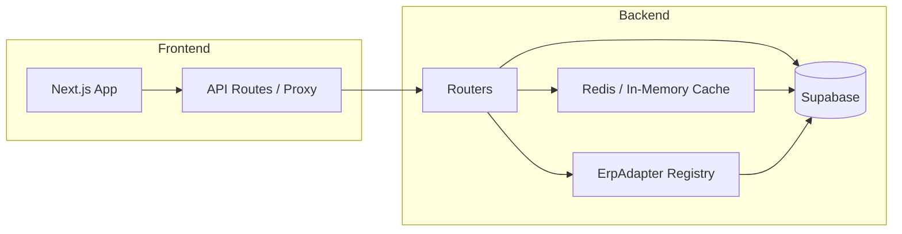

# Cora-Surpass Roadmap – Design

## Architektur-Übersicht

Datenfluss: **App (Next.js)** → **API (Next.js API Routes / Proxy)** → **Backend (FastAPI)** → **Supabase / Redis**. Caching sitzt im Backend (Redis oder In-Memory-Fallback) für Listen-Endpoints. Adapter (ErpAdapter) laufen im Backend; Integrations-Router wählt konkrete Implementierung (SAP, CSV, …) und ruft `sync_commitments` / `sync_actuals` auf. Workflow-Engine (Phase 2) nutzt bestehende Tabellen (workflows, workflow_instances) und kann als eigener Service oder im gleichen Backend integriert werden.

---

## Wireframes / Beschreibungen (ohne Pixel-Grafik)

### Adapter-UI (Admin)

- **Tabelle Connectors:** Zeilen pro System (Name, Status, letzter Sync, Fehler). Aktionen: Konfigurieren, Sync auslösen, Enable/Disable.
- **Config-Modal:** API-URL, Key, Mandant (je nach System); Speichern nur serverseitig (Keys nicht im Frontend speichern).
- **Referenz:** [app/admin/integrations/page.tsx](app/admin/integrations/page.tsx) – bestehende Integrations-Seite erweitern oder als Referenz für konsistentes Layout nutzen.

### Workflow-Builder (Phase 2)

- **Canvas:** Drag&Drop-Knoten (Steps), Kanten zwischen Steps, Eigenschaften-Panel für ausgewählten Knoten (Step-Typ, Approver, Timeout, Bedingungen).
- **Technik:** react-flow (oder vergleichbar) für Knoten/Kanten; Steps-Definition wie in [.kiro/specs/workflow-engine/design.md](.kiro/specs/workflow-engine/design.md).
- **Speichern:** Workflow-Definition (JSON) an Backend; Validierung (mind. ein Step, gültige Approver-Referenzen).

### AI-Alerts (Compliance / Anomalie)

- **Toasts/Banner:** Proaktive Hinweise bei Anomalien oder Compliance-Risiken (z. B. „Vorschlag: Überprüfe Key“). Keine Blockierung der Nutzung.
- **Referenz:** Bestehende Audit-Anomaly-UI und Toast-System (z. B. Sonner/Radix) nutzen; Backend: [backend/services/audit_anomaly_service.py](backend/services/audit_anomaly_service.py) erweitern.

---

## Caching-Layer

- **Wo:** Backend (FastAPI). Redis primär; bei Nichtverfügbarkeit In-Memory-Fallback oder Skip (keine Blockierung).
- **Listen-Endpoints:**
  - **Projects:** Key z. B. `projects:list:{org_id}:{offset}:{limit}` (falls org/tenant verfügbar), sonst `projects:list:{offset}:{limit}`. TTL z. B. 60–120 s. Invalidierung bei Create/Update/Delete Project.
  - **Commitments (GET /csv-import/commitments):** Key z. B. `commitments:list:{org_id}:{offset}:{limit}:{project_nr}`. TTL kurz (z. B. 60 s), da Daten durch Import ändern.
  - **Actuals (GET /csv-import/actuals):** Key z. B. `actuals:list:{org_id}:{offset}:{limit}:{project_nr}`. TTL 60 s.
  - **CSV-Import-History:** Optional gleiche Strategie (org/user + limit/offset); TTL kürzer.
- **Pagination:** Einheitlich `limit` und `offset` (oder `page`, `page_size`) in Query-Parametern; Teil des Cache-Keys.
- **Implementierung:** [backend/services/redis_cache_service.py](backend/services/redis_cache_service.py) nutzen; Key-Builder zentral, um Idempotenz zu gewährleisten.

---

## Adapter-Registry (Phase 1)

- **Backend:** Dict nach `adapter_type` (z. B. `sap`, `csv`, `microsoft`); bei Sync-Aufruf Adapter aus Registry holen, `sync_commitments` / `sync_actuals` aufrufen.
- **Schnittstelle:** [backend/services/erp_adapter.py](backend/services/erp_adapter.py) – bestehende abstrakte Basis und konkrete Implementierungen dokumentieren; neue Adapter nur registrieren, keine Änderung an Router-Logik nötig.
