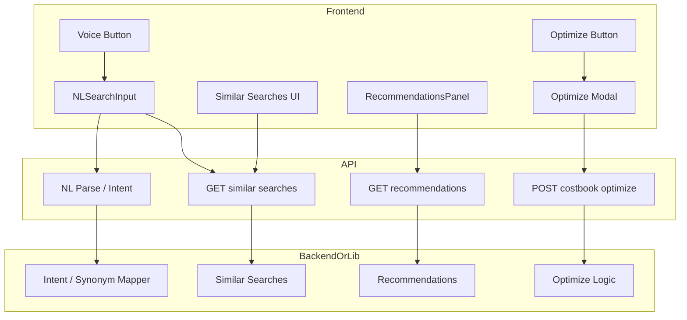

# Design Document: Costbook AI Enhancement

## Overview

This design adds five AI-related enhancements to the Costbook: (1) semantic/intent-aware search beyond keywords, (2) "Similar searches" suggestions after a query, (3) voice input for the NL search field, (4) personalized recommendations by tenant/user, and (5) a visible "AI Optimize Costbook" button with a modal for suggestions and Apply/Simulate actions. It builds on existing NLSearchInput, nl-query-parser, RecommendationsPanel, and costbook optimize API.

### Key Components

1. **Intent Mapper / Semantic Layer**: Extends nl-query-parser or adds a service that maps phrases to filter intents (synonyms, optional embeddings).
2. **Similar Searches Generator**: Backend or frontend logic that returns 2–3 related search phrases from current query and context.
3. **Voice Input**: Web Speech API integration next to NLSearchInput; transcript drives same NL parse.
4. **Personalized Recommendations API**: Recommendations endpoint accepts user_id/organization_id and returns tailored list.
5. **Optimize Modal**: Modal that calls costbook optimize API and shows suggestions with Apply/Simulate.

### Technology Stack

- **Frontend:** Next.js, React, existing Costbook components; Web Speech API for voice.
- **Backend:** FastAPI or Next.js API routes; optional OpenAI/embedding for semantic and similar searches.
- **Logic:** `lib/nl-query-parser.ts` (extend with intent/synonym map); `lib/costbook/` and existing optimize route.

## Architecture

## Data Flow

### Semantic Search

1. User types or speaks a query. NL search input sends text to parse layer.
2. Intent mapper (extended parser or separate service) resolves intent (e.g. "high variance" → filter type + threshold). If using embeddings, query is embedded and matched to costbook column/description embeddings; otherwise synonym/intent map is used.
3. Resolved intent sets costbook filter state; grid/list is filtered. Same UX as today, with broader phrase coverage.

### Similar Searches

1. After a search is executed, frontend calls GET similar-searches (query, optional context: columns, recent queries). Backend or frontend returns 2–3 phrases.
2. UI shows them below the search field. On click, phrase is set as query and search is triggered again.

### Voice Search

1. User clicks microphone; browser prompts for permission if needed. Web Speech API starts; user speaks; transcript is written into NL search field.
2. On end-of-speech (or user stop), same flow as text submit: NL parse and filter application.

### Personalized Recommendations

1. RecommendationsPanel (or Costbook container) loads recommendations with user_id and organization_id in the request.
2. Backend returns list that may include tenant-specific items or priorities. Panel renders them; without context, generic list is shown.

### Optimize Costbook

1. User clicks "AI Optimize Costbook". Frontend opens modal and calls POST costbook/optimize with current project/row context (and optional user/tenant).
2. Backend returns list of suggestions. Modal shows them with "Apply" and "Simulate". Apply triggers update flow or clipboard; Simulate navigates to Monte Carlo/What-If with params.

## Components and Interfaces

### Intent Mapper / Semantic Layer

- **Input:** Raw query string.
- **Output:** Same shape as current nl-query-parser output (filter type, threshold, etc.) so that existing filter application code can stay unchanged. New or extended module: e.g. `lib/nl-query-parser.ts` with synonym map and intent aliases, or `lib/costbook/intent-mapper.ts`. Optional: call embedding service, match to costbook metadata vectors, map to filter.

### Similar Searches

- **Input:** query, optional context (visible_columns, recent_queries).
- **Output:** `["phrase1", "phrase2", "phrase3"]`. Backend: LLM or template-based. Frontend: predefined variants or simple transformations (e.g. "over budget" → "under budget", "high variance").

### Voice Input

- Use `SpeechRecognition` / `webkitSpeechRecognition`. On result, set transcript into NLSearchInput value and trigger existing submit/parse handler. Error handling: permission denied, no recognition → toast or inline message. Reuse pattern from DistributionSettingsDialog or HelpChat if present.

### Recommendations API

- Existing or new GET recommendations endpoint that accepts `user_id`, `organization_id` (from auth). Return list of recommendations; backend may prioritize or add tenant-specific items. RecommendationsPanel already exists; ensure it passes context and displays personalized content.

### Optimize API and Modal

- **API:** Existing `POST /api/costbook/optimize` (or backend equivalent). Input: project IDs or current view context; output: list of suggestions (description, metric, change, impact?). 
- **Modal:** New component or extend existing: title "AI Optimize Costbook", list of suggestions, buttons "Apply" (per item or bulk) and "Simulate". Apply: call update API or copy; Simulate: router.push to Monte Carlo with suggestion params if supported.

## File and API References

| Component | File / Endpoint |
|-----------|------------------|
| NL Search | `components/costbook/NLSearchInput.tsx`, `lib/nl-query-parser.ts` |
| Similar searches | New: `SearchSuggestions.tsx` or extend NLSearchInput; API: `GET /api/costbook/similar-searches?q=...` or frontend-only |
| Voice | Extend NLSearchInput or add `VoiceSearchButton.tsx`; Web Speech API in browser |
| Recommendations | `components/costbook/RecommendationsPanel.tsx`; API: ensure `user_id`/`organization_id` in request |
| Optimize | `app/api/costbook/optimize/route.ts`; new: `components/costbook/OptimizeCostbookModal.tsx`, button in Costbook header |

## Security and Performance

- All APIs must enforce auth and organization scope. Recommendations and optimize must only use data for the current user's org.
- Semantic/similar search: debounce and optional rate limit for LLM calls. Intent mapping and frontend similar-phrases avoid latency when possible.
- Voice: no server call for recognition; only transcript is used like typed text.
