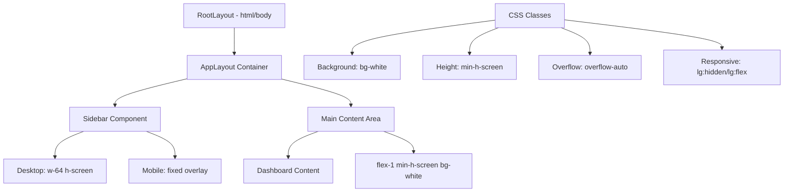
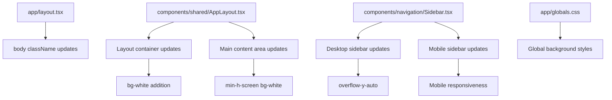

# Design Document

## Overview

This design addresses the black bar scroll issue in the Portfolio Dashboard by implementing proper layout styling, background consistency, and responsive sidebar behavior. The solution focuses on CSS class modifications to existing components without requiring major architectural changes.

The approach uses Tailwind CSS classes to ensure consistent white backgrounds, proper height management, and responsive sidebar behavior across all screen sizes.

## Architecture

### Layout Structure



### Component Hierarchy



## Components and Interfaces

### 1. Layout Container (AppLayout.tsx)

#### Current Implementation
```typescript
<div className="flex h-screen bg-gray-50">
  <Sidebar isOpen={true} />
  <div className="flex-1 flex flex-col min-w-0">
    <main className="flex-1 overflow-auto">
      {children}
    </main>
  </div>
</div>
```

#### Updated Implementation
```typescript
<div className="flex h-screen bg-white">
  <Sidebar isOpen={true} />
  <div className="flex-1 flex flex-col min-w-0">
    <main className="flex-1 min-h-screen bg-white overflow-auto">
      {children}
    </main>
  </div>
</div>
```

**Key Changes:**
- Container background: `bg-gray-50` → `bg-white`
- Main content: Add `min-h-screen bg-white`

### 2. Sidebar Component (Sidebar.tsx)

#### Desktop Sidebar Updates
```typescript
// Current
className="hidden lg:flex w-64 h-screen p-4 bg-gray-800 text-white flex-col"

// Updated
className="hidden lg:flex w-64 h-screen p-4 bg-gray-800 text-white flex-col overflow-y-auto"
```

#### Mobile Sidebar Updates
```typescript
// Add mobile toggle state management
interface SidebarProps {
  isOpen?: boolean
  onToggle?: () => void
  isMobile?: boolean
}

// Enhanced mobile sidebar with proper backdrop
{isMobile && isOpen && (
  <>
    <div className="fixed inset-0 bg-black bg-opacity-50 z-40 lg:hidden" onClick={onToggle} />
    <nav className="fixed left-0 top-0 h-full w-64 bg-gray-800 text-white flex flex-col z-50 lg:hidden transform transition-transform duration-300 ease-in-out">
      {/* Sidebar content */}
    </nav>
  </>
)}
```

### 3. Root Layout (layout.tsx)

#### Body Element Updates
```typescript
// Current
<body className="font-sans antialiased" suppressHydrationWarning={true}>

// Updated
<body className="font-sans antialiased bg-white min-h-screen" suppressHydrationWarning={true}>
```

### 4. Global Styles (globals.css)

#### Background Consistency
```css
/* Enhanced body and html background */
html {
  background-color: #ffffff;
  min-height: 100vh;
}

body {
  background-color: #ffffff;
  min-height: 100vh;
}

/* Ensure main content areas have white background */
main {
  background-color: #ffffff !important;
  min-height: 100vh;
}

/* Override any conflicting gray backgrounds */
.bg-gray-50 {
  background-color: #ffffff !important;
}
```

## Data Models

### Layout State Management
```typescript
interface LayoutState {
  sidebarOpen: boolean
  isMobile: boolean
  screenSize: 'sm' | 'md' | 'lg' | 'xl' | '2xl'
}

interface SidebarState {
  isOpen: boolean
  isMobile: boolean
  animating: boolean
}
```

### Responsive Breakpoints
```typescript
const breakpoints = {
  sm: '640px',   // Mobile
  md: '768px',   // Tablet
  lg: '1024px',  // Desktop (sidebar becomes fixed)
  xl: '1280px',  // Large desktop
  '2xl': '1536px' // Extra large desktop
}
```

## Correctness Properties

*A property is a characteristic or behavior that should hold true across all valid executions of a system-essentially, a formal statement about what the system should do. Properties serve as the bridge between human-readable specifications and machine-verifiable correctness guarantees.*

### Property Reflection

After analyzing all acceptance criteria, I identified several properties that can be consolidated:
- Properties 1.1, 1.2, 4.2, 5.1, 5.2 all relate to background and height consistency - can be combined into comprehensive layout properties
- Properties 2.1, 2.2, 2.3 all relate to sidebar styling - can be combined into sidebar layout property
- Properties 3.1, 3.2, 3.3 all relate to mobile sidebar behavior - can be combined into mobile responsiveness property
- Properties 6.1, 6.2 both relate to scroll behavior - can be combined into scroll handling property

### Property 1: Main Content Layout Consistency
*For any* viewport size and content length, the main content area should have white background (bg-white), minimum screen height (min-h-screen), and proper overflow handling (overflow-auto).
**Validates: Requirements 1.1, 1.2, 4.2, 6.2**

### Property 2: Sidebar Layout and Styling
*For any* desktop viewport (lg and above), the sidebar should have fixed width (w-64), full height (h-screen), dark background (bg-gray-800), and scrollable overflow (overflow-y-auto) without affecting main content styling.
**Validates: Requirements 2.1, 2.2, 2.3**

### Property 3: Mobile Sidebar Responsiveness
*For any* mobile viewport (sm and below), the sidebar should be hidden by default, overlay main content when opened with backdrop, and be dismissible via backdrop or close button clicks.
**Validates: Requirements 3.1, 3.2, 3.3**

### Property 4: Background Color Consistency
*For any* page load or navigation, the html, body, layout container, and main content elements should maintain white backgrounds to prevent dark bleeding.
**Validates: Requirements 5.1, 5.2, 4.2**

### Property 5: Layout Container Structure
*For any* screen size, the layout container should use consistent flex layout (flex h-screen) with proper proportions between sidebar and main content.
**Validates: Requirements 4.1**

### Property 6: Scroll Behavior Consistency
*For any* content that exceeds viewport height, scrolling should be smooth and maintain white background without showing parent container backgrounds.
**Validates: Requirements 1.3, 1.4, 6.1**

<function_calls>
<invoke name="prework">
<parameter name="featureName">dashboard-layout-fix

## Error Handling

### Layout Fallbacks
1. **Missing CSS Classes**: If Tailwind classes fail to load, provide CSS fallbacks
2. **Responsive Breakpoint Issues**: Ensure graceful degradation on unsupported screen sizes
3. **Sidebar State Conflicts**: Handle cases where sidebar state becomes inconsistent
4. **Scroll Performance**: Provide fallbacks for browsers with poor scroll performance

### Error Recovery Strategies
1. **CSS Fallbacks**: Use vanilla CSS as backup for critical layout properties
2. **Progressive Enhancement**: Start with basic layout, enhance with advanced features
3. **State Reset**: Provide mechanisms to reset sidebar and layout state
4. **Performance Monitoring**: Track layout performance and adjust accordingly

## Testing Strategy

### Dual Testing Approach
The testing strategy combines unit tests for specific layout scenarios with property-based tests for comprehensive coverage:

**Unit Tests:**
- Specific CSS class applications (bg-white, min-h-screen, overflow-auto)
- Mobile sidebar open/close interactions
- Responsive breakpoint transitions
- Scroll behavior with different content heights
- Cross-browser layout rendering

**Property-Based Tests:**
- Layout consistency across all viewport sizes
- Background color consistency with randomly generated content
- Sidebar behavior with various navigation menu lengths
- Scroll performance with different content volumes
- Mobile responsiveness with random device orientations

**Property Test Configuration:**
- Minimum 100 iterations per property test
- Each test tagged with: **Feature: dashboard-layout-fix, Property {number}: {property_text}**
- Use React Testing Library with property-based testing framework (fast-check)
- Mock various viewport sizes and content lengths
- Test CSS class applications and computed styles
- Verify visual consistency across different scenarios

**Integration Testing:**
- End-to-end layout behavior across different pages
- Cross-browser compatibility testing
- Performance testing under various content loads
- Mobile device testing with real touch interactions
- Accessibility testing for keyboard navigation and screen readers

The testing approach ensures that layout consistency is maintained across all scenarios and that the black bar issue is permanently resolved.