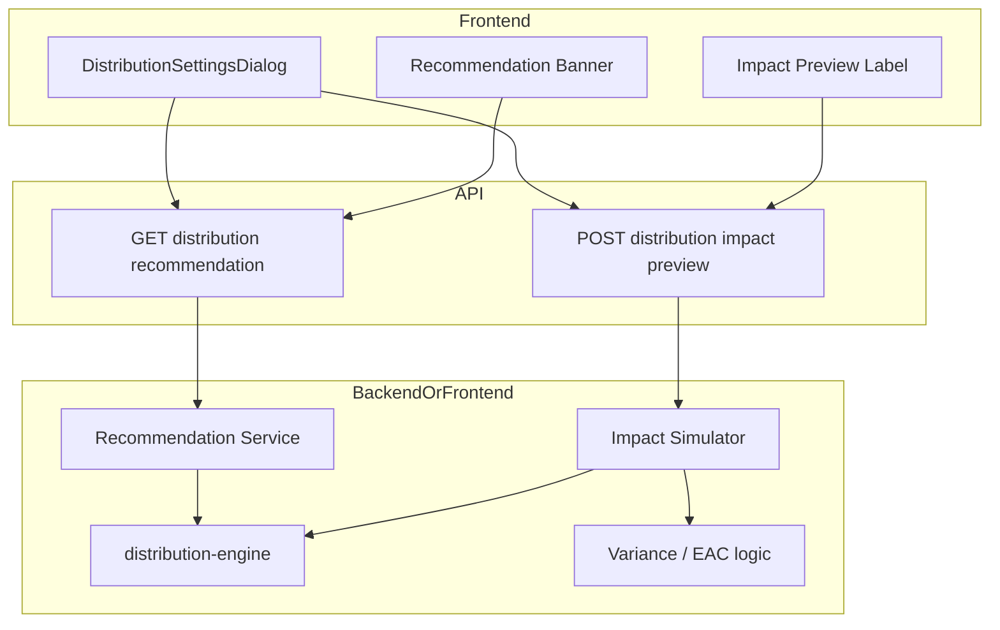

# Design Document: Distribution AI

## Overview

This design adds two AI-related features to the existing Distribution Settings Dialog: (1) an auto-suggestion for profile and duration when the dialog opens, based on history, and (2) a predictive preview of variance impact when the user changes profile, duration, or custom percentages. It builds on `DistributionSettingsDialog.tsx` and `lib/costbook/distribution-engine.ts`.

### Key Components

1. **Distribution Recommendation Service**: Backend or frontend logic that returns a recommended profile (and optionally duration) plus short rationale from historical usage.
2. **Variance Impact Simulator**: Backend or frontend logic that compares current variance with variance under the proposed rule and returns the difference (e.g. percentage).
3. **DistributionSettingsDialog Extensions**: Banner for recommendation; preview label or confirmation text for variance impact.

### Technology Stack

- **Frontend:** Next.js, React, existing DistributionSettingsDialog; optional fetch to backend for recommendation and impact.
- **Backend:** FastAPI; optional new endpoints under e.g. `/api/v1/costbook/distribution/` for recommendation and impact simulation.
- **Logic:** Reuse `lib/costbook/distribution-engine.ts` (e.g. `calculateDistribution`); reuse variance/EAC calculation from costbook or project controls.

## Architecture

## Data Flow

### Recommendation on Dialog Open

1. User opens DistributionSettingsDialog (e.g. for a project or row). Frontend may pass project_id, quarter, or context.
2. Frontend calls GET recommendation endpoint (or runs local logic) with that context. Backend queries stored distribution settings (e.g. last used profile/duration per project/quarter) and returns recommended profile, optional duration, and rationale.
3. Dialog shows banner: "Basierend auf Project-Historie: Custom für Q3 empfohlen" with optional "Übernehmen" button that pre-fills the form.

### Predictive Rule (Variance Impact) on Change

1. User changes profile, duration, or custom percentages in the dialog. Frontend may debounce (e.g. 300–500 ms).
2. Frontend sends current context (project, current variance or cost data) and proposed rule (profile, duration, custom %) to impact endpoint. Backend (or frontend) runs: (a) compute variance with current rule, (b) compute variance with proposed rule, (c) return difference (e.g. delta percent).
3. Dialog shows small preview: "Variance-Reduktion ca. 5%" or "Simulation nicht verfügbar". On "Apply", same hint can be shown in confirmation.

## Components and Interfaces

### Recommendation Service

- **Input:** project_id (and optionally quarter, organization_id). If no backend, frontend can use last-selected profile from local state or a simple heuristic.
- **Output:** `{ profile: "linear" | "custom", duration?: { from, to }, rationale: string }`. Backend can query a table or log of distribution settings by project/quarter and return most frequent or last-used profile with a short text.

### Variance Impact Simulator

- **Input:** project_id (or row context), current variance or cost snapshot, proposed rule (profile, duration, custom %).
- **Output:** `{ variance_delta_percent: number | null, variance_delta_absolute?: number, available: boolean }`. If simulation not possible, `available: false`, `variance_delta_percent: null`.
- Implementation: Call distribution engine for planned values under current and proposed rule; feed into existing variance/EAC calculation; compute difference. Can be backend (accurate, uses DB) or frontend (use existing distribution-engine and costbook helpers if data is in memory).

### DistributionSettingsDialog Changes

- **Recommendation banner:** Place above profile selection. Fetch recommendation on mount (or when project/context is set). "Übernehmen" applies recommendation to form state.
- **Impact preview:** When profile/duration/custom changes, call impact endpoint (debounced). Display result near Apply button or as inline label. On Apply, optionally show in confirm message.

## API Endpoints (Suggested)

| Method | Path | Description |
|--------|------|-------------|
| GET | `/api/v1/costbook/distribution/recommendation` | Query params: project_id, quarter? Return recommended profile, duration, rationale. |
| POST | `/api/v1/costbook/distribution/impact-preview` | Body: project_id, current_rule, proposed_rule, optional cost/variance snapshot. Return variance_delta_percent and available flag. |

(Paths may be Next.js API routes under `app/api/` or FastAPI. If simulation is frontend-only, no impact-preview endpoint needed.)

## Data Models

- **Recommendation:** No new table strictly required if recommendation is derived from existing "last used" or "most used" distribution settings. If storing history: e.g. `distribution_settings_history` (project_id, quarter, profile, duration, user_id, created_at) for querying.
- **Impact:** Stateless; input/output only. No new tables.

## Security and Performance

- Recommendation and impact endpoints must enforce auth and organization/project scope.
- Impact simulation should complete in under ~2 seconds; use cached project/cost data or simplified calculation if needed.
- Debounce impact requests in the UI to avoid excessive calls while the user is adjusting sliders.
