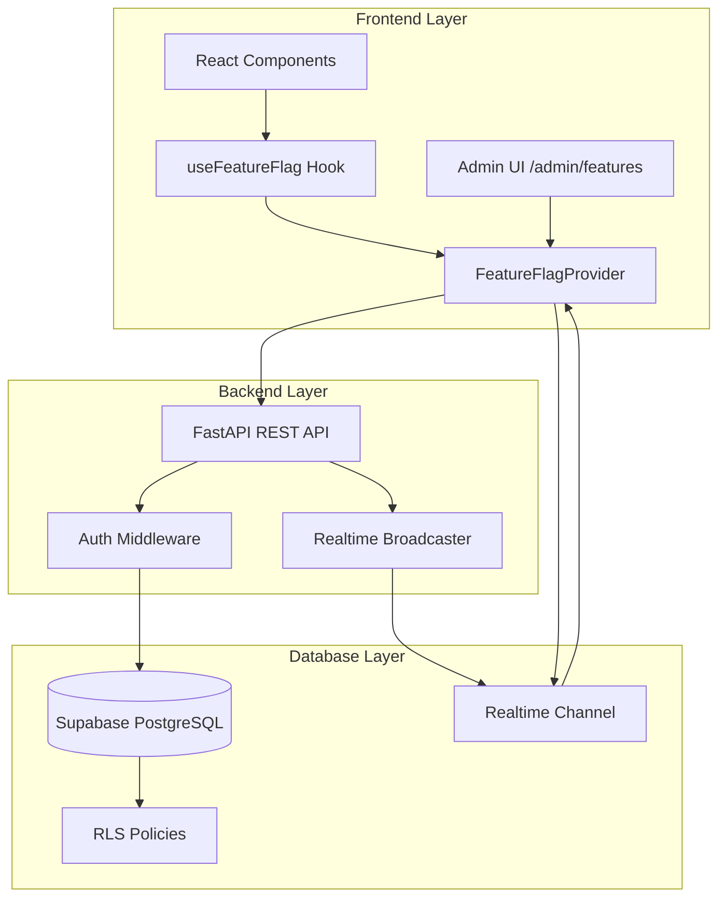

# Design Document: Feature Toggle System

## Overview

The Feature Toggle System is an enterprise-ready solution for managing feature flags in an AI-powered PPM SaaS application. The system enables dynamic feature activation/deactivation at both global and organization levels, with real-time synchronization across all clients.

The architecture follows a three-tier approach:
1. **Database Layer**: Supabase PostgreSQL with Row Level Security (RLS) policies
2. **Backend Layer**: FastAPI REST API with real-time broadcasting
3. **Frontend Layer**: React Context with hooks and admin UI

Key design principles:
- **Real-time First**: All changes propagate immediately via Supabase Realtime
- **Organization Hierarchy**: Organization-specific flags override global flags
- **Performance**: In-memory caching with synchronous flag checks
- **Security**: RLS policies enforce admin-only writes, authenticated reads
- **Resilience**: Graceful degradation with cached values on failures

## Architecture

### System Components



### Data Flow

**Read Flow (Feature Flag Check)**:
1. Component calls `useFeatureFlag('feature_name')`
2. Hook returns cached value from Context (synchronous, <1ms)
3. Context maintains cache updated via real-time subscriptions

**Write Flow (Admin Toggle)**:
1. Admin toggles flag in UI
2. Frontend sends PUT request to Backend API
3. Backend validates admin permissions
4. Backend updates database
5. Database trigger broadcasts change via Realtime
6. All connected clients receive update and refresh cache
7. UI components re-render with new flag state

**Initial Load Flow**:
1. User logs in
2. FeatureFlagProvider fetches all flags via GET /api/features
3. Backend queries database for global flags + organization flags
4. Backend merges results (organization overrides global)
5. Frontend caches flags and subscribes to Realtime channel

## Components and Interfaces

### Database Schema

**Table: feature_flags**

```sql
CREATE TABLE feature_flags (
    id UUID PRIMARY KEY DEFAULT gen_random_uuid(),
    name TEXT NOT NULL,
    enabled BOOLEAN NOT NULL DEFAULT false,
    organization_id UUID REFERENCES organizations(id) ON DELETE CASCADE,
    description TEXT,
    created_at TIMESTAMPTZ NOT NULL DEFAULT NOW(),
    updated_at TIMESTAMPTZ NOT NULL DEFAULT NOW(),
    UNIQUE(name, organization_id)
);

CREATE INDEX idx_feature_flags_name ON feature_flags(name);
CREATE INDEX idx_feature_flags_org ON feature_flags(organization_id);
CREATE INDEX idx_feature_flags_name_org ON feature_flags(name, organization_id);
```

**RLS Policies**:

```sql
-- Enable RLS
ALTER TABLE feature_flags ENABLE ROW LEVEL SECURITY;

-- Read policy: authenticated users can read global flags and their org's flags
CREATE POLICY "Users can read feature flags"
ON feature_flags FOR SELECT
TO authenticated
USING (
    organization_id IS NULL OR 
    organization_id = auth.jwt() ->> 'organization_id'::uuid
);

-- Write policies: only admins can modify
CREATE POLICY "Admins can insert feature flags"
ON feature_flags FOR INSERT
TO authenticated
WITH CHECK (
    auth.jwt() ->> 'role' = 'admin'
);

CREATE POLICY "Admins can update feature flags"
ON feature_flags FOR UPDATE
TO authenticated
USING (
    auth.jwt() ->> 'role' = 'admin'
);

CREATE POLICY "Admins can delete feature flags"
ON feature_flags FOR DELETE
TO authenticated
USING (
    auth.jwt() ->> 'role' = 'admin'
);
```

**Trigger for updated_at**:

```sql
CREATE OR REPLACE FUNCTION update_updated_at_column()
RETURNS TRIGGER AS $$
BEGIN
    NEW.updated_at = NOW();
    RETURN NEW;
END;
$$ LANGUAGE plpgsql;

CREATE TRIGGER update_feature_flags_updated_at
BEFORE UPDATE ON feature_flags
FOR EACH ROW
EXECUTE FUNCTION update_updated_at_column();
```

### Backend API Specification

**Base URL**: `/api/features`

**Authentication**: All endpoints require JWT token in Authorization header

#### GET /api/features

Retrieve all feature flags for the current user's organization.

**Request**:
```
GET /api/features
Authorization: Bearer <jwt_token>
```

**Response** (200 OK):
```json
{
  "flags": [
    {
      "name": "costbook_phase1",
      "enabled": true,
      "organization_id": null,
      "description": "Enable Costbook Phase 1 features",
      "created_at": "2024-01-15T10:30:00Z",
      "updated_at": "2024-01-20T14:45:00Z"
    },
    {
      "name": "ai_anomaly_detection",
      "enabled": false,
      "organization_id": "org-123",
      "description": "AI-powered anomaly detection",
      "created_at": "2024-01-16T09:00:00Z",
      "updated_at": "2024-01-16T09:00:00Z"
    }
  ]
}
```

**Error Responses**:
- 401 Unauthorized: Missing or invalid JWT token
- 500 Internal Server Error: Database connection failure

**Implementation Logic**:
1. Extract organization_id from JWT token
2. Query database for:
   - All global flags (organization_id IS NULL)
   - All organization-specific flags (organization_id = user's org)
3. Merge results with organization flags taking precedence
4. Return merged list

#### POST /api/features

Create a new feature flag (admin only).

**Request**:
```json
POST /api/features
Authorization: Bearer <jwt_token>
Content-Type: application/json

{
  "name": "new_feature",
  "enabled": false,
  "organization_id": null,
  "description": "Description of new feature"
}
```

**Validation Rules**:
- `name`: Required, 1-100 characters, alphanumeric + underscore + hyphen only
- `enabled`: Required, boolean
- `organization_id`: Optional, valid UUID or null
- `description`: Optional, max 500 characters

**Response** (201 Created):
```json
{
  "id": "flag-uuid",
  "name": "new_feature",
  "enabled": false,
  "organization_id": null,
  "description": "Description of new feature",
  "created_at": "2024-01-21T10:00:00Z",
  "updated_at": "2024-01-21T10:00:00Z"
}
```

**Error Responses**:
- 400 Bad Request: Validation errors
- 401 Unauthorized: Missing or invalid JWT token
- 403 Forbidden: User is not an admin
- 409 Conflict: Flag with same name and organization_id already exists

**Post-Operation**:
- Broadcast change via Supabase Realtime channel `feature_flags_changes`

#### PUT /api/features/{name}

Update an existing feature flag (admin only).

**Request**:
```json
PUT /api/features/costbook_phase1
Authorization: Bearer <jwt_token>
Content-Type: application/json

{
  "enabled": true,
  "organization_id": "org-123",
  "description": "Updated description"
}
```

**Validation Rules**:
- `enabled`: Optional, boolean
- `organization_id`: Optional, valid UUID or null
- `description`: Optional, max 500 characters
- `name` in URL path cannot be changed

**Response** (200 OK):
```json
{
  "id": "flag-uuid",
  "name": "costbook_phase1",
  "enabled": true,
  "organization_id": "org-123",
  "description": "Updated description",
  "created_at": "2024-01-15T10:30:00Z",
  "updated_at": "2024-01-21T11:00:00Z"
}
```

**Error Responses**:
- 400 Bad Request: Validation errors
- 401 Unauthorized: Missing or invalid JWT token
- 403 Forbidden: User is not an admin
- 404 Not Found: Flag does not exist

**Post-Operation**:
- Broadcast change via Supabase Realtime channel `feature_flags_changes`

#### DELETE /api/features/{name}

Delete a feature flag (admin only).

**Request**:
```
DELETE /api/features/old_feature?organization_id=org-123
Authorization: Bearer <jwt_token>
```

**Query Parameters**:
- `organization_id`: Optional, specify which flag to delete (global vs org-specific)

**Response** (204 No Content)

**Error Responses**:
- 401 Unauthorized: Missing or invalid JWT token
- 403 Forbidden: User is not an admin
- 404 Not Found: Flag does not exist

**Post-Operation**:
- Broadcast change via Supabase Realtime channel `feature_flags_changes`

### Backend Implementation Structure

**File: backend/app/routers/features.py**

```python
from fastapi import APIRouter, Depends, HTTPException, status
from typing import List, Optional
from pydantic import BaseModel, Field, validator
from supabase import Client
import re

router = APIRouter(prefix="/api/features", tags=["features"])

class FeatureFlagCreate(BaseModel):
    name: str = Field(..., min_length=1, max_length=100)
    enabled: bool
    organization_id: Optional[str] = None
    description: Optional[str] = Field(None, max_length=500)
    
    @validator('name')
    def validate_name(cls, v):
        if not re.match(r'^[a-zA-Z0-9_-]+$', v):
            raise ValueError('Name must contain only alphanumeric, underscore, hyphen')
        return v

class FeatureFlagUpdate(BaseModel):
    enabled: Optional[bool] = None
    organization_id: Optional[str] = None
    description: Optional[str] = Field(None, max_length=500)

class FeatureFlagResponse(BaseModel):
    id: str
    name: str
    enabled: bool
    organization_id: Optional[str]
    description: Optional[str]
    created_at: str
    updated_at: str

@router.get("/", response_model=dict)
async def get_features(
    user: dict = Depends(get_current_user),
    supabase: Client = Depends(get_supabase_client)
):
    """Get all feature flags for current user's organization"""
    organization_id = user.get('organization_id')
    
    # Query global flags and org-specific flags
    response = supabase.table('feature_flags').select('*').or_(
        f'organization_id.is.null,organization_id.eq.{organization_id}'
    ).execute()
    
    # Merge with org flags taking precedence
    flags_dict = {}
    for flag in response.data:
        name = flag['name']
        if name not in flags_dict or flag['organization_id'] is not None:
            flags_dict[name] = flag
    
    return {"flags": list(flags_dict.values())}

@router.post("/", response_model=FeatureFlagResponse, status_code=status.HTTP_201_CREATED)
async def create_feature(
    flag: FeatureFlagCreate,
    user: dict = Depends(require_admin),
    supabase: Client = Depends(get_supabase_client)
):
    """Create a new feature flag (admin only)"""
    response = supabase.table('feature_flags').insert(flag.dict()).execute()
    
    # Broadcast change
    await broadcast_flag_change('created', response.data[0])
    
    return response.data[0]

@router.put("/{name}", response_model=FeatureFlagResponse)
async def update_feature(
    name: str,
    flag: FeatureFlagUpdate,
    user: dict = Depends(require_admin),
    supabase: Client = Depends(get_supabase_client)
):
    """Update a feature flag (admin only)"""
    update_data = {k: v for k, v in flag.dict().items() if v is not None}
    
    response = supabase.table('feature_flags').update(update_data).eq(
        'name', name
    ).execute()
    
    if not response.data:
        raise HTTPException(status_code=404, detail="Feature flag not found")
    
    # Broadcast change
    await broadcast_flag_change('updated', response.data[0])
    
    return response.data[0]

async def broadcast_flag_change(action: str, flag: dict):
    """Broadcast flag change via Supabase Realtime"""
    supabase = get_supabase_client()
    channel = supabase.channel('feature_flags_changes')
    channel.send({
        'type': 'broadcast',
        'event': 'flag_change',
        'payload': {
            'action': action,
            'flag': flag
        }
    })
```

## Data Models

### Frontend TypeScript Interfaces

```typescript
// types/feature-flags.ts

export interface FeatureFlag {
  id: string;
  name: string;
  enabled: boolean;
  organization_id: string | null;
  description: string | null;
  created_at: string;
  updated_at: string;
}

export interface FeatureFlagCreate {
  name: string;
  enabled: boolean;
  organization_id?: string | null;
  description?: string;
}

export interface FeatureFlagUpdate {
  enabled?: boolean;
  organization_id?: string | null;
  description?: string;
}

export interface FeatureFlagsContextValue {
  flags: Map<string, boolean>;
  loading: boolean;
  error: Error | null;
  isFeatureEnabled: (flagName: string) => boolean;
  refreshFlags: () => Promise<void>;
}
```

### Frontend Context Implementation

**File: contexts/FeatureFlagContext.tsx**

```typescript
import React, { createContext, useContext, useEffect, useState, useCallback } from 'react';
import { useAuth } from './SupabaseAuthProvider';
import { supabase } from '@/lib/supabase';
import { FeatureFlag, FeatureFlagsContextValue } from '@/types/feature-flags';

const FeatureFlagsContext = createContext<FeatureFlagsContextValue | undefined>(undefined);

export function FeatureFlagProvider({ children }: { children: React.ReactNode }) {
  const [flags, setFlags] = useState<Map<string, boolean>>(new Map());
  const [loading, setLoading] = useState(true);
  const [error, setError] = useState<Error | null>(null);
  const { user, session } = useAuth();

  const fetchFlags = useCallback(async () => {
    if (!session) {
      setFlags(new Map());
      setLoading(false);
      return;
    }

    try {
      const response = await fetch('/api/features', {
        headers: {
          'Authorization': `Bearer ${session.access_token}`,
        },
      });

      if (!response.ok) {
        throw new Error('Failed to fetch feature flags');
      }

      const data = await response.json();
      const flagMap = new Map<string, boolean>();
      
      data.flags.forEach((flag: FeatureFlag) => {
        flagMap.set(flag.name, flag.enabled);
      });

      setFlags(flagMap);
      setError(null);
    } catch (err) {
      setError(err as Error);
      console.error('Error fetching feature flags:', err);
    } finally {
      setLoading(false);
    }
  }, [session]);

  // Subscribe to real-time updates
  useEffect(() => {
    if (!user) return;

    const channel = supabase
      .channel('feature_flags_changes')
      .on('broadcast', { event: 'flag_change' }, (payload) => {
        const { action, flag } = payload.payload;
        
        setFlags((prev) => {
          const newFlags = new Map(prev);
          if (action === 'deleted') {
            newFlags.delete(flag.name);
          } else {
            newFlags.set(flag.name, flag.enabled);
          }
          return newFlags;
        });
      })
      .subscribe();

    return () => {
      supabase.removeChannel(channel);
    };
  }, [user]);

  // Fetch flags on mount and when user changes
  useEffect(() => {
    fetchFlags();
  }, [fetchFlags]);

  const isFeatureEnabled = useCallback((flagName: string): boolean => {
    return flags.get(flagName) ?? false;
  }, [flags]);

  const value: FeatureFlagsContextValue = {
    flags,
    loading,
    error,
    isFeatureEnabled,
    refreshFlags: fetchFlags,
  };

  return (
    <FeatureFlagsContext.Provider value={value}>
      {children}
    </FeatureFlagsContext.Provider>
  );
}

export function useFeatureFlags(): FeatureFlagsContextValue {
  const context = useContext(FeatureFlagsContext);
  if (!context) {
    throw new Error('useFeatureFlags must be used within FeatureFlagProvider');
  }
  return context;
}

export function useFeatureFlag(flagName: string): { enabled: boolean; loading: boolean } {
  const { flags, loading, isFeatureEnabled } = useFeatureFlags();
  
  return {
    enabled: isFeatureEnabled(flagName),
    loading,
  };
}
```

### Admin UI Component Structure

**File: app/admin/features/page.tsx**

```typescript
'use client';

import { useState, useEffect } from 'react';
import { useAuth } from '@/contexts/SupabaseAuthProvider';
import { useRouter } from 'next/navigation';
import { Search, Plus, Toggle, Edit, Trash } from 'lucide-react';
import { FeatureFlag } from '@/types/feature-flags';
import { supabase } from '@/lib/supabase';

export default function AdminFeaturesPage() {
  const [flags, setFlags] = useState<FeatureFlag[]>([]);
  const [filteredFlags, setFilteredFlags] = useState<FeatureFlag[]>([]);
  const [searchQuery, setSearchQuery] = useState('');
  const [loading, setLoading] = useState(true);
  const [showCreateModal, setShowCreateModal] = useState(false);
  const { user, isAdmin } = useAuth();
  const router = useRouter();

  // Redirect non-admins
  useEffect(() => {
    if (!loading && !isAdmin) {
      router.push('/');
    }
  }, [isAdmin, loading, router]);

  // Fetch flags
  useEffect(() => {
    fetchFlags();
  }, []);

  // Subscribe to real-time updates
  useEffect(() => {
    const channel = supabase
      .channel('admin_feature_flags')
      .on('broadcast', { event: 'flag_change' }, (payload) => {
        const { action, flag } = payload.payload;
        
        setFlags((prev) => {
          if (action === 'created') {
            return [...prev, flag];
          } else if (action === 'updated') {
            return prev.map((f) => (f.id === flag.id ? flag : f));
          } else if (action === 'deleted') {
            return prev.filter((f) => f.id !== flag.id);
          }
          return prev;
        });
      })
      .subscribe();

    return () => {
      supabase.removeChannel(channel);
    };
  }, []);

  // Filter flags based on search
  useEffect(() => {
    if (searchQuery.trim() === '') {
      setFilteredFlags(flags);
    } else {
      const query = searchQuery.toLowerCase();
      setFilteredFlags(
        flags.filter((flag) =>
          flag.name.toLowerCase().includes(query)
        )
      );
    }
  }, [searchQuery, flags]);

  const fetchFlags = async () => {
    // Implementation
  };

  const toggleFlag = async (flag: FeatureFlag) => {
    // Implementation
  };

  return (
    <div className="container mx-auto px-4 py-8">
      <div className="flex justify-between items-center mb-6">
        <h1 className="text-3xl font-bold">Feature Flags</h1>
        <button
          onClick={() => setShowCreateModal(true)}
          className="flex items-center gap-2 bg-blue-600 text-white px-4 py-2 rounded-lg hover:bg-blue-700"
        >
          <Plus size={20} />
          Add New Flag
        </button>
      </div>

      {/* Search Bar */}
      <div className="mb-6">
        <div className="relative">
          <Search className="absolute left-3 top-1/2 transform -translate-y-1/2 text-gray-400" size={20} />
          <input
            type="text"
            placeholder="Search flags by name..."
            value={searchQuery}
            onChange={(e) => setSearchQuery(e.target.value)}
            className="w-full pl-10 pr-4 py-2 border border-gray-300 rounded-lg focus:ring-2 focus:ring-blue-500"
          />
        </div>
      </div>

      {/* Flags Table */}
      <div className="bg-white rounded-lg shadow overflow-hidden">
        <table className="min-w-full divide-y divide-gray-200">
          <thead className="bg-gray-50">
            <tr>
              <th className="px-6 py-3 text-left text-xs font-medium text-gray-500 uppercase tracking-wider">
                Name
              </th>
              <th className="px-6 py-3 text-left text-xs font-medium text-gray-500 uppercase tracking-wider">
                Description
              </th>
              <th className="px-6 py-3 text-left text-xs font-medium text-gray-500 uppercase tracking-wider">
                Scope
              </th>
              <th className="px-6 py-3 text-left text-xs font-medium text-gray-500 uppercase tracking-wider">
                Enabled
              </th>
              <th className="px-6 py-3 text-left text-xs font-medium text-gray-500 uppercase tracking-wider">
                Actions
              </th>
            </tr>
          </thead>
          <tbody className="bg-white divide-y divide-gray-200">
            {filteredFlags.map((flag) => (
              <FlagRow key={flag.id} flag={flag} onToggle={toggleFlag} />
            ))}
          </tbody>
        </table>
        
        {filteredFlags.length === 0 && (
          <div className="text-center py-8 text-gray-500">
            No flags found
          </div>
        )}
      </div>

      {/* Create Modal */}
      {showCreateModal && (
        <CreateFlagModal
          onClose={() => setShowCreateModal(false)}
          onSuccess={fetchFlags}
        />
      )}
    </div>
  );
}
```


## Correctness Properties

A property is a characteristic or behavior that should hold true across all valid executions of a system—essentially, a formal statement about what the system should do. Properties serve as the bridge between human-readable specifications and machine-verifiable correctness guarantees.

### Property 1: Flag Scoping and Visibility

*For any* organization and any set of feature flags (global and organization-specific), when a user from that organization queries flags, the system should return all global flags plus all flags specific to that organization, and organization-specific flags should override global flags with the same name.

**Validates: Requirements 1.2, 1.3, 2.1, 4.1, 4.2**

### Property 2: Unique Flag Names per Scope

*For any* flag name and organization_id combination, attempting to create a second flag with the same name and organization_id should be rejected by the system.

**Validates: Requirements 1.4**

### Property 3: Automatic Timestamp Creation

*For any* newly created feature flag, the created_at field should be automatically set to a timestamp within 1 second of the current time.

**Validates: Requirements 1.5, 15.1**

### Property 4: Automatic Timestamp Updates

*For any* feature flag update operation, the updated_at field should be automatically changed to a timestamp within 1 second of the current time, and the new updated_at should be greater than or equal to the created_at.

**Validates: Requirements 1.6, 15.2**

### Property 5: Admin Write Permissions

*For any* admin user, all write operations (create, update, delete) on feature flags should succeed when provided with valid data.

**Validates: Requirements 2.2, 2.3, 2.4**

### Property 6: Regular User Write Restrictions

*For any* regular (non-admin) user, all write operations (create, update, delete) on feature flags should be rejected with a 403 Forbidden response.

**Validates: Requirements 2.5**

### Property 7: API Response Format Completeness

*For any* successful GET /api/features request, each flag in the response should contain all required fields: name, enabled, organization_id, description, created_at, updated_at.

**Validates: Requirements 4.4**

### Property 8: Flag Creation Persistence

*For any* valid feature flag data submitted via POST /api/features by an admin, the flag should be created and subsequently retrievable via GET /api/features.

**Validates: Requirements 5.1**

### Property 9: Flag Update Persistence

*For any* existing feature flag updated via PUT /api/features/{name} by an admin, the changes should be persisted and reflected in subsequent GET requests.

**Validates: Requirements 5.2**

### Property 10: Input Validation Rejection

*For any* invalid feature flag data (missing required fields, invalid name format, etc.), the API should return a 400 Bad Request response with validation errors.

**Validates: Requirements 5.4**

### Property 11: Name Format Validation

*For any* feature flag name containing characters other than alphanumeric, underscore, or hyphen, the API should reject the creation/update with a validation error.

**Validates: Requirements 5.6**

### Property 12: Real-Time Broadcast on Changes

*For any* feature flag create, update, or delete operation, the system should broadcast the change via the Real_Time_Channel to all connected clients.

**Validates: Requirements 5.5, 6.1**

### Property 13: Hook Returns Boolean

*For any* flag name passed to the useFeatureFlag hook, the hook should return an object with an 'enabled' field that is a boolean value.

**Validates: Requirements 7.3**

### Property 14: Non-Existent Flag Default

*For any* flag name that does not exist in the system, the useFeatureFlag hook should return false for the 'enabled' field.

**Validates: Requirements 7.5**

### Property 15: Edit Preserves Name

*For any* feature flag edit operation, the flag's name should remain unchanged while other fields (enabled, description, organization_id) can be modified.

**Validates: Requirements 9.5**

### Property 16: Case-Insensitive Search Filtering

*For any* list of feature flags and any search query, the filtering function should return all flags whose names contain the search query (case-insensitive), and the results should be the same regardless of the case used in the query.

**Validates: Requirements 11.1, 11.2**

### Property 17: Organization ID Extraction

*For any* authenticated user session, the system should correctly extract the organization_id from the session and use it for flag filtering.

**Validates: Requirements 12.2**

### Property 18: Admin Role Detection

*For any* authenticated user session, the system should correctly determine whether the user has admin privileges based on the role in the session.

**Validates: Requirements 12.3**

### Property 19: Error Containment

*For any* error occurring in feature flag operations (fetch failures, parse errors, etc.), the error should be caught and logged without crashing the application or preventing other features from functioning.

**Validates: Requirements 13.6**

### Property 20: Synchronous Hook Response

*For any* call to the useFeatureFlag hook with a cached flag, the hook should return the result synchronously without any asynchronous delays.

**Validates: Requirements 14.2**

### Property 21: UTC Timestamp Storage

*For any* feature flag created or updated, the created_at and updated_at timestamps should be stored in UTC timezone.

**Validates: Requirements 15.4**

### Property 22: Timestamp Precision

*For any* feature flag created or updated, the created_at and updated_at timestamps should preserve precision to at least the second level.

**Validates: Requirements 15.5**

## Error Handling

### Backend Error Handling

**Database Connection Failures**:
- Catch database connection errors
- Return 503 Service Unavailable with retry-after header
- Log error details for monitoring
- Implement connection pooling with automatic retry

**Validation Errors**:
- Return 400 Bad Request with detailed validation messages
- Include field-level error information in response
- Example: `{"error": "Validation failed", "details": {"name": "Name must contain only alphanumeric, underscore, hyphen"}}`

**Authorization Errors**:
- Return 401 Unauthorized for missing/invalid tokens
- Return 403 Forbidden for insufficient permissions
- Include clear error messages without exposing security details

**Not Found Errors**:
- Return 404 Not Found when flag doesn't exist
- Include the flag name in error message for debugging

**Conflict Errors**:
- Return 409 Conflict when attempting to create duplicate flags
- Include information about the existing flag

**Real-Time Broadcast Failures**:
- Log broadcast failures but don't fail the main operation
- Implement retry logic for broadcast operations
- Fall back to polling if real-time is unavailable

### Frontend Error Handling

**API Request Failures**:
- Implement exponential backoff retry (3 attempts: 1s, 2s, 4s)
- Use cached values during API unavailability
- Display user-friendly error messages
- Log errors to monitoring service

**Real-Time Connection Failures**:
- Automatically attempt reconnection with exponential backoff
- Continue using cached values during disconnection
- Show connection status indicator in admin UI
- Fall back to periodic polling if real-time fails repeatedly

**Hook Error Boundaries**:
- Wrap feature flag context in React Error Boundary
- Prevent feature flag errors from crashing the app
- Return default values (false) when errors occur
- Log errors for debugging

**Loading States**:
- Show loading indicators during initial fetch
- Use optimistic updates for toggle operations
- Revert on failure with error notification

**Validation Errors**:
- Display inline validation errors in forms
- Highlight invalid fields
- Provide clear guidance on how to fix errors

### Error Recovery Strategies

**Cache-First Approach**:
- Always serve from cache when available
- Update cache in background
- Graceful degradation when backend is unavailable

**Retry Logic**:
- Exponential backoff for transient failures
- Maximum retry attempts to prevent infinite loops
- Circuit breaker pattern for persistent failures

**Fallback Behavior**:
- Default to false for unknown flags (fail-safe)
- Use last known good values during outages
- Provide manual refresh option for users

## Testing Strategy

### Dual Testing Approach

The Feature Toggle System requires both unit tests and property-based tests for comprehensive coverage:

**Unit Tests**: Focus on specific examples, edge cases, and integration points
- Specific flag configurations (global vs organization)
- Authentication edge cases (unauthenticated, non-admin)
- Error conditions (network failures, invalid data)
- UI component rendering and interactions
- Real-time subscription setup and teardown

**Property-Based Tests**: Verify universal properties across all inputs
- Flag scoping and visibility rules
- Timestamp generation and updates
- Input validation across all possible invalid inputs
- Search filtering with random queries
- Permission checks across user roles

### Property-Based Testing Configuration

**Library Selection**:
- **Backend (Python/FastAPI)**: Use `hypothesis` library
- **Frontend (TypeScript/React)**: Use `fast-check` library

**Test Configuration**:
- Minimum 100 iterations per property test
- Each test must reference its design document property
- Tag format: `Feature: feature-toggle-system, Property {number}: {property_text}`

**Example Property Test Structure (Python)**:

```python
from hypothesis import given, strategies as st
import pytest

@given(
    name=st.text(alphabet=st.characters(whitelist_categories=('Lu', 'Ll', 'Nd')), min_size=1, max_size=100),
    enabled=st.booleans(),
    organization_id=st.one_of(st.none(), st.uuids())
)
@pytest.mark.property_test
def test_flag_creation_persistence(name, enabled, organization_id):
    """
    Feature: feature-toggle-system, Property 8: Flag Creation Persistence
    For any valid feature flag data, the flag should be created and retrievable
    """
    # Create flag
    response = client.post('/api/features', json={
        'name': name,
        'enabled': enabled,
        'organization_id': str(organization_id) if organization_id else None,
        'description': 'Test flag'
    })
    assert response.status_code == 201
    
    # Retrieve and verify
    get_response = client.get('/api/features')
    flags = get_response.json()['flags']
    assert any(f['name'] == name and f['enabled'] == enabled for f in flags)
```

**Example Property Test Structure (TypeScript)**:

```typescript
import fc from 'fast-check';
import { describe, it, expect } from 'vitest';

describe('Feature: feature-toggle-system, Property 16: Case-Insensitive Search Filtering', () => {
  it('should filter flags case-insensitively', () => {
    fc.assert(
      fc.property(
        fc.array(fc.record({
          name: fc.string({ minLength: 1, maxLength: 50 }),
          enabled: fc.boolean(),
        })),
        fc.string(),
        (flags, query) => {
          const filtered = filterFlags(flags, query);
          const lowerQuery = query.toLowerCase();
          
          // All results should contain the query (case-insensitive)
          filtered.forEach(flag => {
            expect(flag.name.toLowerCase()).toContain(lowerQuery);
          });
          
          // Should be same as filtering with different case
          const upperFiltered = filterFlags(flags, query.toUpperCase());
          expect(filtered).toEqual(upperFiltered);
        }
      ),
      { numRuns: 100 }
    );
  });
});
```

### Unit Test Coverage

**Backend Unit Tests**:
- API endpoint responses for valid requests
- RLS policy enforcement
- Database trigger functionality
- Validation error messages
- Real-time broadcast integration
- Authentication middleware

**Frontend Unit Tests**:
- FeatureFlagProvider initialization
- useFeatureFlag hook behavior
- Real-time subscription handling
- Cache management
- Error boundary behavior
- Admin UI component rendering
- Search and filter functionality
- Modal form validation

### Integration Tests

**End-to-End Flows**:
- Complete flag lifecycle (create → read → update → delete)
- Real-time synchronization across multiple clients
- Admin UI workflows
- Authentication and authorization flows
- Error recovery scenarios

**Performance Tests**:
- API response times under load
- Hook performance with large flag sets
- Real-time broadcast latency
- Database query performance

### Test Data Management

**Seed Data for Tests**:
- Create test organizations and users
- Generate diverse flag configurations
- Include edge cases (null values, special characters)

**Test Isolation**:
- Use transactions for database tests
- Clean up test data after each test
- Mock external dependencies (Supabase Realtime)

**Property Test Generators**:
- Valid flag names (alphanumeric + underscore + hyphen)
- Invalid flag names (special characters, empty strings)
- Random organization IDs
- Random timestamps
- Random boolean values

### Continuous Integration

**CI Pipeline**:
1. Run unit tests on every commit
2. Run property tests on every PR
3. Run integration tests before merge
4. Generate coverage reports
5. Fail build if coverage drops below 80%

**Test Execution Order**:
1. Fast unit tests (< 1 second each)
2. Property tests (< 10 seconds each)
3. Integration tests (< 30 seconds each)
4. E2E tests (< 2 minutes total)
