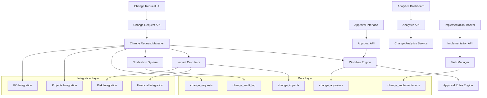

# Design Document: Integrated Change Management System

## Overview

The Integrated Change Management System provides comprehensive change request lifecycle management for Construction/Engineering PPM projects. It handles change initiation, multi-level approvals, impact analysis, implementation tracking, and audit compliance while integrating seamlessly with existing projects, purchase orders, and financial systems.

## Architecture

The system follows a microservices-inspired architecture within the existing FastAPI backend:



## Components and Interfaces

### 1. Change Request Manager

**Purpose**: Core service for managing change request lifecycle and data operations.

**Key Methods**:
```python
class ChangeRequestManager:
    async def create_change_request(
        request_data: ChangeRequestCreate,
        creator_id: UUID,
        template_id: Optional[UUID] = None
    ) -> ChangeRequestResponse
    
    async def update_change_request(
        change_id: UUID,
        updates: ChangeRequestUpdate,
        updated_by: UUID
    ) -> ChangeRequestResponse
    
    async def get_change_request(change_id: UUID) -> ChangeRequestResponse
    async def list_change_requests(
        filters: ChangeRequestFilters
    ) -> List[ChangeRequestResponse]
    
    async def link_to_project(change_id: UUID, project_id: UUID) -> bool
    async def link_to_purchase_order(change_id: UUID, po_id: UUID) -> bool
    
    def validate_status_transition(
        current_status: ChangeStatus,
        new_status: ChangeStatus
    ) -> bool
```

### 2. Approval Workflow Engine

**Purpose**: Manages multi-step approval processes with configurable workflows.

**Key Methods**:
```python
class ApprovalWorkflowEngine:
    async def initiate_approval_workflow(
        change_id: UUID,
        workflow_type: WorkflowType
    ) -> WorkflowInstance
    
    async def process_approval_decision(
        approval_id: UUID,
        decision: ApprovalDecision,
        approver_id: UUID,
        comments: Optional[str] = None
    ) -> ApprovalResult
    
    async def get_pending_approvals(user_id: UUID) -> List[PendingApproval]
    async def escalate_overdue_approvals() -> List[EscalationResult]
    
    def determine_approval_path(
        change_request: ChangeRequestData
    ) -> List[ApprovalStep]
    
    def check_approval_authority(
        user_id: UUID,
        change_value: Decimal,
        change_type: ChangeType
    ) -> bool
```

### 3. Impact Analysis Calculator

**Purpose**: Calculates comprehensive impacts on schedule, cost, and risks.

**Key Methods**:
```python
class ImpactAnalysisCalculator:
    async def calculate_schedule_impact(
        change_request: ChangeRequestData,
        project_schedule: ProjectSchedule
    ) -> ScheduleImpactAnalysis
    
    async def calculate_cost_impact(
        change_request: ChangeRequestData,
        project_budget: ProjectBudget
    ) -> CostImpactAnalysis
    
    async def assess_risk_impact(
        change_request: ChangeRequestData,
        existing_risks: List[Risk]
    ) -> RiskImpactAnalysis
    
    async def generate_impact_scenarios(
        change_request: ChangeRequestData
    ) -> ImpactScenarios
    
    async def update_project_baselines(
        change_id: UUID,
        approved_impacts: ApprovedImpacts
    ) -> BaselineUpdateResult
```

### 4. Change Notification System

**Purpose**: Handles all notifications and communications for change management.

**Key Methods**:
```python
class ChangeNotificationSystem:
    async def notify_stakeholders(
        change_id: UUID,
        event_type: NotificationEvent,
        stakeholder_roles: List[StakeholderRole]
    ) -> NotificationResult
    
    async def send_approval_request(
        approval_id: UUID,
        approver_id: UUID,
        urgency_level: UrgencyLevel
    ) -> bool
    
    async def send_deadline_reminders() -> List[ReminderResult]
    async def escalate_overdue_items() -> List[EscalationResult]
    
    def get_notification_preferences(
        user_id: UUID
    ) -> NotificationPreferences
    
    async def generate_status_report(
        project_id: UUID,
        report_type: ReportType
    ) -> StatusReport
```

## Data Models

### Database Schema Extensions

```sql
-- Change request types enum
CREATE TYPE change_type AS ENUM (
    'scope', 'schedule', 'budget', 'design', 'regulatory', 
    'resource', 'quality', 'safety', 'emergency'
);

-- Change status enum
CREATE TYPE change_status AS ENUM (
    'draft', 'submitted', 'under_review', 'pending_approval',
    'approved', 'rejected', 'on_hold', 'implementing', 
    'implemented', 'closed', 'cancelled'
);

-- Priority levels enum
CREATE TYPE priority_level AS ENUM ('low', 'medium', 'high', 'critical', 'emergency');

-- Approval decision enum
CREATE TYPE approval_decision AS ENUM ('approved', 'rejected', 'needs_info', 'delegated');

-- Main change requests table
CREATE TABLE IF NOT EXISTS change_requests (
    id UUID PRIMARY KEY DEFAULT gen_random_uuid(),
    change_number VARCHAR(50) UNIQUE NOT NULL, -- Auto-generated: CR-YYYY-NNNN
    title VARCHAR(255) NOT NULL,
    description TEXT NOT NULL,
    justification TEXT,
    change_type change_type NOT NULL,
    priority priority_level DEFAULT 'medium',
    status change_status DEFAULT 'draft',
    
    -- Requestor information
    requested_by UUID NOT NULL REFERENCES auth.users(id),
    requested_date TIMESTAMP WITH TIME ZONE DEFAULT NOW(),
    required_by_date DATE,
    
    -- Project linkage
    project_id UUID NOT NULL REFERENCES projects(id) ON DELETE CASCADE,
    affected_milestones JSONB DEFAULT '[]',
    affected_pos JSONB DEFAULT '[]', -- Purchase Order IDs
    
    -- Impact estimates (initial)
    estimated_cost_impact DECIMAL(12,2) DEFAULT 0,
    estimated_schedule_impact_days INTEGER DEFAULT 0,
    estimated_effort_hours DECIMAL(8,2) DEFAULT 0,
    
    -- Actual impacts (post-implementation)
    actual_cost_impact DECIMAL(12,2),
    actual_schedule_impact_days INTEGER,
    actual_effort_hours DECIMAL(8,2),
    
    -- Implementation tracking
    implementation_start_date DATE,
    implementation_end_date DATE,
    implementation_notes TEXT,
    
    -- Metadata
    template_id UUID REFERENCES change_templates(id),
    version INTEGER DEFAULT 1,
    parent_change_id UUID REFERENCES change_requests(id), -- For related changes
    
    created_at TIMESTAMP WITH TIME ZONE DEFAULT NOW(),
    updated_at TIMESTAMP WITH TIME ZONE DEFAULT NOW(),
    closed_at TIMESTAMP WITH TIME ZONE,
    closed_by UUID REFERENCES auth.users(id)
);

-- Change request templates
CREATE TABLE IF NOT EXISTS change_templates (
    id UUID PRIMARY KEY DEFAULT gen_random_uuid(),
    name VARCHAR(255) NOT NULL,
    description TEXT,
    change_type change_type NOT NULL,
    template_data JSONB NOT NULL, -- Form fields, validation rules, etc.
    is_active BOOLEAN DEFAULT true,
    created_by UUID REFERENCES auth.users(id),
    created_at TIMESTAMP WITH TIME ZONE DEFAULT NOW(),
    updated_at TIMESTAMP WITH TIME ZONE DEFAULT NOW()
);

-- Approval workflows and steps
CREATE TABLE IF NOT EXISTS change_approvals (
    id UUID PRIMARY KEY DEFAULT gen_random_uuid(),
    change_request_id UUID NOT NULL REFERENCES change_requests(id) ON DELETE CASCADE,
    step_number INTEGER NOT NULL,
    approver_id UUID NOT NULL REFERENCES auth.users(id),
    approver_role VARCHAR(100), -- Role at time of approval
    
    -- Approval decision
    decision approval_decision,
    decision_date TIMESTAMP WITH TIME ZONE,
    comments TEXT,
    conditions TEXT, -- Conditional approval requirements
    
    -- Workflow management
    is_required BOOLEAN DEFAULT true,
    is_parallel BOOLEAN DEFAULT false, -- Can be processed in parallel with other steps
    depends_on_step INTEGER, -- Must wait for this step to complete
    
    -- Deadlines and escalation
    due_date TIMESTAMP WITH TIME ZONE,
    escalation_date TIMESTAMP WITH TIME ZONE,
    escalated_to UUID REFERENCES auth.users(id),
    
    created_at TIMESTAMP WITH TIME ZONE DEFAULT NOW(),
    updated_at TIMESTAMP WITH TIME ZONE DEFAULT NOW()
);

-- Detailed impact analysis
CREATE TABLE IF NOT EXISTS change_impacts (
    id UUID PRIMARY KEY DEFAULT gen_random_uuid(),
    change_request_id UUID NOT NULL REFERENCES change_requests(id) ON DELETE CASCADE,
    
    -- Schedule impacts
    critical_path_affected BOOLEAN DEFAULT false,
    schedule_impact_details JSONB, -- Detailed timeline changes
    affected_activities JSONB DEFAULT '[]',
    
    -- Cost impacts
    direct_costs DECIMAL(12,2) DEFAULT 0,
    indirect_costs DECIMAL(12,2) DEFAULT 0,
    cost_savings DECIMAL(12,2) DEFAULT 0,
    cost_breakdown JSONB, -- Detailed cost analysis
    
    -- Resource impacts
    resource_requirements JSONB, -- Additional resources needed
    resource_reallocation JSONB, -- Existing resource changes
    
    -- Risk impacts
    new_risks JSONB DEFAULT '[]', -- New risks introduced
    modified_risks JSONB DEFAULT '[]', -- Changes to existing risks
    risk_mitigation_costs DECIMAL(12,2) DEFAULT 0,
    
    -- Quality and compliance impacts
    quality_impact_assessment TEXT,
    compliance_requirements JSONB,
    regulatory_approvals_needed JSONB DEFAULT '[]',
    
    -- Scenarios
    best_case_scenario JSONB,
    worst_case_scenario JSONB,
    most_likely_scenario JSONB,
    
    analyzed_by UUID REFERENCES auth.users(id),
    analyzed_at TIMESTAMP WITH TIME ZONE DEFAULT NOW(),
    approved_by UUID REFERENCES auth.users(id),
    approved_at TIMESTAMP WITH TIME ZONE
);

-- Implementation tracking
CREATE TABLE IF NOT EXISTS change_implementations (
    id UUID PRIMARY KEY DEFAULT gen_random_uuid(),
    change_request_id UUID NOT NULL REFERENCES change_requests(id) ON DELETE CASCADE,
    
    -- Implementation plan
    implementation_plan JSONB, -- Detailed implementation steps
    assigned_to UUID REFERENCES auth.users(id),
    implementation_team JSONB DEFAULT '[]', -- Team member IDs
    
    -- Progress tracking
    progress_percentage INTEGER DEFAULT 0 CHECK (progress_percentage >= 0 AND progress_percentage <= 100),
    completed_tasks JSONB DEFAULT '[]',
    pending_tasks JSONB DEFAULT '[]',
    blocked_tasks JSONB DEFAULT '[]',
    
    -- Milestones
    implementation_milestones JSONB DEFAULT '[]',
    
    -- Issues and risks during implementation
    implementation_issues JSONB DEFAULT '[]',
    lessons_learned TEXT,
    
    -- Verification and validation
    verification_criteria JSONB,
    verification_results JSONB,
    validated_by UUID REFERENCES auth.users(id),
    validated_at TIMESTAMP WITH TIME ZONE,
    
    created_at TIMESTAMP WITH TIME ZONE DEFAULT NOW(),
    updated_at TIMESTAMP WITH TIME ZONE DEFAULT NOW()
);

-- Comprehensive audit log for change management
CREATE TABLE IF NOT EXISTS change_audit_log (
    id UUID PRIMARY KEY DEFAULT gen_random_uuid(),
    change_request_id UUID NOT NULL REFERENCES change_requests(id) ON DELETE CASCADE,
    
    -- Event details
    event_type VARCHAR(50) NOT NULL, -- 'created', 'updated', 'approved', 'rejected', etc.
    event_description TEXT,
    
    -- User and context
    performed_by UUID REFERENCES auth.users(id),
    performed_at TIMESTAMP WITH TIME ZONE DEFAULT NOW(),
    ip_address INET,
    user_agent TEXT,
    
    -- Data changes
    old_values JSONB,
    new_values JSONB,
    
    -- Additional context
    related_entity_type VARCHAR(50), -- 'approval', 'impact', 'implementation'
    related_entity_id UUID,
    
    -- Compliance and regulatory
    compliance_notes TEXT,
    regulatory_reference VARCHAR(255)
);

-- Notification preferences and delivery tracking
CREATE TABLE IF NOT EXISTS change_notifications (
    id UUID PRIMARY KEY DEFAULT gen_random_uuid(),
    change_request_id UUID NOT NULL REFERENCES change_requests(id) ON DELETE CASCADE,
    
    -- Notification details
    notification_type VARCHAR(50) NOT NULL,
    recipient_id UUID NOT NULL REFERENCES auth.users(id),
    delivery_method VARCHAR(20) NOT NULL, -- 'email', 'in_app', 'sms'
    
    -- Content
    subject VARCHAR(255),
    message TEXT,
    
    -- Delivery tracking
    sent_at TIMESTAMP WITH TIME ZONE,
    delivered_at TIMESTAMP WITH TIME ZONE,
    read_at TIMESTAMP WITH TIME ZONE,
    
    -- Status
    delivery_status VARCHAR(20) DEFAULT 'pending', -- 'pending', 'sent', 'delivered', 'failed'
    failure_reason TEXT,
    
    created_at TIMESTAMP WITH TIME ZONE DEFAULT NOW()
);

-- Indexes for performance
CREATE INDEX IF NOT EXISTS idx_change_requests_project_id ON change_requests(project_id);
CREATE INDEX IF NOT EXISTS idx_change_requests_status ON change_requests(status);
CREATE INDEX IF NOT EXISTS idx_change_requests_requested_by ON change_requests(requested_by);
CREATE INDEX IF NOT EXISTS idx_change_requests_change_type ON change_requests(change_type);
CREATE INDEX IF NOT EXISTS idx_change_requests_priority ON change_requests(priority);
CREATE INDEX IF NOT EXISTS idx_change_requests_change_number ON change_requests(change_number);

CREATE INDEX IF NOT EXISTS idx_change_approvals_change_request_id ON change_approvals(change_request_id);
CREATE INDEX IF NOT EXISTS idx_change_approvals_approver_id ON change_approvals(approver_id);
CREATE INDEX IF NOT EXISTS idx_change_approvals_decision ON change_approvals(decision);
CREATE INDEX IF NOT EXISTS idx_change_approvals_due_date ON change_approvals(due_date);

CREATE INDEX IF NOT EXISTS idx_change_impacts_change_request_id ON change_impacts(change_request_id);
CREATE INDEX IF NOT EXISTS idx_change_implementations_change_request_id ON change_implementations(change_request_id);
CREATE INDEX IF NOT EXISTS idx_change_implementations_assigned_to ON change_implementations(assigned_to);

CREATE INDEX IF NOT EXISTS idx_change_audit_log_change_request_id ON change_audit_log(change_request_id);
CREATE INDEX IF NOT EXISTS idx_change_audit_log_performed_by ON change_audit_log(performed_by);
CREATE INDEX IF NOT EXISTS idx_change_audit_log_performed_at ON change_audit_log(performed_at);
CREATE INDEX IF NOT EXISTS idx_change_audit_log_event_type ON change_audit_log(event_type);

CREATE INDEX IF NOT EXISTS idx_change_notifications_change_request_id ON change_notifications(change_request_id);
CREATE INDEX IF NOT EXISTS idx_change_notifications_recipient_id ON change_notifications(recipient_id);
CREATE INDEX IF NOT EXISTS idx_change_notifications_delivery_status ON change_notifications(delivery_status);
```

### Pydantic Models

```python
class ChangeType(str, Enum):
    SCOPE = "scope"
    SCHEDULE = "schedule"
    BUDGET = "budget"
    DESIGN = "design"
    REGULATORY = "regulatory"
    RESOURCE = "resource"
    QUALITY = "quality"
    SAFETY = "safety"
    EMERGENCY = "emergency"

class ChangeStatus(str, Enum):
    DRAFT = "draft"
    SUBMITTED = "submitted"
    UNDER_REVIEW = "under_review"
    PENDING_APPROVAL = "pending_approval"
    APPROVED = "approved"
    REJECTED = "rejected"
    ON_HOLD = "on_hold"
    IMPLEMENTING = "implementing"
    IMPLEMENTED = "implemented"
    CLOSED = "closed"
    CANCELLED = "cancelled"

class PriorityLevel(str, Enum):
    LOW = "low"
    MEDIUM = "medium"
    HIGH = "high"
    CRITICAL = "critical"
    EMERGENCY = "emergency"

class ApprovalDecision(str, Enum):
    APPROVED = "approved"
    REJECTED = "rejected"
    NEEDS_INFO = "needs_info"
    DELEGATED = "delegated"

class ChangeRequestCreate(BaseModel):
    title: str = Field(..., min_length=5, max_length=255)
    description: str = Field(..., min_length=10)
    justification: Optional[str] = None
    change_type: ChangeType
    priority: PriorityLevel = PriorityLevel.MEDIUM
    project_id: UUID
    required_by_date: Optional[date] = None
    
    # Impact estimates
    estimated_cost_impact: Optional[Decimal] = Field(None, ge=0)
    estimated_schedule_impact_days: Optional[int] = Field(None, ge=0)
    estimated_effort_hours: Optional[Decimal] = Field(None, ge=0)
    
    # Linkages
    affected_milestones: List[UUID] = Field(default_factory=list)
    affected_pos: List[UUID] = Field(default_factory=list)
    
    # Template usage
    template_id: Optional[UUID] = None
    template_data: Optional[Dict[str, Any]] = None

class ChangeRequestResponse(BaseModel):
    id: str
    change_number: str
    title: str
    description: str
    justification: Optional[str]
    change_type: str
    priority: str
    status: str
    
    # Requestor information
    requested_by: str
    requested_date: datetime
    required_by_date: Optional[date]
    
    # Project linkage
    project_id: str
    project_name: Optional[str]
    affected_milestones: List[Dict[str, Any]]
    affected_pos: List[Dict[str, Any]]
    
    # Impact data
    estimated_cost_impact: Optional[Decimal]
    estimated_schedule_impact_days: Optional[int]
    actual_cost_impact: Optional[Decimal]
    actual_schedule_impact_days: Optional[int]
    
    # Implementation tracking
    implementation_progress: Optional[int]
    implementation_start_date: Optional[date]
    implementation_end_date: Optional[date]
    
    # Approval status
    pending_approvals: List[Dict[str, Any]]
    approval_history: List[Dict[str, Any]]
    
    # Metadata
    version: int
    created_at: datetime
    updated_at: datetime
    closed_at: Optional[datetime]

class ApprovalRequest(BaseModel):
    change_request_id: UUID
    approver_id: UUID
    step_number: int
    is_required: bool = True
    is_parallel: bool = False
    depends_on_step: Optional[int] = None
    due_date: Optional[datetime] = None

class ApprovalDecisionRequest(BaseModel):
    decision: ApprovalDecision
    comments: Optional[str] = None
    conditions: Optional[str] = None

class ImpactAnalysisRequest(BaseModel):
    change_request_id: UUID
    include_scenarios: bool = True
    detailed_breakdown: bool = False

class ImpactAnalysisResponse(BaseModel):
    change_request_id: str
    
    # Schedule impact
    critical_path_affected: bool
    schedule_impact_days: int
    affected_activities: List[Dict[str, Any]]
    
    # Cost impact
    total_cost_impact: Decimal
    direct_costs: Decimal
    indirect_costs: Decimal
    cost_savings: Decimal
    cost_breakdown: Dict[str, Any]
    
    # Resource impact
    additional_resources_needed: List[Dict[str, Any]]
    resource_reallocation: List[Dict[str, Any]]
    
    # Risk impact
    new_risks: List[Dict[str, Any]]
    modified_risks: List[Dict[str, Any]]
    
    # Scenarios
    scenarios: Dict[str, Dict[str, Any]]
    
    analyzed_by: str
    analyzed_at: datetime

class ChangeAnalytics(BaseModel):
    total_changes: int
    changes_by_status: Dict[str, int]
    changes_by_type: Dict[str, int]
    changes_by_priority: Dict[str, int]
    
    # Performance metrics
    average_approval_time_days: float
    average_implementation_time_days: float
    approval_rate_percentage: float
    
    # Impact accuracy
    cost_estimate_accuracy: float
    schedule_estimate_accuracy: float
    
    # Trends
    monthly_change_volume: List[Dict[str, Any]]
    top_change_categories: List[Dict[str, Any]]
    
    # Project-specific metrics
    changes_by_project: List[Dict[str, Any]]
    high_impact_changes: List[Dict[str, Any]]
```

## API Endpoints

### Backend FastAPI Endpoints

```python
# Change request CRUD operations
@app.post("/changes", response_model=ChangeRequestResponse)
async def create_change_request(
    change_data: ChangeRequestCreate,
    current_user = Depends(require_permission(Permission.project_update))
)

@app.get("/changes")
async def list_change_requests(
    project_id: Optional[UUID] = Query(None),
    status: Optional[ChangeStatus] = Query(None),
    change_type: Optional[ChangeType] = Query(None),
    assigned_to_me: bool = Query(False),
    current_user = Depends(get_current_user)
)

@app.get("/changes/{change_id}", response_model=ChangeRequestResponse)
async def get_change_request(
    change_id: UUID,
    current_user = Depends(require_permission(Permission.project_read))
)

@app.put("/changes/{change_id}", response_model=ChangeRequestResponse)
async def update_change_request(
    change_id: UUID,
    updates: ChangeRequestUpdate,
    current_user = Depends(require_permission(Permission.project_update))
)

# Approval workflow endpoints
@app.post("/changes/{change_id}/submit-for-approval")
async def submit_for_approval(
    change_id: UUID,
    current_user = Depends(require_permission(Permission.project_update))
)

@app.post("/approvals/{approval_id}/decide")
async def make_approval_decision(
    approval_id: UUID,
    decision: ApprovalDecisionRequest,
    current_user = Depends(get_current_user)
)

@app.get("/approvals/pending")
async def get_pending_approvals(
    current_user = Depends(get_current_user)
)

# Impact analysis endpoints
@app.post("/changes/{change_id}/analyze-impact")
async def analyze_change_impact(
    change_id: UUID,
    analysis_request: ImpactAnalysisRequest,
    current_user = Depends(require_permission(Permission.project_read))
)

@app.get("/changes/{change_id}/impact", response_model=ImpactAnalysisResponse)
async def get_impact_analysis(
    change_id: UUID,
    current_user = Depends(require_permission(Permission.project_read))
)

# Implementation tracking endpoints
@app.post("/changes/{change_id}/start-implementation")
async def start_implementation(
    change_id: UUID,
    implementation_plan: ImplementationPlan,
    current_user = Depends(require_permission(Permission.project_update))
)

@app.put("/changes/{change_id}/implementation/progress")
async def update_implementation_progress(
    change_id: UUID,
    progress_update: ImplementationProgress,
    current_user = Depends(require_permission(Permission.project_update))
)

# Analytics and reporting endpoints
@app.get("/changes/analytics")
async def get_change_analytics(
    project_id: Optional[UUID] = Query(None),
    date_from: Optional[date] = Query(None),
    date_to: Optional[date] = Query(None),
    current_user = Depends(require_permission(Permission.project_read))
)

@app.get("/changes/{change_id}/audit-trail")
async def get_change_audit_trail(
    change_id: UUID,
    current_user = Depends(require_permission(Permission.project_read))
)

# Template management endpoints
@app.get("/change-templates")
async def list_change_templates(
    change_type: Optional[ChangeType] = Query(None),
    current_user = Depends(get_current_user)
)

@app.post("/change-templates", response_model=ChangeTemplateResponse)
async def create_change_template(
    template_data: ChangeTemplateCreate,
    current_user = Depends(require_permission(Permission.system_admin))
)
```

## Frontend Components

### 1. Change Request Management Interface

```typescript
interface ChangeRequestManagerProps {
  projectId?: string;
  showProjectFilter?: boolean;
}

const ChangeRequestManager: React.FC<ChangeRequestManagerProps> = ({
  projectId,
  showProjectFilter = true
}) => {
  // Main interface for managing change requests
  // Includes list view, filters, create/edit forms
}
```

### 2. Change Request Form Component

```typescript
interface ChangeRequestFormProps {
  changeId?: string;
  projectId?: string;
  templateId?: string;
  onSubmit: (data: ChangeRequestData) => void;
  onCancel: () => void;
}

const ChangeRequestForm: React.FC<ChangeRequestFormProps> = ({
  changeId,
  projectId,
  templateId,
  onSubmit,
  onCancel
}) => {
  // Comprehensive form for creating/editing change requests
  // Includes template support, impact estimation, file uploads
}
```

### 3. Approval Workflow Interface

```typescript
interface ApprovalWorkflowProps {
  changeId: string;
  userRole: string;
  pendingApprovals: PendingApproval[];
}

const ApprovalWorkflow: React.FC<ApprovalWorkflowProps> = ({
  changeId,
  userRole,
  pendingApprovals
}) => {
  // Interface for approvers to review and decide on changes
  // Shows approval history, impact analysis, supporting documents
}
```

### 4. Impact Analysis Dashboard

```typescript
interface ImpactAnalysisProps {
  changeId: string;
  impactData: ImpactAnalysisResponse;
  editable?: boolean;
}

const ImpactAnalysisDashboard: React.FC<ImpactAnalysisProps> = ({
  changeId,
  impactData,
  editable = false
}) => {
  // Visual representation of change impacts
  // Charts for cost, schedule, resource, and risk impacts
}
```

### 5. Change Analytics Dashboard

```typescript
interface ChangeAnalyticsProps {
  projectId?: string;
  dateRange: DateRange;
  filters: AnalyticsFilters;
}

const ChangeAnalyticsDashboard: React.FC<ChangeAnalyticsProps> = ({
  projectId,
  dateRange,
  filters
}) => {
  // Comprehensive analytics and reporting interface
  // KPIs, trends, performance metrics, compliance reports
}
```

## Integration Points

### 1. Project Integration
- Bidirectional linking between changes and projects
- Automatic budget and timeline updates upon change approval
- Integration with project milestones and deliverables

### 2. Purchase Order Integration
- Link changes to affected POs
- Track PO modifications and budget adjustments
- Integration with financial tracking system

### 3. Risk Management Integration
- Automatic risk assessment for changes
- Update existing risk registers based on change impacts
- Create new risks identified during change analysis

### 4. Resource Management Integration
- Resource requirement analysis for changes
- Integration with resource allocation system
- Impact on resource utilization and availability

## Security and Compliance

### Access Control
- Role-based permissions for change creation, approval, and implementation
- Project-level access controls for change visibility
- Approval authority limits based on change value and type

### Audit and Compliance
- Complete audit trail for all change activities
- Regulatory compliance reporting capabilities
- Data retention policies for change records

### Data Protection
- Sensitive information handling for confidential changes
- Secure document storage and access controls
- Privacy protection for stakeholder communications

## Performance Considerations

### Database Optimization
- Proper indexing for fast change request queries
- Partitioning of audit logs for large-scale deployments
- Efficient approval workflow queries

### Caching Strategy
- Cache frequently accessed change data
- Cache approval workflow configurations
- Cache analytics data with appropriate TTL

### Scalability
- Asynchronous processing for impact analysis
- Background jobs for notifications and reminders
- Horizontal scaling support for high-volume environments

This design provides a comprehensive change management system that integrates seamlessly with your existing PPM platform while addressing the specific needs of Construction/Engineering projects for rigorous change control, impact analysis, and compliance tracking.