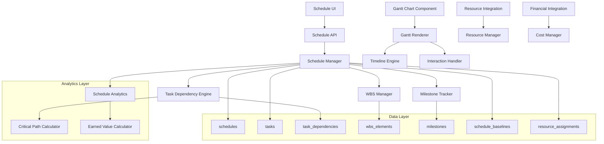

# Design Document: Integrated Master Schedule System

## Overview

The Integrated Master Schedule System provides comprehensive project scheduling capabilities with interactive Gantt chart visualization, Work Breakdown Structure (WBS) management, and real-time schedule tracking. The system integrates with existing PPM components to provide unified project control and performance monitoring.

## Architecture

The system follows a microservices-inspired architecture within the existing FastAPI backend:



## Components and Interfaces

### 1. Schedule Manager

**Purpose**: Core service for managing project schedules, tasks, and hierarchical structures.

**Key Methods**:
```python
class ScheduleManager:
    async def create_schedule(
        self,
        project_id: UUID,
        schedule_data: ScheduleCreate,
        created_by: UUID
    ) -> ScheduleResponse
    
    async def create_task(
        self,
        schedule_id: UUID,
        task_data: TaskCreate,
        created_by: UUID
    ) -> TaskResponse
    
    async def update_task(
        self,
        task_id: UUID,
        updates: TaskUpdate,
        updated_by: UUID
    ) -> TaskResponse
    
    async def get_schedule_with_tasks(
        self,
        schedule_id: UUID,
        include_dependencies: bool = True
    ) -> ScheduleWithTasksResponse
    
    async def update_task_progress(
        self,
        task_id: UUID,
        progress_data: TaskProgressUpdate,
        updated_by: UUID
    ) -> TaskResponse
    
    def calculate_task_rollup_progress(
        self,
        parent_task_id: UUID
    ) -> float
```

### 2. Task Dependency Engine

**Purpose**: Manages task dependencies, critical path calculation, and schedule optimization.

**Key Methods**:
```python
class TaskDependencyEngine:
    async def create_dependency(
        self,
        predecessor_id: UUID,
        successor_id: UUID,
        dependency_type: DependencyType,
        lag_days: int = 0
    ) -> TaskDependencyResponse
    
    async def calculate_critical_path(
        self,
        schedule_id: UUID
    ) -> CriticalPathResult
    
    async def calculate_task_dates(
        self,
        schedule_id: UUID,
        task_id: Optional[UUID] = None
    ) -> ScheduleDateCalculation
    
    async def detect_circular_dependencies(
        self,
        schedule_id: UUID
    ) -> List[CircularDependency]
    
    def calculate_float(
        self,
        task_id: UUID,
        critical_path: List[UUID]
    ) -> FloatCalculation
    
    async def recalculate_schedule(
        self,
        schedule_id: UUID,
        changed_task_id: UUID
    ) -> ScheduleRecalculationResult
```

### 3. WBS Manager

**Purpose**: Manages Work Breakdown Structure hierarchies and work package organization.

**Key Methods**:
```python
class WBSManager:
    async def create_wbs_element(
        self,
        schedule_id: UUID,
        wbs_data: WBSElementCreate,
        created_by: UUID
    ) -> WBSElementResponse
    
    async def get_wbs_hierarchy(
        self,
        schedule_id: UUID,
        max_depth: Optional[int] = None
    ) -> WBSHierarchy
    
    async def move_wbs_element(
        self,
        element_id: UUID,
        new_parent_id: Optional[UUID],
        new_position: int
    ) -> WBSElementResponse
    
    def generate_wbs_code(
        self,
        parent_code: Optional[str],
        position: int
    ) -> str
    
    async def validate_wbs_structure(
        self,
        schedule_id: UUID
    ) -> WBSValidationResult
```

### 4. Gantt Renderer (Frontend)

**Purpose**: Renders interactive Gantt charts with drag-and-drop functionality.

**Key Methods**:
```typescript
class GanttRenderer {
    renderSchedule(
        schedule: ScheduleData,
        options: GanttRenderOptions
    ): void
    
    renderTask(
        task: TaskData,
        timeScale: TimeScale
    ): TaskElement
    
    renderDependencies(
        dependencies: DependencyData[]
    ): void
    
    handleTaskDrag(
        taskId: string,
        newStartDate: Date,
        newEndDate: Date
    ): Promise<void>
    
    updateTimeScale(
        scale: 'day' | 'week' | 'month' | 'quarter'
    ): void
    
    highlightCriticalPath(
        criticalTasks: string[]
    ): void
}
```

## Data Models

### Database Schema Extensions

```sql
-- Schedule management tables
CREATE TYPE dependency_type AS ENUM ('finish_to_start', 'start_to_start', 'finish_to_finish', 'start_to_finish');
CREATE TYPE task_status AS ENUM ('not_started', 'in_progress', 'completed', 'on_hold', 'cancelled');
CREATE TYPE milestone_status AS ENUM ('planned', 'at_risk', 'achieved', 'missed');

-- Main schedules table
CREATE TABLE IF NOT EXISTS schedules (
    id UUID PRIMARY KEY DEFAULT gen_random_uuid(),
    project_id UUID NOT NULL REFERENCES projects(id) ON DELETE CASCADE,
    name VARCHAR(255) NOT NULL,
    description TEXT,
    start_date DATE NOT NULL,
    end_date DATE NOT NULL,
    baseline_start_date DATE,
    baseline_end_date DATE,
    status VARCHAR(50) DEFAULT 'active',
    
    -- Schedule metadata
    created_by UUID NOT NULL REFERENCES auth.users(id),
    created_at TIMESTAMP WITH TIME ZONE DEFAULT NOW(),
    updated_at TIMESTAMP WITH TIME ZONE DEFAULT NOW(),
    
    -- Performance tracking
    schedule_performance_index DECIMAL(5,3),
    schedule_variance_days INTEGER,
    
    CONSTRAINT schedules_date_check CHECK (end_date >= start_date)
);

-- Tasks table with WBS support
CREATE TABLE IF NOT EXISTS tasks (
    id UUID PRIMARY KEY DEFAULT gen_random_uuid(),
    schedule_id UUID NOT NULL REFERENCES schedules(id) ON DELETE CASCADE,
    parent_task_id UUID REFERENCES tasks(id) ON DELETE CASCADE,
    
    -- Task identification
    wbs_code VARCHAR(50) NOT NULL,
    name VARCHAR(255) NOT NULL,
    description TEXT,
    
    -- Scheduling information
    planned_start_date DATE NOT NULL,
    planned_end_date DATE NOT NULL,
    actual_start_date DATE,
    actual_end_date DATE,
    duration_days INTEGER NOT NULL,
    
    -- Baseline information
    baseline_start_date DATE,
    baseline_end_date DATE,
    baseline_duration_days INTEGER,
    
    -- Progress tracking
    progress_percentage INTEGER DEFAULT 0 CHECK (progress_percentage >= 0 AND progress_percentage <= 100),
    status task_status DEFAULT 'not_started',
    
    -- Work information
    planned_effort_hours DECIMAL(10,2),
    actual_effort_hours DECIMAL(10,2),
    remaining_effort_hours DECIMAL(10,2),
    
    -- Critical path analysis
    is_critical BOOLEAN DEFAULT FALSE,
    total_float_days INTEGER DEFAULT 0,
    free_float_days INTEGER DEFAULT 0,
    early_start_date DATE,
    early_finish_date DATE,
    late_start_date DATE,
    late_finish_date DATE,
    
    -- Deliverables and acceptance
    deliverables JSONB DEFAULT '[]',
    acceptance_criteria TEXT,
    
    -- Metadata
    created_by UUID NOT NULL REFERENCES auth.users(id),
    created_at TIMESTAMP WITH TIME ZONE DEFAULT NOW(),
    updated_at TIMESTAMP WITH TIME ZONE DEFAULT NOW(),
    
    CONSTRAINT tasks_date_check CHECK (planned_end_date >= planned_start_date),
    CONSTRAINT tasks_wbs_unique UNIQUE (schedule_id, wbs_code)
);

-- Task dependencies
CREATE TABLE IF NOT EXISTS task_dependencies (
    id UUID PRIMARY KEY DEFAULT gen_random_uuid(),
    predecessor_task_id UUID NOT NULL REFERENCES tasks(id) ON DELETE CASCADE,
    successor_task_id UUID NOT NULL REFERENCES tasks(id) ON DELETE CASCADE,
    dependency_type dependency_type NOT NULL DEFAULT 'finish_to_start',
    lag_days INTEGER DEFAULT 0,
    
    created_by UUID NOT NULL REFERENCES auth.users(id),
    created_at TIMESTAMP WITH TIME ZONE DEFAULT NOW(),
    
    CONSTRAINT no_self_dependency CHECK (predecessor_task_id != successor_task_id),
    CONSTRAINT unique_dependency UNIQUE (predecessor_task_id, successor_task_id)
);

-- WBS elements (for detailed work breakdown structure)
CREATE TABLE IF NOT EXISTS wbs_elements (
    id UUID PRIMARY KEY DEFAULT gen_random_uuid(),
    schedule_id UUID NOT NULL REFERENCES schedules(id) ON DELETE CASCADE,
    parent_element_id UUID REFERENCES wbs_elements(id) ON DELETE CASCADE,
    task_id UUID REFERENCES tasks(id) ON DELETE SET NULL,
    
    -- WBS identification
    wbs_code VARCHAR(50) NOT NULL,
    name VARCHAR(255) NOT NULL,
    description TEXT,
    
    -- Hierarchy information
    level_number INTEGER NOT NULL DEFAULT 1,
    sort_order INTEGER NOT NULL DEFAULT 0,
    
    -- Work package information
    work_package_manager UUID REFERENCES auth.users(id),
    deliverable_description TEXT,
    acceptance_criteria TEXT,
    
    -- Progress rollup
    progress_percentage INTEGER DEFAULT 0 CHECK (progress_percentage >= 0 AND progress_percentage <= 100),
    
    created_by UUID NOT NULL REFERENCES auth.users(id),
    created_at TIMESTAMP WITH TIME ZONE DEFAULT NOW(),
    updated_at TIMESTAMP WITH TIME ZONE DEFAULT NOW(),
    
    CONSTRAINT wbs_elements_code_unique UNIQUE (schedule_id, wbs_code)
);

-- Milestones
CREATE TABLE IF NOT EXISTS milestones (
    id UUID PRIMARY KEY DEFAULT gen_random_uuid(),
    schedule_id UUID NOT NULL REFERENCES schedules(id) ON DELETE CASCADE,
    task_id UUID REFERENCES tasks(id) ON DELETE SET NULL,
    
    -- Milestone information
    name VARCHAR(255) NOT NULL,
    description TEXT,
    target_date DATE NOT NULL,
    actual_date DATE,
    
    -- Status and tracking
    status milestone_status DEFAULT 'planned',
    success_criteria TEXT,
    responsible_party UUID REFERENCES auth.users(id),
    
    -- Deliverables
    deliverables JSONB DEFAULT '[]',
    approval_required BOOLEAN DEFAULT FALSE,
    approved_by UUID REFERENCES auth.users(id),
    approved_at TIMESTAMP WITH TIME ZONE,
    
    created_by UUID NOT NULL REFERENCES auth.users(id),
    created_at TIMESTAMP WITH TIME ZONE DEFAULT NOW(),
    updated_at TIMESTAMP WITH TIME ZONE DEFAULT NOW()
);

-- Schedule baselines for version control
CREATE TABLE IF NOT EXISTS schedule_baselines (
    id UUID PRIMARY KEY DEFAULT gen_random_uuid(),
    schedule_id UUID NOT NULL REFERENCES schedules(id) ON DELETE CASCADE,
    
    -- Baseline information
    baseline_name VARCHAR(255) NOT NULL,
    baseline_date DATE NOT NULL,
    description TEXT,
    
    -- Baseline data (JSON snapshot)
    baseline_data JSONB NOT NULL,
    
    -- Approval workflow
    is_approved BOOLEAN DEFAULT FALSE,
    approved_by UUID REFERENCES auth.users(id),
    approved_at TIMESTAMP WITH TIME ZONE,
    
    created_by UUID NOT NULL REFERENCES auth.users(id),
    created_at TIMESTAMP WITH TIME ZONE DEFAULT NOW()
);

-- Resource assignments to tasks
CREATE TABLE IF NOT EXISTS task_resource_assignments (
    id UUID PRIMARY KEY DEFAULT gen_random_uuid(),
    task_id UUID NOT NULL REFERENCES tasks(id) ON DELETE CASCADE,
    resource_id UUID NOT NULL REFERENCES resources(id) ON DELETE CASCADE,
    
    -- Assignment details
    allocation_percentage INTEGER NOT NULL DEFAULT 100 CHECK (allocation_percentage > 0 AND allocation_percentage <= 100),
    planned_hours DECIMAL(8,2),
    actual_hours DECIMAL(8,2),
    
    -- Assignment period
    assignment_start_date DATE,
    assignment_end_date DATE,
    
    created_by UUID NOT NULL REFERENCES auth.users(id),
    created_at TIMESTAMP WITH TIME ZONE DEFAULT NOW(),
    updated_at TIMESTAMP WITH TIME ZONE DEFAULT NOW(),
    
    CONSTRAINT unique_task_resource UNIQUE (task_id, resource_id)
);

-- Indexes for performance
CREATE INDEX IF NOT EXISTS idx_schedules_project_id ON schedules(project_id);
CREATE INDEX IF NOT EXISTS idx_tasks_schedule_id ON tasks(schedule_id);
CREATE INDEX IF NOT EXISTS idx_tasks_parent_task_id ON tasks(parent_task_id);
CREATE INDEX IF NOT EXISTS idx_tasks_wbs_code ON tasks(schedule_id, wbs_code);
CREATE INDEX IF NOT EXISTS idx_tasks_dates ON tasks(planned_start_date, planned_end_date);
CREATE INDEX IF NOT EXISTS idx_tasks_critical ON tasks(is_critical) WHERE is_critical = TRUE;

CREATE INDEX IF NOT EXISTS idx_task_dependencies_predecessor ON task_dependencies(predecessor_task_id);
CREATE INDEX IF NOT EXISTS idx_task_dependencies_successor ON task_dependencies(successor_task_id);

CREATE INDEX IF NOT EXISTS idx_wbs_elements_schedule_id ON wbs_elements(schedule_id);
CREATE INDEX IF NOT EXISTS idx_wbs_elements_parent ON wbs_elements(parent_element_id);
CREATE INDEX IF NOT EXISTS idx_wbs_elements_level ON wbs_elements(level_number);

CREATE INDEX IF NOT EXISTS idx_milestones_schedule_id ON milestones(schedule_id);
CREATE INDEX IF NOT EXISTS idx_milestones_target_date ON milestones(target_date);
CREATE INDEX IF NOT EXISTS idx_milestones_status ON milestones(status);

CREATE INDEX IF NOT EXISTS idx_task_resource_assignments_task ON task_resource_assignments(task_id);
CREATE INDEX IF NOT EXISTS idx_task_resource_assignments_resource ON task_resource_assignments(resource_id);
```

### Pydantic Models

```python
from enum import Enum
from datetime import date, datetime
from typing import List, Optional, Dict, Any
from uuid import UUID
from pydantic import BaseModel, Field

class DependencyType(str, Enum):
    FINISH_TO_START = "finish_to_start"
    START_TO_START = "start_to_start"
    FINISH_TO_FINISH = "finish_to_finish"
    START_TO_FINISH = "start_to_finish"

class TaskStatus(str, Enum):
    NOT_STARTED = "not_started"
    IN_PROGRESS = "in_progress"
    COMPLETED = "completed"
    ON_HOLD = "on_hold"
    CANCELLED = "cancelled"

class MilestoneStatus(str, Enum):
    PLANNED = "planned"
    AT_RISK = "at_risk"
    ACHIEVED = "achieved"
    MISSED = "missed"

class ScheduleCreate(BaseModel):
    project_id: UUID
    name: str = Field(..., min_length=1, max_length=255)
    description: Optional[str] = None
    start_date: date
    end_date: date

class TaskCreate(BaseModel):
    parent_task_id: Optional[UUID] = None
    wbs_code: str = Field(..., min_length=1, max_length=50)
    name: str = Field(..., min_length=1, max_length=255)
    description: Optional[str] = None
    planned_start_date: date
    planned_end_date: date
    duration_days: int = Field(..., ge=1)
    planned_effort_hours: Optional[float] = Field(None, ge=0)
    deliverables: List[str] = Field(default_factory=list)
    acceptance_criteria: Optional[str] = None

class TaskUpdate(BaseModel):
    name: Optional[str] = Field(None, min_length=1, max_length=255)
    description: Optional[str] = None
    planned_start_date: Optional[date] = None
    planned_end_date: Optional[date] = None
    duration_days: Optional[int] = Field(None, ge=1)
    progress_percentage: Optional[int] = Field(None, ge=0, le=100)
    status: Optional[TaskStatus] = None
    actual_start_date: Optional[date] = None
    actual_end_date: Optional[date] = None
    actual_effort_hours: Optional[float] = Field(None, ge=0)

class TaskProgressUpdate(BaseModel):
    progress_percentage: int = Field(..., ge=0, le=100)
    status: TaskStatus
    actual_start_date: Optional[date] = None
    actual_end_date: Optional[date] = None
    actual_effort_hours: Optional[float] = Field(None, ge=0)
    notes: Optional[str] = None

class TaskDependencyCreate(BaseModel):
    predecessor_task_id: UUID
    successor_task_id: UUID
    dependency_type: DependencyType = DependencyType.FINISH_TO_START
    lag_days: int = Field(default=0)

class WBSElementCreate(BaseModel):
    parent_element_id: Optional[UUID] = None
    wbs_code: str = Field(..., min_length=1, max_length=50)
    name: str = Field(..., min_length=1, max_length=255)
    description: Optional[str] = None
    work_package_manager: Optional[UUID] = None
    deliverable_description: Optional[str] = None
    acceptance_criteria: Optional[str] = None

class MilestoneCreate(BaseModel):
    task_id: Optional[UUID] = None
    name: str = Field(..., min_length=1, max_length=255)
    description: Optional[str] = None
    target_date: date
    success_criteria: Optional[str] = None
    responsible_party: Optional[UUID] = None
    deliverables: List[str] = Field(default_factory=list)
    approval_required: bool = False

class ResourceAssignmentCreate(BaseModel):
    resource_id: UUID
    allocation_percentage: int = Field(..., ge=1, le=100)
    planned_hours: Optional[float] = Field(None, ge=0)
    assignment_start_date: Optional[date] = None
    assignment_end_date: Optional[date] = None

# Response Models
class TaskResponse(BaseModel):
    id: str
    schedule_id: str
    parent_task_id: Optional[str]
    wbs_code: str
    name: str
    description: Optional[str]
    planned_start_date: date
    planned_end_date: date
    actual_start_date: Optional[date]
    actual_end_date: Optional[date]
    duration_days: int
    progress_percentage: int
    status: str
    planned_effort_hours: Optional[float]
    actual_effort_hours: Optional[float]
    remaining_effort_hours: Optional[float]
    is_critical: bool
    total_float_days: int
    free_float_days: int
    deliverables: List[str]
    acceptance_criteria: Optional[str]
    created_at: datetime
    updated_at: datetime

class ScheduleResponse(BaseModel):
    id: str
    project_id: str
    name: str
    description: Optional[str]
    start_date: date
    end_date: date
    baseline_start_date: Optional[date]
    baseline_end_date: Optional[date]
    status: str
    schedule_performance_index: Optional[float]
    schedule_variance_days: Optional[int]
    created_at: datetime
    updated_at: datetime

class ScheduleWithTasksResponse(BaseModel):
    schedule: ScheduleResponse
    tasks: List[TaskResponse]
    dependencies: List[Dict[str, Any]]
    milestones: List[Dict[str, Any]]
    critical_path: List[str]

class CriticalPathResult(BaseModel):
    critical_tasks: List[str]
    project_duration_days: int
    critical_path_length: float
    schedule_risk_factors: List[str]

class FloatCalculation(BaseModel):
    task_id: str
    total_float_days: int
    free_float_days: int
    early_start_date: date
    early_finish_date: date
    late_start_date: date
    late_finish_date: date
```

## Correctness Properties

*A property is a characteristic or behavior that should hold true across all valid executions of a system-essentially, a formal statement about what the system should do. Properties serve as the bridge between human-readable specifications and machine-verifiable correctness guarantees.*

### Property Reflection

After analyzing the acceptance criteria, I identified several properties that can be consolidated:
- Properties related to task creation, WBS creation, and milestone creation can be combined into comprehensive data integrity properties
- Progress calculation properties can be unified into rollup calculation properties  
- Critical path and float calculations can be combined into schedule analysis properties
- Resource assignment and conflict detection can be unified into resource management properties
- Integration properties can be consolidated into system synchronization properties

### Core Schedule Management Properties

**Property 1: Task Data Integrity**
*For any* task creation or update operation, all required fields should be captured correctly and task hierarchies should maintain valid parent-child relationships
**Validates: Requirements 1.1, 1.4, 2.2, 6.1**

**Property 2: Dependency Management Consistency**
*For any* task dependency configuration, all four dependency types should be supported and circular dependencies should be prevented
**Validates: Requirements 1.2, 2.5**

**Property 3: Progress Rollup Accuracy**
*For any* task hierarchy, parent task progress should be calculated correctly based on child task completion and effort weighting
**Validates: Requirements 1.5, 2.3**

**Property 4: WBS Code Uniqueness**
*For any* WBS structure within a project scope, WBS codes should be unique and follow standard numbering conventions
**Validates: Requirements 2.4**

### Schedule Calculation Properties

**Property 5: Critical Path Calculation Correctness**
*For any* task network with dependencies, the critical path should identify the longest sequence of dependent tasks that determines project duration
**Validates: Requirements 4.1, 4.5**

**Property 6: Float Calculation Accuracy**
*For any* non-critical task in a schedule, total float and free float calculations should be mathematically correct based on early/late dates
**Validates: Requirements 4.3, 4.4**

**Property 7: Schedule Recalculation Consistency**
*For any* task date change, dependent task schedules and critical path should be recalculated correctly and automatically
**Validates: Requirements 1.3, 4.5**

### Resource Management Properties

**Property 8: Resource Assignment Integrity**
*For any* resource assignment to tasks, the assignment should be stored correctly with proper effort allocation percentages
**Validates: Requirements 5.1**

**Property 9: Resource Conflict Detection**
*For any* resource allocation scenario, overallocation across concurrent tasks should be detected accurately
**Validates: Requirements 5.2, 5.3**

**Property 10: Resource Utilization Calculation**
*For any* resource assignment configuration, utilization reports should show accurate allocation percentages over time
**Validates: Requirements 5.4, 5.5**

### Milestone and Baseline Properties

**Property 11: Milestone Status Tracking**
*For any* milestone with target dates, status calculations should correctly identify on-time, at-risk, and overdue milestones
**Validates: Requirements 6.4, 6.5**

**Property 12: Baseline Variance Calculation**
*For any* established baseline, schedule variance calculations should be mathematically correct for individual tasks and overall project
**Validates: Requirements 7.1, 7.2, 7.5**

**Property 13: Baseline Version Management**
*For any* baseline versioning operation, multiple baseline versions should be maintained correctly with proper approval workflow
**Validates: Requirements 7.4**

### Integration Properties

**Property 14: Financial Integration Consistency**
*For any* schedule-to-financial system integration, budget and cost data associations should be maintained correctly
**Validates: Requirements 8.1, 8.2**

**Property 15: System Synchronization Accuracy**
*For any* schedule update, integrated systems (resources, dashboards, reporting) should be synchronized correctly
**Validates: Requirements 8.3, 8.5**

**Property 16: Data Export Integrity**
*For any* data export operation, exported schedule data should match expected standard formats and maintain data integrity
**Validates: Requirements 8.4**

### Collaboration Properties

**Property 17: Progress Update Consistency**
*For any* progress update operation, actual dates and percentage completion should be captured correctly with proper validation
**Validates: Requirements 9.1, 10.2**

**Property 18: Real-time Notification Accuracy**
*For any* schedule change, real-time updates should be broadcast correctly to all connected users
**Validates: Requirements 9.2, 9.5**

**Property 19: Audit Trail Completeness**
*For any* schedule modification, audit trail should maintain complete history with user attribution and timestamps
**Validates: Requirements 9.4**

**Property 20: Offline Synchronization Integrity**
*For any* offline operation, data should synchronize correctly when connectivity is restored without data loss
**Validates: Requirements 10.4**

## Error Handling

### Validation Errors
- Invalid date ranges (end date before start date)
- Circular dependency detection and prevention
- Resource overallocation warnings
- WBS code uniqueness violations
- Invalid progress percentages (outside 0-100 range)

### Business Logic Errors
- Critical path calculation failures
- Schedule recalculation errors
- Baseline comparison inconsistencies
- Integration synchronization failures

### System Errors
- Database connection failures
- Real-time notification delivery failures
- File export/import errors
- Concurrent update conflicts

## Testing Strategy

### Unit Tests
- Task CRUD operations with validation
- Dependency creation and circular detection
- Critical path algorithm correctness
- Progress rollup calculations
- WBS hierarchy management
- Resource assignment validation

### Property-Based Tests
- **Minimum 100 iterations per property test**
- Each property test references its design document property
- **Tag format**: Feature: integrated-master-schedule, Property {number}: {property_text}

**Key Property Test Areas**:
1. Schedule calculation algorithms with random task networks
2. Progress rollup with various hierarchy structures  
3. Resource conflict detection with random allocation scenarios
4. Critical path identification across different network topologies
5. Date recalculation with dependency changes
6. Baseline variance calculations with random schedule changes

### Integration Tests
- End-to-end schedule creation and management workflows
- Gantt chart rendering with real schedule data
- Resource system integration
- Financial system integration
- Real-time collaboration features
- Mobile responsiveness and offline functionality

### Performance Tests
- Large schedule rendering (1000+ tasks)
- Critical path calculation performance
- Real-time update broadcasting
- Concurrent user interactions
- Database query optimization for complex schedules