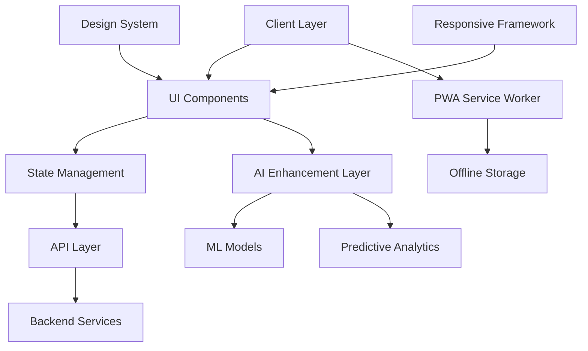

# Design Document: Mobile-First UI Enhancements

## Overview

This design document outlines the technical architecture and implementation approach for transforming the existing PPM-SaaS application into a modern, mobile-first, AI-enhanced user experience. The design leverages Next.js 14, Tailwind CSS, and advanced AI capabilities to create a superior user interface that adapts intelligently to user needs and device capabilities.

## Architecture

### High-Level Architecture



### Component Architecture

The system follows an atomic design methodology with enhanced mobile-first considerations:

**Atoms (Base Components):**
- TouchButton: Enhanced button with 44px minimum touch target
- ResponsiveInput: Adaptive input fields with mobile keyboard optimization
- SmartIcon: Context-aware icons with accessibility labels
- FlexibleTypography: Responsive text scaling system

**Molecules (Composite Components):**
- SearchBarWithAI: Intelligent search with predictive suggestions
- FilterPanel: Collapsible filter system with smart presets
- MetricCard: Responsive data display with touch interactions
- NavigationItem: Adaptive navigation elements

**Organisms (Complex Components):**
- AdaptiveDashboard: AI-powered dashboard with dynamic layouts
- SmartSidebar: Intelligent navigation with usage-based optimization
- ResponsiveDataTable: Touch-optimized tables with swipe actions
- AIAssistantChat: Floating AI helper with contextual guidance

## Components and Interfaces

### 1. Responsive Layout System

#### ResponsiveContainer Component
```typescript
interface ResponsiveContainerProps {
  children: React.ReactNode;
  maxWidth?: 'sm' | 'md' | 'lg' | 'xl' | '2xl' | 'full';
  padding?: 'none' | 'sm' | 'md' | 'lg';
  className?: string;
}

const ResponsiveContainer: React.FC<ResponsiveContainerProps> = ({
  children,
  maxWidth = 'full',
  padding = 'md',
  className = ''
}) => {
  const paddingClasses = {
    none: '',
    sm: 'p-2 sm:p-4',
    md: 'p-4 sm:p-6 lg:p-8',
    lg: 'p-6 sm:p-8 lg:p-12'
  };

  const maxWidthClasses = {
    sm: 'max-w-sm',
    md: 'max-w-md',
    lg: 'max-w-lg',
    xl: 'max-w-xl',
    '2xl': 'max-w-2xl',
    full: 'w-full'
  };

  return (
    <div className={`
      ${maxWidthClasses[maxWidth]} 
      ${paddingClasses[padding]} 
      mx-auto 
      ${className}
    `}>
      {children}
    </div>
  );
};
```

#### AdaptiveGrid Component
```typescript
interface AdaptiveGridProps {
  children: React.ReactNode;
  columns?: {
    mobile: number;
    tablet: number;
    desktop: number;
  };
  gap?: 'sm' | 'md' | 'lg';
  className?: string;
}

const AdaptiveGrid: React.FC<AdaptiveGridProps> = ({
  children,
  columns = { mobile: 1, tablet: 2, desktop: 3 },
  gap = 'md',
  className = ''
}) => {
  const gapClasses = {
    sm: 'gap-2',
    md: 'gap-4',
    lg: 'gap-6'
  };

  return (
    <div className={`
      grid 
      grid-cols-${columns.mobile} 
      md:grid-cols-${columns.tablet} 
      lg:grid-cols-${columns.desktop}
      ${gapClasses[gap]}
      ${className}
    `}>
      {children}
    </div>
  );
};
```

### 2. Smart Navigation System

#### SmartSidebar Component
```typescript
interface NavigationItem {
  id: string;
  label: string;
  icon: React.ComponentType;
  href: string;
  badge?: number;
  aiSuggested?: boolean;
  usageFrequency?: number;
}

interface SmartSidebarProps {
  isOpen: boolean;
  onToggle: () => void;
  isMobile: boolean;
  userId: string;
}

const SmartSidebar: React.FC<SmartSidebarProps> = ({
  isOpen,
  onToggle,
  isMobile,
  userId
}) => {
  const [navigationItems, setNavigationItems] = useState<NavigationItem[]>([]);
  const [aiSuggestions, setAiSuggestions] = useState<string[]>([]);

  // AI-powered navigation optimization
  useEffect(() => {
    const optimizeNavigation = async () => {
      const userBehavior = await getUserNavigationPatterns(userId);
      const optimizedItems = await getAIOptimizedNavigation(userBehavior);
      setNavigationItems(optimizedItems);
    };

    optimizeNavigation();
  }, [userId]);

  return (
    <>
      {/* Mobile Overlay */}
      {isMobile && isOpen && (
        <div 
          className="fixed inset-0 bg-black bg-opacity-50 z-40 lg:hidden"
          onClick={onToggle}
        />
      )}
      
      {/* Sidebar */}
      <nav className={`
        ${isMobile ? 'fixed' : 'relative'}
        ${isMobile && !isOpen ? '-translate-x-full' : 'translate-x-0'}
        left-0 top-0 h-full w-64 bg-gray-900 text-white 
        flex flex-col z-50 transition-transform duration-300 ease-in-out
        ${!isMobile ? 'lg:translate-x-0' : ''}
      `}>
        {/* Header */}
        <div className="flex items-center justify-between p-4 border-b border-gray-700">
          <h2 className="text-xl font-bold">PPM Dashboard</h2>
          {isMobile && (
            <button
              onClick={onToggle}
              className="p-2 rounded-md hover:bg-gray-700 transition-colors"
            >
              <X className="h-5 w-5" />
            </button>
          )}
        </div>

        {/* AI Suggestions */}
        {aiSuggestions.length > 0 && (
          <div className="p-4 bg-blue-900 bg-opacity-50">
            <h3 className="text-sm font-medium text-blue-200 mb-2">
              AI Suggestions
            </h3>
            <div className="space-y-1">
              {aiSuggestions.map((suggestion, index) => (
                <div key={index} className="text-xs text-blue-100">
                  {suggestion}
                </div>
              ))}
            </div>
          </div>
        )}

        {/* Navigation Items */}
        <ul className="space-y-1 flex-1 p-4">
          {navigationItems.map((item) => (
            <li key={item.id}>
              <Link
                href={item.href}
                className={`
                  flex items-center py-3 px-4 rounded-lg transition-colors
                  hover:bg-gray-700 group relative
                  ${item.aiSuggested ? 'bg-blue-900 bg-opacity-30' : ''}
                `}
                onClick={() => isMobile && onToggle()}
              >
                <item.icon className="h-5 w-5 mr-3 flex-shrink-0" />
                <span className="truncate">{item.label}</span>
                
                {item.badge && (
                  <span className="ml-auto bg-red-500 text-white text-xs rounded-full px-2 py-1">
                    {item.badge}
                  </span>
                )}
                
                {item.aiSuggested && (
                  <div className="absolute -top-1 -right-1 w-3 h-3 bg-blue-400 rounded-full animate-pulse" />
                )}
              </Link>
            </li>
          ))}
        </ul>

        {/* Footer */}
        <div className="p-4 border-t border-gray-700">
          <button 
            onClick={handleLogout}
            className="flex items-center w-full py-2 px-4 rounded-lg hover:bg-gray-700 text-gray-300 hover:text-white transition-colors"
          >
            <LogOut className="mr-2 h-4 w-4" />
            Logout
          </button>
        </div>
      </nav>
    </>
  );
};
```

### 3. AI-Enhanced Dashboard

#### AdaptiveDashboard Component
```typescript
interface DashboardWidget {
  id: string;
  type: 'metric' | 'chart' | 'table' | 'ai-insight';
  title: string;
  data: any;
  size: 'small' | 'medium' | 'large';
  priority: number;
  aiRecommended?: boolean;
}

interface AdaptiveDashboardProps {
  userId: string;
  userRole: string;
}

const AdaptiveDashboard: React.FC<AdaptiveDashboardProps> = ({
  userId,
  userRole
}) => {
  const [widgets, setWidgets] = useState<DashboardWidget[]>([]);
  const [layout, setLayout] = useState<'grid' | 'masonry' | 'list'>('grid');
  const [isLoading, setIsLoading] = useState(true);

  // AI-powered widget optimization
  useEffect(() => {
    const optimizeDashboard = async () => {
      setIsLoading(true);
      
      // Get user behavior patterns
      const userBehavior = await getUserDashboardInteractions(userId);
      
      // Get AI recommendations
      const aiRecommendations = await getAIDashboardRecommendations({
        userId,
        userRole,
        behavior: userBehavior
      });
      
      // Optimize widget arrangement
      const optimizedWidgets = await optimizeWidgetLayout(aiRecommendations);
      
      setWidgets(optimizedWidgets);
      setIsLoading(false);
    };

    optimizeDashboard();
  }, [userId, userRole]);

  const renderWidget = (widget: DashboardWidget) => {
    const sizeClasses = {
      small: 'col-span-1 row-span-1',
      medium: 'col-span-1 md:col-span-2 row-span-1',
      large: 'col-span-1 md:col-span-2 lg:col-span-3 row-span-2'
    };

    return (
      <div
        key={widget.id}
        className={`
          ${sizeClasses[widget.size]}
          bg-white rounded-lg shadow-sm border border-gray-200 p-6
          hover:shadow-md transition-shadow duration-200
          ${widget.aiRecommended ? 'ring-2 ring-blue-200' : ''}
        `}
      >
        <div className="flex items-center justify-between mb-4">
          <h3 className="text-lg font-semibold text-gray-900">
            {widget.title}
          </h3>
          {widget.aiRecommended && (
            <div className="flex items-center text-blue-600 text-sm">
              <Zap className="h-4 w-4 mr-1" />
              AI Recommended
            </div>
          )}
        </div>
        
        <WidgetContent widget={widget} />
      </div>
    );
  };

  if (isLoading) {
    return (
      <div className="grid grid-cols-1 md:grid-cols-2 lg:grid-cols-3 gap-6">
        {[...Array(6)].map((_, i) => (
          <div key={i} className="bg-white rounded-lg shadow-sm border border-gray-200 p-6">
            <div className="animate-pulse">
              <div className="h-4 bg-gray-200 rounded w-3/4 mb-4"></div>
              <div className="h-32 bg-gray-200 rounded"></div>
            </div>
          </div>
        ))}
      </div>
    );
  }

  return (
    <div className="space-y-6">
      {/* Dashboard Controls */}
      <div className="flex flex-col sm:flex-row sm:items-center sm:justify-between gap-4">
        <h1 className="text-2xl font-bold text-gray-900">Dashboard</h1>
        
        <div className="flex items-center space-x-4">
          <select
            value={layout}
            onChange={(e) => setLayout(e.target.value as any)}
            className="px-3 py-2 border border-gray-300 rounded-md focus:ring-2 focus:ring-blue-500"
          >
            <option value="grid">Grid Layout</option>
            <option value="masonry">Masonry Layout</option>
            <option value="list">List Layout</option>
          </select>
          
          <button className="flex items-center px-3 py-2 bg-blue-600 text-white rounded-md hover:bg-blue-700">
            <Settings className="h-4 w-4 mr-2" />
            Customize
          </button>
        </div>
      </div>

      {/* Widgets Grid */}
      <div className={`
        ${layout === 'grid' ? 'grid grid-cols-1 md:grid-cols-2 lg:grid-cols-3 gap-6' : ''}
        ${layout === 'masonry' ? 'columns-1 md:columns-2 lg:columns-3 gap-6' : ''}
        ${layout === 'list' ? 'space-y-6' : ''}
      `}>
        {widgets.map(renderWidget)}
      </div>
    </div>
  );
};
```

### 4. Touch-Optimized Components

#### TouchButton Component
```typescript
interface TouchButtonProps {
  children: React.ReactNode;
  variant?: 'primary' | 'secondary' | 'ghost';
  size?: 'sm' | 'md' | 'lg';
  disabled?: boolean;
  loading?: boolean;
  onClick?: () => void;
  className?: string;
}

const TouchButton: React.FC<TouchButtonProps> = ({
  children,
  variant = 'primary',
  size = 'md',
  disabled = false,
  loading = false,
  onClick,
  className = ''
}) => {
  const baseClasses = `
    inline-flex items-center justify-center font-medium rounded-lg
    transition-all duration-200 ease-in-out
    focus:outline-none focus:ring-2 focus:ring-offset-2
    disabled:opacity-50 disabled:cursor-not-allowed
    active:scale-95 transform
  `;

  const variantClasses = {
    primary: 'bg-blue-600 text-white hover:bg-blue-700 focus:ring-blue-500',
    secondary: 'bg-gray-200 text-gray-900 hover:bg-gray-300 focus:ring-gray-500',
    ghost: 'text-gray-700 hover:bg-gray-100 focus:ring-gray-500'
  };

  const sizeClasses = {
    sm: 'px-3 py-2 text-sm min-h-[36px]', // Minimum 36px for accessibility
    md: 'px-4 py-3 text-base min-h-[44px]', // Standard 44px touch target
    lg: 'px-6 py-4 text-lg min-h-[52px]'   // Larger for primary actions
  };

  return (
    <button
      className={`
        ${baseClasses}
        ${variantClasses[variant]}
        ${sizeClasses[size]}
        ${className}
      `}
      disabled={disabled || loading}
      onClick={onClick}
    >
      {loading && (
        <div className="animate-spin rounded-full h-4 w-4 border-b-2 border-current mr-2" />
      )}
      {children}
    </button>
  );
};
```

#### SwipeableCard Component
```typescript
interface SwipeableCardProps {
  children: React.ReactNode;
  onSwipeLeft?: () => void;
  onSwipeRight?: () => void;
  leftAction?: {
    icon: React.ComponentType;
    label: string;
    color: string;
  };
  rightAction?: {
    icon: React.ComponentType;
    label: string;
    color: string;
  };
}

const SwipeableCard: React.FC<SwipeableCardProps> = ({
  children,
  onSwipeLeft,
  onSwipeRight,
  leftAction,
  rightAction
}) => {
  const [swipeOffset, setSwipeOffset] = useState(0);
  const [isDragging, setIsDragging] = useState(false);
  const cardRef = useRef<HTMLDivElement>(null);

  const handleTouchStart = (e: React.TouchEvent) => {
    setIsDragging(true);
    // Store initial touch position
  };

  const handleTouchMove = (e: React.TouchEvent) => {
    if (!isDragging) return;
    
    const touch = e.touches[0];
    const rect = cardRef.current?.getBoundingClientRect();
    if (!rect) return;

    const offset = touch.clientX - rect.left - rect.width / 2;
    setSwipeOffset(Math.max(-100, Math.min(100, offset)));
  };

  const handleTouchEnd = () => {
    setIsDragging(false);
    
    if (Math.abs(swipeOffset) > 50) {
      if (swipeOffset > 0 && onSwipeRight) {
        onSwipeRight();
      } else if (swipeOffset < 0 && onSwipeLeft) {
        onSwipeLeft();
      }
    }
    
    setSwipeOffset(0);
  };

  return (
    <div className="relative overflow-hidden rounded-lg">
      {/* Action Backgrounds */}
      {leftAction && (
        <div className={`
          absolute inset-y-0 left-0 flex items-center justify-start pl-4
          ${leftAction.color} text-white
          transform transition-transform duration-200
          ${swipeOffset < -20 ? 'translate-x-0' : '-translate-x-full'}
        `}>
          <leftAction.icon className="h-6 w-6 mr-2" />
          <span className="font-medium">{leftAction.label}</span>
        </div>
      )}
      
      {rightAction && (
        <div className={`
          absolute inset-y-0 right-0 flex items-center justify-end pr-4
          ${rightAction.color} text-white
          transform transition-transform duration-200
          ${swipeOffset > 20 ? 'translate-x-0' : 'translate-x-full'}
        `}>
          <span className="font-medium">{rightAction.label}</span>
          <rightAction.icon className="h-6 w-6 ml-2" />
        </div>
      )}

      {/* Card Content */}
      <div
        ref={cardRef}
        className={`
          bg-white transform transition-transform duration-200
          ${isDragging ? '' : 'transition-transform'}
        `}
        style={{
          transform: `translateX(${swipeOffset}px)`
        }}
        onTouchStart={handleTouchStart}
        onTouchMove={handleTouchMove}
        onTouchEnd={handleTouchEnd}
      >
        {children}
      </div>
    </div>
  );
};
```

## Data Models

### User Preferences Model
```typescript
interface UserPreferences {
  userId: string;
  theme: 'light' | 'dark' | 'auto';
  language: string;
  timezone: string;
  dashboardLayout: {
    widgets: DashboardWidget[];
    layout: 'grid' | 'masonry' | 'list';
  };
  navigationPreferences: {
    collapsedSections: string[];
    pinnedItems: string[];
    recentItems: string[];
  };
  accessibilitySettings: {
    highContrast: boolean;
    reducedMotion: boolean;
    fontSize: 'small' | 'medium' | 'large';
    screenReader: boolean;
  };
  aiSettings: {
    enableSuggestions: boolean;
    enablePredictiveText: boolean;
    enableAutoOptimization: boolean;
  };
  devicePreferences: {
    [deviceId: string]: {
      lastUsed: Date;
      preferredLayout: string;
      customizations: Record<string, any>;
    };
  };
}
```

### AI Analytics Model
```typescript
interface AIAnalytics {
  userId: string;
  sessionId: string;
  interactions: {
    timestamp: Date;
    action: string;
    component: string;
    context: Record<string, any>;
    duration: number;
  }[];
  patterns: {
    mostUsedFeatures: string[];
    timeOfDayUsage: Record<string, number>;
    deviceUsagePatterns: Record<string, number>;
    workflowPatterns: string[][];
  };
  predictions: {
    nextLikelyAction: string;
    suggestedFeatures: string[];
    optimizationOpportunities: string[];
  };
}
```

### Responsive Breakpoint Model
```typescript
interface ResponsiveBreakpoints {
  mobile: {
    min: 0;
    max: 767;
    columns: 1;
    spacing: 'sm';
  };
  tablet: {
    min: 768;
    max: 1023;
    columns: 2;
    spacing: 'md';
  };
  desktop: {
    min: 1024;
    max: 1279;
    columns: 3;
    spacing: 'lg';
  };
  wide: {
    min: 1280;
    max: Infinity;
    columns: 4;
    spacing: 'xl';
  };
}
```

Now I need to use the prework tool to analyze the acceptance criteria before writing the correctness properties:

<function_calls>
<invoke name="prework">
<parameter name="featureName">mobile-first-ui-enhancements

## Correctness Properties

*A property is a characteristic or behavior that should hold true across all valid executions of a system-essentially, a formal statement about what the system should do. Properties serve as the bridge between human-readable specifications and machine-verifiable correctness guarantees.*

### Property 1: Touch Target Accessibility
*For any* interactive UI element, the touch target size should be at least 44px in both width and height to ensure accessibility compliance
**Validates: Requirements 1.1**

### Property 2: Responsive Layout Integrity
*For any* screen size change, the layout should adapt without breaking visual hierarchy or causing horizontal overflow
**Validates: Requirements 1.3, 3.4**

### Property 3: Navigation Transition Smoothness
*For any* navigation transition on mobile devices, the animation duration should be between 200-300ms with appropriate easing
**Validates: Requirements 1.2**

### Property 4: Form Input Optimization
*For any* form field on mobile devices, the appropriate keyboard type should be triggered based on the input type (numeric, email, etc.)
**Validates: Requirements 1.4**

### Property 5: Orientation Change Adaptation
*For any* device orientation change, the application should maintain user context and data without loss
**Validates: Requirements 1.5**

### Property 6: AI Navigation Suggestions
*For any* user with established usage patterns, the navigation system should provide relevant suggestions based on frequency and context
**Validates: Requirements 2.1, 2.5**

### Property 7: Smart Search Functionality
*For any* search query, the system should provide predictive suggestions with fuzzy matching capabilities
**Validates: Requirements 2.2**

### Property 8: Workflow Intelligence
*For any* completed workflow, the system should offer intelligent shortcuts for similar future tasks
**Validates: Requirements 2.3**

### Property 9: Dashboard Widget Optimization
*For any* user dashboard, widgets should be arranged based on user role, recent activity, and interaction patterns
**Validates: Requirements 3.1**

### Property 10: Anomaly Detection Visualization
*For any* detected data anomaly, the system should provide clear visual indicators and contextual information
**Validates: Requirements 3.2**

### Property 11: Preference Persistence
*For any* user interaction with dashboard elements, preferences should be stored and applied consistently across sessions
**Validates: Requirements 3.3**

### Property 12: Touch Gesture Recognition
*For any* supported touch gesture (swipe, pinch, long-press), the system should respond appropriately with visual feedback
**Validates: Requirements 4.1, 4.2, 4.3, 4.4, 4.5**

### Property 13: PWA Installation Capability
*For any* mobile browser visit, the system should offer PWA installation when criteria are met
**Validates: Requirements 5.1**

### Property 14: Offline Functionality
*For any* cached content or queued form submission, the system should function correctly when offline and sync when online
**Validates: Requirements 5.2, 5.4**

### Property 15: Push Notification Delivery
*For any* critical project update, subscribed users should receive timely push notifications
**Validates: Requirements 5.3**

### Property 16: AI Resource Optimization
*For any* resource utilization analysis, the AI system should identify optimization opportunities with measurable confidence scores
**Validates: Requirements 6.1, 6.2, 6.3**

### Property 17: Predictive Capacity Planning
*For any* resource performance pattern, the system should generate accurate future capacity predictions
**Validates: Requirements 6.4**

### Property 18: Learning from Optimization Outcomes
*For any* applied optimization suggestion, the system should track results and improve future recommendations
**Validates: Requirements 6.5**

### Property 19: AI Risk Pattern Recognition
*For any* project data analysis, the AI system should identify risk patterns with improving accuracy over time
**Validates: Requirements 7.1, 7.2**

### Property 20: Historical Risk Mitigation
*For any* identified risk similar to past occurrences, the system should suggest proven mitigation strategies
**Validates: Requirements 7.3**

### Property 21: Predictive Risk Alerting
*For any* predicted risk escalation, appropriate stakeholders should receive alerts with recommended actions
**Validates: Requirements 7.4**

### Property 22: Keyboard Navigation Accessibility
*For any* keyboard-only navigation, the system should provide clear focus indicators and logical tab order
**Validates: Requirements 8.1**

### Property 23: Screen Reader Compatibility
*For any* interactive element, meaningful labels and descriptions should be available to screen readers
**Validates: Requirements 8.2**

### Property 24: High Contrast Accessibility
*For any* user requiring high contrast, the system should provide color schemes meeting WCAG AA standards
**Validates: Requirements 8.3**

### Property 25: Motor Accessibility Support
*For any* user with motor impairments, the system should provide larger touch targets and extended timeout options
**Validates: Requirements 8.4**

### Property 26: Dynamic Content Accessibility
*For any* dynamic content change, screen readers should be appropriately notified through ARIA live regions
**Validates: Requirements 8.5**

### Property 27: Core Web Vitals Performance
*For any* page load or interaction, the system should maintain LCP < 2.5s, FID < 100ms, and CLS < 0.1
**Validates: Requirements 9.1, 9.2, 9.3**

### Property 28: Progressive Loading Experience
*For any* slow network condition, the system should provide progressive loading with meaningful feedback
**Validates: Requirements 9.4**

### Property 29: UI Responsiveness During Processing
*For any* heavy operation, the user interface should remain responsive through proper async handling
**Validates: Requirements 9.5**

### Property 30: Contextual Help Provision
*For any* unfamiliar feature encounter, the system should offer contextual help and guidance
**Validates: Requirements 10.2**

### Property 31: Proactive AI Assistance
*For any* user struggling with tasks, the AI assistant should proactively offer relevant guidance
**Validates: Requirements 10.3**

### Property 32: Onboarding Progress Tracking
*For any* onboarding step completion, the system should track progress and adapt the experience accordingly
**Validates: Requirements 10.4**

### Property 33: Intelligent Help Search
*For any* help request, the system should provide intelligent search through documentation with relevant results
**Validates: Requirements 10.5**

### Property 34: Cross-Device Synchronization
*For any* user switching between devices, interface preferences and customizations should sync consistently
**Validates: Requirements 11.1**

### Property 35: Task Continuity Across Devices
*For any* task started on one device, users should be able to continue seamlessly on another device
**Validates: Requirements 11.2**

### Property 36: Offline Synchronization
*For any* offline changes made on a device, data should sync correctly when connectivity is restored
**Validates: Requirements 11.3**

### Property 37: Conflict Resolution Intelligence
*For any* conflict between device states, the system should provide intelligent merge resolution
**Validates: Requirements 11.4**

### Property 38: Workspace Configuration Restoration
*For any* user login on a new device, personalized workspace configurations should be restored accurately
**Validates: Requirements 11.5**

### Property 39: Mobile Chart Interactions
*For any* chart displayed on mobile devices, touch-optimized interactions for zooming and panning should work smoothly
**Validates: Requirements 12.1**

### Property 40: Real-time Chart Performance
*For any* real-time data update, chart transitions should animate smoothly without performance degradation
**Validates: Requirements 12.2**

### Property 41: Chart Interactivity
*For any* chart element interaction, detailed tooltips and drill-down capabilities should be available
**Validates: Requirements 12.3**

### Property 42: Chart Responsive Adaptation
*For any* screen orientation change, charts should adapt their layout while maintaining readability
**Validates: Requirements 12.4**

### Property 43: Chart Export Quality
*For any* chart export operation, high-quality images should be generated optimized for the target format
**Validates: Requirements 12.5**

## Error Handling

### Client-Side Error Handling

**Network Connectivity Issues:**
- Implement exponential backoff for failed API requests
- Provide clear offline indicators and cached content access
- Queue user actions for retry when connectivity is restored

**Touch Interaction Errors:**
- Implement debouncing for rapid touch events
- Provide visual feedback for invalid gestures
- Graceful fallback for unsupported touch features

**Responsive Layout Failures:**
- Implement CSS Grid and Flexbox fallbacks
- Provide minimum viable layouts for extreme screen sizes
- Graceful degradation for unsupported CSS features

### AI System Error Handling

**ML Model Failures:**
- Implement fallback to rule-based systems
- Provide confidence scores for all AI recommendations
- Allow manual override of AI suggestions

**Data Processing Errors:**
- Implement data validation and sanitization
- Provide meaningful error messages for invalid inputs
- Graceful degradation when AI features are unavailable

### Performance Error Handling

**Memory Management:**
- Implement virtual scrolling for large datasets
- Lazy load non-critical components
- Provide memory usage monitoring and cleanup

**Rendering Performance:**
- Implement frame rate monitoring
- Provide reduced motion options for slower devices
- Graceful degradation of animations and transitions

## Testing Strategy

### Dual Testing Approach

The testing strategy combines comprehensive unit testing with property-based testing to ensure both specific functionality and universal correctness properties.

**Unit Tests:**
- Focus on specific examples and edge cases
- Test component rendering and user interactions
- Validate API integrations and data transformations
- Test accessibility features and keyboard navigation

**Property-Based Tests:**
- Verify universal properties across all inputs using fast-check
- Test responsive behavior across all screen sizes
- Validate touch interactions across different devices
- Ensure AI recommendations meet quality thresholds

### Property-Based Testing Configuration

**Testing Framework:** Jest with fast-check for property-based testing
**Minimum Iterations:** 100 per property test
**Test Tagging Format:** **Feature: mobile-first-ui-enhancements, Property {number}: {property_text}**

### Testing Categories

**Responsive Design Testing:**
- Property tests for layout integrity across viewport sizes
- Touch target size validation across all interactive elements
- Typography scaling and readability across devices

**AI Feature Testing:**
- Property tests for recommendation quality and relevance
- Performance testing for AI processing times
- Accuracy testing for predictive features

**Accessibility Testing:**
- Automated testing with axe-core for WCAG compliance
- Keyboard navigation testing across all components
- Screen reader compatibility testing

**Performance Testing:**
- Core Web Vitals monitoring with Lighthouse CI
- Memory usage testing for large datasets
- Network performance testing under various conditions

### Cross-Device Testing

**Device Matrix:**
- iOS Safari (iPhone, iPad)
- Android Chrome (various screen sizes)
- Desktop browsers (Chrome, Firefox, Safari, Edge)
- Progressive Web App testing across platforms

**Testing Scenarios:**
- Touch interactions and gesture recognition
- Offline functionality and data synchronization
- Cross-device preference synchronization
- Performance across different hardware capabilities