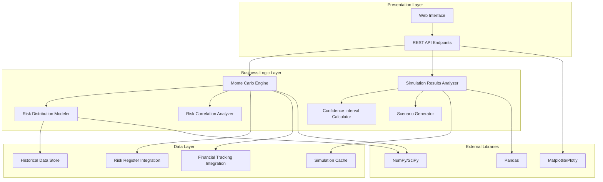

# Design Document: Monte Carlo Risk Simulations

## Overview

The Monte Carlo Risk Simulation system provides probabilistic analysis of project cost and schedule risks through statistical modeling and simulation. The system integrates with existing risk registers and financial tracking data to perform comprehensive risk analysis using Monte Carlo methods, enabling project managers to understand risk exposure through distribution analysis, scenario modeling, and confidence interval calculations.

The system is designed as a modular architecture with clear separation between simulation engine, data modeling, results analysis, and presentation layers. This approach ensures maintainability, testability, and extensibility while providing high-performance statistical computations.

## Architecture

The system follows a layered architecture with the following key components:



**Design Rationale**: The layered architecture separates concerns and enables independent testing and development of each component. The Monte Carlo Engine serves as the central orchestrator, coordinating between data modeling, correlation analysis, and results processing.

## Components and Interfaces

### Monte Carlo Engine

**Purpose**: Central simulation orchestrator that performs statistical simulations using random sampling.

**Key Responsibilities**:
- Execute Monte Carlo simulations with configurable iteration counts (minimum 10,000)
- Coordinate between risk modeling, correlation analysis, and results processing
- Manage simulation performance and ensure completion within 30 seconds for up to 100 risks
- Support real-time re-execution with updated parameters

**Interface**:
```python
class MonteCarloEngine:
    def run_simulation(self, risks: List[Risk], iterations: int = 10000, 
                      correlations: Optional[CorrelationMatrix] = None) -> SimulationResults
    def validate_simulation_parameters(self, risks: List[Risk]) -> ValidationResult
    def get_simulation_progress(self, simulation_id: str) -> ProgressStatus
```

**Design Rationale**: The engine abstracts the complexity of Monte Carlo simulation while providing a clean interface for configuration and execution. Performance requirements drive the use of NumPy for vectorized operations.

### Risk Distribution Modeler

**Purpose**: Models individual risks as probability distributions and handles distribution fitting.

**Key Responsibilities**:
- Support multiple probability distributions (normal, triangular, uniform, beta, lognormal)
- Handle three-point estimation for triangular distributions
- Perform maximum likelihood estimation for distribution fitting
- Validate distribution parameters for mathematical validity

**Interface**:
```python
class RiskDistributionModeler:
    def create_distribution(self, risk_data: RiskData, 
                          distribution_type: DistributionType) -> ProbabilityDistribution
    def fit_distribution_from_historical(self, historical_data: List[float]) -> ProbabilityDistribution
    def validate_distribution_parameters(self, distribution: ProbabilityDistribution) -> bool
    def model_cross_impacts(self, cost_risk: Risk, schedule_risk: Risk, 
                          correlation: float) -> CrossImpactModel
```

**Design Rationale**: Separate distribution modeling enables flexible risk representation and supports both expert judgment (three-point estimation) and data-driven approaches (historical fitting).

### Risk Correlation Analyzer

**Purpose**: Models dependencies and correlations between different risks.

**Key Responsibilities**:
- Support correlation coefficients between -1 and +1
- Validate correlation matrices for positive definiteness
- Generate correlated random samples for simulation
- Handle cross-impact relationships between cost and schedule risks

**Interface**:
```python
class RiskCorrelationAnalyzer:
    def create_correlation_matrix(self, correlations: Dict[Tuple[str, str], float]) -> CorrelationMatrix
    def validate_correlation_matrix(self, matrix: CorrelationMatrix) -> ValidationResult
    def generate_correlated_samples(self, distributions: List[ProbabilityDistribution], 
                                  correlations: CorrelationMatrix, 
                                  sample_count: int) -> np.ndarray
```

**Design Rationale**: Dedicated correlation handling ensures mathematical consistency and prevents common errors in multivariate sampling.

### Simulation Results Analyzer

**Purpose**: Processes simulation outputs and generates statistical insights.

**Key Responsibilities**:
- Calculate key percentiles (P10, P25, P50, P75, P90, P95, P99)
- Generate confidence intervals (80%, 90%, 95%)
- Identify top risk contributors to overall uncertainty
- Perform statistical significance tests for scenario comparisons

**Interface**:
```python
class SimulationResultsAnalyzer:
    def calculate_percentiles(self, results: SimulationResults) -> PercentileAnalysis
    def generate_confidence_intervals(self, results: SimulationResults, 
                                    confidence_levels: List[float]) -> ConfidenceIntervals
    def identify_top_risk_contributors(self, results: SimulationResults, 
                                     top_n: int = 10) -> List[RiskContribution]
    def compare_scenarios(self, scenario_a: SimulationResults, 
                         scenario_b: SimulationResults) -> ScenarioComparison
```

### Scenario Generator

**Purpose**: Creates and manages different risk scenarios for comparative analysis.

**Key Responsibilities**:
- Allow modification of individual risk parameters
- Support side-by-side scenario analysis
- Model cost and effectiveness of risk mitigation strategies
- Calculate expected value of risk mitigation investments

**Interface**:
```python
class ScenarioGenerator:
    def create_scenario(self, base_risks: List[Risk], 
                       modifications: Dict[str, RiskModification]) -> Scenario
    def compare_scenarios(self, scenarios: List[Scenario]) -> ScenarioComparison
    def evaluate_mitigation_strategy(self, base_scenario: Scenario, 
                                   mitigation: MitigationStrategy) -> MitigationAnalysis
```

### Confidence Interval Calculator

**Purpose**: Specialized component for statistical confidence level calculations.

**Key Responsibilities**:
- Calculate confidence intervals for cost and schedule outcomes
- Generate percentile-based risk exposure metrics
- Support multiple confidence levels simultaneously

**Interface**:
```python
class ConfidenceIntervalCalculator:
    def calculate_intervals(self, data: np.ndarray, 
                          confidence_levels: List[float]) -> Dict[float, Tuple[float, float]]
    def calculate_percentile_ranges(self, data: np.ndarray, 
                                  percentiles: List[float]) -> Dict[float, float]
```

## Data Models

### Core Risk Model
```python
@dataclass
class Risk:
    id: str
    name: str
    category: RiskCategory
    impact_type: ImpactType  # COST, SCHEDULE, BOTH
    probability_distribution: ProbabilityDistribution
    baseline_impact: float
    correlation_dependencies: List[str]
    mitigation_strategies: List[MitigationStrategy]
```

### Probability Distribution Model
```python
@dataclass
class ProbabilityDistribution:
    distribution_type: DistributionType
    parameters: Dict[str, float]
    bounds: Optional[Tuple[float, float]]
    
    def sample(self, size: int) -> np.ndarray
    def pdf(self, x: np.ndarray) -> np.ndarray
    def cdf(self, x: np.ndarray) -> np.ndarray
```

### Simulation Results Model
```python
@dataclass
class SimulationResults:
    simulation_id: str
    timestamp: datetime
    iteration_count: int
    cost_outcomes: np.ndarray
    schedule_outcomes: np.ndarray
    risk_contributions: Dict[str, np.ndarray]
    convergence_metrics: ConvergenceMetrics
    execution_time: float
```

### Scenario Model
```python
@dataclass
class Scenario:
    id: str
    name: str
    description: str
    risks: List[Risk]
    modifications: Dict[str, RiskModification]
    simulation_results: Optional[SimulationResults]
```

**Design Rationale**: The data models use dataclasses for immutability and type safety. NumPy arrays are used for simulation data to enable efficient statistical operations.

## Correctness Properties

*A property is a characteristic or behavior that should hold true across all valid executions of a system—essentially, a formal statement about what the system should do. Properties serve as the bridge between human-readable specifications and machine-verifiable correctness guarantees.*

<function_calls>
<invoke name="prework">
<parameter name="featureName">monte-carlo-risk-simulations

Based on the prework analysis, I'll now perform a property reflection to eliminate redundancy before writing the correctness properties:

**Property Reflection:**
- Properties 1.1 and 1.3 can be combined into a comprehensive simulation execution property
- Properties 2.1, 2.3, and 2.4 can be consolidated into a distribution modeling property
- Properties 3.1, 3.2, and 3.4 can be combined into a statistical analysis property
- Properties 4.1, 4.2, and 4.3 can be consolidated into a cost simulation property
- Properties 5.1, 5.2, and 5.3 can be combined into a schedule simulation property
- Properties 7.1, 7.3, and 7.4 can be consolidated into a risk register integration property
- Properties 8.1, 8.2, 8.3, 8.4, and 8.5 can be combined into a visualization generation property

### Property 1: Simulation Execution Integrity
*For any* Monte Carlo simulation run, the engine should execute at least 10,000 iterations and successfully process all supported probability distribution types (normal, triangular, uniform, beta, lognormal).
**Validates: Requirements 1.1, 1.3**

### Property 2: Parameter Change Responsiveness
*For any* simulation with modified parameters, re-execution should produce different results when parameters meaningfully change the risk profile.
**Validates: Requirements 1.5**

### Property 3: Distribution Modeling Correctness
*For any* risk with three-point estimates, the Risk Distribution Modeler should create valid triangular distributions with proper parameter bounds and correlation coefficients within [-1, +1].
**Validates: Requirements 2.1, 2.3, 2.4**

### Property 4: Historical Data Fitting
*For any* historical dataset, the Risk Distribution Modeler should fit probability distributions that demonstrate good statistical fit to the source data.
**Validates: Requirements 2.2**

### Property 5: Cross-Impact Modeling
*For any* risks affecting both cost and schedule, the modeler should maintain proper correlation structures in cross-impact relationships.
**Validates: Requirements 2.5**

### Property 6: Statistical Analysis Completeness
*For any* simulation results, the analyzer should calculate all required percentiles (P10, P25, P50, P75, P90, P95, P99), confidence intervals (80%, 90%, 95%), and statistical measures (mean, standard deviation, coefficient of variation).
**Validates: Requirements 3.1, 3.2, 3.4**

### Property 7: Risk Contribution Analysis
*For any* simulation with multiple risks, the analyzer should correctly identify and rank the top 10 risk contributors to overall project uncertainty.
**Validates: Requirements 3.3**

### Property 8: Scenario Comparison Validity
*For any* two different scenarios, the analyzer should provide statistically valid significance tests for comparing simulation results.
**Validates: Requirements 3.5**

### Property 9: Cost Simulation Accuracy
*For any* project with cost risks, the engine should integrate baseline financial data, model bidirectional impacts, and account for correlations without double-counting.
**Validates: Requirements 4.1, 4.2, 4.3**

### Property 10: Cost Distribution Output
*For any* cost simulation, the engine should produce probability distributions showing budget compliance at different confidence levels.
**Validates: Requirements 4.4**

### Property 11: Time-Based Cost Modeling
*For any* simulation with inflation or currency risks, the engine should correctly apply time-based escalation factors.
**Validates: Requirements 4.5**

### Property 12: Schedule Simulation Integrity
*For any* project with schedule risks, the engine should integrate milestone data, consider critical path effects, and model both activity-specific and project-wide risks.
**Validates: Requirements 5.1, 5.2, 5.3**

### Property 13: Schedule Distribution Output
*For any* schedule simulation, the engine should produce probability distributions showing completion likelihood by target dates.
**Validates: Requirements 5.4**

### Property 14: Resource Constraint Modeling
*For any* simulation with resource constraints, the engine should properly incorporate resource availability impacts on schedule risk.
**Validates: Requirements 5.5**

### Property 15: Scenario Isolation
*For any* scenario modification, changing individual risk parameters should not affect other risks in the scenario.
**Validates: Requirements 6.1**

### Property 16: Scenario Comparison Capability
*For any* multiple scenarios, the generator should support accurate side-by-side analysis and comparison.
**Validates: Requirements 6.2**

### Property 17: Mitigation Strategy Modeling
*For any* risk mitigation strategy, the generator should correctly model costs, effectiveness, and expected value calculations.
**Validates: Requirements 6.3, 6.4**

### Property 18: Sensitivity Analysis
*For any* scenario with external factors, the generator should perform accurate sensitivity analysis for key variables.
**Validates: Requirements 6.5**

### Property 19: Risk Register Integration
*For any* simulation, the engine should automatically import risk register data, reflect updates in subsequent runs, and maintain traceability to source entries.
**Validates: Requirements 7.1, 7.3, 7.4**

### Property 20: Incomplete Data Handling
*For any* incomplete risk register data, the engine should provide appropriate default distribution parameters based on risk category and historical data.
**Validates: Requirements 7.2**

### Property 21: Risk Register Updates
*For any* newly identified risks during analysis, the engine should support adding them to the risk register.
**Validates: Requirements 7.5**

### Property 22: Visualization Generation
*For any* simulation results, the analyzer should generate all required chart types: probability distributions, tornado diagrams, CDF charts with percentile markers, risk heat maps, and scenario overlay charts.
**Validates: Requirements 8.1, 8.2, 8.3, 8.4, 8.5**

### Property 23: Simulation Configuration
*For any* simulation configuration, the engine should accept and properly use iteration count, random seed, and convergence criteria adjustments.
**Validates: Requirements 9.1**

### Property 24: Model Validation
*For any* probability distribution, the engine should perform appropriate goodness-of-fit tests and validate correlation matrices for mathematical consistency.
**Validates: Requirements 9.2, 9.3**

### Property 25: Sensitivity and Change Detection
*For any* simulation, the engine should identify high-impact parameters and highlight validation areas when model assumptions change.
**Validates: Requirements 9.4, 9.5**

### Property 26: Historical Learning
*For any* available historical project data, the Risk Distribution Modeler should use outcomes to calibrate distributions and calculate prediction accuracy metrics.
**Validates: Requirements 10.1, 10.2**

### Property 27: Continuous Improvement
*For any* sufficient historical data, the modeler should suggest improved distribution parameters and provide recommendations for updating standard assumptions.
**Validates: Requirements 10.3, 10.5**

### Property 28: Risk Pattern Database
*For any* project type and phase, the modeler should maintain and organize historical risk patterns and outcomes.
**Validates: Requirements 10.4**

## Error Handling

The system implements comprehensive error handling across all components:

**Simulation Engine Errors**:
- Invalid risk data: Validate all risk parameters before simulation
- Convergence failures: Implement adaptive iteration counts and convergence monitoring
- Performance timeouts: Provide progress indicators and allow simulation cancellation
- Memory constraints: Use streaming processing for large simulations

**Distribution Modeling Errors**:
- Invalid distribution parameters: Validate mathematical constraints and provide user feedback
- Correlation matrix errors: Check positive definiteness and suggest corrections
- Historical data fitting failures: Fallback to default distributions with user notification

**Integration Errors**:
- Risk register connectivity: Implement retry logic and offline mode capabilities
- Financial data inconsistencies: Validate data integrity and provide reconciliation reports
- External system failures: Graceful degradation with cached data when possible

**Visualization Errors**:
- Chart generation failures: Provide alternative text-based summaries
- Large dataset rendering: Implement data sampling and progressive loading
- Export format errors: Support multiple output formats with fallback options

## Testing Strategy

The testing approach combines unit testing for specific functionality with property-based testing for comprehensive validation of statistical properties.

**Unit Testing Focus**:
- Component integration points and API contracts
- Specific distribution fitting algorithms with known datasets
- Error handling and edge cases (empty datasets, invalid parameters)
- Performance benchmarks for simulation execution times
- Visualization output validation with reference images

**Property-Based Testing Focus**:
- Statistical correctness across all supported distributions
- Correlation matrix validation and multivariate sampling
- Simulation convergence properties with varying iteration counts
- Risk aggregation accuracy with different correlation structures
- Scenario comparison statistical validity

**Testing Configuration**:
- Minimum 100 iterations per property test
- Each property test references its design document property
- Tag format: **Feature: monte-carlo-risk-simulations, Property {number}: {property_text}**
- Use Hypothesis library for Python property-based testing
- Integrate with pytest for unified test execution

**Integration Testing**:
- End-to-end simulation workflows with real risk register data
- Performance testing with varying project sizes (10, 50, 100 risks)
- Cross-browser compatibility for web interface components
- Database integration testing with historical data scenarios

**Design Rationale**: The dual testing approach ensures both functional correctness and statistical validity. Property-based testing is particularly valuable for Monte Carlo simulations where traditional unit tests cannot cover the vast input space of probabilistic systems.