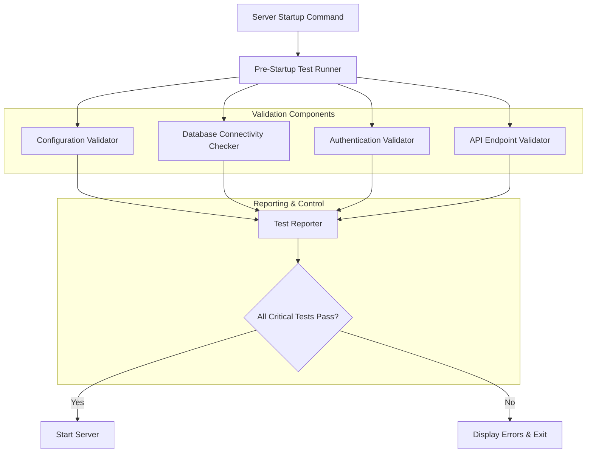

# Design Document: Pre-Startup Testing System

## Overview

The Pre-Startup Testing System is a comprehensive validation framework that runs automated tests before the development server starts. It validates API endpoints, database connectivity, authentication flows, and system configuration to catch issues early in the development cycle. The system provides detailed reporting with actionable guidance to help developers quickly resolve any problems.

## Architecture

The system follows a modular architecture with independent validators that can run in parallel for optimal performance:



## Components and Interfaces

### 1. Pre-Startup Test Runner

**Purpose**: Orchestrates all validation tests and controls server startup flow.

**Key Methods**:
```python
class PreStartupTestRunner:
    async def run_all_tests() -> TestResults
    async def run_critical_tests_only() -> TestResults
    def should_allow_startup(results: TestResults) -> bool
    def generate_startup_report(results: TestResults) -> str
```

**Integration Points**:
- Hooks into FastAPI startup event
- Integrates with existing server startup scripts
- Provides CLI interface for standalone testing

### 2. Configuration Validator

**Purpose**: Validates environment variables and configuration settings.

**Key Methods**:
```python
class ConfigurationValidator:
    def validate_environment_variables() -> ValidationResult
    def check_database_config() -> ValidationResult
    def validate_api_keys() -> ValidationResult
    def check_development_vs_production_config() -> ValidationResult
```

**Validation Checks**:
- Required environment variables (SUPABASE_URL, SUPABASE_ANON_KEY, OPENAI_API_KEY)
- JWT token format and validity
- Database connection string format
- API key format validation
- Development mode configuration consistency

### 3. Database Connectivity Checker

**Purpose**: Validates database connections and required database objects.

**Key Methods**:
```python
class DatabaseConnectivityChecker:
    async def test_supabase_connection() -> ConnectionResult
    async def check_required_tables() -> TableCheckResult
    async def validate_database_functions() -> FunctionCheckResult
    async def test_permissions() -> PermissionResult
```

**Database Validations**:
- Supabase client connection test
- Critical table existence (user_profiles, financial_tracking, etc.)
- Custom function availability (execute_sql, etc.)
- Read/write permission verification
- Migration status checking

### 4. Authentication Validator

**Purpose**: Tests authentication flows and permission systems.

**Key Methods**:
```python
class AuthenticationValidator:
    async def test_jwt_parsing() -> AuthResult
    async def validate_role_based_access() -> RBACResult
    async def test_development_mode_auth() -> DevAuthResult
    async def check_admin_permissions() -> AdminResult
```

**Authentication Tests**:
- JWT token parsing and validation
- Development mode authentication fallbacks
- Role-based access control for different user types
- Admin-only endpoint access restrictions
- Permission inheritance and caching

### 5. API Endpoint Validator

**Purpose**: Tests critical API endpoints for functionality and proper responses.

**Key Methods**:
```python
class APIEndpointValidator:
    async def test_admin_endpoints() -> EndpointResults
    async def test_variance_endpoints() -> EndpointResults
    async def test_authentication_required_endpoints() -> EndpointResults
    async def validate_response_formats() -> FormatResults
```

**Endpoint Tests**:
- Admin endpoints (/admin/users, /admin/users/{id}, etc.)
- Variance endpoints (/csv-import/variances, /variance/alerts)
- Authentication-protected endpoints
- Response format validation
- Error handling verification

### 6. Test Reporter

**Purpose**: Generates comprehensive reports with actionable guidance.

**Key Methods**:
```python
class TestReporter:
    def generate_summary_report(results: TestResults) -> str
    def format_error_details(errors: List[TestError]) -> str
    def provide_resolution_guidance(error: TestError) -> str
    def create_machine_readable_output(results: TestResults) -> dict
```

**Reporting Features**:
- Color-coded console output
- Detailed error messages with resolution steps
- Priority-based issue ordering
- Links to relevant documentation
- Machine-readable JSON output for CI/CD

## Data Models

### Test Result Models

```python
@dataclass
class ValidationResult:
    component: str
    test_name: str
    status: TestStatus  # PASS, FAIL, WARNING, SKIP
    message: str
    details: Optional[dict] = None
    resolution_steps: List[str] = field(default_factory=list)
    severity: Severity = Severity.MEDIUM  # LOW, MEDIUM, HIGH, CRITICAL

@dataclass
class TestResults:
    overall_status: TestStatus
    validation_results: List[ValidationResult]
    execution_time: float
    timestamp: datetime
    
    def has_critical_failures(self) -> bool
    def get_failures_by_severity(self) -> Dict[Severity, List[ValidationResult]]
```

### Configuration Models

```python
@dataclass
class TestConfiguration:
    skip_non_critical: bool = False
    timeout_seconds: int = 30
    parallel_execution: bool = True
    cache_results: bool = True
    output_format: OutputFormat = OutputFormat.CONSOLE
    
    # Endpoint-specific configuration
    test_endpoints: List[str] = field(default_factory=lambda: [
        "/admin/users",
        "/csv-import/variances", 
        "/variance/alerts"
    ])
```

## Error Handling

### Error Categories and Responses

1. **Critical Errors** (Block Startup):
   - Database connection failures
   - Missing required environment variables
   - Authentication system failures
   - Core API endpoint failures

2. **Warning Errors** (Allow Startup with Warnings):
   - Non-critical table missing
   - Optional feature configuration issues
   - Performance optimization warnings

3. **Info Messages** (Informational Only):
   - Successful validations
   - Configuration recommendations
   - Performance metrics

### Error Resolution Guidance

Each error type includes specific resolution steps:

```python
ERROR_RESOLUTION_MAP = {
    "missing_execute_sql_function": [
        "The execute_sql database function is missing",
        "1. Run database migrations: python apply_migration_direct.py",
        "2. Or modify endpoints to use standard Supabase queries",
        "3. Check migration files in backend/migrations/"
    ],
    "supabase_connection_failed": [
        "Cannot connect to Supabase database",
        "1. Check SUPABASE_URL in .env file",
        "2. Verify SUPABASE_ANON_KEY is valid",
        "3. Test connection: curl -H 'apikey: YOUR_KEY' YOUR_URL/rest/v1/"
    ]
}
```

## Testing Strategy

### Unit Tests

Focus on individual validator components:
- Configuration validation logic
- Database connection handling
- Authentication token parsing
- API response format validation

### Integration Tests

Test component interactions:
- End-to-end test execution flow
- Error reporting and formatting
- Server startup integration
- CLI interface functionality

### Property-Based Tests

Now I need to analyze the acceptance criteria for testable properties:

## Correctness Properties

*A property is a characteristic or behavior that should hold true across all valid executions of a system-essentially, a formal statement about what the system should do. Properties serve as the bridge between human-readable specifications and machine-verifiable correctness guarantees.*

### Property Reflection

After analyzing all acceptance criteria, I identified several areas where properties can be consolidated:
- Multiple properties about test execution behavior can be combined into comprehensive test orchestration properties
- Error handling and reporting properties can be unified into error response properties  
- Configuration validation properties can be consolidated into validation completeness properties
- Authentication testing properties can be combined into comprehensive auth validation properties

### Core System Properties

**Property 1: Test Execution Before Startup**
*For any* server startup attempt, all validation tests must complete execution before server initialization begins
**Validates: Requirements 1.1**

**Property 2: Critical Failure Prevention**
*For any* test execution with critical failures, server startup must be prevented and detailed error information must be displayed
**Validates: Requirements 1.2, 8.2**

**Property 3: Successful Test Completion Allows Startup**
*For any* test execution where all critical tests pass, normal server startup must be allowed to proceed
**Validates: Requirements 1.3**

**Property 4: Test Performance Guarantee**
*For any* complete test execution, the total runtime must not exceed 30 seconds
**Validates: Requirements 1.5**

### API Validation Properties

**Property 5: Comprehensive Endpoint Testing**
*For any* API endpoint in the critical endpoint list, authentication and response format validation must be performed
**Validates: Requirements 2.1, 2.2**

**Property 6: Missing Function Detection**
*For any* API endpoint that uses missing database functions, the specific missing function must be detected and reported
**Validates: Requirements 2.3**

**Property 7: Authentication Scenario Coverage**
*For any* authentication-required endpoint, both valid and invalid authentication scenarios must be tested
**Validates: Requirements 2.4**

### Database Validation Properties

**Property 8: Database Connection Validation**
*For any* database connectivity test, Supabase connection verification with credential validation must be performed
**Validates: Requirements 3.1**

**Property 9: Database Object Existence Checking**
*For any* required database object (table, function), existence and accessibility verification must be performed
**Validates: Requirements 3.2, 3.3**

**Property 10: Database Permission Testing**
*For any* database connectivity test, both read and write operations must be tested to verify permissions
**Validates: Requirements 3.5**

### Authentication System Properties

**Property 11: JWT Validation Testing**
*For any* authentication test execution, JWT token parsing and validation logic must be verified
**Validates: Requirements 4.1**

**Property 12: Role-Based Access Control Testing**
*For any* permission test, role-based access control must be validated for different user types
**Validates: Requirements 4.2, 4.3**

### Configuration Validation Properties

**Property 13: Environment Variable Completeness**
*For any* configuration validation, all required environment variables must be checked for presence and validity
**Validates: Requirements 5.1, 5.4**

**Property 14: Configuration Error Guidance**
*For any* configuration validation failure, specific guidance with correct formats and examples must be provided
**Validates: Requirements 5.2, 5.3**

### Reporting and User Experience Properties

**Property 15: Comprehensive Test Reporting**
*For any* test execution completion, a comprehensive report showing all test results with proper formatting must be generated
**Validates: Requirements 6.1, 6.3**

**Property 16: Error Resolution Guidance**
*For any* test failure, specific error messages with suggested resolution steps must be provided
**Validates: Requirements 6.2, 3.4, 4.4**

**Property 17: Issue Prioritization**
*For any* test execution with multiple issues, results must be prioritized and ordered by severity and impact
**Validates: Requirements 6.4**

### Workflow Integration Properties

**Property 18: Automatic Test Execution**
*For any* backend server startup, the test system must execute automatically without requiring separate commands
**Validates: Requirements 7.1**

**Property 19: Test Caching Efficiency**
*For any* test execution where configuration hasn't changed, cached results must be used to avoid redundant checks
**Validates: Requirements 7.4**

### Error Recovery Properties

**Property 20: Non-Critical Failure Handling**
*For any* test execution with only non-critical failures, warnings must be displayed but server startup must be allowed to continue
**Validates: Requirements 8.1**

**Property 21: Service Impact Analysis**
*For any* external service unavailability, affected features must be identified and appropriate fallback suggestions must be provided
**Validates: Requirements 8.3, 8.4**

## Testing Strategy

### Dual Testing Approach

The system will use both unit tests and property-based tests for comprehensive coverage:

**Unit Tests** focus on:
- Individual validator component functionality
- Specific error scenarios and edge cases
- Integration points between components
- CLI interface and configuration parsing

**Property-Based Tests** focus on:
- Universal properties across all test executions
- Comprehensive input coverage through randomization
- System behavior under various failure conditions
- Performance characteristics across different loads

### Property-Based Testing Configuration

- **Minimum 100 iterations** per property test due to randomization
- **Test tagging format**: `Feature: pre-startup-testing, Property {number}: {property_text}`
- **Framework**: Use pytest with Hypothesis for Python property-based testing
- Each correctness property will be implemented as a single property-based test
- Tests will generate random configurations, endpoint lists, and failure scenarios

### Test Implementation Strategy

1. **Mock External Dependencies**: Database connections, API calls, file system operations
2. **Parameterized Test Generation**: Generate various system states and configurations
3. **Failure Injection**: Systematically inject different types of failures to test error handling
4. **Performance Validation**: Measure execution times across different system loads
5. **Integration Testing**: Test complete startup flow with real FastAPI application

The testing strategy ensures that the pre-startup testing system itself is thoroughly validated and reliable, preventing issues in the validation system from affecting development productivity.