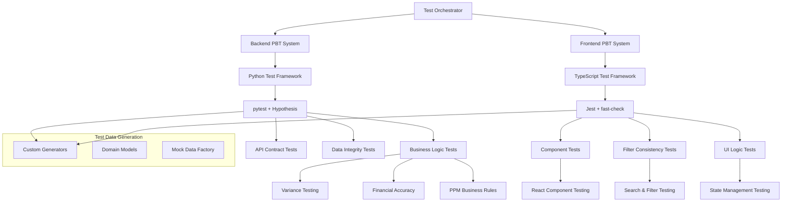

# Design Document: Property-Based Testing

## Overview

The Property-Based Testing system implements comprehensive testing infrastructure for both backend Python and frontend TypeScript components of the PPM SaaS platform. The system uses pytest with Hypothesis for backend testing and fast-check with Jest for frontend testing, focusing on critical business logic validation, financial accuracy, and UI consistency across the entire application.

## Architecture

The testing system follows a dual-track architecture supporting both backend and frontend testing:



## Components and Interfaces

### 1. Backend Property-Based Testing Infrastructure

**Purpose**: Comprehensive Python-based property testing using pytest and Hypothesis.

**Key Classes**:
```python
class BackendPBTFramework:
    def __init__(self, db_session, supabase_client):
        self.db = db_session
        self.supabase = supabase_client
        self.generators = DomainGenerators()
    
    def setup_property_test(self, test_function, iterations: int = 100):
        """Setup property test with custom configuration"""
        return given(self.generators.generate_test_data())(test_function)
    
    def run_financial_property_tests(self):
        """Run all financial accuracy property tests"""
        pass

class DomainGenerators:
    """Custom Hypothesis generators for PPM domain objects"""
    
    @composite
    def project_data(draw):
        return {
            'name': draw(text(min_size=1, max_size=100)),
            'budget': draw(floats(min_value=0, max_value=10000000)),
            'start_date': draw(dates()),
            'end_date': draw(dates()),
            'status': draw(sampled_from(['planning', 'active', 'completed', 'cancelled']))
        }
    
    @composite
    def financial_record(draw):
        return {
            'planned_amount': draw(floats(min_value=0, max_value=1000000)),
            'actual_amount': draw(floats(min_value=0, max_value=1000000)),
            'currency': draw(sampled_from(['USD', 'EUR', 'GBP', 'JPY'])),
            'exchange_rate': draw(floats(min_value=0.1, max_value=10.0))
        }
    
    @composite
    def user_role_assignment(draw):
        return {
            'user_id': draw(uuids()),
            'role': draw(sampled_from(['admin', 'portfolio_manager', 'project_manager', 'viewer'])),
            'scope_type': draw(one_of(none(), sampled_from(['project', 'portfolio']))),
            'scope_id': draw(one_of(none(), uuids()))
        }
```

### 2. Financial Variance Accuracy Testing

**Purpose**: Rigorous validation of financial calculations and currency operations.

**Key Test Properties**:
```python
class VarianceAccuracyTests:
    @given(financial_record(), floats(min_value=0.01, max_value=100))
    def test_variance_calculation_accuracy(self, financial_data, budget):
        """Property: Variance calculations must be mathematically correct"""
        actual = financial_data['actual_amount']
        variance = calculate_project_budget_variance({'budget': budget, 'actual_cost': actual})
        
        expected_variance_amount = actual - budget
        expected_variance_percentage = (expected_variance_amount / budget) * 100 if budget > 0 else 0
        
        assert abs(variance['variance_amount'] - expected_variance_amount) < 0.01
        assert abs(variance['variance_percentage'] - expected_variance_percentage) < 0.01
    
    @given(financial_record(), financial_record())
    def test_currency_conversion_reciprocal_consistency(self, from_record, to_record):
        """Property: Currency conversions must maintain reciprocal consistency"""
        from_currency = from_record['currency']
        to_currency = to_record['currency']
        amount = from_record['planned_amount']
        
        # Convert from A to B, then B back to A
        converted_amount = convert_currency(amount, from_currency, to_currency)
        back_converted = convert_currency(converted_amount, to_currency, from_currency)
        
        # Should be approximately equal (within floating point precision)
        assert abs(back_converted - amount) < 0.01
    
    @given(lists(financial_record(), min_size=1, max_size=100))
    def test_budget_aggregation_consistency(self, financial_records):
        """Property: Budget aggregations must be consistent regardless of calculation order"""
        # Calculate total in different orders
        total_planned_1 = sum(r['planned_amount'] for r in financial_records)
        total_actual_1 = sum(r['actual_amount'] for r in financial_records)
        
        shuffled_records = financial_records.copy()
        random.shuffle(shuffled_records)
        total_planned_2 = sum(r['planned_amount'] for r in shuffled_records)
        total_actual_2 = sum(r['actual_amount'] for r in shuffled_records)
        
        assert abs(total_planned_1 - total_planned_2) < 0.01
        assert abs(total_actual_1 - total_actual_2) < 0.01
```

### 3. Frontend Property-Based Testing Infrastructure

**Purpose**: TypeScript-based property testing using fast-check and Jest.

**Key Implementation**:
```typescript
// Frontend PBT Framework
class FrontendPBTFramework {
  private generators: DomainGenerators;
  
  constructor() {
    this.generators = new DomainGenerators();
  }
  
  setupPropertyTest<T>(
    generator: fc.Arbitrary<T>,
    testFunction: (data: T) => void,
    options: { numRuns?: number; seed?: number } = {}
  ) {
    return fc.assert(
      fc.property(generator, testFunction),
      { numRuns: options.numRuns || 100, seed: options.seed }
    );
  }
}

// Domain-specific generators for frontend testing
class DomainGenerators {
  projectGenerator = fc.record({
    id: fc.uuid(),
    name: fc.string({ minLength: 1, maxLength: 100 }),
    status: fc.constantFrom('planning', 'active', 'completed', 'cancelled'),
    budget: fc.float({ min: 0, max: 10000000 }),
    health: fc.constantFrom('green', 'yellow', 'red'),
    created_at: fc.date().map(d => d.toISOString())
  });
  
  userGenerator = fc.record({
    id: fc.uuid(),
    email: fc.emailAddress(),
    role: fc.constantFrom('admin', 'portfolio_manager', 'project_manager', 'viewer'),
    is_active: fc.boolean()
  });
  
  filterStateGenerator = fc.record({
    search: fc.string({ maxLength: 50 }),
    status: fc.option(fc.constantFrom('active', 'completed', 'cancelled')),
    dateRange: fc.option(fc.record({
      start: fc.date(),
      end: fc.date()
    })),
    sortBy: fc.constantFrom('name', 'created_at', 'budget', 'status'),
    sortOrder: fc.constantFrom('asc', 'desc')
  });
}
```

### 4. Filter Consistency Testing

**Purpose**: Validation of frontend filtering and search functionality.

**Key Test Properties**:
```typescript
class FilterConsistencyTests {
  @property([fc.array(projectGenerator), filterStateGenerator])
  testFilterConsistency(projects: Project[], filterState: FilterState) {
    // Property: Filtering should produce consistent results regardless of data order
    const shuffledProjects = [...projects].sort(() => Math.random() - 0.5);
    
    const filtered1 = applyFilters(projects, filterState);
    const filtered2 = applyFilters(shuffledProjects, filterState);
    
    // Results should contain the same projects (order may differ)
    expect(new Set(filtered1.map(p => p.id))).toEqual(new Set(filtered2.map(p => p.id)));
  }
  
  @property([fc.array(projectGenerator), fc.string()])
  testSearchConsistency(projects: Project[], searchTerm: string) {
    // Property: Search results should match expected criteria
    const results = searchProjects(projects, searchTerm);
    
    if (searchTerm.trim()) {
      results.forEach(project => {
        const matchesName = project.name.toLowerCase().includes(searchTerm.toLowerCase());
        const matchesDescription = project.description?.toLowerCase().includes(searchTerm.toLowerCase());
        expect(matchesName || matchesDescription).toBe(true);
      });
    } else {
      // Empty search should return all projects
      expect(results.length).toBe(projects.length);
    }
  }
  
  @property([fc.array(projectGenerator), filterStateGenerator])
  testFilterStateManagement(projects: Project[], filterState: FilterState) {
    // Property: Filter state should persist correctly across operations
    const component = render(<ProjectList projects={projects} />);
    
    // Apply filters
    applyFiltersToComponent(component, filterState);
    
    // Navigate away and back
    simulateNavigation(component);
    
    // Filter state should be preserved
    const currentState = getComponentFilterState(component);
    expect(currentState).toEqual(filterState);
  }
}
```

### 5. Business Logic Property Validation

**Purpose**: Comprehensive testing of core PPM business rules and calculations.

**Key Implementation**:
```python
class BusinessLogicValidationTests:
    @given(project_data(), lists(financial_record(), min_size=1))
    def test_project_health_calculation_consistency(self, project_data, financial_records):
        """Property: Project health scores must accurately reflect status indicators"""
        project = create_project(project_data)
        add_financial_records(project, financial_records)
        
        health_score = calculate_project_health(project)
        
        # Health score should be between 0 and 100
        assert 0 <= health_score <= 100
        
        # Health should correlate with budget variance
        budget_variance = calculate_budget_variance(project)
        if abs(budget_variance['variance_percentage']) > 20:
            assert health_score < 70  # Poor health for high variance
        elif abs(budget_variance['variance_percentage']) < 5:
            assert health_score > 80  # Good health for low variance
    
    @given(lists(user_role_assignment(), min_size=1), floats(min_value=0, max_value=100))
    def test_resource_allocation_constraints(self, assignments, total_capacity):
        """Property: Resource allocations must never exceed 100% and maintain consistency"""
        allocations = calculate_resource_allocations(assignments, total_capacity)
        
        # Total allocation should not exceed 100%
        total_allocated = sum(allocation['percentage'] for allocation in allocations)
        assert total_allocated <= 100.0
        
        # Individual allocations should be non-negative
        for allocation in allocations:
            assert allocation['percentage'] >= 0
            assert allocation['hours'] >= 0
    
    @given(dates(), dates(), lists(text(), min_size=1))
    def test_timeline_calculation_invariants(self, start_date, end_date, milestones):
        """Property: Timeline calculations must maintain logical consistency"""
        if start_date > end_date:
            start_date, end_date = end_date, start_date
        
        timeline = calculate_project_timeline(start_date, end_date, milestones)
        
        # Timeline duration should match date difference
        expected_duration = (end_date - start_date).days
        assert timeline['duration_days'] == expected_duration
        
        # Milestone dates should be within project timeline
        for milestone in timeline['milestones']:
            assert start_date <= milestone['date'] <= end_date
```

### 6. API Contract Testing

**Purpose**: Property-based validation of API endpoint behavior and contracts.

**Key Implementation**:
```python
class APIContractTests:
    @given(project_data())
    def test_project_api_contract_consistency(self, project_data):
        """Property: Project API responses must match defined schemas"""
        # Create project via API
        response = self.client.post("/projects/", json=project_data)
        assert response.status_code == 201
        
        created_project = response.json()
        
        # Response should match schema
        assert validate_project_schema(created_project)
        
        # Retrieve project via API
        project_id = created_project['id']
        get_response = self.client.get(f"/projects/{project_id}")
        assert get_response.status_code == 200
        
        retrieved_project = get_response.json()
        
        # Retrieved project should match created project
        assert created_project['id'] == retrieved_project['id']
        assert created_project['name'] == retrieved_project['name']
    
    @given(integers(min_value=1, max_value=100), integers(min_value=1, max_value=50))
    def test_pagination_consistency(self, page_size, page_number):
        """Property: API pagination must behave consistently"""
        response = self.client.get(f"/projects/?page={page_number}&per_page={page_size}")
        assert response.status_code == 200
        
        data = response.json()
        
        # Response should have pagination metadata
        assert 'total_count' in data
        assert 'page' in data
        assert 'per_page' in data
        assert 'total_pages' in data
        
        # Page size should be respected
        assert len(data['projects']) <= page_size
        
        # Page number should match request
        assert data['page'] == page_number
    
    @given(text(), sampled_from(['name', 'created_at', 'budget']))
    def test_api_filtering_consistency(self, search_term, sort_field):
        """Property: API filtering must produce consistent results"""
        params = {'search': search_term, 'sort_by': sort_field}
        response = self.client.get("/projects/", params=params)
        assert response.status_code == 200
        
        projects = response.json()['projects']
        
        # If search term provided, results should match
        if search_term.strip():
            for project in projects:
                assert (search_term.lower() in project['name'].lower() or 
                       search_term.lower() in (project.get('description', '') or '').lower())
        
        # Results should be sorted by specified field
        if len(projects) > 1:
            sort_values = [project[sort_field] for project in projects]
            assert sort_values == sorted(sort_values)
```

## Data Integrity and Consistency Testing

### Database Operation Testing

```python
class DataIntegrityTests:
    @given(project_data(), lists(financial_record()))
    def test_crud_operation_consistency(self, project_data, financial_records):
        """Property: CRUD operations must maintain referential integrity"""
        # Create project
        project = create_project(project_data)
        assert project.id is not None
        
        # Add financial records
        for record_data in financial_records:
            record = create_financial_record(project.id, record_data)
            assert record.project_id == project.id
        
        # Update project
        updated_data = {**project_data, 'name': 'Updated Name'}
        updated_project = update_project(project.id, updated_data)
        assert updated_project.name == 'Updated Name'
        
        # Delete project should cascade to financial records
        delete_project(project.id)
        remaining_records = get_financial_records_by_project(project.id)
        assert len(remaining_records) == 0
    
    @given(lists(project_data(), min_size=2, max_size=10))
    def test_concurrent_operation_safety(self, projects_data):
        """Property: Concurrent operations must not corrupt data"""
        import asyncio
        
        async def create_project_async(data):
            return await async_create_project(data)
        
        # Create projects concurrently
        tasks = [create_project_async(data) for data in projects_data]
        created_projects = await asyncio.gather(*tasks)
        
        # All projects should be created successfully
        assert len(created_projects) == len(projects_data)
        
        # All projects should have unique IDs
        project_ids = [p.id for p in created_projects]
        assert len(set(project_ids)) == len(project_ids)
```

## Performance and Regression Testing

### Performance Property Testing

```python
class PerformanceTests:
    @given(integers(min_value=10, max_value=1000))
    def test_response_time_scalability(self, data_size):
        """Property: Response times should scale predictably with data size"""
        # Create test data
        projects = [create_test_project() for _ in range(data_size)]
        
        # Measure response time
        start_time = time.time()
        response = self.client.get("/projects/")
        end_time = time.time()
        
        response_time = end_time - start_time
        
        # Response time should be reasonable (adjust threshold as needed)
        max_acceptable_time = 0.1 + (data_size * 0.001)  # Linear scaling assumption
        assert response_time < max_acceptable_time
        
        # Response should be successful
        assert response.status_code == 200
    
    @given(lists(financial_record(), min_size=100, max_size=10000))
    def test_memory_usage_consistency(self, financial_records):
        """Property: Memory usage should not grow excessively with data processing"""
        import psutil
        import os
        
        process = psutil.Process(os.getpid())
        initial_memory = process.memory_info().rss
        
        # Process financial records
        results = []
        for record in financial_records:
            variance = calculate_project_budget_variance(record)
            results.append(variance)
        
        final_memory = process.memory_info().rss
        memory_growth = final_memory - initial_memory
        
        # Memory growth should be reasonable (less than 100MB for this test)
        assert memory_growth < 100 * 1024 * 1024
```

## Testing Strategy

Now I need to analyze the acceptance criteria for testable properties:
## Correctness Properties

*A property is a characteristic or behavior that should hold true across all valid executions of a system-essentially, a formal statement about what the system should do. Properties serve as the bridge between human-readable specifications and machine-verifiable correctness guarantees.*

### Property Reflection

After analyzing all acceptance criteria, I identified several areas where properties can be consolidated:
- Testing framework integration properties can be combined into comprehensive framework setup properties
- Test execution and generation properties can be unified into test behavior consistency properties
- Financial and business logic properties can be consolidated into calculation accuracy properties
- Performance and monitoring properties can be combined into system efficiency validation properties

### Backend Testing Infrastructure Properties

**Property 1: Framework Integration Completeness**
*For any* backend property test setup, pytest and Hypothesis must integrate correctly to generate diverse test cases and execute minimum 100 iterations per property
**Validates: Requirements 1.1, 1.2**

**Property 2: Test Failure Debugging Support**
*For any* property test failure, the system must provide minimal failing examples that enable efficient debugging and issue resolution
**Validates: Requirements 1.3**

**Property 3: CI/CD Test Determinism**
*For any* test execution with configured seed values, the system must produce deterministic, reproducible results across different environments
**Validates: Requirements 1.4**

**Property 4: Domain Generator Validity**
*For any* custom generator for domain-specific data types (projects, portfolios, financial records), generated data must be valid and realistic
**Validates: Requirements 1.5**

### Financial Accuracy Testing Properties

**Property 5: Variance Calculation Mathematical Correctness**
*For any* budget and actual amount combination, variance calculations must produce mathematically accurate results following defined formulas
**Validates: Requirements 2.1**

**Property 6: Currency Conversion Reciprocal Consistency**
*For any* currency conversion sequence (A→B→A), the final amount must equal the original amount within acceptable precision limits
**Validates: Requirements 2.2**

**Property 7: Percentage Calculation Scale Independence**
*For any* budget variance calculation, percentage results must be accurate regardless of the absolute budget scale or magnitude
**Validates: Requirements 2.3**

**Property 8: Edge Case Handling Robustness**
*For any* edge case input (zero budgets, negative values, extreme amounts), variance calculations must handle them correctly without errors
**Validates: Requirements 2.4**

**Property 9: Status Classification Consistency**
*For any* calculated variance percentage, the status classification (over/under/on budget) must align correctly with the percentage thresholds
**Validates: Requirements 2.5**

### Frontend Testing Infrastructure Properties

**Property 10: Frontend Framework Integration**
*For any* frontend property test setup, fast-check and Jest must integrate correctly to provide stable test execution with proper seed management
**Validates: Requirements 3.1, 3.4**

**Property 11: Mock Data Realism**
*For any* generated test data for projects, users, and financial records, the data must be realistic and conform to expected domain constraints
**Validates: Requirements 3.2**

**Property 12: React Component Behavior Validation**
*For any* React component tested with different prop combinations, the component must behave correctly and maintain expected functionality
**Validates: Requirements 3.3**

**Property 13: Async Operation Testing Support**
*For any* async operation or state management logic test, the testing system must properly handle asynchronous behavior and state transitions
**Validates: Requirements 3.5**

### Filter and Search Consistency Properties

**Property 14: Filter Operation Consistency**
*For any* filter operation applied to different data sets, the results must be consistent regardless of data order or composition
**Validates: Requirements 4.1**

**Property 15: Search Result Consistency**
*For any* search operation, results must match expected criteria consistently regardless of data ordering or presentation
**Validates: Requirements 4.2**

**Property 16: Combined Filter Logic Correctness**
*For any* combination of multiple filters, the combined filtering logic must work correctly and produce expected intersection results
**Validates: Requirements 4.3**

**Property 17: Filter State Persistence**
*For any* filter state management across navigation, the filter state must persist correctly and maintain user selections
**Validates: Requirements 4.4**

**Property 18: Filter Performance Consistency**
*For any* filter operation on large data sets, performance must remain consistent and within acceptable bounds
**Validates: Requirements 4.5**

### Business Logic Validation Properties

**Property 19: Project Health Score Accuracy**
*For any* project with status indicators, health scores must accurately reflect the underlying project metrics and conditions
**Validates: Requirements 5.1**

**Property 20: Resource Allocation Constraint Enforcement**
*For any* resource allocation operation, allocation percentages must never exceed 100% and must maintain mathematical consistency
**Validates: Requirements 5.2**

**Property 21: Timeline Calculation Correctness**
*For any* project timeline with dates and milestones, date arithmetic and milestone progression logic must be mathematically correct
**Validates: Requirements 5.3**

**Property 22: Risk Scoring Formula Compliance**
*For any* risk calculation, the results must follow defined mathematical formulas and respect established constraints
**Validates: Requirements 5.4**

**Property 23: System Invariant Preservation**
*For any* system operation, critical invariants (budget totals, resource capacity limits) must be preserved across all operations
**Validates: Requirements 5.5**

### API Contract Testing Properties

**Property 24: API Schema Compliance**
*For any* API endpoint response across different input variations, responses must match defined schemas and maintain contract consistency
**Validates: Requirements 6.1**

**Property 25: Pagination Behavior Consistency**
*For any* API pagination request with different page sizes and offsets, pagination behavior must be consistent and mathematically correct
**Validates: Requirements 6.2**

**Property 26: API Filter Parameter Correctness**
*For any* API filtering request with query parameters, the filtering behavior must produce expected results matching the parameter specifications
**Validates: Requirements 6.3**

**Property 27: API Error Response Appropriateness**
*For any* invalid API input, the system must return appropriate error responses with correct status codes and error messages
**Validates: Requirements 6.4**

**Property 28: API Performance Consistency**
*For any* API endpoint under different load conditions, response times must remain consistent within acceptable performance bounds
**Validates: Requirements 6.5**

### Data Integrity and Consistency Properties

**Property 29: CRUD Operation Referential Integrity**
*For any* database CRUD operation sequence, referential integrity must be maintained throughout all operations without data corruption
**Validates: Requirements 7.1**

**Property 30: Concurrent Operation Safety**
*For any* set of concurrent database operations, race conditions must not occur and data consistency must be preserved
**Validates: Requirements 7.2**

**Property 31: Data Migration Information Preservation**
*For any* data migration or transformation, all essential information must be preserved without loss or corruption
**Validates: Requirements 7.3**

**Property 32: Backup and Restore Accuracy**
*For any* backup and restore operation, restored data must match original data exactly with no information loss
**Validates: Requirements 7.4**

**Property 33: Database Constraint Enforcement**
*For any* attempt to create invalid data states, database constraints must prevent the invalid states and maintain data integrity
**Validates: Requirements 7.5**

### Performance and Monitoring Properties

**Property 34: Performance Measurement Accuracy**
*For any* performance test across different load patterns, response time measurements must be accurate and representative
**Validates: Requirements 8.1**

**Property 35: Performance Scaling Predictability**
*For any* system operation with varying data sizes, performance scaling must follow predictable patterns within expected bounds
**Validates: Requirements 8.2**

**Property 36: Performance Regression Detection**
*For any* performance regression occurrence, the system must detect it and provide clear metrics and comparison data for analysis
**Validates: Requirements 8.3**

**Property 37: Memory Usage Management**
*For any* system operation, memory usage must remain within reasonable bounds without causing memory leaks or excessive allocation
**Validates: Requirements 8.4**

**Property 38: Monitoring System Integration**
*For any* performance data collection, the system must properly integrate with monitoring systems to track trends over time
**Validates: Requirements 8.5**

## Testing Strategy

### Dual Testing Approach

The property-based testing system will use both backend and frontend testing frameworks for comprehensive coverage:

**Backend Property Tests** focus on:
- Business logic correctness and mathematical accuracy
- API contract compliance and data integrity
- Database operations and concurrent safety
- Performance characteristics and scalability

**Frontend Property Tests** focus on:
- UI component behavior and consistency
- Filter and search functionality reliability
- State management and async operation handling
- User interaction patterns and edge cases

### Property-Based Testing Configuration

- **Minimum 100 iterations** per property test for thorough coverage
- **Test tagging format**: `Feature: property-based-testing, Property {number}: {property_text}`
- **Backend Framework**: pytest with Hypothesis for Python property-based testing
- **Frontend Framework**: Jest with fast-check for TypeScript property-based testing
- **Deterministic execution** with configurable seed values for reproducible results
- **CI/CD integration** with performance regression detection

### Test Implementation Strategy

1. **Custom Domain Generators**: Create realistic generators for PPM domain objects (projects, users, financial records)
2. **Mathematical Property Validation**: Focus on financial calculations, variance accuracy, and business rule compliance
3. **Concurrency and Performance Testing**: Validate system behavior under concurrent load and varying data sizes
4. **Integration Property Testing**: Test complete workflows and system interactions
5. **Regression Detection**: Implement automated detection of performance and functional regressions

### Test Coverage Goals

- **Financial Calculations**: 100% coverage of variance, currency conversion, and budget calculations
- **Business Logic**: Complete coverage of health scoring, resource allocation, and timeline calculations
- **API Contracts**: Full validation of all endpoint schemas, pagination, and error handling
- **UI Consistency**: Comprehensive testing of filters, search, and component behavior
- **Data Integrity**: Complete validation of CRUD operations, constraints, and concurrent safety

The property-based testing system ensures that the PPM platform maintains correctness, performance, and reliability across all possible execution scenarios while providing early detection of regressions and issues.