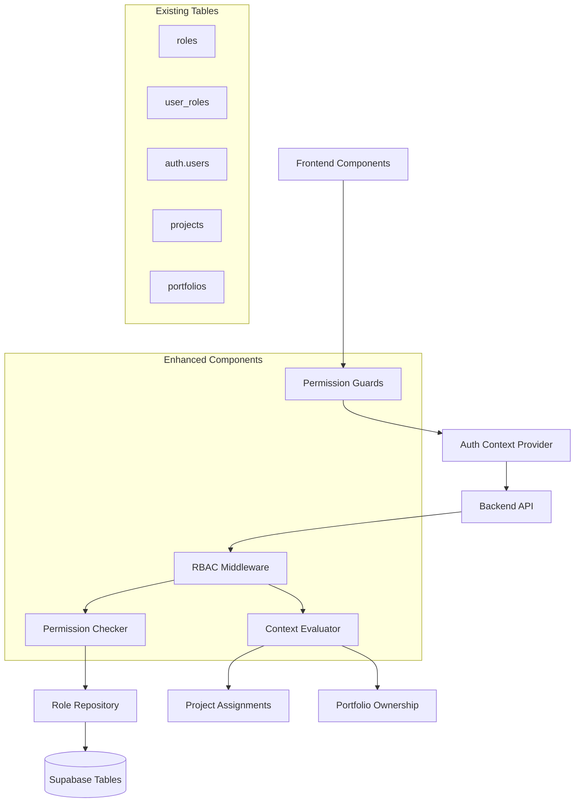

# Design Document: RBAC Enhancement

## Overview

The RBAC Enhancement builds upon the existing role-based access control system to provide comprehensive backend permission validation and frontend role-based UI controls. The system leverages existing Supabase tables (roles, user_roles) and integrates seamlessly with the current FastAPI backend and Next.js frontend to provide dynamic, context-aware access control.

## Architecture

The enhanced RBAC system follows a layered architecture that extends existing authentication:



## Components and Interfaces

### 1. Enhanced Permission Checker

**Purpose**: Core backend component for validating user permissions with context awareness.

**Key Classes**:
```python
class EnhancedPermissionChecker:
    async def check_permission(user_id: UUID, permission: Permission, context: Optional[PermissionContext] = None) -> bool
    async def check_any_permission(user_id: UUID, permissions: List[Permission], context: Optional[PermissionContext] = None) -> bool
    async def get_user_permissions(user_id: UUID, context: Optional[PermissionContext] = None) -> List[Permission]
    async def get_effective_roles(user_id: UUID, context: Optional[PermissionContext] = None) -> List[Role]

class PermissionContext(BaseModel):
    project_id: Optional[UUID] = None
    portfolio_id: Optional[UUID] = None
    resource_id: Optional[UUID] = None
    organization_id: Optional[UUID] = None
    
class RoleAssignment(BaseModel):
    user_id: UUID
    role_id: UUID
    scope_type: Optional[str] = None  # "project", "portfolio", "organization"
    scope_id: Optional[UUID] = None
    assigned_by: UUID
    assigned_at: datetime
    expires_at: Optional[datetime] = None
```

### 2. RBAC Middleware Enhancement

**Purpose**: FastAPI middleware for automatic permission checking on protected endpoints.

**Key Implementation**:
```python
class RBACMiddleware:
    def __init__(self, app: FastAPI, permission_checker: EnhancedPermissionChecker):
        self.app = app
        self.permission_checker = permission_checker
    
    async def __call__(self, request: Request, call_next):
        # Extract user from JWT token
        user = await self.get_current_user(request)
        
        # Check if endpoint requires permissions
        endpoint_permissions = self.get_endpoint_permissions(request)
        
        if endpoint_permissions:
            context = self.extract_permission_context(request)
            has_permission = await self.permission_checker.check_any_permission(
                user.id, endpoint_permissions, context
            )
            
            if not has_permission:
                raise HTTPException(status_code=403, detail="Insufficient permissions")
        
        return await call_next(request)

# Enhanced dependency functions
def require_permission(permission: Permission, context_extractor: Optional[Callable] = None):
    async def permission_dependency(
        request: Request,
        current_user = Depends(get_current_user)
    ):
        context = None
        if context_extractor:
            context = await context_extractor(request)
        
        has_permission = await permission_checker.check_permission(
            current_user.id, permission, context
        )
        
        if not has_permission:
            raise HTTPException(status_code=403, detail=f"Permission {permission.value} required")
        
        return current_user
    
    return permission_dependency
```

### 3. Frontend Permission Guards

**Purpose**: React components and hooks for role-based UI control.

**Key Components**:
```typescript
// Permission Guard Component
interface PermissionGuardProps {
  permission: string | string[];
  context?: PermissionContext;
  fallback?: React.ReactNode;
  children: React.ReactNode;
}

const PermissionGuard: React.FC<PermissionGuardProps> = ({ 
  permission, 
  context, 
  fallback = null, 
  children 
}) => {
  const { hasPermission } = usePermissions();
  
  if (hasPermission(permission, context)) {
    return <>{children}</>;
  }
  
  return <>{fallback}</>;
};

// Permission Hook
interface UsePermissionsReturn {
  hasPermission: (permission: string | string[], context?: PermissionContext) => boolean;
  userRoles: string[];
  loading: boolean;
  refetch: () => Promise<void>;
}

const usePermissions = (): UsePermissionsReturn => {
  const { session } = useAuth();
  const [permissions, setPermissions] = useState<string[]>([]);
  const [userRoles, setUserRoles] = useState<string[]>([]);
  const [loading, setLoading] = useState(true);
  
  // Implementation details...
};

// Role-based Navigation
interface RoleBasedNavProps {
  userRole: string;
  permissions: string[];
}

const RoleBasedNav: React.FC<RoleBasedNavProps> = ({ userRole, permissions }) => {
  const navItems = getNavItemsForRole(userRole, permissions);
  
  return (
    <nav>
      {navItems.map(item => (
        <PermissionGuard key={item.path} permission={item.requiredPermission}>
          <NavItem {...item} />
        </PermissionGuard>
      ))}
    </nav>
  );
};
```

### 4. Enhanced Auth Context Provider

**Purpose**: Extended authentication context with role and permission information.

**Key Implementation**:
```typescript
interface EnhancedAuthContextType extends AuthContextType {
  userRoles: string[];
  userPermissions: string[];
  hasPermission: (permission: string | string[], context?: PermissionContext) => boolean;
  hasRole: (role: string | string[]) => boolean;
  refreshPermissions: () => Promise<void>;
}

const EnhancedAuthProvider: React.FC<{ children: React.ReactNode }> = ({ children }) => {
  const [userRoles, setUserRoles] = useState<string[]>([]);
  const [userPermissions, setUserPermissions] = useState<string[]>([]);
  const { session, user, loading } = useAuth();
  
  useEffect(() => {
    if (session?.user) {
      fetchUserRolesAndPermissions(session.user.id);
    }
  }, [session]);
  
  const hasPermission = useCallback((
    permission: string | string[], 
    context?: PermissionContext
  ) => {
    // Implementation with context-aware permission checking
  }, [userPermissions]);
  
  // Enhanced context value with role/permission methods
};
```

## Data Models

### Enhanced Database Schema

Building on existing RBAC tables with additional context support:

```sql
-- Enhanced user_roles table for scoped assignments
ALTER TABLE user_roles ADD COLUMN IF NOT EXISTS
    scope_type VARCHAR(50),  -- "project", "portfolio", "organization", "global"
    scope_id UUID,
    assigned_by UUID REFERENCES auth.users(id),
    expires_at TIMESTAMP WITH TIME ZONE,
    is_active BOOLEAN DEFAULT true;

-- Create indexes for performance
CREATE INDEX IF NOT EXISTS idx_user_roles_scope ON user_roles(user_id, scope_type, scope_id);
CREATE INDEX IF NOT EXISTS idx_user_roles_active ON user_roles(user_id, is_active);

-- Permission cache table for performance
CREATE TABLE IF NOT EXISTS permission_cache (
    id UUID PRIMARY KEY DEFAULT gen_random_uuid(),
    user_id UUID NOT NULL REFERENCES auth.users(id) ON DELETE CASCADE,
    permission VARCHAR(100) NOT NULL,
    context_type VARCHAR(50),
    context_id UUID,
    granted BOOLEAN NOT NULL,
    cached_at TIMESTAMP WITH TIME ZONE DEFAULT NOW(),
    expires_at TIMESTAMP WITH TIME ZONE DEFAULT (NOW() + INTERVAL '1 hour')
);

CREATE INDEX IF NOT EXISTS idx_permission_cache_lookup ON permission_cache(user_id, permission, context_type, context_id);
CREATE INDEX IF NOT EXISTS idx_permission_cache_expiry ON permission_cache(expires_at);
```

### API Models

```python
class RoleAssignmentRequest(BaseModel):
    user_id: UUID
    role_id: UUID
    scope_type: Optional[str] = None
    scope_id: Optional[UUID] = None
    expires_at: Optional[datetime] = None

class PermissionCheckRequest(BaseModel):
    permission: str
    context: Optional[PermissionContext] = None

class UserPermissionsResponse(BaseModel):
    user_id: UUID
    roles: List[RoleResponse]
    permissions: List[str]
    effective_permissions: List[str]
    context_permissions: Dict[str, List[str]]  # Keyed by context type

class RoleManagementResponse(BaseModel):
    role: RoleResponse
    assigned_users: List[UserResponse]
    permission_count: int
    active_assignments: int
```

## Integration Points

### 1. Supabase Auth Integration

Seamless bridge between Supabase authentication and custom RBAC:

```python
class SupabaseRBACBridge:
    async def sync_user_roles(self, user_id: UUID):
        """Sync roles between Supabase auth.users and custom user_roles table"""
        # Get roles from custom system
        custom_roles = await self.get_user_roles(user_id)
        
        # Update Supabase auth metadata
        await supabase.auth.admin.update_user_by_id(
            user_id,
            {"user_metadata": {"roles": [role.name for role in custom_roles]}}
        )
    
    async def get_user_from_jwt(self, token: str) -> Optional[User]:
        """Extract user and role information from JWT token"""
        try:
            payload = jwt.decode(token, options={"verify_signature": False})
            user_id = payload.get("sub")
            
            if user_id:
                # Get enhanced user info with roles
                return await self.get_enhanced_user_info(user_id)
        except Exception as e:
            logger.error(f"JWT decode error: {e}")
            return None
```

### 2. Context-Aware Permission Checking

Dynamic permission evaluation based on resource context:

```python
class ContextAwarePermissionChecker:
    async def check_project_permission(self, user_id: UUID, permission: Permission, project_id: UUID) -> bool:
        # Check global permissions first
        if await self.has_global_permission(user_id, permission):
            return True
        
        # Check project-specific assignments
        project_roles = await self.get_project_roles(user_id, project_id)
        for role in project_roles:
            if permission in role.permissions:
                return True
        
        # Check portfolio-level permissions if project belongs to portfolio
        portfolio_id = await self.get_project_portfolio(project_id)
        if portfolio_id:
            return await self.check_portfolio_permission(user_id, permission, portfolio_id)
        
        return False
    
    async def check_resource_access(self, user_id: UUID, resource_type: str, resource_id: UUID) -> bool:
        # Dynamic resource access based on assignments and hierarchy
        pass
```

### 3. Frontend Integration with Existing Components

Enhanced existing components with role-based behavior:

```typescript
// Enhanced Dashboard with role-based sections
const EnhancedDashboard: React.FC = () => {
  const { hasPermission, userRoles } = usePermissions();
  
  return (
    <AppLayout>
      {/* Admin-only sections */}
      <PermissionGuard permission="admin_read">
        <AdminDashboardSection />
      </PermissionGuard>
      
      {/* Manager sections */}
      <PermissionGuard permission={["portfolio_read", "project_read"]}>
        <ManagerDashboardSection />
      </PermissionGuard>
      
      {/* Enhanced existing components with role awareness */}
      <VarianceKPIs 
        showDetailedMetrics={hasPermission("financial_read")}
        allowEdit={hasPermission("financial_update")}
      />
      
      <VarianceAlerts 
        showAdminActions={hasPermission("budget_alert_manage")}
      />
    </AppLayout>
  );
};

// Role-based action buttons
const ProjectActionButtons: React.FC<{ projectId: string }> = ({ projectId }) => {
  const context = { project_id: projectId };
  
  return (
    <div className="flex space-x-2">
      <PermissionGuard permission="project_update" context={context}>
        <Button onClick={handleEdit}>Edit Project</Button>
      </PermissionGuard>
      
      <PermissionGuard permission="project_delete" context={context}>
        <Button variant="destructive" onClick={handleDelete}>Delete Project</Button>
      </PermissionGuard>
      
      <PermissionGuard permission="financial_update" context={context}>
        <Button onClick={handleBudgetUpdate}>Update Budget</Button>
      </PermissionGuard>
    </div>
  );
};
```

## Performance Optimization

### 1. Permission Caching Strategy

```python
class PermissionCache:
    def __init__(self, redis_client: Optional[Redis] = None):
        self.redis = redis_client
        self.local_cache = {}
        self.cache_ttl = 3600  # 1 hour
    
    async def get_cached_permission(self, user_id: UUID, permission: str, context: Optional[str] = None) -> Optional[bool]:
        cache_key = f"perm:{user_id}:{permission}:{context or 'global'}"
        
        # Try Redis first
        if self.redis:
            cached = await self.redis.get(cache_key)
            if cached is not None:
                return json.loads(cached)
        
        # Fallback to local cache
        return self.local_cache.get(cache_key)
    
    async def cache_permission(self, user_id: UUID, permission: str, result: bool, context: Optional[str] = None):
        cache_key = f"perm:{user_id}:{permission}:{context or 'global'}"
        
        # Cache in Redis
        if self.redis:
            await self.redis.setex(cache_key, self.cache_ttl, json.dumps(result))
        
        # Cache locally
        self.local_cache[cache_key] = result
```

### 2. Batch Permission Loading

```python
class BatchPermissionLoader:
    async def load_user_permissions_batch(self, user_ids: List[UUID]) -> Dict[UUID, List[Permission]]:
        """Load permissions for multiple users in a single query"""
        query = """
        SELECT ur.user_id, r.permissions
        FROM user_roles ur
        JOIN roles r ON ur.role_id = r.id
        WHERE ur.user_id = ANY($1) AND ur.is_active = true AND r.is_active = true
        """
        
        results = await self.db.fetch(query, user_ids)
        
        # Aggregate permissions by user
        user_permissions = {}
        for row in results:
            user_id = row['user_id']
            permissions = row['permissions']
            
            if user_id not in user_permissions:
                user_permissions[user_id] = set()
            
            user_permissions[user_id].update(permissions)
        
        return {uid: list(perms) for uid, perms in user_permissions.items()}
```

## Error Handling

### Permission Denial Handling

```python
class PermissionError(Exception):
    def __init__(self, user_id: UUID, permission: Permission, context: Optional[PermissionContext] = None):
        self.user_id = user_id
        self.permission = permission
        self.context = context
        super().__init__(f"User {user_id} lacks permission {permission.value}")

class RBACErrorHandler:
    async def handle_permission_denied(self, error: PermissionError, request: Request):
        # Log security event
        await self.log_security_event(
            event_type="permission_denied",
            user_id=error.user_id,
            permission=error.permission.value,
            context=error.context,
            request_path=request.url.path
        )
        
        # Return appropriate response based on request type
        if request.headers.get("accept") == "application/json":
            return JSONResponse(
                status_code=403,
                content={
                    "error": "insufficient_permissions",
                    "message": f"Permission {error.permission.value} required",
                    "required_permission": error.permission.value
                }
            )
        else:
            # Redirect to access denied page
            return RedirectResponse(url="/access-denied")
```

## Testing Strategy

Now I need to analyze the acceptance criteria for testable properties:
## Correctness Properties

*A property is a characteristic or behavior that should hold true across all valid executions of a system-essentially, a formal statement about what the system should do. Properties serve as the bridge between human-readable specifications and machine-verifiable correctness guarantees.*

### Property Reflection

After analyzing all acceptance criteria, I identified several areas where properties can be consolidated:
- Authentication and role validation properties can be combined into comprehensive auth flow properties
- Permission checking properties can be unified into permission evaluation consistency properties
- UI control properties can be consolidated into frontend permission enforcement properties
- Performance and caching properties can be combined into system efficiency properties

### Backend Authentication and Role Validation Properties

**Property 1: Authentication and Role Retrieval Consistency**
*For any* API endpoint access, user authentication must be validated and assigned roles must be retrieved accurately from the user_roles table
**Validates: Requirements 1.1, 2.1**

**Property 2: Permission Verification Accuracy**
*For any* permission check request, the system must verify that the user has the required permission and return accurate authorization results
**Validates: Requirements 1.2**

**Property 3: HTTP Status Code Correctness**
*For any* permission validation failure, the system must return appropriate HTTP status codes (401 for unauthenticated, 403 for unauthorized)
**Validates: Requirements 1.3**

**Property 4: Permission Combination Logic**
*For any* operation requiring multiple permissions, the system must correctly evaluate AND and OR logic for permission combinations
**Validates: Requirements 1.4**

**Property 5: FastAPI Integration Seamlessness**
*For any* protected endpoint using dependency injection, role checking must integrate seamlessly without breaking existing functionality
**Validates: Requirements 1.5**

### Supabase Auth Integration Properties

**Property 6: Role Change Synchronization**
*For any* user role modification, the Auth_Integration must update the user's session to reflect new permissions accurately
**Validates: Requirements 2.2**

**Property 7: Auth System Bridge Consistency**
*For any* access to Supabase auth.roles, the integration must provide consistent bridging to the custom roles system
**Validates: Requirements 2.3**

**Property 8: Role Aggregation Accuracy**
*For any* user with multiple assigned roles, the system must correctly aggregate permissions across all roles without duplication or omission
**Validates: Requirements 2.5**

### Frontend Permission Control Properties

**Property 9: UI Component Permission Enforcement**
*For any* UI component rendering, permission guards must check user permissions and conditionally render elements based on authorization
**Validates: Requirements 3.1**

**Property 10: Dynamic UI Reactivity**
*For any* user role change, the frontend UI must automatically update to reflect new permission levels without requiring page refresh
**Validates: Requirements 3.2**

**Property 11: Navigation Permission Filtering**
*For any* navigation menu display, unauthorized menu items must be hidden based on user permissions
**Validates: Requirements 3.3**

**Property 12: Action Button Permission Control**
*For any* action button display, buttons for unauthorized operations must be disabled or hidden based on user permissions
**Validates: Requirements 3.4**

**Property 13: API Flexibility Completeness**
*For any* permission checking need, both component-level and hook-based APIs must be available and function correctly
**Validates: Requirements 3.5**

### Admin Role Management Properties

**Property 14: User Role Management Functionality**
*For any* user role management operation, the system must provide complete interfaces for viewing and modifying role assignments
**Validates: Requirements 4.1**

**Property 15: Custom Role Creation Capability**
*For any* custom role definition, the system must allow creation with specific permission sets and validate configuration correctness
**Validates: Requirements 4.2**

**Property 16: Permission Configuration Validation**
*For any* permission update attempt, the system must validate permission combinations and prevent invalid configurations
**Validates: Requirements 4.3**

**Property 17: Effective Permission Display Accuracy**
*For any* user role assignment view, the system must display effective permissions including inherited permissions accurately
**Validates: Requirements 4.4**

**Property 18: Audit Logging Completeness**
*For any* role or permission change, the system must create complete audit log entries with all relevant details
**Validates: Requirements 4.5**

### Manager Role Scoping Properties

**Property 19: Portfolio Manager Permission Granting**
*For any* user assigned as portfolio manager, the system must grant appropriate portfolio-level operations and oversight permissions
**Validates: Requirements 5.1**

**Property 20: Project Manager Scope Enforcement**
*For any* user assigned as project manager, permissions must be limited to project-specific management within assigned projects only
**Validates: Requirements 5.2, 5.5**

**Property 21: Resource Management Scope Consistency**
*For any* resource management operation, permissions must be enforced within the manager's assigned scope boundaries
**Validates: Requirements 5.3**

**Property 22: Granular Role Assignment Support**
*For any* role assignment, the system must support project-specific and portfolio-specific assignments for granular access control
**Validates: Requirements 5.4**

### Viewer Role Restriction Properties

**Property 23: Viewer Read-Only Access Enforcement**
*For any* user assigned viewer role, the system must grant only read-only access to portfolios, projects, and resources
**Validates: Requirements 6.1**

**Property 24: Viewer Write Operation Prevention**
*For any* write operation attempt by a viewer, the system must prevent creating, updating, or deleting data
**Validates: Requirements 6.2**

**Property 25: Financial Data Access Filtering**
*For any* financial data access by viewers, the system must show summary information while protecting sensitive details
**Validates: Requirements 6.3**

**Property 26: Organizational Report Access Control**
*For any* report or dashboard access by viewers, the system must allow access only to reports appropriate to their organizational level
**Validates: Requirements 6.4**

**Property 27: Read-Only UI Indication**
*For any* viewer interface display, the system must provide clear visual indicators when users have read-only access
**Validates: Requirements 6.5**

### Dynamic Permission Evaluation Properties

**Property 28: Context-Aware Permission Evaluation**
*For any* permission evaluation, the system must consider relevant context including project assignment, portfolio ownership, and organizational hierarchy
**Validates: Requirements 7.1**

**Property 29: Assignment Change Permission Synchronization**
*For any* project assignment change, the system must automatically update effective permissions for all affected users
**Validates: Requirements 7.2**

**Property 30: Multi-Level Permission Verification**
*For any* resource access check, the system must verify both role-based permissions and resource-specific assignments
**Validates: Requirements 7.3**

**Property 31: Time-Based Permission Support**
*For any* temporary access grant, the system must correctly handle time-based permissions including expiration enforcement
**Validates: Requirements 7.4**

**Property 32: Custom Permission Logic Extensibility**
*For any* custom business rule requirement, the system must provide functional hooks for implementing custom permission logic
**Validates: Requirements 7.5**

### Performance and Caching Properties

**Property 33: Permission Caching Efficiency**
*For any* frequent permission check, the system must cache results to minimize database queries while maintaining accuracy
**Validates: Requirements 8.1**

**Property 34: Cache Invalidation Consistency**
*For any* user role change, the system must invalidate relevant cache entries to maintain permission consistency
**Validates: Requirements 8.2**

**Property 35: Session Performance Optimization**
*For any* user session loading, the system must preload commonly needed permissions for optimal performance
**Validates: Requirements 8.3**

**Property 36: Database Query Efficiency**
*For any* role and permission lookup, the system must use efficient database queries with proper indexing
**Validates: Requirements 8.4**

**Property 37: Performance Monitoring Availability**
*For any* permission checking operation, the system must collect and provide performance monitoring metrics
**Validates: Requirements 8.5**

## Testing Strategy

### Dual Testing Approach

The system will use both unit tests and property-based tests for comprehensive coverage:

**Unit Tests** focus on:
- Individual RBAC component functionality
- Specific permission scenarios and edge cases
- API endpoint security and error handling
- Frontend component permission behavior

**Property-Based Tests** focus on:
- Universal properties across all permission evaluations
- Comprehensive input coverage through randomization
- System behavior under various role configurations
- Performance characteristics across different user loads

### Property-Based Testing Configuration

- **Minimum 100 iterations** per property test due to randomization
- **Test tagging format**: `Feature: rbac-enhancement, Property {number}: {property_text}`
- **Framework**: Use pytest with Hypothesis for Python property-based testing, Jest with fast-check for TypeScript
- Each correctness property will be implemented as a single property-based test
- Tests will generate random user configurations, role assignments, and permission scenarios

### Test Implementation Strategy

1. **Mock External Dependencies**: Database connections, Supabase auth, session management
2. **Parameterized Test Generation**: Generate various user roles, permission sets, and context scenarios
3. **Security Testing**: Systematically test all possible permission bypass attempts
4. **Performance Testing**: Validate caching behavior and query efficiency under load
5. **Integration Testing**: Test complete RBAC flow with real authentication and database operations

The testing strategy ensures that the enhanced RBAC system maintains security, performance, and usability across all possible user scenarios while integrating seamlessly with existing PPM platform components.