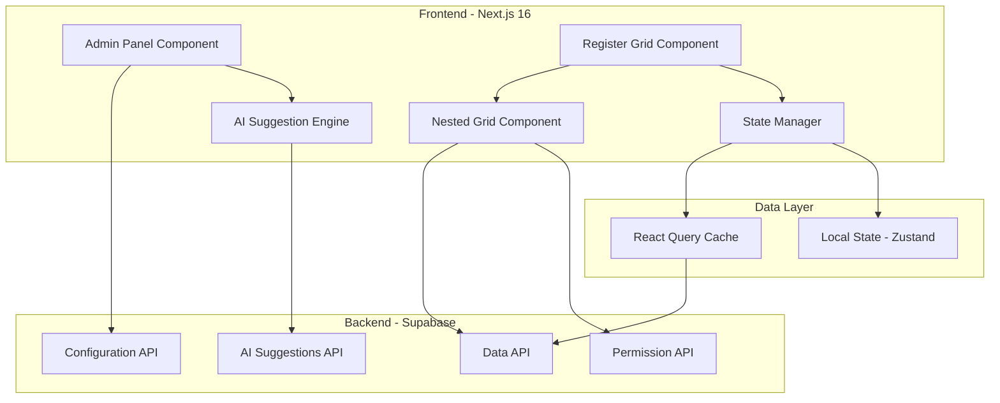

# Design Document: Register Nested Grids

## Overview

Das Register Nested Grids Feature ermöglicht die Anzeige von verknüpften Items (Tasks, Registers, Cost Book Data) direkt innerhalb von erweiterbaren Grid-Rows. Die Lösung nutzt ag-grid-react für performante Nested Grid Darstellung und integriert "10x besser" Features wie AI-Auto-Konfiguration, Inline-Editing, Drag&Drop und Dynamic Filters.

Die Architektur folgt einem komponentenbasierten Ansatz mit klarer Trennung zwischen:
- Admin-Konfiguration (Section Management, Column Selection)
- Grid-Darstellung (Expand/Collapse, Multi-Level Nesting)
- Data Management (Permissions, State Preservation, Caching)
- AI-Features (Auto-Suggestions, Change Highlights)

## Architecture

### High-Level Architecture



### Component Hierarchy

```
RegisterGridContainer
├── RegisterGrid (ag-grid-react)
│   ├── ExpandableRow
│   │   ├── ChevronIcon
│   │   └── NestedGridContainer
│   │       ├── NestedGrid (ag-grid-react)
│   │       │   ├── FilterBar
│   │       │   ├── EditableCell
│   │       │   ├── DragHandle (react-dnd)
│   │       │   └── NestedGridContainer (Level 2)
│   │       └── AIChangeHighlight
│   └── ScrollPositionManager
└── PermissionGuard

AdminPanelContainer
├── NestedGridsTab
│   ├── SectionList
│   │   ├── SectionItem
│   │   │   ├── ItemTypeSelector
│   │   │   ├── ColumnSelector (Dynamic)
│   │   │   ├── DisplayOrderManager (Drag&Drop)
│   │   │   └── AISuggestionPanel
│   │   └── AddSectionButton
│   └── EnableLinkedItemsToggle
```

## Components and Interfaces

### 1. Admin Panel Components

#### NestedGridsTab Component

```typescript
// 10x: AI-Auto-Konfiguration für Columns
interface NestedGridsTabProps {
  registerId: string;
  enableLinkedItems: boolean;
  onConfigChange: (config: NestedGridConfig) => void;
}

interface NestedGridConfig {
  sections: Section[];
  enableLinkedItems: boolean;
}

interface Section {
  id: string;
  itemType: ItemType;
  columns: ColumnConfig[];
  displayOrder: number;
  permissions?: PermissionConfig;
}

type ItemType = 'tasks' | 'registers' | 'cost_registers';

interface ColumnConfig {
  id: string;
  field: string;
  headerName: string;
  width?: number;
  editable?: boolean;
  order: number;
}

interface AISuggestion {
  type: 'column_combination' | 'filter_preset' | 'display_order';
  confidence: number;
  suggestion: {
    columns?: string[];
    reason: string;
    popularity?: number;
  };
}
```

#### Dynamic Column Selector

```typescript
// 10x: Dynamic Column-Selector basierend auf Type
interface ColumnSelectorProps {
  itemType: ItemType;
  selectedColumns: ColumnConfig[];
  onColumnsChange: (columns: ColumnConfig[]) => void;
  aiSuggestions?: AISuggestion[];
}

// Column definitions per item type
const COLUMN_DEFINITIONS: Record<ItemType, AvailableColumn[]> = {
  tasks: [
    { field: 'status', headerName: 'Status', type: 'select' },
    { field: 'dueDate', headerName: 'Due Date', type: 'date' },
    { field: 'assignee', headerName: 'Assignee', type: 'user' },
    { field: 'priority', headerName: 'Priority', type: 'select' },
    { field: 'progress', headerName: 'Progress', type: 'number' },
    { field: 'description', headerName: 'Description', type: 'text' },
    { field: 'tags', headerName: 'Tags', type: 'tags' },
    { field: 'createdAt', headerName: 'Created', type: 'date' },
    { field: 'updatedAt', headerName: 'Updated', type: 'date' },
    { field: 'estimatedHours', headerName: 'Est. Hours', type: 'number' },
    { field: 'actualHours', headerName: 'Actual Hours', type: 'number' }
  ],
  registers: [
    { field: 'name', headerName: 'Name', type: 'text' },
    { field: 'budget', headerName: 'Budget', type: 'currency' },
    { field: 'eac', headerName: 'EAC', type: 'currency' },
    { field: 'variance', headerName: 'Variance', type: 'currency' },
    { field: 'status', headerName: 'Status', type: 'select' },
    { field: 'owner', headerName: 'Owner', type: 'user' },
    { field: 'startDate', headerName: 'Start Date', type: 'date' },
    { field: 'endDate', headerName: 'End Date', type: 'date' },
    { field: 'progress', headerName: 'Progress', type: 'number' },
    { field: 'category', headerName: 'Category', type: 'select' },
    { field: 'description', headerName: 'Description', type: 'text' }
  ],
  cost_registers: [
    { field: 'eac', headerName: 'EAC', type: 'currency' },
    { field: 'variance', headerName: 'Variance', type: 'currency' },
    { field: 'commitments', headerName: 'Commitments', type: 'currency' },
    { field: 'actuals', headerName: 'Actuals', type: 'currency' },
    { field: 'budget', headerName: 'Budget', type: 'currency' },
    { field: 'forecast', headerName: 'Forecast', type: 'currency' },
    { field: 'costCode', headerName: 'Cost Code', type: 'text' },
    { field: 'category', headerName: 'Category', type: 'select' },
    { field: 'vendor', headerName: 'Vendor', type: 'text' },
    { field: 'invoiceDate', headerName: 'Invoice Date', type: 'date' },
    { field: 'paymentStatus', headerName: 'Payment Status', type: 'select' }
  ]
};

interface AvailableColumn {
  field: string;
  headerName: string;
  type: 'text' | 'number' | 'currency' | 'date' | 'select' | 'user' | 'tags';
}
```

### 2. Grid Display Components

#### RegisterGrid Component

```typescript
// 10x: No-Popups (alles inline)
interface RegisterGridProps {
  registerId: string;
  config: NestedGridConfig;
  onRowExpand: (rowId: string) => void;
  onRowCollapse: (rowId: string) => void;
}

interface RegisterGridState {
  expandedRows: Set<string>;
  scrollPosition: ScrollPosition;
  filterState: FilterState;
}

interface ScrollPosition {
  top: number;
  left: number;
  expandedRows: string[];
}
```

#### NestedGrid Component

```typescript
// 10x: Inline-Editing in Nested Grids
interface NestedGridProps {
  parentRowId: string;
  itemType: ItemType;
  columns: ColumnConfig[];
  nestingLevel: number; // Max 2
  permissions: PermissionConfig;
  onDataChange: (rowId: string, field: string, value: any) => Promise<void>;
}

interface EditableCell {
  rowId: string;
  field: string;
  value: any;
  editable: boolean;
  validationRules?: ValidationRule[];
}

interface ValidationRule {
  type: 'required' | 'min' | 'max' | 'pattern' | 'custom';
  value?: any;
  message: string;
  validator?: (value: any) => boolean;
}
```

#### Drag & Drop Integration

```typescript
// 10x: Drag&Drop Rows
import { useDrag, useDrop } from 'react-dnd';

interface DraggableRowProps {
  rowId: string;
  index: number;
  onReorder: (dragIndex: number, hoverIndex: number) => void;
  canDrag: boolean;
}

interface DragItem {
  type: 'NESTED_GRID_ROW';
  rowId: string;
  index: number;
}

// Usage in NestedGrid
const [{ isDragging }, drag] = useDrag({
  type: 'NESTED_GRID_ROW',
  item: { rowId, index },
  canDrag: () => hasEditPermission,
  collect: (monitor) => ({
    isDragging: monitor.isDragging()
  })
});

const [{ isOver }, drop] = useDrop({
  accept: 'NESTED_GRID_ROW',
  drop: (item: DragItem) => {
    onReorder(item.index, index);
  },
  collect: (monitor) => ({
    isOver: monitor.isOver()
  })
});
```

### 3. State Management

#### State Manager with React Query

```typescript
// State management using Zustand + React Query
import create from 'zustand';
import { useQuery, useMutation, useQueryClient } from '@tanstack/react-query';

interface NestedGridStore {
  expandedRows: Map<string, Set<string>>; // registerId -> Set of rowIds
  scrollPositions: Map<string, ScrollPosition>;
  filterStates: Map<string, FilterState>;
  
  expandRow: (registerId: string, rowId: string) => void;
  collapseRow: (registerId: string, rowId: string) => void;
  saveScrollPosition: (registerId: string, position: ScrollPosition) => void;
  restoreScrollPosition: (registerId: string) => ScrollPosition | null;
  setFilterState: (registerId: string, filters: FilterState) => void;
}

// React Query hooks
function useNestedGridData(parentRowId: string, itemType: ItemType) {
  return useQuery({
    queryKey: ['nested-grid', parentRowId, itemType],
    queryFn: () => fetchNestedGridData(parentRowId, itemType),
    staleTime: 5 * 60 * 1000, // 5 minutes
    refetchOnWindowFocus: true // 10x: Refresh on Return
  });
}

function useUpdateNestedGridItem() {
  const queryClient = useQueryClient();
  
  return useMutation({
    mutationFn: ({ rowId, field, value }: EditableCell) => 
      updateNestedGridItem(rowId, field, value),
    onSuccess: (data, variables) => {
      // Invalidate and refetch
      queryClient.invalidateQueries(['nested-grid', variables.rowId]);
    }
  });
}

function useReorderRows() {
  const queryClient = useQueryClient();
  
  return useMutation({
    mutationFn: ({ parentRowId, rowIds }: { parentRowId: string; rowIds: string[] }) =>
      reorderNestedGridRows(parentRowId, rowIds),
    onSuccess: (data, variables) => {
      queryClient.invalidateQueries(['nested-grid', variables.parentRowId]);
    }
  });
}
```

### 4. AI Features

#### AI Suggestion Engine

```typescript
// 10x: AI-Auto-Konfiguration (Vorschläge basierend auf Data)
interface AISuggestionEngine {
  generateColumnSuggestions: (
    itemType: ItemType,
    historicalData: HistoricalUsage[]
  ) => Promise<AISuggestion[]>;
  
  detectChanges: (
    previousData: any[],
    currentData: any[]
  ) => ChangeHighlight[];
  
  suggestFilters: (
    itemType: ItemType,
    userBehavior: UserBehavior[]
  ) => FilterSuggestion[];
}

interface ChangeHighlight {
  rowId: string;
  field: string;
  changeType: 'added' | 'modified' | 'deleted';
  previousValue?: any;
  currentValue?: any;
  timestamp: Date;
}

interface FilterSuggestion {
  field: string;
  operator: 'equals' | 'contains' | 'greaterThan' | 'lessThan' | 'between';
  value: any;
  reason: string;
  usageCount: number;
}

// 10x: AI-Highlight Changes ("3 neue Items seit letztem View")
function useAIChangeDetection(registerId: string, itemType: ItemType) {
  const previousData = usePreviousData(registerId, itemType);
  const currentData = useNestedGridData(registerId, itemType);
  
  return useQuery({
    queryKey: ['ai-changes', registerId, itemType],
    queryFn: async () => {
      if (!previousData || !currentData.data) return [];
      
      const changes = await detectChanges(previousData, currentData.data);
      return changes;
    },
    enabled: !!previousData && !!currentData.data
  });
}
```

### 5. Permission System

```typescript
interface PermissionConfig {
  canView: boolean;
  canEdit: boolean;
  canDelete: boolean;
  canReorder: boolean;
  restrictedFields?: string[];
}

interface PermissionGuard {
  checkPermission: (
    userId: string,
    resourceId: string,
    action: 'view' | 'edit' | 'delete' | 'reorder'
  ) => Promise<boolean>;
  
  getAlternative: (
    userId: string,
    resourceId: string
  ) => Promise<PermissionAlternative | null>;
}

// 10x: AI-Alternative ("Zeig Summary statt Details")
interface PermissionAlternative {
  type: 'summary' | 'limited_view' | 'request_access';
  message: string;
  data?: any;
}

function usePermissionCheck(resourceId: string, action: string) {
  return useQuery({
    queryKey: ['permission', resourceId, action],
    queryFn: () => checkPermission(resourceId, action),
    staleTime: 10 * 60 * 1000 // 10 minutes
  });
}
```

### 6. Filter System

```typescript
// 10x: Dynamic Filters
interface FilterState {
  filters: Filter[];
  activeFilters: string[];
}

interface Filter {
  id: string;
  field: string;
  operator: FilterOperator;
  value: any;
  label: string;
}

type FilterOperator = 
  | 'equals' 
  | 'notEquals' 
  | 'contains' 
  | 'notContains' 
  | 'greaterThan' 
  | 'lessThan' 
  | 'between' 
  | 'in' 
  | 'notIn';

interface FilterBarProps {
  itemType: ItemType;
  columns: ColumnConfig[];
  onFilterChange: (filters: Filter[]) => void;
  aiSuggestions?: FilterSuggestion[];
}

// Filter application logic
function applyFilters(data: any[], filters: Filter[]): any[] {
  return data.filter(item => {
    return filters.every(filter => {
      const value = item[filter.field];
      
      switch (filter.operator) {
        case 'equals':
          return value === filter.value;
        case 'contains':
          return String(value).toLowerCase().includes(String(filter.value).toLowerCase());
        case 'greaterThan':
          return value > filter.value;
        case 'lessThan':
          return value < filter.value;
        case 'between':
          return value >= filter.value[0] && value <= filter.value[1];
        case 'in':
          return filter.value.includes(value);
        default:
          return true;
      }
    });
  });
}
```

## Data Models

### Database Schema (Supabase)

```sql
-- Nested Grid Configuration
CREATE TABLE nested_grid_configs (
  id UUID PRIMARY KEY DEFAULT uuid_generate_v4(),
  register_id UUID NOT NULL REFERENCES registers(id) ON DELETE CASCADE,
  enable_linked_items BOOLEAN DEFAULT false,
  created_at TIMESTAMP WITH TIME ZONE DEFAULT NOW(),
  updated_at TIMESTAMP WITH TIME ZONE DEFAULT NOW()
);

-- Sections
CREATE TABLE nested_grid_sections (
  id UUID PRIMARY KEY DEFAULT uuid_generate_v4(),
  config_id UUID NOT NULL REFERENCES nested_grid_configs(id) ON DELETE CASCADE,
  item_type VARCHAR(50) NOT NULL CHECK (item_type IN ('tasks', 'registers', 'cost_registers')),
  display_order INTEGER NOT NULL,
  created_at TIMESTAMP WITH TIME ZONE DEFAULT NOW(),
  updated_at TIMESTAMP WITH TIME ZONE DEFAULT NOW()
);

-- Column Configurations
CREATE TABLE nested_grid_columns (
  id UUID PRIMARY KEY DEFAULT uuid_generate_v4(),
  section_id UUID NOT NULL REFERENCES nested_grid_sections(id) ON DELETE CASCADE,
  field VARCHAR(100) NOT NULL,
  header_name VARCHAR(200) NOT NULL,
  width INTEGER,
  editable BOOLEAN DEFAULT false,
  display_order INTEGER NOT NULL,
  created_at TIMESTAMP WITH TIME ZONE DEFAULT NOW()
);

-- User State (Scroll positions, expanded rows, filters)
CREATE TABLE nested_grid_user_state (
  id UUID PRIMARY KEY DEFAULT uuid_generate_v4(),
  user_id UUID NOT NULL REFERENCES users(id) ON DELETE CASCADE,
  register_id UUID NOT NULL REFERENCES registers(id) ON DELETE CASCADE,
  expanded_rows JSONB DEFAULT '[]',
  scroll_position JSONB,
  filter_state JSONB,
  last_viewed_at TIMESTAMP WITH TIME ZONE DEFAULT NOW(),
  UNIQUE(user_id, register_id)
);

-- AI Suggestions Cache
CREATE TABLE ai_suggestions (
  id UUID PRIMARY KEY DEFAULT uuid_generate_v4(),
  item_type VARCHAR(50) NOT NULL,
  suggestion_type VARCHAR(50) NOT NULL,
  suggestion_data JSONB NOT NULL,
  confidence NUMERIC(3,2),
  usage_count INTEGER DEFAULT 0,
  created_at TIMESTAMP WITH TIME ZONE DEFAULT NOW(),
  expires_at TIMESTAMP WITH TIME ZONE
);

-- Change Tracking for AI Highlights
CREATE TABLE nested_grid_changes (
  id UUID PRIMARY KEY DEFAULT uuid_generate_v4(),
  parent_row_id UUID NOT NULL,
  item_type VARCHAR(50) NOT NULL,
  row_id UUID NOT NULL,
  field VARCHAR(100),
  change_type VARCHAR(20) CHECK (change_type IN ('added', 'modified', 'deleted')),
  previous_value JSONB,
  current_value JSONB,
  changed_at TIMESTAMP WITH TIME ZONE DEFAULT NOW()
);

-- Indexes for performance
CREATE INDEX idx_nested_grid_configs_register ON nested_grid_configs(register_id);
CREATE INDEX idx_nested_grid_sections_config ON nested_grid_sections(config_id);
CREATE INDEX idx_nested_grid_columns_section ON nested_grid_columns(section_id);
CREATE INDEX idx_nested_grid_user_state_user_register ON nested_grid_user_state(user_id, register_id);
CREATE INDEX idx_nested_grid_changes_parent_row ON nested_grid_changes(parent_row_id, item_type);
CREATE INDEX idx_ai_suggestions_type ON ai_suggestions(item_type, suggestion_type);
```

### TypeScript Data Models

```typescript
// Frontend data models matching database schema
interface NestedGridConfigModel {
  id: string;
  registerId: string;
  enableLinkedItems: boolean;
  sections: SectionModel[];
  createdAt: Date;
  updatedAt: Date;
}

interface SectionModel {
  id: string;
  configId: string;
  itemType: ItemType;
  displayOrder: number;
  columns: ColumnModel[];
  createdAt: Date;
  updatedAt: Date;
}

interface ColumnModel {
  id: string;
  sectionId: string;
  field: string;
  headerName: string;
  width?: number;
  editable: boolean;
  displayOrder: number;
  createdAt: Date;
}

interface UserStateModel {
  id: string;
  userId: string;
  registerId: string;
  expandedRows: string[];
  scrollPosition: ScrollPosition | null;
  filterState: FilterState | null;
  lastViewedAt: Date;
}

interface ChangeModel {
  id: string;
  parentRowId: string;
  itemType: ItemType;
  rowId: string;
  field?: string;
  changeType: 'added' | 'modified' | 'deleted';
  previousValue?: any;
  currentValue?: any;
  changedAt: Date;
}
```

## Correctness Properties

*Eine Property ist eine Eigenschaft oder ein Verhalten, das über alle gültigen Ausführungen eines Systems wahr sein sollte - im Wesentlichen eine formale Aussage darüber, was das System tun soll. Properties dienen als Brücke zwischen menschenlesbaren Spezifikationen und maschinenverifizierbaren Korrektheitsgarantien.*


### Property Reflection

Nach der Prework-Analyse identifiziere ich folgende Redundanzen und Konsolidierungsmöglichkeiten:

**Redundanzen identifiziert:**

1. **Properties 1.2 und 1.3** (Enable Linked Items read-only/editable): Diese können zu einer Property kombiniert werden, die den Zustand basierend auf dem Flag testet.

2. **Properties 4.1, 4.2, 4.4** (Chevron-Icon Anzeige und Expand): Diese testen ähnliche Verhaltensweisen und können zu einer umfassenden Expand/Collapse Property kombiniert werden.

3. **Properties 5.1 und 5.5** (Scroll-Position und Expand-State erhalten): Beide testen State-Preservation beim Navigation Return und können kombiniert werden.

4. **Properties 7.1 und 7.2** (Editierbare Cells und Inline-Editing): Diese testen das gleiche Feature und können kombiniert werden.

5. **Properties 8.1 und 8.2** (Drag-Handle und visuelles Feedback): Diese sind Teil des gleichen Drag&Drop Flows und können kombiniert werden.

6. **Properties 9.2 und 9.3** (Einzelner Filter und Multi-Filter): Diese können zu einer Property kombiniert werden, die Filter-Anwendung generell testet.

7. **Properties 6.1, 6.2, 6.3** (Permission Handling): Diese können zu einer umfassenden Permission Property kombiniert werden.

**Konsolidierte Properties:**

Nach der Reflection bleiben folgende einzigartige, nicht-redundante Properties übrig:

- Admin Panel State basierend auf Enable Flag
- Section Management (Add/Remove)
- Dynamic Column Selection basierend auf Item Type
- Nested Grid Expand/Collapse mit Multi-Level Support
- State Preservation (Scroll + Expand State) beim Navigation Return
- Data Refresh mit AI Change Highlights
- Permission-basiertes Verhalten mit Alternativen
- Inline Editing mit Validation und Error Handling
- Drag & Drop Reordering mit Error Handling
- Filter Application und State Preservation
- Costbook 4.0 Integration

### Correctness Properties

**Property 1: Admin Panel Editability basierend auf Enable Flag**

*Für jedes* Register, wenn "Enable Linked Items" aktiviert ist, dann sollen alle Nested Grid Konfigurationsoptionen editierbar sein; wenn deaktiviert, sollen sie read-only sein.

**Validates: Requirements 1.2, 1.3**

---

**Property 2: Section Management Invariant**

*Für jede* Section-Operation (Add/Remove), die Anzahl der Sections in der Konfigurationsliste soll sich entsprechend ändern (Add: +1, Remove: -1), und Remove-Operationen sollen eine Bestätigung erfordern.

**Validates: Requirements 2.1, 2.2**

---

**Property 3: Minimum Column Availability**

*Für jede* Section-Konfiguration, unabhängig vom Item Type, sollen mindestens 10 Columns zur Auswahl verfügbar sein.

**Validates: Requirements 2.4**

---

**Property 4: AI Suggestions Presence**

*Für jede* Section-Konfiguration, sollen AI-generierte Vorschläge für Column-Kombinationen angezeigt werden.

**Validates: Requirements 2.6**

---

**Property 5: Dynamic Column Selection basierend auf Item Type**

*Für jeden* Item Type Wechsel, sollen die verfügbaren Columns dynamisch aktualisiert werden, und alle zuvor ausgewählten Columns, die für den neuen Type ungültig sind, sollen entfernt werden.

**Validates: Requirements 3.4**

---

**Property 6: Nested Grid Expand/Collapse Behavior**

*Für jede* Row mit verknüpften Items, soll ein Chevron-Icon angezeigt werden; beim Klick soll die Row expandieren und das Nested Grid anzeigen; bei erneutem Klick soll die Row kollabieren (Idempotenz).

**Validates: Requirements 4.1, 4.2, 4.6**

---

**Property 7: Multi-Level Nesting Constraint**

*Für jedes* Nested Grid, soll Multi-Level Nesting bis maximal 2 Ebenen unterstützt werden; Versuche, eine 3. Ebene zu öffnen, sollen blockiert werden.

**Validates: Requirements 4.5**

---

**Property 8: Nested Items Chevron Display**

*Für jedes* Item in einem Nested Grid, das selbst verknüpfte Items hat, soll ein Chevron-Icon für weitere Expansion angezeigt werden.

**Validates: Requirements 4.4**

---

**Property 9: State Preservation Round-Trip**

*Für jede* Navigation weg von und zurück zu einer Register View, sollen sowohl Scroll-Position als auch Expand/Collapse State aller Rows wiederhergestellt werden.

**Validates: Requirements 5.1, 5.5**

---

**Property 10: Data Refresh on Return**

*Für jeden* Return zu einer View mit erweiterten Nested Grids, sollen die Nested Grid Daten refreshed werden.

**Validates: Requirements 5.2**

---

**Property 11: AI Change Highlights**

*Für alle* Änderungen in Nested Grid Items seit dem letzten View, sollen AI-generierte Highlights für geänderte Items angezeigt werden, und neue Items sollen mit einer Notification inklusive Anzahl angezeigt werden.

**Validates: Requirements 5.3, 5.4**

---

**Property 12: Permission-basiertes Nested Grid Verhalten**

*Für jeden* Benutzer ohne View-Rechte für verknüpfte Items, soll das Chevron-Icon deaktiviert/ausgeblendet sein; Versuche zu öffnen sollen eine Warning-Message anzeigen; AI-generierte Alternativen (z.B. Summary) sollen angeboten werden.

**Validates: Requirements 6.1, 6.2, 6.3**

---

**Property 13: Permission Check vor Datenladen**

*Für jede* Nested Grid Daten-Anfrage, sollen Permissions auf Section-Ebene geprüft werden, bevor Daten geladen werden.

**Validates: Requirements 6.4**

---

**Property 14: Inline Editing ohne Popups**

*Für jede* editierbare Cell in einem Nested Grid (mit Edit-Rechten), soll die Änderung inline ohne Popup möglich sein, mit visueller Kennzeichnung der Editierbarkeit.

**Validates: Requirements 7.1, 7.2**

---

**Property 15: Save Operation mit Backend Sync**

*Für jede* Speicher-Operation in einem Nested Grid, soll die Änderung an das Backend gesendet werden; bei Erfolg soll die Cell aktualisiert werden; bei Fehler soll eine Fehlermeldung angezeigt und der vorherige Wert wiederhergestellt werden.

**Validates: Requirements 7.3, 7.4**

---

**Property 16: Validation vor Speichern**

*Für jede* Änderung in editierbaren Fields, sollen Validation Rules angewendet werden, bevor die Änderung gespeichert wird.

**Validates: Requirements 7.5**

---

**Property 17: Drag & Drop mit visuellem Feedback**

*Für jede* Row-Selection in einem Nested Grid (mit Edit-Rechten), soll ein Drag-Handle angezeigt werden; beim Ziehen soll visuelles Feedback für die Drop-Position angezeigt werden.

**Validates: Requirements 8.1, 8.2**

---

**Property 18: Row Reorder mit Backend Sync**

*Für jede* Drop-Operation, soll die Row-Reihenfolge aktualisiert und an das Backend gesendet werden; bei Fehler soll die ursprüngliche Reihenfolge wiederhergestellt und eine Fehlermeldung angezeigt werden.

**Validates: Requirements 8.3, 8.4**

---

**Property 19: Drag & Drop Permission Constraint**

*Für jedes* Nested Grid, soll Drag & Drop nur für Benutzer mit entsprechenden Edit-Rechten aktiviert sein.

**Validates: Requirements 8.5**

---

**Property 20: Filter Bar Presence**

*Für jedes* angezeigte Nested Grid, soll eine Filter-Leiste mit konfigurierbaren Filtern angezeigt werden.

**Validates: Requirements 9.1**

---

**Property 21: Filter Application Logic**

*Für jeden* angewendeten Filter (einzeln oder kombiniert), sollen nur Items angezeigt werden, die allen Filter-Kriterien entsprechen.

**Validates: Requirements 9.2, 9.3**

---

**Property 22: Filter Removal Round-Trip**

*Für jede* Filter-Anwendung und anschließende Entfernung, sollen alle Items wieder angezeigt werden (Rückkehr zum Ursprungszustand).

**Validates: Requirements 9.4**

---

**Property 23: Filter State Preservation**

*Für jede* Navigation weg von und zurück zu einer View, soll der Filter-State erhalten bleiben.

**Validates: Requirements 9.5**

---

**Property 24: AI Filter Suggestions**

*Für jedes* Nested Grid, sollen AI-Vorschläge für häufig verwendete Filter-Kombinationen angezeigt werden.

**Validates: Requirements 9.6**

---

**Property 25: Costbook 4.0 Integration Completeness**

*Für die* Costbook 4.0 View, sollen alle konfigurierten Nested Grid Features (Inline-Editing, Filters, Drag&Drop, Multi-Level Nesting) vollständig unterstützt werden.

**Validates: Requirements 10.4**

## Error Handling

### Error Categories

1. **Permission Errors**
   - User lacks view/edit permissions
   - Section-level permission denied
   - Response: Display warning message, offer AI-generated alternatives (summary view, request access)

2. **Data Loading Errors**
   - Network failure during nested grid data fetch
   - Backend timeout
   - Response: Show error message, provide retry button, cache last known good state

3. **Save Operation Errors**
   - Validation failure (client-side)
   - Backend save failure
   - Concurrent modification conflict
   - Response: Display specific error message, restore previous value, highlight problematic field

4. **Drag & Drop Errors**
   - Reorder operation fails on backend
   - Invalid drop target
   - Response: Restore original order, show error notification

5. **Configuration Errors**
   - Invalid column configuration
   - Missing required fields
   - Response: Prevent save, highlight validation errors, suggest corrections

6. **State Restoration Errors**
   - Corrupted state in local storage
   - Incompatible state version
   - Response: Clear corrupted state, use default state, log error for debugging

### Error Handling Patterns

```typescript
// Generic error handler for nested grid operations
interface ErrorHandler {
  handleError: (error: NestedGridError) => ErrorResponse;
  logError: (error: NestedGridError) => void;
  notifyUser: (message: string, severity: 'error' | 'warning' | 'info') => void;
}

interface NestedGridError {
  type: ErrorType;
  message: string;
  context?: any;
  recoverable: boolean;
}

type ErrorType = 
  | 'permission_denied'
  | 'data_load_failed'
  | 'save_failed'
  | 'validation_failed'
  | 'reorder_failed'
  | 'config_invalid'
  | 'state_corrupted';

interface ErrorResponse {
  userMessage: string;
  action: 'retry' | 'restore' | 'alternative' | 'none';
  alternative?: PermissionAlternative;
}

// Example: Save operation with error handling
async function saveNestedGridCell(
  rowId: string,
  field: string,
  value: any
): Promise<SaveResult> {
  try {
    // Validate before save
    const validationResult = validateField(field, value);
    if (!validationResult.valid) {
      return {
        success: false,
        error: {
          type: 'validation_failed',
          message: validationResult.message,
          recoverable: true
        }
      };
    }
    
    // Attempt save
    const result = await updateNestedGridItem(rowId, field, value);
    return { success: true, data: result };
    
  } catch (error) {
    // Handle backend errors
    if (error.code === 'PERMISSION_DENIED') {
      return {
        success: false,
        error: {
          type: 'permission_denied',
          message: 'You do not have permission to edit this field',
          recoverable: false
        }
      };
    }
    
    // Generic error
    return {
      success: false,
      error: {
        type: 'save_failed',
        message: 'Failed to save changes. Please try again.',
        recoverable: true
      }
    };
  }
}
```

### Retry Logic

```typescript
// Exponential backoff for retryable operations
async function withRetry<T>(
  operation: () => Promise<T>,
  maxRetries: number = 3,
  baseDelay: number = 1000
): Promise<T> {
  let lastError: Error;
  
  for (let attempt = 0; attempt < maxRetries; attempt++) {
    try {
      return await operation();
    } catch (error) {
      lastError = error;
      
      // Don't retry non-recoverable errors
      if (!isRecoverableError(error)) {
        throw error;
      }
      
      // Wait with exponential backoff
      const delay = baseDelay * Math.pow(2, attempt);
      await new Promise(resolve => setTimeout(resolve, delay));
    }
  }
  
  throw lastError;
}

function isRecoverableError(error: any): boolean {
  const recoverableCodes = ['NETWORK_ERROR', 'TIMEOUT', 'SERVER_ERROR'];
  return recoverableCodes.includes(error.code);
}
```

## Testing Strategy

### Dual Testing Approach

Dieses Feature erfordert sowohl Unit Tests als auch Property-Based Tests für umfassende Coverage:

**Unit Tests** fokussieren auf:
- Spezifische Beispiele (z.B. Tasks Columns werden bei Item Type "Tasks" angezeigt)
- Edge Cases (z.B. leere Nested Grids, maximale Nesting-Tiefe)
- Error Conditions (z.B. Permission Denied, Save Failures)
- Integration Points (z.B. Costbook 4.0 Integration)

**Property-Based Tests** fokussieren auf:
- Universelle Properties über alle Inputs (z.B. Filter-Anwendung funktioniert für beliebige Filter-Kombinationen)
- State Preservation (z.B. Navigation Round-Trips erhalten State)
- Invarianten (z.B. Multi-Level Nesting nie > 2 Ebenen)
- Round-Trip Properties (z.B. Expand dann Collapse kehrt zum Ursprung zurück)

### Property-Based Testing Configuration

**Library:** fast-check (für TypeScript/JavaScript)

**Configuration:**
- Minimum 100 Iterationen pro Property Test
- Jeder Test muss die Design Property referenzieren
- Tag Format: `Feature: register-nested-grids, Property {number}: {property_text}`

**Example Property Test:**

```typescript
import fc from 'fast-check';

// Feature: register-nested-grids, Property 6: Nested Grid Expand/Collapse Behavior
describe('Property 6: Expand/Collapse Idempotence', () => {
  it('should return to original state after expand then collapse', () => {
    fc.assert(
      fc.property(
        fc.record({
          rowId: fc.uuid(),
          hasLinkedItems: fc.constant(true),
          initialState: fc.constant('collapsed')
        }),
        async ({ rowId, hasLinkedItems, initialState }) => {
          // Setup
          const grid = createTestGrid();
          const row = grid.getRow(rowId);
          
          // Initial state should be collapsed
          expect(row.isExpanded()).toBe(false);
          
          // Expand
          await grid.expandRow(rowId);
          expect(row.isExpanded()).toBe(true);
          expect(row.getNestedGrid()).toBeDefined();
          
          // Collapse
          await grid.collapseRow(rowId);
          expect(row.isExpanded()).toBe(false);
          expect(row.getNestedGrid()).toBeNull();
        }
      ),
      { numRuns: 100 }
    );
  });
});
```

### Test Coverage Requirements

**Admin Panel:**
- Unit tests für UI-Komponenten (Section Management, Column Selector)
- Property tests für Dynamic Column Selection basierend auf Item Type
- Integration tests für AI Suggestions

**Grid Display:**
- Unit tests für Expand/Collapse UI
- Property tests für Multi-Level Nesting Constraint
- Property tests für State Preservation Round-Trips

**Inline Editing:**
- Unit tests für Validation Rules
- Property tests für Save/Error Handling
- Integration tests für Backend Sync

**Drag & Drop:**
- Unit tests für Drag Handlers
- Property tests für Reorder Operations
- Property tests für Permission Constraints

**Filters:**
- Unit tests für Filter UI
- Property tests für Filter Application Logic
- Property tests für Filter State Preservation

**Permissions:**
- Unit tests für Permission Checks
- Property tests für Permission-basiertes Verhalten
- Integration tests für AI Alternatives

**AI Features:**
- Unit tests für AI Suggestion Display
- Integration tests für Change Detection
- Property tests für Suggestion Presence

### Testing Tools

- **Unit Testing:** Jest + React Testing Library
- **Property-Based Testing:** fast-check
- **E2E Testing:** Playwright (für Costbook 4.0 Integration)
- **Component Testing:** Storybook (für isolierte Component Tests)
- **API Mocking:** MSW (Mock Service Worker)

### Test Data Generation

```typescript
// Generators for property-based tests
const arbitraryItemType = fc.constantFrom('tasks', 'registers', 'cost_registers');

const arbitrarySection = fc.record({
  id: fc.uuid(),
  itemType: arbitraryItemType,
  columns: fc.array(arbitraryColumnConfig, { minLength: 1, maxLength: 15 }),
  displayOrder: fc.integer({ min: 0, max: 100 })
});

const arbitraryColumnConfig = fc.record({
  id: fc.uuid(),
  field: fc.string({ minLength: 1, maxLength: 50 }),
  headerName: fc.string({ minLength: 1, maxLength: 100 }),
  width: fc.option(fc.integer({ min: 50, max: 500 })),
  editable: fc.boolean(),
  order: fc.integer({ min: 0, max: 100 })
});

const arbitraryFilter = fc.record({
  id: fc.uuid(),
  field: fc.string(),
  operator: fc.constantFrom('equals', 'contains', 'greaterThan', 'lessThan', 'between'),
  value: fc.anything(),
  label: fc.string()
});

const arbitraryPermissionConfig = fc.record({
  canView: fc.boolean(),
  canEdit: fc.boolean(),
  canDelete: fc.boolean(),
  canReorder: fc.boolean(),
  restrictedFields: fc.option(fc.array(fc.string()))
});
```

### Performance Testing

**Key Metrics:**
- Nested Grid render time: < 200ms für bis zu 100 Rows
- Expand/Collapse animation: < 300ms
- Filter application: < 100ms für bis zu 1000 Items
- Drag & Drop feedback: < 50ms
- State restoration: < 500ms

**Load Testing:**
- Test mit bis zu 1000 Rows im Parent Grid
- Test mit bis zu 500 Items pro Nested Grid
- Test mit 2-Level Nesting und jeweils 100 Items pro Level
- Test mit 10+ aktiven Filtern gleichzeitig

### Accessibility Testing

- Keyboard navigation für Expand/Collapse
- Screen reader support für Nested Grids
- ARIA labels für Drag Handles
- Focus management beim Expand/Collapse
- High contrast mode support
