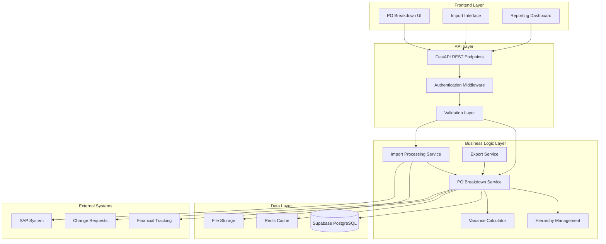

# Design Document

## Overview

The SAP PO Breakdown Management system provides comprehensive import, management, and analysis capabilities for hierarchical Purchase Order cost structures. The system integrates with existing FastAPI backend architecture, leverages Supabase for data persistence, and provides both REST API endpoints and frontend interfaces for managing complex cost hierarchies.

The design emphasizes performance, data integrity, and seamless integration with existing financial tracking and variance calculation systems. The architecture supports both SAP standard structures and custom user-defined hierarchies while maintaining complete audit trails and version control.

## Architecture

### System Components



### Data Flow Architecture

1. **Import Flow**: CSV/Excel files → Validation → Parsing → Hierarchy Construction → Database Storage
2. **Management Flow**: UI Operations → API Validation → Business Logic → Database Updates → Cache Invalidation
3. **Integration Flow**: PO Changes → Variance Calculation → Financial System Updates → Change Request Links
4. **Export Flow**: Query Parameters → Data Aggregation → Format Conversion → File Generation

## Components and Interfaces

### Core Services

#### POBreakdownService
```python
class POBreakdownService:
    """Core service for PO breakdown management and operations."""
    
    async def create_breakdown(self, breakdown_data: POBreakdownCreate) -> POBreakdownResponse
    async def get_breakdown(self, breakdown_id: UUID) -> POBreakdownResponse
    async def update_breakdown(self, breakdown_id: UUID, updates: POBreakdownUpdate) -> POBreakdownResponse
    async def delete_breakdown(self, breakdown_id: UUID) -> bool
    async def get_project_hierarchy(self, project_id: UUID) -> POHierarchyResponse
    async def move_breakdown_item(self, item_id: UUID, new_parent_id: UUID) -> POBreakdownResponse
    async def calculate_hierarchy_totals(self, project_id: UUID) -> Dict[str, Decimal]
    async def get_breakdown_history(self, breakdown_id: UUID) -> List[POBreakdownVersion]
```

#### ImportProcessingService
```python
class ImportProcessingService:
    """Service for processing SAP PO data imports."""
    
    async def validate_import_file(self, file: UploadFile) -> ImportValidationResult
    async def process_csv_import(self, file: UploadFile, project_id: UUID, config: ImportConfig) -> ImportResult
    async def process_excel_import(self, file: UploadFile, project_id: UUID, config: ImportConfig) -> ImportResult
    async def create_import_batch(self, project_id: UUID, source: str) -> UUID
    async def get_import_status(self, batch_id: UUID) -> ImportStatus
    async def resolve_import_conflicts(self, batch_id: UUID, resolutions: List[ConflictResolution]) -> ImportResult
```

#### HierarchyManager
```python
class HierarchyManager:
    """Manages hierarchical relationships and integrity."""
    
    async def validate_hierarchy_move(self, item_id: UUID, new_parent_id: UUID) -> ValidationResult
    async def update_parent_totals(self, parent_id: UUID) -> None
    async def get_hierarchy_path(self, item_id: UUID) -> List[POBreakdownResponse]
    async def get_children(self, parent_id: UUID, recursive: bool = False) -> List[POBreakdownResponse]
    async def validate_circular_reference(self, item_id: UUID, potential_parent_id: UUID) -> bool
    async def rebuild_hierarchy_totals(self, project_id: UUID) -> None
```

#### VarianceCalculator
```python
class VarianceCalculator:
    """Calculates financial variances and performance metrics."""
    
    async def calculate_item_variance(self, breakdown_id: UUID) -> VarianceResult
    async def calculate_project_variance(self, project_id: UUID) -> ProjectVarianceResult
    async def get_variance_trends(self, project_id: UUID, period: str) -> List[VarianceTrend]
    async def identify_variance_outliers(self, project_id: UUID, threshold: float) -> List[VarianceOutlier]
    async def generate_variance_alerts(self, project_id: UUID) -> List[VarianceAlert]
```

### API Endpoints

#### PO Breakdown Management
- `POST /api/v1/projects/{project_id}/po-breakdowns` - Create PO breakdown item
- `GET /api/v1/projects/{project_id}/po-breakdowns` - List project PO breakdowns
- `GET /api/v1/po-breakdowns/{breakdown_id}` - Get specific breakdown item
- `PUT /api/v1/po-breakdowns/{breakdown_id}` - Update breakdown item
- `DELETE /api/v1/po-breakdowns/{breakdown_id}` - Delete breakdown item
- `GET /api/v1/projects/{project_id}/po-hierarchy` - Get complete hierarchy
- `POST /api/v1/po-breakdowns/{breakdown_id}/move` - Move item in hierarchy

#### Import and Export
- `POST /api/v1/projects/{project_id}/po-breakdowns/import` - Import PO data
- `GET /api/v1/import-batches/{batch_id}/status` - Get import status
- `POST /api/v1/import-batches/{batch_id}/resolve-conflicts` - Resolve import conflicts
- `GET /api/v1/projects/{project_id}/po-breakdowns/export` - Export PO data
- `GET /api/v1/po-breakdowns/{breakdown_id}/history` - Get version history

#### Financial Integration
- `GET /api/v1/projects/{project_id}/po-variance` - Get project variance analysis
- `GET /api/v1/po-breakdowns/{breakdown_id}/variance` - Get item variance details
- `POST /api/v1/po-breakdowns/{breakdown_id}/link-change-request` - Link to change request
- `GET /api/v1/projects/{project_id}/po-financial-summary` - Get financial summary

## Data Models

### Core Models

#### POBreakdown
```python
class POBreakdownCreate(BaseModel):
    name: str
    code: Optional[str] = None
    sap_po_number: Optional[str] = None
    sap_line_item: Optional[str] = None
    parent_breakdown_id: Optional[UUID] = None
    cost_center: Optional[str] = None
    gl_account: Optional[str] = None
    planned_amount: Decimal = Decimal('0.00')
    committed_amount: Decimal = Decimal('0.00')
    actual_amount: Decimal = Decimal('0.00')
    currency: str = 'USD'
    breakdown_type: POBreakdownType
    category: Optional[str] = None
    subcategory: Optional[str] = None
    custom_fields: Dict[str, Any] = {}
    tags: List[str] = []
    notes: Optional[str] = None

class POBreakdownResponse(BaseModel):
    id: UUID
    project_id: UUID
    name: str
    code: Optional[str]
    sap_po_number: Optional[str]
    sap_line_item: Optional[str]
    hierarchy_level: int
    parent_breakdown_id: Optional[UUID]
    cost_center: Optional[str]
    gl_account: Optional[str]
    planned_amount: Decimal
    committed_amount: Decimal
    actual_amount: Decimal
    remaining_amount: Decimal
    currency: str
    exchange_rate: Decimal
    breakdown_type: POBreakdownType
    category: Optional[str]
    subcategory: Optional[str]
    custom_fields: Dict[str, Any]
    tags: List[str]
    notes: Optional[str]
    import_batch_id: Optional[UUID]
    import_source: Optional[str]
    version: int
    is_active: bool
    created_by: UUID
    created_at: datetime
    updated_at: datetime
    children: Optional[List['POBreakdownResponse']] = None
    variance_data: Optional[VarianceData] = None

class POBreakdownUpdate(BaseModel):
    name: Optional[str] = None
    code: Optional[str] = None
    parent_breakdown_id: Optional[UUID] = None
    cost_center: Optional[str] = None
    gl_account: Optional[str] = None
    planned_amount: Optional[Decimal] = None
    committed_amount: Optional[Decimal] = None
    actual_amount: Optional[Decimal] = None
    currency: Optional[str] = None
    category: Optional[str] = None
    subcategory: Optional[str] = None
    custom_fields: Optional[Dict[str, Any]] = None
    tags: Optional[List[str]] = None
    notes: Optional[str] = None
```

#### Import Models
```python
class ImportConfig(BaseModel):
    column_mappings: Dict[str, str]  # CSV column to field mappings
    hierarchy_column: Optional[str] = None
    parent_reference_column: Optional[str] = None
    skip_header_rows: int = 1
    currency_default: str = 'USD'
    breakdown_type_default: POBreakdownType = POBreakdownType.sap_standard
    conflict_resolution: ConflictResolution = ConflictResolution.skip
    validate_amounts: bool = True
    create_missing_parents: bool = True

class ImportResult(BaseModel):
    batch_id: UUID
    status: ImportStatus
    total_records: int
    processed_records: int
    successful_records: int
    failed_records: int
    conflicts: List[ImportConflict]
    errors: List[ImportError]
    warnings: List[ImportWarning]
    processing_time_ms: int
    created_hierarchies: int
    updated_records: int

class ImportConflict(BaseModel):
    row_number: int
    conflict_type: ConflictType
    existing_record: Dict[str, Any]
    new_record: Dict[str, Any]
    suggested_resolution: ConflictResolution
    field_conflicts: List[str]
```

#### Hierarchy Models
```python
class POHierarchyResponse(BaseModel):
    project_id: UUID
    root_items: List[POBreakdownResponse]
    total_levels: int
    total_items: int
    financial_summary: HierarchyFinancialSummary
    last_updated: datetime

class HierarchyFinancialSummary(BaseModel):
    total_planned: Decimal
    total_committed: Decimal
    total_actual: Decimal
    total_remaining: Decimal
    variance_amount: Decimal
    variance_percentage: Decimal
    currency: str
    by_category: Dict[str, CategorySummary]
    by_level: Dict[int, LevelSummary]

class HierarchyMoveRequest(BaseModel):
    new_parent_id: Optional[UUID] = None
    new_position: Optional[int] = None
    validate_only: bool = False
```

#### Variance Models
```python
class VarianceData(BaseModel):
    planned_vs_actual: Decimal
    planned_vs_committed: Decimal
    committed_vs_actual: Decimal
    variance_percentage: Decimal
    variance_status: VarianceStatus
    trend_direction: TrendDirection
    last_calculated: datetime

class ProjectVarianceResult(BaseModel):
    project_id: UUID
    overall_variance: VarianceData
    by_category: Dict[str, VarianceData]
    by_hierarchy_level: Dict[int, VarianceData]
    top_variances: List[VarianceOutlier]
    variance_trends: List[VarianceTrend]
    recommendations: List[VarianceRecommendation]

class VarianceAlert(BaseModel):
    breakdown_id: UUID
    alert_type: VarianceAlertType
    severity: AlertSeverity
    threshold_exceeded: Decimal
    current_variance: Decimal
    message: str
    recommended_actions: List[str]
```

### Enums

```python
class POBreakdownType(str, Enum):
    sap_standard = "sap_standard"
    custom_hierarchy = "custom_hierarchy"
    cost_center = "cost_center"
    work_package = "work_package"

class ImportStatus(str, Enum):
    pending = "pending"
    processing = "processing"
    completed = "completed"
    failed = "failed"
    partially_completed = "partially_completed"

class ConflictType(str, Enum):
    duplicate_code = "duplicate_code"
    duplicate_sap_reference = "duplicate_sap_reference"
    parent_not_found = "parent_not_found"
    invalid_hierarchy = "invalid_hierarchy"
    amount_mismatch = "amount_mismatch"

class ConflictResolution(str, Enum):
    skip = "skip"
    update = "update"
    create_new = "create_new"
    merge = "merge"
    manual = "manual"

class VarianceStatus(str, Enum):
    on_track = "on_track"
    minor_variance = "minor_variance"
    significant_variance = "significant_variance"
    critical_variance = "critical_variance"

class VarianceAlertType(str, Enum):
    budget_exceeded = "budget_exceeded"
    commitment_exceeded = "commitment_exceeded"
    negative_variance = "negative_variance"
    trend_deteriorating = "trend_deteriorating"
```

## Correctness Properties

*A property is a characteristic or behavior that should hold true across all valid executions of a system-essentially, a formal statement about what the system should do. Properties serve as the bridge between human-readable specifications and machine-verifiable correctness guarantees.*

<function_calls>
<invoke name="prework">
<parameter name="featureName">sap-po-breakdown-management

### Property Reflection

After analyzing all acceptance criteria, I identified several areas where properties can be consolidated:

**Consolidation Opportunities:**
- Properties 1.1-1.6 (Import validation and processing) can be combined into comprehensive import validation properties
- Properties 3.2, 3.4, 5.3 (Automatic recalculation) can be unified into a single recalculation consistency property
- Properties 6.1, 6.2, 6.4 (Version control) can be combined into comprehensive audit trail properties
- Properties 7.1-7.6 (Search and filtering) can be consolidated into comprehensive query correctness properties

**Final Property Set:**

### Converting EARS to Properties

Based on the prework analysis, here are the key correctness properties for the SAP PO Breakdown Management system:

**Property 1: Import Data Validation and Processing**
*For any* CSV or Excel file upload, the system should correctly validate file format, process all standard SAP fields, create proper hierarchical relationships, detect duplicates, provide detailed error feedback, and generate unique batch IDs for successful imports.
**Validates: Requirements 1.1, 1.2, 1.3, 1.4, 1.5, 1.6**

**Property 2: Hierarchy Integrity and Management**
*For any* PO breakdown hierarchy operation (creation, modification, deletion, movement), the system should maintain hierarchy depth limits, prevent circular references, automatically recalculate parent totals, and provide proper deletion handling while preserving data integrity.
**Validates: Requirements 2.1, 2.2, 2.3, 2.4, 2.5**

**Property 3: Financial Calculation Consistency**
*For any* financial data entry or update, the system should correctly calculate remaining amounts (planned - actual), apply currency conversions with audit trails, trigger variance recalculations, generate appropriate warnings for budget overruns, and maintain calculation accuracy across all operations.
**Validates: Requirements 3.1, 3.2, 3.3, 3.4, 3.5, 3.6**

**Property 4: Custom Structure Flexibility**
*For any* custom structure creation or modification, the system should support user-defined categories, store flexible metadata in JSONB format, handle multiple tags correctly, validate code uniqueness within project scope, and preserve original SAP relationships during customization.
**Validates: Requirements 4.1, 4.3, 4.4, 4.5, 4.6**

**Property 5: Financial System Integration**
*For any* PO breakdown operation that affects financial data, the system should correctly link to existing project financial records, include all relevant data in variance calculations, trigger project-level recalculations, aggregate data properly for reports, update change request impacts, and monitor budget alert thresholds.
**Validates: Requirements 5.1, 5.2, 5.3, 5.4, 5.5, 5.6**

**Property 6: Comprehensive Audit Trail**
*For any* PO breakdown data modification, import, or deletion, the system should create complete version records with timestamps and user identification, preserve historical data through soft deletion, maintain chronological change logs, and support complete audit data export with proper formatting.
**Validates: Requirements 6.1, 6.2, 6.4, 6.5, 6.6**

**Property 7: Query and Filter Correctness**
*For any* search, filter, or export operation, the system should correctly process text searches across all relevant fields, apply financial and hierarchical filters accurately, combine multiple filter criteria with proper logic, maintain filter context in exports, and support filter persistence and reuse.
**Validates: Requirements 7.1, 7.2, 7.3, 7.4, 7.5, 7.6**

**Property 8: Export Data Integrity**
*For any* data export operation, the system should support all required formats (CSV, Excel, JSON), preserve hierarchical relationships in output, provide accurate aggregated totals, include all financial fields and calculated variances, and maintain data consistency between internal storage and exported formats.
**Validates: Requirements 9.1, 9.2, 9.3, 9.4, 9.6**

**Property 9: Validation and Error Handling**
*For any* data validation, error detection, or system failure scenario, the system should perform comprehensive validation checks, provide specific error messages with correction guidance, maintain transaction integrity with rollback capabilities, generate detailed error reports, and support conflict resolution workflows.
**Validates: Requirements 10.1, 10.2, 10.3, 10.4, 10.5, 10.6**

**Property 10: Scheduled Operations Reliability**
*For any* scheduled export or automated operation, the system should execute jobs according to schedule, handle failures gracefully with retry mechanisms, maintain job status tracking, and deliver results through configured channels (email, file storage).
**Validates: Requirements 9.5**

## Error Handling

### Import Error Handling
- **File Format Errors**: Detailed validation with specific line-by-line feedback
- **Data Type Errors**: Clear messages indicating expected vs. actual data types
- **Hierarchy Errors**: Validation of parent-child relationships with circular reference detection
- **Duplicate Handling**: Configurable conflict resolution with user confirmation workflows
- **Transaction Integrity**: Rollback capabilities for failed imports with partial success reporting

### Runtime Error Handling
- **Calculation Errors**: Graceful handling of division by zero and overflow conditions
- **Currency Conversion Errors**: Fallback to base currency with audit trail logging
- **Database Constraint Violations**: User-friendly error messages with correction suggestions
- **Concurrency Conflicts**: Optimistic locking with conflict resolution workflows
- **Performance Degradation**: Automatic query optimization and caching strategies

### Integration Error Handling
- **Financial System Sync Errors**: Retry mechanisms with exponential backoff
- **Change Request Link Failures**: Graceful degradation with manual linking options
- **External API Failures**: Circuit breaker patterns with fallback data sources
- **Authentication Errors**: Clear error messages with re-authentication prompts
- **Authorization Errors**: Detailed permission requirement explanations

## Testing Strategy

### Dual Testing Approach

The SAP PO Breakdown Management system requires both unit testing and property-based testing to ensure comprehensive coverage and correctness validation.

**Unit Testing Focus:**
- Specific SAP data format examples and edge cases
- Known hierarchy configurations and financial calculations
- Integration points with existing financial tracking systems
- Error conditions and boundary value testing
- User interface interaction scenarios

**Property-Based Testing Focus:**
- Universal properties that hold across all valid PO breakdown operations
- Comprehensive input coverage through randomized test data generation
- Hierarchy integrity validation across all possible structures
- Financial calculation accuracy across all currency and amount combinations
- Import validation across all possible file formats and data combinations

### Property-Based Testing Configuration

**Testing Framework**: pytest with Hypothesis for property-based testing
**Minimum Iterations**: 100 iterations per property test (due to randomization)
**Test Data Generators**: Custom generators for SAP data formats, hierarchical structures, and financial data
**Performance Testing**: Separate performance test suite for scalability requirements

**Property Test Implementation Requirements:**
- Each correctness property must be implemented as a separate property-based test
- Tests must reference their corresponding design document property number
- Tag format: **Feature: sap-po-breakdown-management, Property {number}: {property_text}**
- All tests must validate real functionality without mocks or fake data
- Test generators must create realistic SAP data structures and hierarchies

### Integration Testing Strategy

**Database Integration**: Test with real Supabase connections and transaction handling
**File Processing Integration**: Test with actual CSV/Excel files of varying sizes and formats
**Financial System Integration**: Test integration with existing variance calculation systems
**API Integration**: Test complete request/response cycles with authentication and authorization
**Performance Integration**: Test system behavior under realistic load conditions

### Test Data Management

**Synthetic SAP Data Generation**: Create realistic SAP PO structures for testing
**Hierarchy Test Cases**: Generate complex hierarchical structures with various depths and relationships
**Financial Data Scenarios**: Create comprehensive financial test data with multiple currencies and amounts
**Error Condition Simulation**: Generate invalid data scenarios for error handling validation
**Performance Test Data**: Large datasets for scalability and performance testing