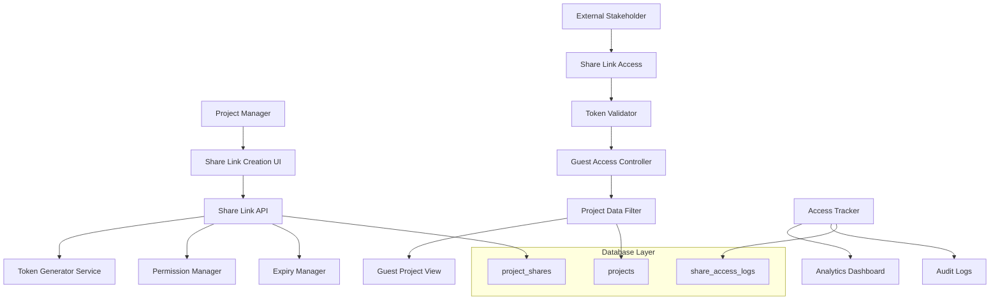

# Design Document: Shareable Project URLs

## Overview

The Shareable Project URLs system enables secure, time-limited external access to project information without requiring full system accounts. It integrates with the existing PPM platform's authentication, authorization, and audit systems while providing a streamlined experience for external stakeholders.

## Architecture

The system follows a layered architecture that integrates with existing FastAPI backend and Next.js frontend:



## Components and Interfaces

### 1. Share Link Generator Service

**Purpose**: Creates and manages secure shareable URLs for projects.

**Key Methods**:
```python
class ShareLinkGenerator:
    async def create_share_link(
        project_id: UUID, 
        creator_id: UUID, 
        permissions: SharePermissionLevel,
        expiry_duration: timedelta,
        custom_message: Optional[str] = None
    ) -> ShareLinkResponse
    
    async def list_project_shares(project_id: UUID) -> List[ShareLinkResponse]
    async def revoke_share_link(share_id: UUID, revoked_by: UUID) -> bool
    async def extend_expiry(share_id: UUID, new_expiry: datetime) -> ShareLinkResponse
    def generate_secure_token() -> str
```

**Integration Points**:
- Integrates with existing RBAC system for creator permissions
- Uses existing audit_logs table for tracking
- Leverages project table for data access

### 2. Guest Access Controller

**Purpose**: Manages authentication and authorization for external users accessing via share links.

**Key Methods**:
```python
class GuestAccessController:
    async def validate_share_token(token: str) -> Optional[ShareLinkData]
    async def get_filtered_project_data(
        project_id: UUID, 
        permission_level: SharePermissionLevel
    ) -> FilteredProjectData
    
    async def log_access_event(
        share_id: UUID, 
        ip_address: str, 
        user_agent: str,
        accessed_sections: List[str]
    ) -> None
    
    def check_rate_limit(ip_address: str, share_id: UUID) -> bool
```

**Permission Levels**:
- `VIEW_ONLY`: Basic project info (name, description, status, progress percentage)
- `LIMITED_DATA`: Includes milestones, timeline, public documents, team members
- `FULL_PROJECT`: All project data except financial details and internal notes

### 3. Access Analytics Service

**Purpose**: Tracks and analyzes share link usage patterns.

**Key Methods**:
```python
class AccessAnalyticsService:
    async def get_share_analytics(
        project_id: UUID, 
        date_range: DateRange
    ) -> ShareAnalytics
    
    async def detect_suspicious_activity(share_id: UUID) -> List[SecurityAlert]
    async def generate_usage_report(project_id: UUID) -> UsageReport
    async def send_expiry_notifications() -> None
```

## Data Models

### Database Schema Extensions

```sql
-- Share links table
CREATE TABLE IF NOT EXISTS project_shares (
    id UUID PRIMARY KEY DEFAULT gen_random_uuid(),
    project_id UUID NOT NULL REFERENCES projects(id) ON DELETE CASCADE,
    token VARCHAR(64) UNIQUE NOT NULL,
    created_by UUID NOT NULL REFERENCES auth.users(id),
    permission_level VARCHAR(20) NOT NULL CHECK (permission_level IN ('view_only', 'limited_data', 'full_project')),
    expires_at TIMESTAMP WITH TIME ZONE NOT NULL,
    is_active BOOLEAN DEFAULT true,
    custom_message TEXT,
    access_count INTEGER DEFAULT 0,
    last_accessed_at TIMESTAMP WITH TIME ZONE,
    last_accessed_ip INET,
    revoked_at TIMESTAMP WITH TIME ZONE,
    revoked_by UUID REFERENCES auth.users(id),
    revocation_reason TEXT,
    created_at TIMESTAMP WITH TIME ZONE DEFAULT NOW(),
    updated_at TIMESTAMP WITH TIME ZONE DEFAULT NOW()
);

-- Share access logs table
CREATE TABLE IF NOT EXISTS share_access_logs (
    id UUID PRIMARY KEY DEFAULT gen_random_uuid(),
    share_id UUID NOT NULL REFERENCES project_shares(id) ON DELETE CASCADE,
    accessed_at TIMESTAMP WITH TIME ZONE DEFAULT NOW(),
    ip_address INET NOT NULL,
    user_agent TEXT,
    country_code VARCHAR(2),
    city VARCHAR(100),
    accessed_sections JSONB DEFAULT '[]',
    session_duration INTEGER, -- seconds
    is_suspicious BOOLEAN DEFAULT false,
    suspicious_reasons JSONB DEFAULT '[]'
);

-- Indexes for performance
CREATE INDEX IF NOT EXISTS idx_project_shares_token ON project_shares(token);
CREATE INDEX IF NOT EXISTS idx_project_shares_project_id ON project_shares(project_id);
CREATE INDEX IF NOT EXISTS idx_project_shares_expires_at ON project_shares(expires_at);
CREATE INDEX IF NOT EXISTS idx_project_shares_created_by ON project_shares(created_by);
CREATE INDEX IF NOT EXISTS idx_share_access_logs_share_id ON share_access_logs(share_id);
CREATE INDEX IF NOT EXISTS idx_share_access_logs_accessed_at ON share_access_logs(accessed_at);
CREATE INDEX IF NOT EXISTS idx_share_access_logs_ip_address ON share_access_logs(ip_address);
```

### Pydantic Models

```python
class SharePermissionLevel(str, Enum):
    VIEW_ONLY = "view_only"
    LIMITED_DATA = "limited_data"
    FULL_PROJECT = "full_project"

class ShareLinkCreate(BaseModel):
    project_id: UUID
    permission_level: SharePermissionLevel
    expiry_duration_days: int = Field(ge=1, le=365)
    custom_message: Optional[str] = Field(None, max_length=500)

class ShareLinkResponse(BaseModel):
    id: str
    project_id: str
    token: str
    share_url: str
    permission_level: str
    expires_at: datetime
    is_active: bool
    custom_message: Optional[str]
    access_count: int
    last_accessed_at: Optional[datetime]
    created_at: datetime
    created_by: str

class FilteredProjectData(BaseModel):
    id: str
    name: str
    description: Optional[str]
    status: str
    progress_percentage: Optional[float]
    start_date: Optional[date]
    end_date: Optional[date]
    # Conditional fields based on permission level
    milestones: Optional[List[Dict[str, Any]]] = None
    team_members: Optional[List[Dict[str, Any]]] = None
    documents: Optional[List[Dict[str, Any]]] = None
    timeline: Optional[Dict[str, Any]] = None

class ShareAnalytics(BaseModel):
    total_accesses: int
    unique_visitors: int
    access_by_day: List[Dict[str, Any]]
    geographic_distribution: List[Dict[str, Any]]
    most_viewed_sections: List[Dict[str, Any]]
    average_session_duration: float
    suspicious_activity_count: int
```

## API Endpoints

### Backend FastAPI Endpoints

```python
# Share link management
@app.post("/projects/{project_id}/shares", response_model=ShareLinkResponse)
async def create_project_share(
    project_id: UUID,
    share_data: ShareLinkCreate,
    current_user = Depends(require_permission(Permission.project_read))
)

@app.get("/projects/{project_id}/shares")
async def list_project_shares(
    project_id: UUID,
    current_user = Depends(require_permission(Permission.project_read))
)

@app.delete("/shares/{share_id}")
async def revoke_share_link(
    share_id: UUID,
    current_user = Depends(require_permission(Permission.project_read))
)

@app.put("/shares/{share_id}/extend")
async def extend_share_expiry(
    share_id: UUID,
    new_expiry: datetime,
    current_user = Depends(require_permission(Permission.project_read))
)

# Guest access endpoints
@app.get("/projects/{project_id}/share/{token}")
async def access_shared_project(
    project_id: UUID,
    token: str,
    request: Request
)

@app.get("/shares/{share_id}/analytics")
async def get_share_analytics(
    share_id: UUID,
    current_user = Depends(require_permission(Permission.project_read))
)
```

### Frontend Next.js Routes

```typescript
// Share management page
/projects/[id]/shares

// Guest access page  
/projects/[id]/share/[token]

// Share analytics
/projects/[id]/shares/analytics
```

## Frontend Components

### 1. Share Link Management Component

```typescript
interface ShareLinkManagerProps {
  projectId: string;
  userPermissions: string[];
}

const ShareLinkManager: React.FC<ShareLinkManagerProps> = ({
  projectId,
  userPermissions
}) => {
  // Component for creating and managing share links
  // Includes permission selection, expiry settings, link list
}
```

### 2. Guest Project View Component

```typescript
interface GuestProjectViewProps {
  projectData: FilteredProjectData;
  permissionLevel: SharePermissionLevel;
}

const GuestProjectView: React.FC<GuestProjectViewProps> = ({
  projectData,
  permissionLevel
}) => {
  // Simplified project view for external stakeholders
  // Responsive design, no system navigation
}
```

### 3. Share Analytics Dashboard

```typescript
interface ShareAnalyticsProps {
  shareId: string;
  dateRange: DateRange;
}

const ShareAnalyticsDashboard: React.FC<ShareAnalyticsProps> = ({
  shareId,
  dateRange
}) => {
  // Analytics visualization using recharts
  // Access patterns, geographic data, usage trends
}
```

## Security Considerations

### Token Generation
- Use cryptographically secure random token generation
- 64-character URL-safe tokens (Base64URL encoding)
- Prevent token enumeration attacks through rate limiting

### Access Control
- Validate project permissions before share link creation
- Implement IP-based rate limiting (10 requests per minute per IP)
- Log all access attempts for security monitoring

### Data Filtering
- Strict data filtering based on permission levels
- Never expose sensitive financial data or internal notes
- Sanitize all output data to prevent information leakage

## Error Handling

### Common Error Scenarios
1. **Invalid Token**: Clear error message with contact information
2. **Expired Link**: Friendly expiration notice with request renewal option
3. **Revoked Access**: Professional access denied message
4. **Rate Limit Exceeded**: Temporary access restriction notice
5. **Project Not Found**: Generic error to prevent information disclosure

## Testing Strategy

### Unit Tests
- Token generation uniqueness and security
- Permission filtering accuracy
- Expiry logic validation
- Rate limiting functionality

### Integration Tests
- End-to-end share link creation and access flow
- Database transaction integrity
- Email notification delivery
- Analytics data accuracy

### Property-Based Tests

Now I need to analyze the acceptance criteria for testable properties:

## Correctness Properties

*A property is a characteristic or behavior that should hold true across all valid executions of a system-essentially, a formal statement about what the system should do. Properties serve as the bridge between human-readable specifications and machine-verifiable correctness guarantees.*

### Property Reflection

After analyzing all acceptance criteria, I identified several areas where properties can be consolidated:
- Token generation properties can be combined into comprehensive uniqueness and security properties
- Permission enforcement properties can be unified into access control validation properties
- Expiry management properties can be consolidated into time-based access properties
- Access tracking properties can be combined into comprehensive logging properties

### Core System Properties

**Property 1: Secure Token Generation**
*For any* share link creation request, the generated token must be cryptographically secure, unique across all projects, and at least 32 characters long using URL-safe characters
**Validates: Requirements 1.1, 1.2, 1.4**

**Property 2: Permission Enforcement Consistency**
*For any* external user accessing via share link, only the permissions granted to that specific link must be enforced, regardless of the user's access method or timing
**Validates: Requirements 2.2, 2.3, 2.4, 2.5**

**Property 3: Time-Based Access Control**
*For any* share link with an expiration time, access must be automatically disabled when the current time exceeds the expiration timestamp, with timezone-aware comparison
**Validates: Requirements 3.2, 3.3**

**Property 4: Access Event Logging Completeness**
*For any* share link access event, all required metadata (timestamp, IP address, user agent, accessed sections) must be logged to the tracking system
**Validates: Requirements 4.1, 4.2**

**Property 5: Data Filtering Accuracy**
*For any* permission level and project data combination, the filtered output must contain only the information permitted by that specific permission level and never expose restricted data
**Validates: Requirements 2.3, 2.4, 2.5, 5.2**

**Property 6: Link Management State Consistency**
*For any* share link management operation (revocation, expiry extension), the link's state must be immediately and consistently updated across all access attempts
**Validates: Requirements 6.2, 6.3**

**Property 7: Security Integration Compliance**
*For any* project with existing security classifications, share link creation and access must respect and enforce those classifications without exception
**Validates: Requirements 7.1, 7.2, 7.4**

**Property 8: Rate Limiting Enforcement**
*For any* IP address and share link combination, access attempts must be rate-limited according to configured thresholds to prevent abuse
**Validates: Requirements 7.4**

### Testing Strategy

**Dual Testing Approach**:
- **Unit tests**: Verify specific token generation, permission filtering, and expiry logic
- **Property tests**: Verify universal properties across all share link operations
- Both are complementary and necessary for comprehensive security validation

**Property-Based Testing Configuration**:
- **Minimum 100 iterations** per property test due to security-critical nature
- **Test tagging format**: `Feature: shareable-project-urls, Property {number}: {property_text}`
- **Framework**: Use pytest with Hypothesis for Python property-based testing
- Each correctness property will be implemented as a single property-based test
- Tests will generate random project configurations, permission levels, and access patterns

The testing strategy ensures that the share link system maintains security and consistency across all possible usage scenarios, which is critical for external stakeholder access.

## Performance Considerations

### Caching Strategy
- Cache filtered project data for active share links (5-minute TTL)
- Cache token validation results (1-minute TTL)
- Use Redis for distributed caching in production

### Database Optimization
- Partition share_access_logs by date for large-scale deployments
- Implement automatic cleanup of expired share links
- Use database indexes for fast token lookups

### Monitoring and Alerting
- Monitor share link creation rates for abuse detection
- Alert on suspicious access patterns (geographic anomalies, high frequency)
- Track performance metrics for guest access response times

This design integrates seamlessly with your existing PPM platform while providing secure, controlled external access to project information. The system maintains your current security standards while enabling the transparency needed for Construction/Engineering project stakeholder communication.