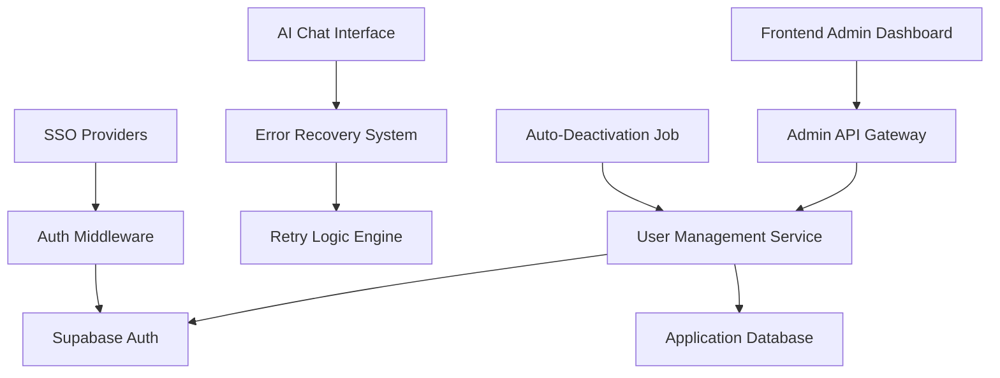
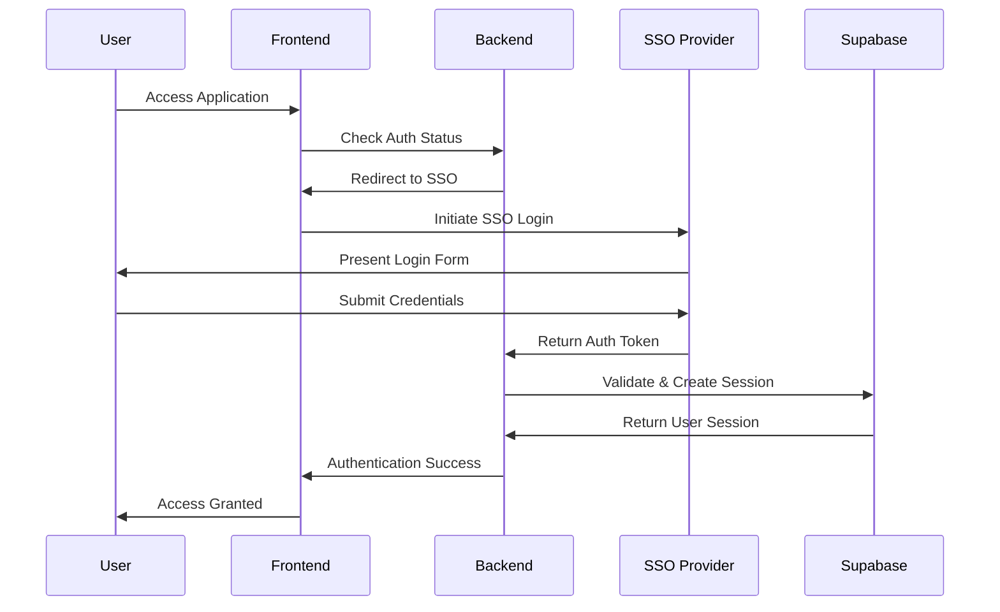

# User Management & Admin Dashboard Design

## Overview

This design document outlines the architecture and implementation approach for comprehensive user management and admin dashboard functionality. The system will provide robust error handling for AI chat, complete user administration capabilities, and SSO integration foundation.

## Architecture

### System Components



### Component Responsibilities

- **Frontend Admin Dashboard**: React-based user interface for user management
- **Admin API Gateway**: FastAPI endpoints for administrative operations
- **User Management Service**: Core business logic for user operations
- **Error Recovery System**: Comprehensive error handling for AI chat
- **Auto-Deactivation Job**: Scheduled task for inactive user management
- **SSO Integration**: External authentication provider support

## Components and Interfaces

### 1. AI Chat Error Recovery System

#### Error Classification Engine
```typescript
interface ChatError {
  timestamp: Date
  errorType: 'network' | 'server' | 'timeout' | 'auth' | 'unknown'
  message: string
  statusCode?: number
  retryable: boolean
}

interface ErrorRecoveryState {
  lastQuery: string
  conversationId: string | null
  retryCount: number
  maxRetries: number
  errorHistory: ChatError[]
}
```

#### Retry Strategy Implementation
- **Exponential Backoff**: 1s, 2s, 4s, 8s, max 10s
- **Circuit Breaker**: Stop retries after 3 consecutive failures
- **Context Preservation**: Maintain conversation state during retries

### 2. User Management Backend API

#### Core Endpoints
```python
# User CRUD Operations
@app.get("/admin/users")
async def list_users(
    page: int = 1,
    per_page: int = 20,
    search: str = None,
    status: str = None,
    current_user = Depends(require_admin)
)

@app.post("/admin/users")
async def create_user(
    user_data: UserCreateRequest,
    current_user = Depends(require_admin)
)

@app.put("/admin/users/{user_id}")
async def update_user(
    user_id: UUID,
    user_data: UserUpdateRequest,
    current_user = Depends(require_admin)
)

@app.delete("/admin/users/{user_id}")
async def delete_user(
    user_id: UUID,
    current_user = Depends(require_admin)
)

@app.post("/admin/users/{user_id}/deactivate")
async def deactivate_user(
    user_id: UUID,
    current_user = Depends(require_admin)
)
```

#### Data Models
```python
class UserResponse(BaseModel):
    id: UUID
    email: str
    role: str
    status: str
    last_login: Optional[datetime]
    created_at: datetime
    updated_at: datetime
    is_active: bool

class UserCreateRequest(BaseModel):
    email: str
    role: str = "user"
    send_invite: bool = True

class UserUpdateRequest(BaseModel):
    role: Optional[str] = None
    is_active: Optional[bool] = None
```

### 3. Admin Dashboard Frontend

#### Component Architecture
```typescript
// Main Admin Layout
AdminLayout
├── AdminSidebar
├── UserManagementPage
│   ├── UserTable
│   ├── UserFilters
│   ├── UserActions
│   └── UserModal
└── AdminHeader

// User Management Components
interface User {
  id: string
  email: string
  role: string
  status: 'active' | 'inactive' | 'pending'
  lastLogin: Date | null
  createdAt: Date
}

interface UserTableProps {
  users: User[]
  onEdit: (user: User) => void
  onDelete: (userId: string) => void
  onDeactivate: (userId: string) => void
}
```

#### State Management
```typescript
// User Management Store
interface UserManagementState {
  users: User[]
  loading: boolean
  error: string | null
  filters: UserFilters
  pagination: PaginationState
  selectedUsers: string[]
}

// Actions
type UserManagementAction =
  | { type: 'LOAD_USERS_START' }
  | { type: 'LOAD_USERS_SUCCESS'; payload: User[] }
  | { type: 'LOAD_USERS_ERROR'; payload: string }
  | { type: 'UPDATE_USER'; payload: User }
  | { type: 'DELETE_USER'; payload: string }
```

### 4. Auto-Deactivation Service

#### Job Scheduler Implementation
```python
import asyncio
from datetime import datetime, timedelta

class UserDeactivationJob:
    def __init__(self, supabase_client, config):
        self.supabase = supabase_client
        self.inactivity_threshold = config.get('inactivity_days', 90)
        
    async def run_deactivation_check(self):
        """Check and deactivate inactive users"""
        cutoff_date = datetime.now() - timedelta(days=self.inactivity_threshold)
        
        # Query inactive users
        inactive_users = await self.get_inactive_users(cutoff_date)
        
        for user in inactive_users:
            await self.deactivate_user(user['id'])
            await self.log_deactivation(user['id'], 'auto_inactive')
```

#### Scheduling Configuration
- **Frequency**: Daily at 2:00 AM UTC
- **Batch Size**: 100 users per batch
- **Retry Logic**: 3 attempts with exponential backoff
- **Monitoring**: Slack/email notifications for job status

### 5. SSO Integration Architecture

#### Authentication Flow


#### SSO Provider Configuration
```python
class SSOConfig(BaseModel):
    provider: str  # 'okta', 'azure_ad'
    client_id: str
    client_secret: str
    redirect_uri: str
    scopes: List[str]
    user_mapping: Dict[str, str]

class SSOHandler:
    def __init__(self, config: SSOConfig):
        self.config = config
        
    async def handle_callback(self, code: str) -> UserSession:
        """Handle SSO callback and create user session"""
        token = await self.exchange_code_for_token(code)
        user_info = await self.get_user_info(token)
        return await self.create_or_update_user(user_info)
```

## Data Models

### User Management Schema

```sql
-- Enhanced user profiles table
CREATE TABLE user_profiles (
    id UUID PRIMARY KEY DEFAULT gen_random_uuid(),
    user_id UUID REFERENCES auth.users(id) ON DELETE CASCADE,
    role VARCHAR(50) NOT NULL DEFAULT 'user',
    is_active BOOLEAN DEFAULT true,
    last_login TIMESTAMP WITH TIME ZONE,
    deactivated_at TIMESTAMP WITH TIME ZONE,
    deactivated_by UUID REFERENCES auth.users(id),
    deactivation_reason VARCHAR(255),
    sso_provider VARCHAR(50),
    sso_user_id VARCHAR(255),
    created_at TIMESTAMP WITH TIME ZONE DEFAULT NOW(),
    updated_at TIMESTAMP WITH TIME ZONE DEFAULT NOW()
);

-- User activity tracking
CREATE TABLE user_activity_log (
    id UUID PRIMARY KEY DEFAULT gen_random_uuid(),
    user_id UUID REFERENCES auth.users(id) ON DELETE CASCADE,
    action VARCHAR(100) NOT NULL,
    details JSONB,
    ip_address INET,
    user_agent TEXT,
    created_at TIMESTAMP WITH TIME ZONE DEFAULT NOW()
);

-- Admin action audit log
CREATE TABLE admin_audit_log (
    id UUID PRIMARY KEY DEFAULT gen_random_uuid(),
    admin_user_id UUID REFERENCES auth.users(id),
    target_user_id UUID REFERENCES auth.users(id),
    action VARCHAR(100) NOT NULL,
    details JSONB,
    created_at TIMESTAMP WITH TIME ZONE DEFAULT NOW()
);
```

### Error Recovery Schema

```sql
-- Chat error tracking
CREATE TABLE chat_error_log (
    id UUID PRIMARY KEY DEFAULT gen_random_uuid(),
    user_id UUID REFERENCES auth.users(id),
    session_id VARCHAR(255),
    error_type VARCHAR(50) NOT NULL,
    error_message TEXT,
    status_code INTEGER,
    query_text TEXT,
    retry_count INTEGER DEFAULT 0,
    resolved BOOLEAN DEFAULT false,
    created_at TIMESTAMP WITH TIME ZONE DEFAULT NOW()
);
```

## Correctness Properties

*A property is a characteristic or behavior that should hold true across all valid executions of a system-essentially, a formal statement about what the system should do. Properties serve as the bridge between human-readable specifications and machine-verifiable correctness guarantees.*

### Property 1: Error Recovery Consistency
*For any* AI chat error that is marked as retryable, the system should implement exponential backoff and not exceed the maximum retry limit
**Validates: Requirements 1.4, 1.6**

### Property 2: Admin Permission Enforcement
*For any* admin API endpoint access, the requesting user must have valid admin permissions and the action must be logged
**Validates: Requirements 7.1, 7.3**

### Property 3: User Deactivation Integrity
*For any* user deactivation (manual or automatic), all related project assignments and permissions should be handled appropriately without data corruption
**Validates: Requirements 4.2, 8.2**

### Property 4: SSO Authentication Round-trip
*For any* valid SSO authentication flow, the user should be able to authenticate, receive a session, and access protected resources
**Validates: Requirements 5.1, 5.8**

### Property 5: User Data Consistency
*For any* user management operation (create, update, delete), the changes should be reflected consistently across Supabase Auth and application tables
**Validates: Requirements 8.4, 8.5**

### Property 6: Error Classification Accuracy
*For any* network or server error in AI chat, the error should be correctly classified and appropriate recovery actions should be suggested
**Validates: Requirements 1.1, 1.2, 1.5**

### Property 7: Admin Navigation Security
*For any* user accessing admin navigation, the interface should only display admin functions if the user has appropriate permissions
**Validates: Requirements 6.3, 7.5**

### Property 8: Auto-deactivation Exclusion Rules
*For any* automatic deactivation job execution, admin users and recently active users should be excluded from deactivation
**Validates: Requirements 4.5, 4.1**

## Error Handling

### AI Chat Error Recovery
- **Network Errors**: Retry with exponential backoff, show connection status
- **Authentication Errors**: Redirect to login, clear invalid tokens
- **Server Errors**: Log to console, show user-friendly message, suggest alternatives
- **Timeout Errors**: Implement circuit breaker, provide manual retry option

### Admin API Error Handling
- **Validation Errors**: Return detailed field-level error messages
- **Permission Errors**: Log security events, return 403 with clear message
- **Database Errors**: Rollback transactions, log errors, return generic message
- **Rate Limiting**: Implement sliding window, return 429 with retry-after header

### SSO Integration Error Handling
- **Provider Unavailable**: Fallback to local authentication
- **Token Validation Failure**: Clear session, redirect to login
- **User Mapping Errors**: Log issues, create user with default role
- **Configuration Errors**: Disable SSO, alert administrators

## Testing Strategy

### Unit Testing
- **Error Classification**: Test all error types and recovery strategies
- **Permission Validation**: Verify admin access controls
- **User CRUD Operations**: Test all user management functions
- **SSO Token Handling**: Validate token exchange and user creation

### Property-Based Testing
- **Error Recovery Properties**: Test retry logic with random error scenarios
- **User Management Properties**: Verify data consistency across operations
- **Permission Properties**: Ensure security constraints are maintained
- **SSO Properties**: Validate authentication flows with various providers

### Integration Testing
- **End-to-End User Management**: Test complete admin workflows
- **SSO Integration**: Test with real provider configurations
- **Auto-deactivation Jobs**: Verify scheduled task execution
- **Error Recovery Flows**: Test complete error handling scenarios

### Performance Testing
- **Admin Dashboard Load**: Test with large user datasets (10k+ users)
- **Auto-deactivation Scale**: Test job performance with high user volumes
- **Error Recovery Overhead**: Measure impact of error handling on response times
- **SSO Authentication Speed**: Benchmark authentication flow performance