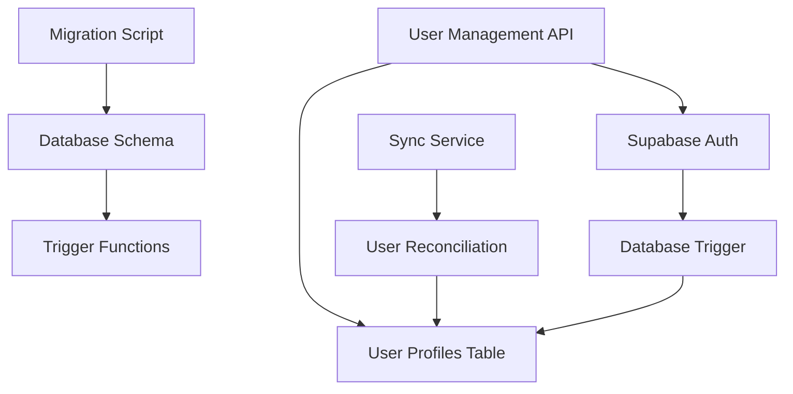

# Design Document: User Synchronization System

## Overview

The User Synchronization System ensures seamless integration between Supabase's built-in authentication (`auth.users`) and the application's custom user management system (`user_profiles`). The system implements automatic user profile creation through database triggers and provides tools for synchronizing existing users.

The design addresses the core issue where users can successfully authenticate through Supabase Auth but cannot access application features because their profile records don't exist in the custom user management tables.

## Architecture

### System Components



### Data Flow

1. **New User Registration**: User signs up → Supabase Auth creates auth.users record → Trigger automatically creates user_profiles record
2. **Existing User Sync**: Admin runs sync → System identifies missing profiles → Creates missing user_profiles records
3. **User Management**: API queries join auth.users and user_profiles for complete user information

## Components and Interfaces

### Database Schema Components

#### User Profiles Table
```sql
CREATE TABLE user_profiles (
    id UUID PRIMARY KEY DEFAULT gen_random_uuid(),
    user_id UUID REFERENCES auth.users(id) ON DELETE CASCADE UNIQUE,
    role VARCHAR(50) NOT NULL DEFAULT 'user',
    is_active BOOLEAN DEFAULT true,
    last_login TIMESTAMP WITH TIME ZONE,
    deactivated_at TIMESTAMP WITH TIME ZONE,
    deactivated_by UUID REFERENCES auth.users(id),
    deactivation_reason VARCHAR(255),
    sso_provider VARCHAR(50),
    sso_user_id VARCHAR(255),
    created_at TIMESTAMP WITH TIME ZONE DEFAULT NOW(),
    updated_at TIMESTAMP WITH TIME ZONE DEFAULT NOW()
);
```

#### Automatic Profile Creation Trigger
```sql
CREATE OR REPLACE FUNCTION create_user_profile()
RETURNS TRIGGER AS $
BEGIN
    INSERT INTO user_profiles (user_id, role, is_active)
    VALUES (NEW.id, 'user', true);
    RETURN NEW;
END;
$ language 'plpgsql';

CREATE TRIGGER on_auth_user_created
    AFTER INSERT ON auth.users
    FOR EACH ROW
    EXECUTE FUNCTION create_user_profile();
```

### Service Components

#### Migration Service
- **Purpose**: Apply database schema changes and create triggers
- **Interface**: Command-line script with verification
- **Responsibilities**: 
  - Create tables and indexes
  - Set up triggers and functions
  - Verify migration success
  - Provide rollback capability

#### User Synchronization Service
- **Purpose**: Reconcile existing auth.users with user_profiles
- **Interface**: REST API endpoint and CLI tool
- **Responsibilities**:
  - Identify missing user profiles
  - Create missing profiles with default values
  - Report synchronization results
  - Handle error cases gracefully

#### Enhanced User Management API
- **Purpose**: Provide unified user data access
- **Interface**: REST API with JSON responses
- **Responsibilities**:
  - Join auth.users and user_profiles data
  - Handle missing profile cases
  - Maintain API compatibility
  - Provide complete user information

## Data Models

### User Profile Model
```python
class UserProfile:
    id: UUID
    user_id: UUID  # Foreign key to auth.users
    role: str = "user"
    is_active: bool = True
    last_login: Optional[datetime] = None
    deactivated_at: Optional[datetime] = None
    deactivated_by: Optional[UUID] = None
    deactivation_reason: Optional[str] = None
    sso_provider: Optional[str] = None
    sso_user_id: Optional[str] = None
    created_at: datetime
    updated_at: datetime
```

### Synchronization Result Model
```python
class SyncResult:
    total_auth_users: int
    existing_profiles: int
    created_profiles: int
    failed_creations: int
    errors: List[str]
    execution_time: float
```

### Migration Status Model
```python
class MigrationStatus:
    tables_created: List[str]
    triggers_created: List[str]
    functions_created: List[str]
    indexes_created: List[str]
    verification_passed: bool
    errors: List[str]
```

## Correctness Properties

*A property is a characteristic or behavior that should hold true across all valid executions of a system-essentially, a formal statement about what the system should do. Properties serve as the bridge between human-readable specifications and machine-verifiable correctness guarantees.*

### Property 1: Automatic Profile Creation
*For any* user created in auth.users, there should automatically be a corresponding user_profiles record created with the same user_id
**Validates: Requirements 1.1**

### Property 2: Default Role Assignment
*For any* newly created user_profiles record, the role should be set to 'user'
**Validates: Requirements 1.2**

### Property 3: Default Active Status
*For any* newly created user_profiles record, the is_active field should be set to true
**Validates: Requirements 1.3**

### Property 4: User Profile Referential Integrity
*For any* user_profiles record, the user_id should reference a valid record in auth.users
**Validates: Requirements 1.4, 4.2, 4.4**

### Property 5: Authentication Resilience
*For any* user profile creation failure, user authentication should still succeed and errors should be logged
**Validates: Requirements 1.5**

### Property 6: Sync Missing Profile Detection
*For any* auth.users record without a corresponding user_profiles record, the sync system should identify it as missing
**Validates: Requirements 3.1**

### Property 7: Sync Profile Creation
*For any* missing user profile identified by sync, a user_profiles record should be created with default values
**Validates: Requirements 3.2**

### Property 8: Sync Data Preservation
*For any* existing user_profiles record, synchronization should not modify its existing data
**Validates: Requirements 3.3**

### Property 9: Sync Reporting Accuracy
*For any* synchronization operation, the reported number of created profiles should match the actual number of profiles created
**Validates: Requirements 3.4**

### Property 10: Sync Idempotence
*For any* synchronization operation, running it multiple times should produce the same result without creating duplicates or errors
**Validates: Requirements 3.5**

### Property 11: One-to-One User Relationship
*For any* auth.users record, there should be exactly one corresponding user_profiles record
**Validates: Requirements 4.1**

### Property 12: Cascade Deletion
*For any* auth.users record that is deleted, the corresponding user_profiles record should also be deleted
**Validates: Requirements 4.3**

### Property 13: Foreign Key Validation
*For any* attempt to create a user_profiles record with an invalid user_id, the system should reject the operation
**Validates: Requirements 4.4**

### Property 14: Cross-Table Referential Integrity
*For any* user-related table, all foreign key relationships should remain valid and consistent
**Validates: Requirements 4.5**

### Property 15: Migration Verification Error Reporting
*For any* migration verification failure, the system should provide detailed error information describing what failed
**Validates: Requirements 5.5**

### Property 16: API Data Completeness
*For any* user retrieved through the API, the response should contain data from both auth.users and user_profiles tables
**Validates: Requirements 6.1, 6.2**

### Property 17: API Missing Profile Handling
*For any* user with a missing user_profiles record, the API should handle the case gracefully without crashing
**Validates: Requirements 6.3**

### Property 18: API Backward Compatibility
*For any* existing API endpoint, the response format and data structure should remain unchanged after implementing user synchronization
**Validates: Requirements 6.4**

### Property 19: API Response Consistency
*For any* user data returned by the API, the format should be consistent regardless of whether the user_profiles record exists or was created by synchronization
**Validates: Requirements 6.5**

## Error Handling

### Database Connection Failures
- Migration scripts should detect connection issues and provide clear error messages
- Sync operations should handle temporary database unavailability gracefully
- API endpoints should fall back to auth.users data when user_profiles is unavailable

### Trigger Execution Failures
- Profile creation trigger should log errors without preventing user authentication
- Failed profile creations should be queued for retry during next sync operation
- System should continue operating even if some profiles are missing

### Data Consistency Issues
- Orphaned records should be detected and reported during sync operations
- Foreign key violations should be prevented through proper constraint enforcement
- Data corruption should be detected through integrity checks

## Testing Strategy

### Unit Testing
- Test individual functions for profile creation, sync logic, and API endpoints
- Test error handling scenarios with mocked database failures
- Test edge cases like duplicate users, invalid data, and constraint violations
- Verify proper error logging and reporting mechanisms

### Property-Based Testing
- Use property-based testing to verify correctness properties across many generated inputs
- Generate random user data to test automatic profile creation
- Test sync operations with various combinations of existing and missing profiles
- Verify API consistency across different user states and data combinations
- Each property test should run minimum 100 iterations to ensure comprehensive coverage
- Tag each test with format: **Feature: user-synchronization, Property {number}: {property_text}**

### Integration Testing
- Test complete user registration flow from signup to profile creation
- Test migration application and rollback procedures
- Test sync operations on realistic datasets
- Verify API functionality with real database connections and user data

### Database Testing
- Test trigger functionality with actual database operations
- Verify foreign key constraints and cascade deletions
- Test RLS policies and security restrictions
- Validate migration scripts against clean and existing databases