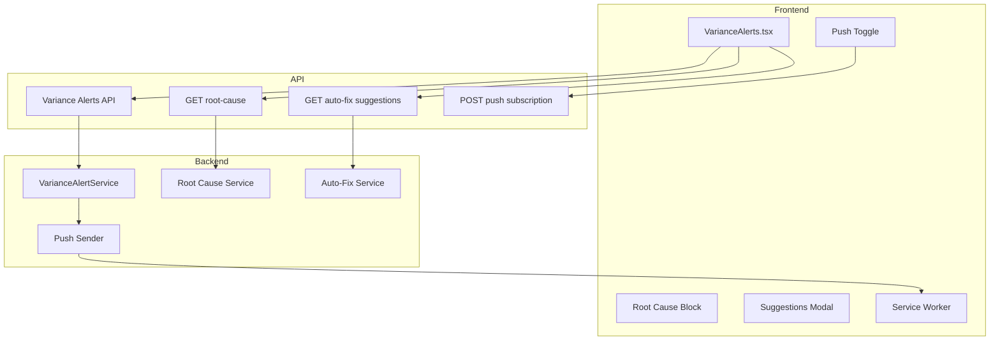

# Design Document: Variance Alerts AI

## Overview

This design extends the existing dashboard variance alerts with three AI-related capabilities: (1) optional browser push notifications when new alerts are created, (2) optional root-cause analysis per alert, and (3) AI-generated auto-fix suggestions with optional impact simulation. It builds on `VarianceAlertService` and `VarianceAlerts.tsx` without replacing them.

### Key Components

1. **Push Subscription Manager**: Frontend + optional backend for VAPID subscription storage and push sending.
2. **Root Cause Service**: Backend (or frontend) logic to derive root causes for an alert (LLM or rules).
3. **Auto-Fix Suggestion Service**: Backend endpoint returning concrete adjustments (ETC, Accruals) with optional simulation hook.
4. **VarianceAlerts UI Extensions**: Root-cause block, "Vorschläge anzeigen" button, suggestions modal, push toggle.

### Technology Stack

- **Frontend:** Next.js, React, existing dashboard components; Web Push API, Service Worker.
- **Backend:** FastAPI (existing); optional new routes under e.g. `/api/v1/variance-alerts/` or extend existing variance/budget-alerts API.
- **AI:** Optional OpenAI/LLM for root-cause and suggestions; rule-based fallback recommended for latency/cost.

## Architecture

## Data Flow

### Push Notification Flow

1. User enables "Push bei neuen Alerts" → frontend requests notification permission, gets subscription (VAPID), sends to backend (POST subscription).
2. When VarianceAlertService creates a new alert, backend invokes Push Sender with user's subscription(s).
3. Push message is delivered to browser; Service Worker receives push event, shows notification; user click opens dashboard/alert.

### Root-Cause Flow

1. User expands alert or opens alert detail → frontend calls GET `/api/.../variance-alerts/{alert_id}/root-cause` (or equivalent).
2. Backend (Root Cause Service) computes causes (LLM or rules), returns list of { cause, confidence }.
3. Frontend renders "Root Cause" block with causes and confidence; user can collapse or hide.

### Auto-Fix Suggestions Flow

1. User clicks "Vorschläge anzeigen" on alert card → frontend calls GET (or POST with alert payload) `/api/.../variance-alerts/{alert_id}/suggestions`.
2. Backend (Auto-Fix Service) returns list of suggestions (description, metric, change, optional impact).
3. Frontend opens modal with list; user can choose "Impact simulieren" (navigate to Monte Carlo / EAC with params) or "Übernehmen" (copy or trigger Costbook update).

## Components and Interfaces

### Backend

#### Root Cause Service

- **Input:** alert_id (or full alert payload: project_id, metric, threshold, current value, context).
- **Output:** List of `{ cause: string, confidence: number }`. Rule-based: e.g. map metric + threshold to predefined causes; LLM: prompt with alert context, parse structured response. Timeout/error → return [].

#### Auto-Fix Suggestion Service

- **Input:** alert_id or alert payload.
- **Output:** List of `{ description: string, metric: string, recommended_change: string, estimated_impact?: string }`. Optional: call EAC/Monte Carlo to compute estimated_impact. Integrate with existing costbook/optimize logic if applicable.

#### Push Subscription Storage and Sender

- **Storage:** Table or key-value store: user_id, subscription JSON (endpoint, keys), organization_id. Optional: `app/api/.../push-subscriptions` or backend route.
- **Sender:** When new alert is created, look up user(s) with push enabled for that rule/scope, send web push via VAPID. Use library e.g. PyWebPush or equivalent in Python.

### Frontend

#### VarianceAlerts.tsx Extensions

- **Push toggle:** Checkbox or switch "Push bei neuen Alerts"; on enable request permission, register subscription, call backend to save. Place in dashboard settings or above/below the alerts list.
- **Root Cause block:** Per alert card or in detail modal: collapsible section "Root Cause"; on expand fetch root-cause API, show list with confidence (e.g. progress bar or %).
- **Suggestions:** Button "Vorschläge anzeigen" on card → open modal; modal lists suggestions, buttons "Impact simulieren" and "Übernehmen" (Übernehmen: copy to clipboard or deep link to Costbook with pre-filled values if API supports).

#### Service Worker (public/sw.js)

- Add handler for `push` event: parse payload (title, body, url), show Notification; on `notificationclick` focus window and navigate to url if provided.

## API Endpoints (Suggested)

| Method | Path | Description |
|--------|------|-------------|
| GET | `/api/v1/variance-alerts/{alert_id}/root-cause` | Return root causes with confidence for alert. |
| GET | `/api/v1/variance-alerts/{alert_id}/suggestions` | Return auto-fix suggestions for alert. |
| POST | `/api/v1/push-subscriptions` or `/api/v1/users/me/push-subscriptions` | Register VAPID subscription for variance alerts. |
| DELETE | .../push-subscriptions | Unregister subscription. |

(Exact paths may follow existing project convention; e.g. Next.js API routes under `app/api/` or FastAPI under `backend/routers/`.)

## Data Models

### Push Subscription (optional new table)

- `id` UUID PK
- `user_id` UUID FK
- `organization_id` UUID
- `subscription_json` JSONB (endpoint, keys from Push API)
- `created_at` timestamptz
- Unique on (user_id, endpoint) or per-device as needed

No new tables required for root-cause or suggestions if they are computed on the fly and not persisted.

## Security and Performance

- Push: Validate subscription on backend; send only to subscriptions belonging to the user/organization that owns the alert.
- Root-Cause / Suggestions: Enforce auth; filter alerts by organization_id. Rate-limit LLM calls; use rule-based fallback under load.
- Service Worker: Served over HTTPS; scope and cache strategy consistent with existing PWA if any.
