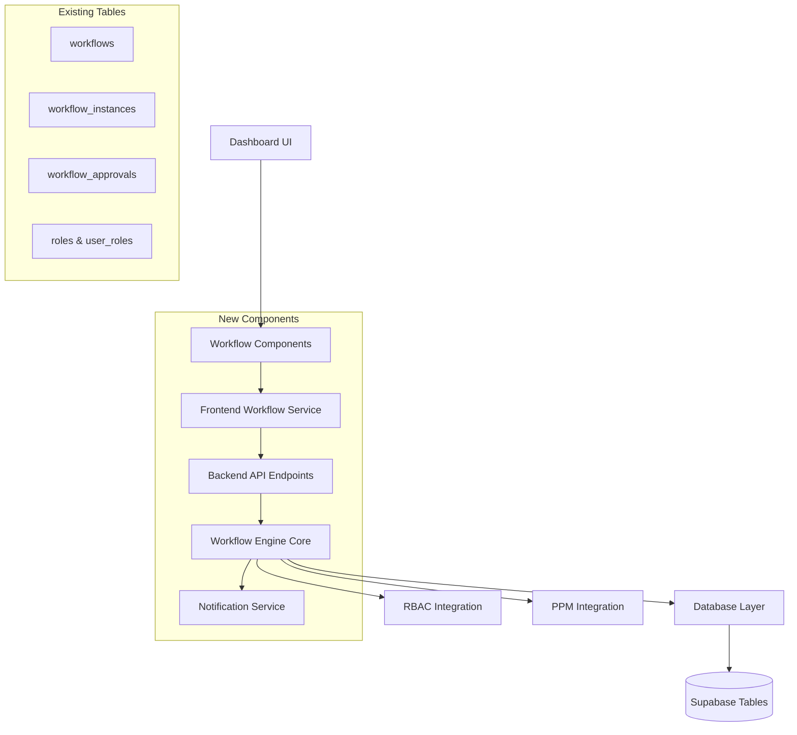

# Design Document: Workflow Engine

## Overview

The Workflow Engine provides a comprehensive approval system for the PPM SaaS platform, leveraging existing Supabase database tables (workflows, workflow_instances, workflow_approvals) to enable sophisticated approval processes. The system integrates seamlessly with the existing FastAPI backend and Next.js frontend, providing both API endpoints and dashboard components for managing approval workflows.

## Architecture

The system follows a layered architecture that integrates with existing PPM components:



## Components and Interfaces

### 1. Workflow Engine Core

**Purpose**: Central orchestration of workflow execution and state management.

**Key Classes**:
```python
class WorkflowEngine:
    async def create_workflow(definition: WorkflowDefinition) -> Workflow
    async def initiate_workflow(workflow_id: UUID, context: Dict) -> WorkflowInstance
    async def process_approval(instance_id: UUID, approval: ApprovalDecision) -> WorkflowInstance
    async def get_pending_approvals(user_id: UUID) -> List[PendingApproval]

class WorkflowDefinition(BaseModel):
    name: str
    description: Optional[str]
    steps: List[WorkflowStep]
    triggers: List[WorkflowTrigger]
    metadata: Dict[str, Any]

class WorkflowStep(BaseModel):
    step_order: int
    step_type: StepType  # APPROVAL, NOTIFICATION, CONDITION
    approvers: List[UUID]
    approval_type: ApprovalType  # ANY, ALL, MAJORITY
    conditions: Optional[Dict[str, Any]]
    timeout_hours: Optional[int]

class WorkflowInstance(BaseModel):
    id: UUID
    workflow_id: UUID
    status: WorkflowStatus  # PENDING, IN_PROGRESS, COMPLETED, REJECTED, CANCELLED
    context: Dict[str, Any]
    current_step: int
    initiated_by: UUID
    initiated_at: datetime
```

### 2. Backend API Layer

**Purpose**: FastAPI endpoints for workflow management and approval processing.

**Key Endpoints**:
```python
# Workflow Definition Management
@app.post("/workflows/", response_model=WorkflowResponse)
async def create_workflow(definition: WorkflowCreate, current_user = Depends(require_permission(Permission.workflow_manage)))

@app.get("/workflows/", response_model=List[WorkflowResponse])
async def list_workflows(current_user = Depends(require_permission(Permission.workflow_read)))

# Workflow Instance Management  
@app.post("/workflows/{workflow_id}/instances", response_model=WorkflowInstanceResponse)
async def initiate_workflow(workflow_id: UUID, context: WorkflowContext, current_user = Depends(get_current_user))

@app.get("/workflow-instances/{instance_id}", response_model=WorkflowInstanceResponse)
async def get_workflow_instance(instance_id: UUID, current_user = Depends(get_current_user))

# Approval Management
@app.get("/approvals/pending", response_model=List[PendingApprovalResponse])
async def get_pending_approvals(current_user = Depends(get_current_user))

@app.post("/approvals/{approval_id}/decision", response_model=ApprovalResponse)
async def submit_approval_decision(approval_id: UUID, decision: ApprovalDecision, current_user = Depends(get_current_user))
```

### 3. Frontend Workflow Components

**Purpose**: React components for workflow interaction within existing dashboard.

**Key Components**:
```typescript
// Main workflow dashboard integration
interface WorkflowDashboardProps {
  userId: string;
  userRole: string;
}

const WorkflowDashboard: React.FC<WorkflowDashboardProps> = ({ userId, userRole }) => {
  // Displays pending approvals, workflow status, and action buttons
}

// Approval action component
interface ApprovalButtonsProps {
  approvalId: string;
  onApprovalSubmitted: (decision: ApprovalDecision) => void;
}

const ApprovalButtons: React.FC<ApprovalButtonsProps> = ({ approvalId, onApprovalSubmitted }) => {
  // Approve/Reject buttons with comment modal
}

// Workflow status indicator
interface WorkflowStatusProps {
  workflowInstance: WorkflowInstance;
  showDetails?: boolean;
}

const WorkflowStatus: React.FC<WorkflowStatusProps> = ({ workflowInstance, showDetails }) => {
  // Visual progress indicator and status display
}
```

### 4. Database Integration Layer

**Purpose**: Abstraction layer for Supabase database operations.

**Key Methods**:
```python
class WorkflowRepository:
    async def create_workflow(self, workflow_data: Dict) -> Dict
    async def get_workflow(self, workflow_id: UUID) -> Optional[Dict]
    async def create_workflow_instance(self, instance_data: Dict) -> Dict
    async def update_workflow_instance(self, instance_id: UUID, updates: Dict) -> Dict
    async def create_approval(self, approval_data: Dict) -> Dict
    async def update_approval(self, approval_id: UUID, decision: Dict) -> Dict
    async def get_pending_approvals_for_user(self, user_id: UUID) -> List[Dict]
```

## Data Models

### Enhanced Database Schema

Building on existing tables with additional fields and relationships:

```sql
-- Enhanced workflows table (extends existing)
ALTER TABLE workflows ADD COLUMN IF NOT EXISTS 
    triggers JSONB DEFAULT '[]',
    conditions JSONB DEFAULT '{}',
    timeout_hours INTEGER DEFAULT 72,
    auto_approve_conditions JSONB DEFAULT '{}';

-- Enhanced workflow_instances table (extends existing)  
ALTER TABLE workflow_instances ADD COLUMN IF NOT EXISTS
    context JSONB DEFAULT '{}',
    current_step INTEGER DEFAULT 1,
    completed_at TIMESTAMP WITH TIME ZONE,
    cancelled_at TIMESTAMP WITH TIME ZONE,
    cancellation_reason TEXT;

-- Enhanced workflow_approvals table (extends existing)
ALTER TABLE workflow_approvals ADD COLUMN IF NOT EXISTS
    approval_type VARCHAR(20) DEFAULT 'ANY',
    timeout_at TIMESTAMP WITH TIME ZONE,
    escalated_to UUID REFERENCES auth.users(id),
    escalated_at TIMESTAMP WITH TIME ZONE;
```

### API Models

```python
class WorkflowTrigger(BaseModel):
    trigger_type: str  # "budget_change", "milestone_update", "resource_allocation"
    conditions: Dict[str, Any]
    threshold_values: Optional[Dict[str, float]]

class ApprovalDecision(BaseModel):
    decision: str  # "APPROVED", "REJECTED", "DELEGATED"
    comments: Optional[str]
    delegate_to: Optional[UUID]

class PendingApproval(BaseModel):
    id: UUID
    workflow_instance_id: UUID
    workflow_name: str
    initiated_by: str
    initiated_at: datetime
    step_description: str
    context: Dict[str, Any]
    timeout_at: Optional[datetime]
```

## Integration Points

### 1. RBAC Integration

The workflow system integrates with the existing RBAC system:

```python
# Permission-based workflow access
WORKFLOW_PERMISSIONS = {
    Permission.workflow_create: ["admin", "portfolio_manager"],
    Permission.workflow_approve: ["admin", "portfolio_manager", "project_manager"],
    Permission.workflow_view: ["admin", "portfolio_manager", "project_manager", "viewer"]
}

# Dynamic approval permissions based on context
async def can_approve_workflow(user_id: UUID, workflow_instance: WorkflowInstance) -> bool:
    # Check if user is designated approver for current step
    # Verify user has appropriate role permissions
    # Consider delegation and escalation rules
```

### 2. PPM Feature Integration

Automatic workflow triggers for existing PPM features:

```python
# Budget change triggers
@app.put("/financial-tracking/{record_id}")
async def update_financial_record(record_id: UUID, updates: FinancialTrackingUpdate):
    # Existing update logic
    
    # Check if budget variance exceeds threshold
    if abs(variance_percentage) > BUDGET_APPROVAL_THRESHOLD:
        await workflow_engine.initiate_workflow(
            workflow_id=BUDGET_APPROVAL_WORKFLOW_ID,
            context={
                "record_id": record_id,
                "variance_amount": variance_amount,
                "variance_percentage": variance_percentage
            }
        )

# Project milestone triggers  
@app.put("/projects/{project_id}/milestones/{milestone_id}")
async def update_milestone(project_id: UUID, milestone_id: UUID, updates: MilestoneUpdate):
    # Existing update logic
    
    # Trigger milestone approval workflow if configured
    if milestone_requires_approval(milestone_id, updates):
        await workflow_engine.initiate_workflow(
            workflow_id=MILESTONE_APPROVAL_WORKFLOW_ID,
            context={
                "project_id": project_id,
                "milestone_id": milestone_id,
                "changes": updates.dict()
            }
        )
```

### 3. Dashboard Integration

Seamless integration with existing dashboard components:

```typescript
// Enhanced dashboard page with workflow integration
const DashboardPage: React.FC = () => {
  const { session } = useAuth();
  const [pendingApprovals, setPendingApprovals] = useState<PendingApproval[]>([]);
  
  // Existing dashboard logic...
  
  return (
    <AppLayout>
      {/* Existing dashboard components */}
      <VarianceKPIs />
      <VarianceTrends />
      <VarianceAlerts />
      
      {/* New workflow integration */}
      {pendingApprovals.length > 0 && (
        <WorkflowApprovalSection 
          approvals={pendingApprovals}
          onApprovalAction={handleApprovalAction}
        />
      )}
    </AppLayout>
  );
};
```

## Error Handling

### Workflow Execution Errors

```python
class WorkflowError(Exception):
    """Base workflow error"""
    pass

class WorkflowValidationError(WorkflowError):
    """Workflow definition validation error"""
    pass

class ApprovalTimeoutError(WorkflowError):
    """Approval timeout exceeded"""
    pass

class InsufficientPermissionsError(WorkflowError):
    """User lacks required permissions"""
    pass

# Error handling with recovery mechanisms
async def handle_workflow_error(error: WorkflowError, instance_id: UUID):
    if isinstance(error, ApprovalTimeoutError):
        await escalate_approval(instance_id)
    elif isinstance(error, InsufficientPermissionsError):
        await notify_administrators(instance_id, error)
    else:
        await log_workflow_error(instance_id, error)
```

## Testing Strategy

### Unit Tests

Focus on individual workflow components:
- Workflow definition validation
- Approval logic and state transitions
- Permission checking and RBAC integration
- Database operations and data consistency

### Integration Tests

Test component interactions:
- End-to-end workflow execution
- API endpoint integration
- Frontend component behavior
- Database transaction handling

### Property-Based Tests

Now I need to analyze the acceptance criteria for testable properties:
## Correctness Properties

*A property is a characteristic or behavior that should hold true across all valid executions of a system-essentially, a formal statement about what the system should do. Properties serve as the bridge between human-readable specifications and machine-verifiable correctness guarantees.*

### Property Reflection

After analyzing all acceptance criteria, I identified several areas where properties can be consolidated:
- Workflow creation and management properties can be combined into workflow lifecycle properties
- Approval processing properties can be unified into approval state management properties
- API endpoint properties can be consolidated into comprehensive API contract properties
- Integration properties can be combined into system integration consistency properties

### Core Workflow Management Properties

**Property 1: Workflow Definition Persistence**
*For any* valid workflow definition with steps, approvers, and conditions, storing it in the database must preserve all definition data accurately
**Validates: Requirements 1.1**

**Property 2: Workflow Step Execution Patterns**
*For any* workflow with sequential or parallel approval steps, execution must follow the defined pattern and enforce proper step ordering
**Validates: Requirements 1.2, 2.2**

**Property 3: Approver Validation Consistency**
*For any* workflow configuration with specified approvers, all approvers must have validated roles and appropriate permissions before workflow activation
**Validates: Requirements 1.3**

**Property 4: Workflow Version Management**
*For any* workflow definition update, existing workflow instances must remain unchanged while new instances use the updated definition
**Validates: Requirements 1.4**

### Workflow Instance Execution Properties

**Property 5: Instance Creation Completeness**
*For any* workflow initiation, a workflow instance must be created with proper initial status, metadata, and all required fields populated
**Validates: Requirements 2.1**

**Property 6: Approval Decision Recording**
*For any* approver action (approve, reject, delegate), the decision must be recorded with accurate timestamp, comments, and approver identification
**Validates: Requirements 2.3**

**Property 7: Workflow Completion Logic**
*For any* workflow instance where all required approvals are obtained, the instance status must be marked as completed and no further approvals required
**Validates: Requirements 2.4**

**Property 8: Rejection Handling Consistency**
*For any* approval rejection, the workflow must handle the rejection according to its configuration (stop, restart, escalate) without data corruption
**Validates: Requirements 2.5**

### API Contract Properties

**Property 9: CRUD Endpoint Completeness**
*For any* workflow definition, all CRUD operations (create, read, update, delete) must be available through API endpoints and function correctly
**Validates: Requirements 3.1**

**Property 10: Instance Management API Consistency**
*For any* workflow instance operation (initiate, status check, history retrieval), the API must provide consistent responses and maintain data integrity
**Validates: Requirements 3.2, 3.4**

**Property 11: Approval API Functionality**
*For any* user with approval permissions, the API must correctly return their pending approvals and accept their approval decisions
**Validates: Requirements 3.3**

**Property 12: RBAC Enforcement Universality**
*For any* workflow API endpoint access, role-based access control must be enforced according to user permissions and operation requirements
**Validates: Requirements 3.5**

### Dashboard Integration Properties

**Property 13: Pending Approval Display Accuracy**
*For any* user viewing the dashboard, pending approvals requiring their action must be displayed accurately and completely
**Validates: Requirements 4.1**

**Property 14: Workflow Status Visualization**
*For any* workflow instance, the dashboard must display visual indicators that accurately reflect the current approval progress and status
**Validates: Requirements 4.2**

**Property 15: Approval Interaction Completeness**
*For any* approval interface interaction, users must be able to approve, reject, or delegate with comment capabilities functioning correctly
**Validates: Requirements 4.3**

**Property 16: Workflow History Accuracy**
*For any* workflow instance, the displayed timeline must show all approval actions and decisions in chronological order with complete information
**Validates: Requirements 4.4**

### Notification System Properties

**Property 17: Notification Generation Completeness**
*For any* workflow requiring approval, notifications must be created for all designated approvers without omission
**Validates: Requirements 5.1**

**Property 18: Stakeholder Notification Consistency**
*For any* workflow status change, all relevant stakeholders (initiator, approvers, observers) must receive appropriate notifications
**Validates: Requirements 5.3**

**Property 19: Notification Channel Compliance**
*For any* notification delivery, the system must use the correct channels (in-app, email) based on user preferences and maintain delivery history
**Validates: Requirements 5.4, 5.5**

### Analytics and Reporting Properties

**Property 20: Metrics Calculation Accuracy**
*For any* workflow execution, metrics (duration, approval times, rejection rates) must be calculated accurately and stored consistently
**Validates: Requirements 6.1, 6.2**

**Property 21: Report Data Integrity**
*For any* workflow report generation, the data must be complete, accurate, and properly formatted for analysis
**Validates: Requirements 6.3, 6.5**

### System Integration Properties

**Property 22: Automatic Trigger Reliability**
*For any* budget change, milestone update, or resource allocation exceeding thresholds, appropriate approval workflows must be initiated automatically
**Validates: Requirements 7.1, 7.2, 7.3**

**Property 23: PPM System Integration Consistency**
*For any* integration with financial tracking or risk management systems, workflow triggers must function correctly and maintain data consistency
**Validates: Requirements 7.4, 7.5**

### Error Handling and Recovery Properties

**Property 24: Error Logging and Stability**
*For any* workflow execution error, detailed error information must be logged while maintaining system stability and workflow state integrity
**Validates: Requirements 8.1**

**Property 25: Delegation and Escalation Reliability**
*For any* approver unavailability scenario, delegation and escalation mechanisms must function correctly without losing workflow context
**Validates: Requirements 8.2**

**Property 26: System Recovery Consistency**
*For any* system outage and recovery, workflow state must be preserved and processing must resume correctly without data loss
**Validates: Requirements 8.3**

**Property 27: Data Consistency and Audit Completeness**
*For any* data inconsistency detection or error condition, reconciliation capabilities must function correctly and complete audit trails must be maintained
**Validates: Requirements 8.4, 8.5**

## Testing Strategy

### Dual Testing Approach

The system will use both unit tests and property-based tests for comprehensive coverage:

**Unit Tests** focus on:
- Individual workflow component functionality
- Specific approval scenarios and edge cases
- API endpoint behavior and error handling
- Database operations and transaction management

**Property-Based Tests** focus on:
- Universal properties across all workflow executions
- Comprehensive input coverage through randomization
- System behavior under various approval scenarios
- Integration consistency across different workflow types

### Property-Based Testing Configuration

- **Minimum 100 iterations** per property test due to randomization
- **Test tagging format**: `Feature: workflow-engine, Property {number}: {property_text}`
- **Framework**: Use pytest with Hypothesis for Python property-based testing
- Each correctness property will be implemented as a single property-based test
- Tests will generate random workflow definitions, approval scenarios, and user configurations

### Test Implementation Strategy

1. **Mock External Dependencies**: Database connections, notification services, authentication
2. **Parameterized Test Generation**: Generate various workflow configurations and approval patterns
3. **State Transition Testing**: Systematically test all possible workflow state transitions
4. **Concurrency Testing**: Test workflow behavior under concurrent approval actions
5. **Integration Testing**: Test complete workflow execution with real database and API calls

The testing strategy ensures that the workflow engine maintains correctness and reliability across all possible execution scenarios while integrating seamlessly with existing PPM platform components.