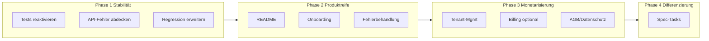

# Roadmap Marktreife

Diese Roadmap bündelt die Schritte, um die PPM-App stabil, nutzerfreundlich und marktfähig zu machen. **Ziel** ist eine marktreife App bzw. ein erster Pilot mit zahlenden Nutzern. Die **Phasen** sind in Reihenfolge zu bearbeiten: Zuerst Stabilität (Phase 1), dann Produktreife (Phase 2), danach Monetarisierung (Phase 3); Phase 4 (Differenzierung) ist optional.

---

## Phase 1: Stabilität und Tests (Basis für alles Weitere)

- [ ] **1.1 Ignorierte Tests schrittweise reaktivieren**
  - [ ] Priorisierte Liste aus [docs/fehlende-tests-uebersicht.md](fehlende-tests-uebersicht.md) Sektion 1.2 übernehmen (z. B. zuerst: `EnhancedAuthProvider.test.tsx`, `usePermissions.test.ts`, `guest-project-access-page.test.tsx`, `share-link-manager.test.tsx`).
  - [ ] Pro Test: Mocks/Umgebung anpassen (z. B. `fetch`, Timer), dann Eintrag aus [jest.config.js](../jest.config.js) `testPathIgnorePatterns` entfernen.
  - [ ] Nach jeder Reaktivierung: `npm run test` und ggf. Regression (`npm run test:regression`) prüfen.
- [ ] **1.2 Laufzeit- und API-Fehler abdecken**
  - [ ] Für kritische Seiten (z. B. Projects, Admin Users): Route-Test mit Backend-Mock 500/503; optional Seiten-Test mit gemocktem `fetch` 500/Timeout und Assert auf Fehler-/Retry-UI (vgl. [docs/why-runtime-api-errors-are-not-caught-by-tests.md](why-runtime-api-errors-are-not-caught-by-tests.md)).
  - [ ] Optional: E2E-Szenario „Backend nicht erreichbar“ oder „500“ für einen Kernflow (Playwright), siehe gleiches Doc.
- [ ] **1.3 Regression-Suite erweitern**
  - [ ] Weitere kritische Frontend-Suites in [docs/regression-test-suite.md](regression-test-suite.md) mit `[@regression]` markieren.
  - [ ] Backend: Weitere Tests in `@pytest.mark.regression` aufnehmen (vgl. [docs/regression-test-suite.md](regression-test-suite.md)).
- [ ] **1.4 Kritische Lib/Hooks testen**
  - [ ] Aus [docs/fehlende-tests-uebersicht.md](fehlende-tests-uebersicht.md) 1.3/1.4: Mindestens `lib/utils/error-handler.ts`, `lib/design-system.ts`, und einen der Hooks (`useDebounce`, `useClickOutside` oder `useWorkflowRealtime`) mit Unit-Tests abdecken.

**Referenzen Phase 1:** [fehlende-tests-uebersicht.md](fehlende-tests-uebersicht.md), [why-runtime-api-errors-are-not-caught-by-tests.md](why-runtime-api-errors-are-not-caught-by-tests.md), [regression-test-suite.md](regression-test-suite.md), [jest.config.js](../jest.config.js).

---

## Phase 2: Produktreife und Erstnutzer-Erlebnis

- [ ] **2.1 README und Einstieg**
  - [ ] Projekt-README anlegen oder ergänzen (Root oder [docs/README.md](README.md)): Kurzbeschreibung der App, Zielgruppe, Tech-Stack, Voraussetzungen, `npm install` / `npm run dev`, Backend starten, ggf. `.env.local.example` verlinken.
  - [ ] Optional: „Getting started“ für neue Entwickler (Link zu [docs/frontend/PROJECT_OVERVIEW.md](frontend/PROJECT_OVERVIEW.md) oder kurze Sektion).
- [ ] **2.2 Onboarding für einen Kernflow**
  - [ ] Einen Kernflow definieren (z. B. „Projekt anlegen → erste Simulation oder ersten Report sehen“).
  - [ ] Bestehende Touren prüfen ([components/pmr/OnboardingTour.tsx](../components/pmr/OnboardingTour.tsx), [components/guided-tour/](../components/guided-tour/)); ggf. eine app-weite „Erste Schritte“-Tour oder gezielte Tooltips für diesen Flow ergänzen.
  - [ ] Sicherstellen, dass der Flow fehlerfrei durchläuft (Loading/Error-States, siehe Phase 1).
- [ ] **2.3 Fehlerbehandlung und Hinweise**
  - [ ] Zentrale Seiten (Projects, Dashboards, Admin Users): Bei Backend-Timeout/503 eine einheitliche, verständliche Meldung und optional „Retry“ anzeigen (bereits teilweise vorhanden; prüfen und vereinheitlichen).
  - [ ] Keine weißen Bildschirme bei Parse-Fehlern (z. B. Help-Chat-Markdown): Error-Boundary/Fallback wie in [components/help-chat/MessageRenderer.tsx](../components/help-chat/MessageRenderer.tsx) beibehalten und bei Bedarf auf weitere kritische Bereiche ausweiten.

**Referenzen Phase 2:** [frontend/PROJECT_OVERVIEW.md](frontend/PROJECT_OVERVIEW.md), [.env.local.example](../.env.local.example), [components/guided-tour/](../components/guided-tour/).

---

## Phase 3: Monetarisierung und Multi-Tenant (für Markteintritt)

- [ ] **3.1 Tenant- und Organisationsverwaltung**
  - [ ] Spec [.kiro/specs/saas-tenant-management/requirements.md](../.kiro/specs/saas-tenant-management/requirements.md) umsetzen: Super-Admin-Bereich (z. B. `/admin/tenants` oder `/admin/organizations`), CRUD für Organisationen (Name, Slug, is_active, optional Logo/Settings).
  - [ ] Backend: Endpoints für Tenant-CRUD, Prüfung `super_admin`; RLS/tenant_id bei allen fachlichen Tabellen sicherstellen.
  - [ ] Org-Admin: Bereich „Eigene Organisation“ (Mitglieder, Rollen, optional Name/Logo) nur für eigene Org.
- [ ] **3.2 Billing und Abrechnung (optional, aber für Self-Serve nötig)**
  - [ ] Entscheidung: Nur manuelle Rechnungen (dann 3.1 + Dokumentation) oder Self-Serve mit Stripe (oder anderem Anbieter).
  - [ ] Bei Self-Serve: Pläne/Limits in `organizations.settings` oder eigener Tabelle; Stripe-Integration (Checkout Session, Webhook für Abo-Status); Frontend: Plan-Auswahl, Upgrade-Flow, ggf. Nutzer-/Projekt-Limits anzeigen.
  - [ ] Abrechnungslogik (welcher Plan, welche Limits) in Backend prüfen (z. B. bei Projekt-Erstellung, User-Invite).
- [ ] **3.3 Rechtliches und AGB**
  - [ ] AGB, Datenschutz, Impressum bereitstellen und in der App verlinken (z. B. Footer, Sign-up).
  - [ ] Hosting und Datenverarbeitung DSGVO-konform dokumentieren; optional AV-Vertrag für Enterprise.

**Referenzen Phase 3:** [.kiro/specs/saas-tenant-management/](../.kiro/specs/saas-tenant-management/), [security/env-setup.md](security/env-setup.md).

---

## Phase 4: Differenzierung (optional, nach Stabilität und Monetarisierung)

- [ ] **4.1 Register Nested Grids und AI Help Chat**
  - [ ] Offene Tasks aus [docs/kiro-specs-10x-priorities.md](kiro-specs-10x-priorities.md): Register Nested Grids (Checkpoints 7/11, Property-Tests, ggf. Drag&Drop, Filter Application); AI Help Chat (HelpLogger-Schema, RAG-Erweiterung, Proactive Tips, Analytics-Tests).
- [ ] **4.2 Weitere Specs nach Priorität**
  - [ ] Integrated Master Schedule, Mobile-First (ausgewählte Tasks für Costbook/Dashboard), SAP PO Breakdown – nur bei Bedarf und Ressourcen; Reihenfolge wie in [docs/kiro-specs-10x-priorities.md](kiro-specs-10x-priorities.md).

**Referenzen Phase 4:** [kiro-specs-10x-priorities.md](kiro-specs-10x-priorities.md), [.kiro/specs/register-nested-grids/](../.kiro/specs/register-nested-grids/), [.kiro/specs/ai-help-chat-enhancement/](../.kiro/specs/ai-help-chat-enhancement/).

---

## Abhängigkeiten und Reihenfolge

Phase 1 sollte zuerst angegangen werden (stabile Basis); Phase 2 kann parallel zu 1.4 starten. Phase 3 baut auf 2 auf (nutzbare App + klarer Einstieg). Phase 4 ist explizit optional und für „10x“-Features.
